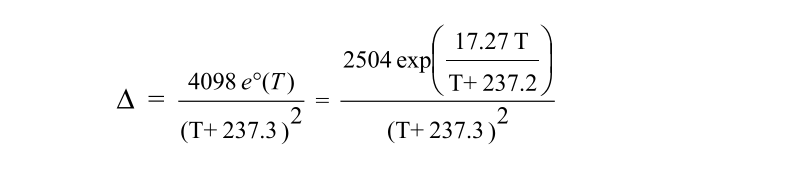
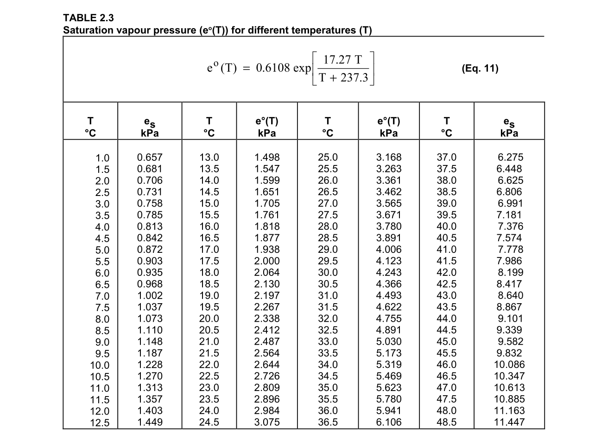
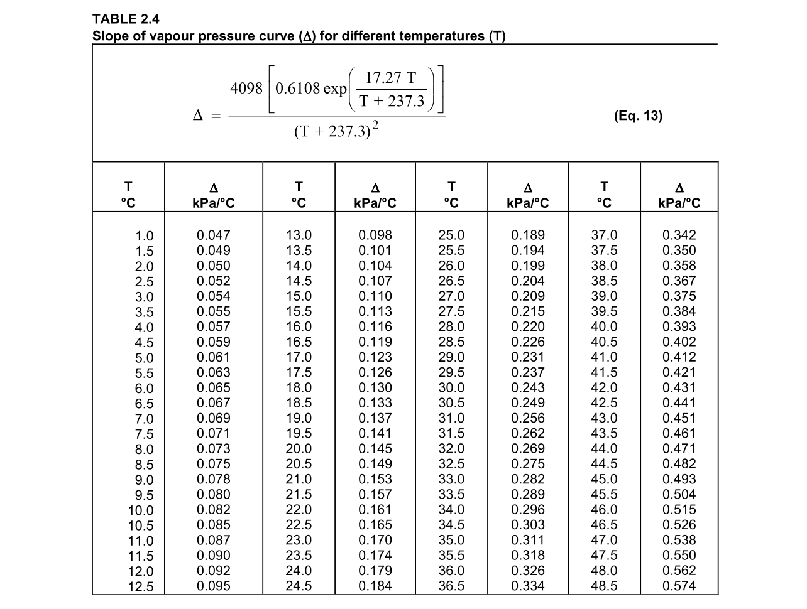
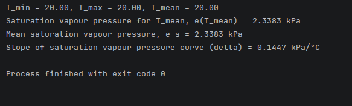
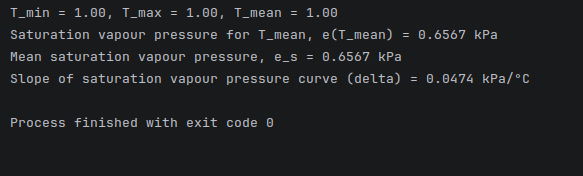
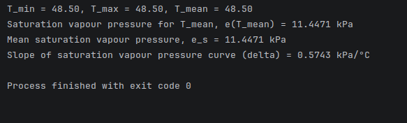
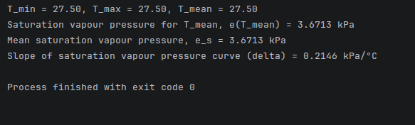

# devlog02. Разработка первых модулей

*First working code. Builds the minimal vertical slice: a mock air-temperature sensor reading, a module computing daily min/max/mean temperature, and a vapour-pressure module computing saturation vapour pressure and the slope-of-curve term (“delta”) per FAO-56 eq. 9–13. Wires it all together in a first `main.c` and verifies output against FAO-56 Annex 2 tables at four temperature values (1.0, 20.0, 27.5, 48.5 °C), all matching within ~0.0005 kPa.*

* * *

## Определение первого шага

Посмотрим на уравнение Пенмана–Монтейта еще раз (FAO56 1998: 24, eq. 6):


Смотрим на первый член уравнения в числителе: **0.408**. Значение используется как **константа** или коэффициент, определяющий некоторую связь энергии и испаренной воды. Смысл этой константы следующий: чтобы испарить 1 мм воды с 1 м<sup>2</sup>, требуется примерно 2.45 МДж энергии. Соответственно, 1 МДж/м<sup>2</sup> испаряет примерно 0.408 мм воды. **Вычисление не требуется**.

Смотрим на второй член уравнения в числителе: **"дельта"**, slope of saturation vapour pressure curve. Это **вычисляемое значение**. Приведем формулу для его вычисления (FAO56 1998: 37, eq. 13):


* * *

## Разбор уравнения

Первое, что сразу же видно и о чем следует заметить, это то, что вычисление "дельты" предполагает использовать, кроме констант, **значение измеренной температуры воздуха**. Документация FAO56 указывает: "В уравнении Пенмана–Монтейта, где 'дельта' присутствует и в числителе, и в знаменателе, наклон кривой давления насыщенного пара рассчитывается **с использованием средней температуры воздуха** (согласно уравнению № 9)".

Приведем упомянутое уравнение (FAO56 1998: 33, eq. 9):


Итак, **первое наблюдение**:

- модуль вычисления "дельты" будет иметь зависимость от **вычисленной** средней *суточной* температуры воздуха (согласно уравнению № 9);
- вычисленная средняя температура, очевидно, имеет зависимость от **измеренной** температуры воздуха (точнее, от некоторого набора измерений, который нужно где-то хранить).

Тогда для минимального компилируемого "ходячего скелета" программы напишем параллельно **два модуля** - для **вычисляемой температуры воздуха** и для **вычисления давления насыщенного пара**, включая сюда и вычисление "дельты". **Третий модуль** - **измеряемых значений** - опишем кратко как имитацию сенсорных данных, для начала хватит простого значения мгновенного измерения температуры воздуха.

* * *

## Пишем первые файлы

- Создадим файл **`air-temperature-read.h`** и объявим функцию в нем для чтения измеренного мгновенного значения температуры воздуха (возьмем стандартное значение в 20 градусов Цельсия):
    
    ```C
    double SensorTemperature_ReadInstant(void);
    ```
    
- Создадим файл **`air-temperature-read.c`** и напишем реализацию функции, которая возвращает значение, имитирующее значение прочитанной мгновенной температуры:
    
    ```C
    #include "air-temperature-read.h"
    
    double SensorTemperature_ReadInstant(void) {
        return 20.0;     /* Тестовое значение */
    }
    ```
    
    > В дальнейшем эта функция будет немного изменена, чтобы обращаться к слою сенсоров, оттуда получать значение температуры и передавать именно его. Кроме того, функция должна будет получить возможность использовать значение по умолчанию (не путать с тестовым значением), обращаясь к словарю стандартных наборов.
    
* * *

## Остальные части уравнения

Кратко объясним оставшиеся части уравнения для нахождения "дельты".

1.  Выражение, помещенное в числителе в квадратные скобки, также является **вычисляемым значением**, или, согласно принятому нами обозначению, является деривативом уравнения "дельты". Это выражение, на самом деле, можно представить в виде знака **e<sup>o</sup>(T)** - saturation vapour pressure at the air temperature, давление пара как функция температуры воздуха, - которое вычисляется по той самой формуле, которая заключена в квадратные скобки в уравнении для нахождения "дельты":
    
    
    
    > Заметим, что в уравнении "дельты" значения 4098 и 0.6108 могут быть перемножены (произведение примерно равно **2504**). В таком случае получим следующий вид уравнения для вычисления "дельты":
    > 
    > 
    > 
    > **Опечатку** 237.2 следует исправить на **237.3**.
    
2.  Что касается значения **exp**, будем иметь в виду, что форма **exp(x)** означает константу основания натурального логарифма, равную **2.7183**, возведенную в степень **x**. Короче говоря, **exp** в степени *x* = **2.7183** в степени *x*. Значение *x* = результатам вычисления выражения, заключенного в скобки после **exp**.
    
3.  Что касается значения температуры воздуха при вычислении "дельты", заметим еще раз, что следует предварительно вычислить значение средней суточной температуры (**T<sub>mean</sub>**) - и именно это значение использовать как **T** в уравнении для нахождения "дельты".
    
* * *

## Разработка модулей

Итак, **у нас есть** функция (модуля `air-temperature-read`), которая возвращает значение мгновенно измеренной температуры воздуха, `SensorTemperature_ReadInstant();`. Теперь **мы хотим**:

- **вычислить** значение средней температуры воздуха, **T<sub>mean</sub>**;
- **вычислить** значение давления пара как функции температуры воздуха, используя найденное среднее значение температуры **e<sup>o</sup>(T<sub>mean</sub>)**;
- **вычислить** наклон кривой давления насыщенного пара, **"дельту"**, используя найденное значение давления пара от температуры.

**Вычислим также** среднее значение давления насыщенного пара, **e<sub>s</sub>**, по формуле:


> Заметим, что **не следует путать** смысл значений **e<sup>o</sup>(T<sub>mean</sub>)** и **e<sub>s</sub>**.

* * *

### Модуль вычисляемой температуры воздуха

Напишем - в слое математической модели - модуль для **вычисляемых значений** температуры воздуха. Он будет зависеть от модуля чтения **измеряемых значений** температуры (слой сенсорного узла, или слой измерений).

* * *

#### `air-temperature-calc.h`

- Объявим **структуру** для хранения основных вычисленных значений температуры воздуха:
    
    ```C
    #include <stdint.h>
    
    typedef struct {
        double T_max;
        double T_min;
        double T_mean;
        uint32_t timestamp;
    } AirTemperatureData;
    ```
    
- Объявим функцию для **обновления** содержимого структуры:
    
    ```C
    void AirTemperature_Update(AirTemperatureData* data, double T_inst, uint32_t timestamp);
    ```
    
* * *

#### `air-temperature-calc.c`

Реализуем функцию, которая будет:

- инициализировать структуру непосредственно измеренным значением температуры;
- находить согласно ранее приведенной формуле среднюю температуру **T<sub>mean</sub>**.

```C
#include <stddef.h>
#include "air-temperature-calc.h"

void AirTemperature_Update(AirTemperatureData* data, const double T_inst, const uint32_t timestamp) {
    if (data == NULL) { return; }

    data->timestamp = timestamp;

    /* Инициализация структуры при первом измерении */
    if (data->T_max == 0.0 && data->T_min == 0.0) {
        data->T_max = T_inst;
        data->T_min = T_inst;
    } else {
        if (T_inst > data->T_max) data->T_max = T_inst;
        if (T_inst < data->T_min) data->T_min = T_inst;
    }

    /* Вычисление средней температуры */
    data->T_mean = (data->T_max + data->T_min) / 2.0;
}
```

> Заметим, что при тестовой оркестрации, в файле **`main.c`**, аргументу `T_inst` будет присвоено значение мгновенно измеренных данных, имитирующих значение сенсоров: **`T_inst = SensorTemperature_ReadInstant()`**. Тестовое значение временной метки будет равно нулю: `timestamp = 0`.

> *UPD:* впоследствии паттерн инициализации будет изменен на более надежный - здесь представлено раннее и временное решение с целью быстрого запуска первого компилируемого кода.

* * *

### Файловая структура проекта

Опишем предварительно общую **файловую структуру** нашей программы:

```md
FAO56-CALC-PROJECT
├─ 01-sensor-measurement            # Слой чтения сенсорных данных
|  ├─ 011-air-temperature-read      # Модуль чтения температуры воздуха
|  |  ├─ air-temperature-read.h
|  |  └─ air-temperature-read.c
|  ├─ 012-...
|  └─ ...
├─ 02-evapotranspiration-model      # Слой математической модели
|  ├─ 021-atmo-parameters-calc
|  ├─ 022-air-temperature-calc      # Модуль вычисляемой температуры воздуха
|  |  ├─ air-temperature-calc.h
|  |  └─ air-temperature-calc.c
|  ├─ 023-air-humidity-calc
|  ├─ 024-vapour-pressure-calc      # См. следующий раздел
|  |  ├─ vapour-pressure-calc.h
|  |  └─ vapour-pressure-calc.c
|  ├─ 025-...
|  └─ 02x-evapotranspiration-calc   # Модуль основного уравнения
├─ ...
└─ main.c                           # Слой (файл) оркестрации
```

* * *

### Модуль вычисляемых значений давления пара

Напишем - в слое математической модели - модуль для **вычисляемых значений давления пара**. Он будет зависеть от модуля **вычисляемых значений температуры воздуха**, написанного только что ранее. Вычисляемые значения давления пара суть следующие:

- давление насыщенного пара для средней температуры воздуха, **e<sup>o</sup>(T<sub>mean</sub>)**;
- среднее давление насыщенного пара, **e<sub>s</sub>**;
- наклон кривой давления насыщенного пара, **"дельта"**.

> Значение актуального давления насыщенного пара, **e<sub>a</sub>**, зависящее от значения измеренной влажности воздуха, будет описано в этом же модуле позднее - вместе с модулем чтения измеряемой относительной влажности, **RH**.

* * *

#### `vapour-pressure-calc.h`

- Поскольку для вычисления значений давления пара используются значения вычисленной (средней) температуры воздуха, **подключим** соответствующий модуль:
    
    ```C
    #include "../022-air-temperature-calc/air-temperature-calc.h"
    ```
    
- Определим **константы** для нахождения **e<sup>o</sup>(T)** и **"дельты"**:
    
    ```C
    #define TETENS_CONST_A   (0.6108)   // Константа уравнения Тетенса e(T) по FAO56
    #define TETENS_CONST_B   (17.27 )   // Константа уравнения Тетенса e(T) по FAO56
    #define TETENS_CONST_C   (237.3 )   // Константа уравнения Тетенса e(T) по FAO56
    #define SVP_CS_CONST_D   (4098.0)   // Константа уравнения slope of SVP curve
    #define LOG_BASE_CONST   (2.7183)   // Константа основания натурального логарифма
    ```
    
- Объявим **функции** (APIs модуля `vapour-pressure-calc`):
    
    ```C
    /* Давление насыщенного пара для средней температуры, e(T_mean) */
    double CalcSaturationVapourPressureForTmean(const AirTemperatureData* Tdata);
    
    /* Среднее давление насыщенного пара, e_s = (e(T_max) + e(T_min)) / 2 */
    double CalcMeanSaturationVapourPressure(const AirTemperatureData* Tdata);
    
    /* Delta = slope of saturation vapour pressure curve, нужно использовать T_mean */
    double CalcSlopeDelta(const AirTemperatureData* Tdata);
    ```
    
* * *

#### `vapour-pressure-calc.c`

Подключим необходимые файлы и реализуем указанные функции.

- Вычисление давления насыщенного пара для средней температуры воздуха, **e<sup>o</sup>(T<sub>mean</sub>)**:
    
    ```C
    #include <math.h>
    #include <stddef.h>
    #include "vapour-pressure-calc.h"
    
    double CalcSaturationVapourPressureForTmean(const AirTemperatureData* Tdata) {
      if (Tdata == NULL) { return 0.0; }
      const double T_mean = Tdata->T_mean;
      const double exp_term = (TETENS_CONST_B * T_mean) / (T_mean + TETENS_CONST_C);
      return TETENS_CONST_A * pow(LOG_BASE_CONST, exp_term);
    }
    ```
    
- Вычисление среднего давления насыщенного пара, **e<sub>s</sub>**:
    
    ```C
    double CalcMeanSaturationVapourPressure(const AirTemperatureData* Tdata) {
      if (Tdata == NULL) { return 0.0; }
      const double e_max = TETENS_CONST_A * pow(LOG_BASE_CONST, (TETENS_CONST_B * Tdata->T_max) / (Tdata->T_max + TETENS_CONST_C));
      const double e_min = TETENS_CONST_A * pow(LOG_BASE_CONST, (TETENS_CONST_B * Tdata->T_min) / (Tdata->T_min + TETENS_CONST_C));
      return (e_max + e_min) / 2.0;
    }
    ```
    
- Вычисление наклона кривой давления насыщенного пара, **"дельты"**:
    
    ```C
    double CalcSlopeDelta(const AirTemperatureData* Tdata) {
      if (Tdata == NULL) { return 0.0; }
      const double e_Tmean = CalcSaturationVapourPressureForTmean(Tdata);
      const double denom = (Tdata->T_mean + TETENS_CONST_C) * (Tdata->T_mean + TETENS_CONST_C);
      return (SVP_CS_CONST_D * e_Tmean) / denom;
    }
    ```
    
* * *

### Модуль и слой оркестрации

Подключим модули измеряемых значений температуры воздуха (имитация сенсора), вычисляемых значений температуры воздуха и вычисляемых значений давления пара. Затем вычислим значения: **T<sub>mean</sub>**, **e<sup>o</sup>(T<sub>mean</sub>)**, **e<sub>s</sub>**, **"дельты"**.

Заметим, что поскольку сейчас мы получаем из модуля чтения измеряемых значений температуры воздуха только одно тестовое значение:

- значения **T<sub>min</sub>**, **T<sub>max</sub>**, **T<sub>mean</sub>** будут равны;
- значения **e<sup>o</sup>(T<sub>mean</sub>)**, **e<sub>s</sub>** будут равны.

В дальнейшем логика будет улучшена. Сейчас наша задача получить самый первый "ходячий скелет" и **запустить компиляцию**.

```C
#include <stdio.h>
#include "01-sensor-measurement/011-air-temperature-read/air-temperature-read.h"
#include "02-evapotranspiration-model/022-air-temperature-calc/air-temperature-calc.h"
#include "02-evapotranspiration-model/023-air-humidity-calc/vapour-pressure-calc.h"

int main(void) {
    AirTemperatureData Tdata = { 0 };

    /* Читаем значение измеренной температуры */
    const double T_inst = SensorTemperature_ReadInstant();
    const uint32_t timestamp = 0;   /* Тестовое значение */

    /* Обновляем модуль air-temperature-calc */
    AirTemperature_Update(&Tdata, T_inst, timestamp);

    /* Вычисляем e(T_mean), kPa */
    const double SVPTmean = CalcSaturationVapourPressureForTmean(&Tdata);

    /* Вычисляем e_s, kPa */
    const double MeanSVP = CalcMeanSaturationVapourPressure(&Tdata);

    /* Вычисляем "дельту" */
    const double delta = CalcSlopeDelta(&Tdata);

    printf("T_min = %.2f, T_max = %.2f, T_mean = %.2f\n", Tdata.T_min, Tdata.T_max, Tdata.T_mean);
    printf("Saturation vapour pressure for T_mean, e(T_mean) = %.4f kPa\n", SVPTmean);
    printf("Mean saturation vapour pressure, e_s = %.4f kPa\n", MeanSVP);
    printf("Slope of saturation vapour pressure curve (delta) = %.4f kPa/C\n", delta);

    return 0;
}
```

* * *

## Запуск и проверки

Остановимся пока что на проверке двух значений: **e<sup>o</sup>(T<sub>mean</sub>)**, **"дельты"**. Посмотрим соответствующие таблицы в документации (FAO-56 1998: 215, ann. 2, tab. 2.3; 216, ann. 2, tab. 2.4):





**Запустим программу** для нескольких различных значений температуры: в файле `air-temperature-read.c` в функции `SensorTemperature_ReadInstant();` будем вручную менять значение измеренной температуры, например, `return 20.0;`, `return 1.0;`, `48.5`, `27.5`. **Сравним значения**, выведенные в терминал, со значениями таблиц FAO56.



> При **T = 20.0**. В таблице: **e<sup>o</sup>(T) = 2.338**, **"дельта" = 0.145**. В терминале: **e<sup>o</sup>(T) = 2.338**, **"дельта" = 0.1447**.



> При **T = 1.0**. В таблице: **e<sup>o</sup>(T) = 0.657**, **"дельта" = 0.047**. В терминале: **e<sup>o</sup>(T) = 0.6567**, **"дельта" = 0.0474**.



> При **T = 48.5**. В таблице: **e<sup>o</sup>(T) = 11.447**, **"дельта" = 0.574**. В терминале: **e<sup>o</sup>(T) = 11.4471**, **"дельта" = 0.5743**.



> При **T = 27.5**. В таблице: **e<sup>o</sup>(T) = 3.671**, **"дельта" = 0.215**. В терминале: **e<sup>o</sup>(T) = 3.6713**, **"дельта" = 0.2146**.

* * *

## Подведем итоги

У нас есть минимально работающая программа, которая на основе тестового значения температуры воздуха вычисляет среднее значение температуры и использует его для вычисления "дельты" - первого члена уравнения Пенмана–Монтейта.

Далее будем двигаться в двух направлениях:

- улучшать существующие модули (см. ниже);
- писать следующие модули - для вычисления следующего члена уравнения.

> От роли **e<sub>s</sub>** можем пока отвлечься и вернуться, когда дойдем до работы с соответствующими деривативами основного уравнения.

* * *

## Проблемы и что нужно улучшить

Написанные модули - **минимальный** код, требуемый для **проверки** того, что поток данных проходит полностью от уровня имитации сенсорного узла (измеряемых значений) через слой вычислительной модели к выводу корректных результатов вычислений.

**Необходимо**:

- ввести проверки согласно стандарту MISRA C:2012;
- добавить возможность чтения различных значений для **T<sub>min</sub>**, **T<sub>max</sub>**;
- добавить возможность выбирать значения по умолчанию, если данные измерений повреждены или недоступны.
