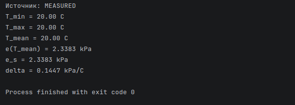
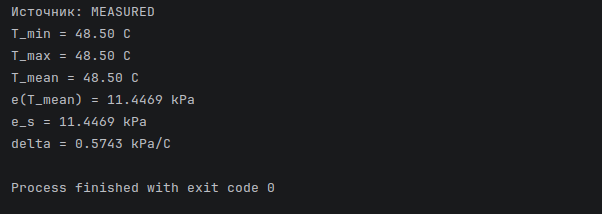
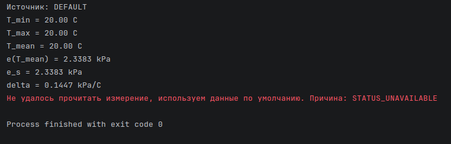
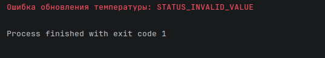
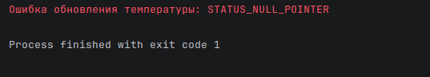
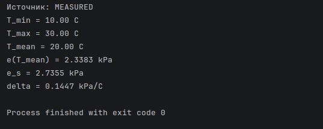

# devlog03. Улучшение первых модулей

## Зачем сразу улучшать и что именно?

На предыдущем шаге была получена первая рабочая вертикаль вычислений: от имитации мгновенного измерения температуры воздуха через слой вычисляемой (минимальной, максимальной, средней) температуры воздуха к вычислению давления насыщенного пара и наклона кривой давления насыщенного пара ("дельты"). Такая логика декомпозиции уравнения Пенмана–Монтейта позволяет получить компилируемый и проверяемый "ходячий скелет" программы, который можно расширять по мере продвижения к следующим членам уравнения (следуя методу "аккреции", или инкрементной разработки).

Однако очевидно, что первоначальная форма кода, будучи удобной для первого запуска, не обладает достаточной инженерной строгостью. Вопрос в том, где провести грань - когда написанного достаточно, чтобы двигаться дальше, а когда лучше доработать прежде, чем идти дальше. Кажется, в общем случае можно ответить так: первый "скелет", с одной стороны, не должен жестко ограничивать архитектуру, которая еще только пишется в остальных модулях; с другой стороны, нужно сделать так, чтобы по мере усложнения программы проблемы, несовершенства и ошибки первого "скелета" можно было легко обнаруживать. Для этого в наш "скелет" и нужно сразу же внести некоторые изменения.

* * *

### Какие проблемы?

В данный момент в "скелете" присутствуют **скрытые допущения**, **неявная инициализация** через нулевые значения, **отсутствие статусов ошибок** и слишком **слабая формализация границ между слоями**. По мере роста проекта все это может накапливать вокруг себя ненужные проблемы.

Основываясь на этих общих соображениях, в существующий код внесем улучшения, которые решают указанные проблемы, протестируем вновь работу "скелета" и перейдем к написанию радиационного блока.

Короче говоря, нужно повысить устойчивость нашего "скелета", сохранив простоту его "прохода" через слои.

* * *

### Резюмируем

**Что сделано:**

- собран первый проход по модели FAO56;
- реализован базовый pipeline:
  - измерение температуры,
  - расчет производных величин,
  - расчет давления насыщенного пара,
  - расчет наклона кривой ("дельты");
- структура проекта строилась по формуле, что дало хорошую читаемость.

**Выявленные ограничения:**

- отсутствует единая система ошибок;
- нет явной валидации входных данных;
- используется неявная инициализация (через 0.0);
- вычисления и управление частично смешаны;
- нет единого "контракта" между модулями.

* * *

### Что мы хотим?

1. Мы хотим получить следующий **поток выполнения**, который будет проверять значения:

   ```md
   Sensor Read -> Validation -> State Update -> Calculation -> Output
   ```

2. Мы хотим получить следующий **автомат состояний** для вычисления "дельты":

   ```mermaid
   stateDiagram-v2

    [*] --> Init

    Init --> ReadTemperature

    ReadTemperature --> ReadOk : success
    ReadTemperature --> ReadFail : error

    ReadFail --> UseDefault

    UseDefault --> ReadOk

    ReadOk --> ValidateTemperature

    ValidateTemperature --> Invalid : invalid
    ValidateTemperature --> UpdateState : valid

    Invalid --> ErrorEnd

    UpdateState --> CheckInitialized

    CheckInitialized --> FirstInit : not initialized
    CheckInitialized --> UpdateMinMax : already initialized

    FirstInit --> ComputeMean
    UpdateMinMax --> ComputeMean

    ComputeMean --> Calc_e_tmean

    Calc_e_tmean --> Calc_e_s

    Calc_e_s --> Calc_delta

    Calc_delta --> SuccessEnd

    ErrorEnd --> [*]
    SuccessEnd --> [*]
   ```

3. Мы хотим удовлетворить следующим **требованиям** - иметь:

- явный и единообразный способ сообщать об ошибке;
- явный способ отличать корректное значение от отсутствующего или поврежденного;
- явную инициализацию состояний;
- механизм разделения системных проверок и доменной математики;
- односторонний поток зависимостей - от источника данных к вычислению.

* * *

## Добавление слоя валидации и состояния

Добавим слой валидации и состояния, который будем подключать для проверок в модули, где такие проверки требуются. Это будет общий для всех слой со стандартизированной формой проверок, в нем будут находиться общие элементы, которые не относятся ни к чтению сенсорных данных (измеряемых значений), ни к математической модели, но которые используются ими всеми. К таким элементам, в частности, отнесем: **статусы выполнения**, **базовые проверки**, а также некоторые **вспомогательные функции**, которые должны быть доступны на всем протяжении проекта для удобства его разработки и проверки.

* * *

### Файловая система проекта

В текущей фазе - в сравнении с devlog02 - будем иметь следующую структуру файлов и папок:

```md
FAO56-CALC-PROJECT
├─ 00-validation                    # Слой валидации и состояния
|  |  ├─ status.h
|  |  ├─ status.c
|  |  ├─ validation.h
|  |  └─ validation.c
├─ 01-measurement                   # Слой чтения сенсорных данных
|  ├─ 011-air-temperature-read      # Модуль чтения температуры воздуха
|  |  ├─ air-temperature-read.h
|  |  └─ air-temperature-read.c
|  ├─ 012-...
|  └─ ...
├─ 02-calculation                   # Бывш. слой эвапотранспирации
|  ├─ 021-atmo-parameters-calc
|  ├─ 022-air-temperature-calc      # Модуль вычисляемой температуры воздуха
|  |  ├─ air-temperature-calc.h
|  |  └─ air-temperature-calc.c
|  ├─ 023-air-humidity-calc
|  ├─ 024-vapour-pressure-calc
|  |  ├─ vapour-pressure-calc.h
|  |  └─ vapour-pressure-calc.c
|  ├─ 025-...
|  └─ 02x-evapotranspiration-calc   # Модуль основного уравнения
└─ 03-orchestration                 # Слой оркестрации
   └─ main.c
```

### Напишем новые файлы

#### `status.h`

Создадим форму, содержащую **набор состояний** - для использования во всех модулях, где требуется отслеживание (трассировка), - и **функцию вывода сообщения о состоянии**:

```C
typedef enum {
    STATUS_OK = 0,
    STATUS_NULL_POINTER,
    STATUS_INVALID_VALUE,
    STATUS_UNAVAILABLE,
    STATUS_INTERNAL_ERROR
} Status;

const char* Status_ToString(Status status);
```

* * *

#### `status.c`

Напишем реализацию и определим случаи:

```C
#include "status.h"

const char* Status_ToString(const Status status) {
    switch (status) {
        case STATUS_OK:
            return "STATUS_OK";

        case STATUS_NULL_POINTER:
            return "STATUS_NULL_POINTER";

        case STATUS_INVALID_VALUE:
            return "STATUS_INVALID_VALUE";

        case STATUS_UNAVAILABLE:
            return "STATUS_UNAVAILABLE";

        case STATUS_INTERNAL_ERROR:
            return "STATUS_INTERNAL_ERROR";

        default:
            return "STATUS_UNKNOWN";
    }
}
```

* * *

#### `validation.h`

Объявим функцию для задания "защитного коридора" значений при использовании данных температуры воздуха:

```C
#include <stdbool.h>
bool ValidTemperatureC(double value);
```

* * *

#### `validation.c`

Напишем реализацию. Будем поначалу использовать широкий диапазон для "защитного коридора". Также используем функцию `isfinite` из библиотеки `math.h`:

```C
#include <math.h>
#include "validation.h"

bool ValidTemperatureC(const double value) {
    return isfinite(value) && (value >= -100.0) && (value <= 100.0);
}
```

> Напомним, что функция `isfinite(double x);` возвращает `1`, если значение аргумента есть конечное число, и `0` - если значение не является числом (NaN, not a number), плюс бесконечностью или минус бесконечностью.

* * *

### Подробнее о слое валидации

В слой `00-validation` вынесены **две группы сущностей**.

Первая группа - это **статусы выполнения**. Они нужны для того, чтобы любая функция, которая может завершиться ошибкой, не возвращала "молчаливое" значение, которое трудно отличить от корректного результата. Чтобы этого избежать, введен единый **перечислимый тип статусов**. Его задача в том, чтобы сделать поведение функций явным.

Вторая группа - это **базовые проверки**. В частности, проверки на `NULL`, проверки чисел на конечность и базовая валидация диапазонов входных величин. Эти функции не являются частью самой модели эвапотранспирации. Они не вычисляют физические параметры и не участвуют в уравнении как таковом. Их назначение - обеспечить надежную **границу** между внешним миром и вычислительным ядром.

Добавление этого слоя будет полезно тем, что он позволяет не распылять проверки по всей программе. Вместо этого проверочная логика становится общей инфраструктурой, а доменные модули остаются сосредоточенными на своей математике.

* * *

## Что изменяется в других слоях

### Слой измерений

#### `air-temperature-read.h`

```C
#include <stdbool.h>
#include <stdint.h>
#include "../../00-validation/status.h"

/* Для отслеживания источника входного значения - измерение или fallback */
typedef enum {
    SENSOR_VALUE_MEASURED = 0,
    SENSOR_VALUE_DEFAULT
} SensorValueSource;

/* Структура хранения данных мгновенной температуры воздуха [C] */
typedef struct {
    double instant_c;
    uint32_t timestamp;
    SensorValueSource source;
} TemperatureSample;

/* Имитация чтения мгновенной температуры */
Status SensorTemperature_ReadInstant(TemperatureSample* out_sample);

/* Значение по умолчанию (fallback) - если измерение недоступно или данные повреждены */
Status SensorTemperature_ReadDefault(TemperatureSample* out_sample);

const char* SensorValueSource_ToString(SensorValueSource source);
```

* * *

#### `air-temperature-read.c`

```C
#include <stddef.h>
#include "air-temperature-read.h"

#define SENSOR_MOCK_INSTANT_C       (20.0)  // Имитируем измерение температуры
#define SENSOR_DEFAULT_INSTANT_C    (20.0)  // Используем значение по умолчанию
#define SENSOR_MOCK_TIMESTAMP       (0U)    // Временная метка измерения (имитации)

Status SensorTemperature_ReadInstant(TemperatureSample* out_sample) {
    if (out_sample == NULL) {
        return STATUS_NULL_POINTER;
    }

    out_sample->instant_c = SENSOR_MOCK_INSTANT_C;
    out_sample->timestamp = SENSOR_MOCK_TIMESTAMP;
    out_sample->source = SENSOR_VALUE_MEASURED;

    return STATUS_OK;
}

Status SensorTemperature_ReadDefault(TemperatureSample* out_sample) {
    if (out_sample == NULL) {
        return STATUS_NULL_POINTER;
    }

    out_sample->instant_c = SENSOR_DEFAULT_INSTANT_C;
    out_sample->timestamp = SENSOR_MOCK_TIMESTAMP;
    out_sample->source = SENSOR_VALUE_DEFAULT;

    return STATUS_OK;
}

const char* SensorValueSource_ToString(const SensorValueSource source) {
    switch (source) {
        case SENSOR_VALUE_MEASURED:
            return "MEASURED";

        case SENSOR_VALUE_DEFAULT:
            return "DEFAULT";

        default:
            return "UNKNOWN";
    }
}
```

* * *

#### Пояснение к слою измерения

Слой `01-measurement` по-прежнему отвечает за чтение или имитацию входных измерений. На текущем этапе вместо реального сенсора используется тестовое значение мгновенной температуры воздуха. Однако теперь **результат чтения оформляется не просто как число, а как структура с явными полями**: само значение, временная метка и источник значения.

Такое изменение важно по двум причинам. Во-первых, оно готовит код к будущему подключению реального сенсорного слоя, где данные могут быть недоступны, испорчены или заменены значениями по умолчанию. Во-вторых, оно делает сам поток данных более прозрачным: уже на этом шаге видно, откуда пришло значение и как оно должно восприниматься системой.

* * *

### Слой математической модели

#### `air-temperature-calc.h`

```C
#include <stdint.h>
#include <stdbool.h>
#include "../../00-validation/status.h"

/* Структура для хранения вычисленных значений температуры */
typedef struct {
    double T_max_C;
    double T_min_C;
    double T_mean_C;
    uint32_t timestamp;     /* Время последнего обновления */
    bool initialized;       /* Флаг инициализации */
} AirTemperatureData;

/* Явная инициализация структуры */
void AirTemperature_Init(AirTemperatureData* data);

/* Обновление состояния по одному измерению.
 * Функция отвечает за: валидацию входа; инициализацию при первом значении; обновление min и max; вычисление mean */
Status AirTemperature_Update(AirTemperatureData* data, double T_inst_C, uint32_t timestamp);
```

* * *

#### `air-temperature-calc.c`

```C
#include <stddef.h>
#include "air-temperature-calc.h"
#include "../../00-validation/validation.h"

void AirTemperature_Init(AirTemperatureData* data) {
    if (data == NULL) { return; }

    data->T_min_C = 0.0;
    data->T_max_C = 0.0;
    data->T_mean_C = 0.0;
    data->timestamp = 0U;
    data->initialized = false;
}

Status AirTemperature_Update(AirTemperatureData* data, const double T_inst_C, const uint32_t timestamp) {
    if (data == NULL) {
        return STATUS_NULL_POINTER;
    }

    if (!ValidTemperatureC(T_inst_C)) {
        return STATUS_INVALID_VALUE;
    }

    data->timestamp = timestamp;

    /* Первый корректный вход */
    if (data->initialized == false) {
        data->T_min_C = T_inst_C;
        data->T_max_C = T_inst_C;
        data->initialized = true;
    } else {
        if (T_inst_C > data->T_max_C) {
            data->T_max_C = T_inst_C;
        }

        if (T_inst_C < data->T_min_C) {
            data->T_min_C = T_inst_C;
        }
    }

    /* Средняя температура воздуха, T_mean [C] */
    data->T_mean_C = (data->T_max_C + data->T_min_C) / 2.0;

    return STATUS_OK;
}
```

* * *

#### `vapour-pressure-calc.h`

```C
#include "../../00-validation/status.h"
#include "../022-air-temperature-calc/air-temperature-calc.h"

/* *** *** ** * * Функции возвращают статус и пишут результат в out-параметр * * ** *** *** */

/* Давление насыщенного пара для средней температуры воздуха, e(T_mean) */
Status Calc_SaturationVapourPressure_ForTmean(const AirTemperatureData* Tdata, double* out_kPa);

/* Среднее давление насыщенного пара, e_s = (e(T_max) + e(T_min)) / 2 */
Status Calc_Mean_SaturationVapourPressure(const AirTemperatureData* Tdata, double* out_kPa);

/* Delta = slope of saturation vapour pressure curve, нужно использовать T_mean */
Status Calc_SlopeDelta(const AirTemperatureData* Tdata, double* out_kPa_per_C);
```

* * *

#### `vapour-pressure-calc.c`

```C
#include <math.h>
#include <stddef.h>
#include "vapour-pressure-calc.h"
#include "../../00-validation/validation.h"

/* Константы для расчета e(T) и slope of SVP curve */
#define TETENS_CONST_A      (0.6108)        /* Константа уравнения Тетенса e(T) по FAO56 */
#define TETENS_CONST_B      (17.27)         /* Константа уравнения Тетенса e(T) по FAO56 */
#define TETENS_CONST_C      (237.3)         /* Константа уравнения Тетенса e(T) по FAO56 */
#define SVP_CS_CONST_D      (4098.0)        /* Константа уравнения slope of SVP curve */
// #define LOG_BASE_CONST       (2.7183)        /* Константа основания натурального логарифма */

/* Внутренняя (не публичная) вспомогательная функция - вычисление уравнения Магнуса-Тетенса */
static double Calc_TetensSaturationPressure(const double temperature_c) {
    const double exp_term = (TETENS_CONST_B * temperature_c) / (temperature_c + TETENS_CONST_C);
    return TETENS_CONST_A * exp(exp_term);
}

/* e(T_mean) */
Status Calc_SaturationVapourPressure_ForTmean(const AirTemperatureData* Tdata, double* out_kPa) {
    if ((Tdata == NULL) || (out_kPa == NULL)) {
        return STATUS_NULL_POINTER;
    }

    if ((Tdata->initialized == false) || (!ValidTemperatureC(Tdata->T_mean_C))) {
        return STATUS_INVALID_VALUE;
    }

    *out_kPa = Calc_TetensSaturationPressure(Tdata->T_mean_C);

    return STATUS_OK;
}

/* e_s */
Status Calc_Mean_SaturationVapourPressure(const AirTemperatureData* Tdata, double* out_kPa) {
    if ((Tdata == NULL) || (out_kPa == NULL)) {
        return STATUS_NULL_POINTER;
    }

    if ((Tdata->initialized == false) || (!ValidTemperatureC(Tdata->T_max_C)) ||
        (!ValidTemperatureC(Tdata->T_min_C))) {
        return STATUS_INVALID_VALUE;
    }

    const double e_Tmax = Calc_TetensSaturationPressure(Tdata->T_max_C);
    const double e_Tmin = Calc_TetensSaturationPressure(Tdata->T_min_C);

    *out_kPa = (e_Tmax + e_Tmin) / 2.0;

    return STATUS_OK;
}

/* Delta */
Status Calc_SlopeDelta(const AirTemperatureData* Tdata, double* out_kPa_per_C) {
    if ((Tdata == NULL) || (out_kPa_per_C == NULL)) {
        return STATUS_NULL_POINTER;
    }

    if ((Tdata->initialized == false) || (!ValidTemperatureC(Tdata->T_mean_C))) {
        return STATUS_INVALID_VALUE;
    }

    const double e_Tmean = Calc_TetensSaturationPressure(Tdata->T_mean_C);
    const double denom = (Tdata->T_mean_C + TETENS_CONST_C) *
                   (Tdata->T_mean_C + TETENS_CONST_C);

    if (denom == 0.0) {
        return STATUS_INVALID_VALUE;
    }

    *out_kPa_per_C = (SVP_CS_CONST_D * e_Tmean) / denom;

    return STATUS_OK;
}
```

* * *

#### Пояснение к слою математической модели

В слое `02-calculation` написанные ранее модули были уточнены.

Первый из них - **модуль вычисляемой температуры воздуха**. Ранее он опирался на неявную инициализацию через нулевые значения. Теперь **состояние температуры стало явным**: структура содержит *признак инициализации*. Это устраняет двусмысленность, потому что значение `0.0` само по себе является допустимым физическим значением температуры и *не может служить признаком* того, что данные еще не были получены.

Кроме того, **обновление температуры теперь выполняет три задачи**: проверяет входное значение, инициализирует состояние при первом корректном измерении и затем обновляет минимальное, максимальное и среднее значения.

Второй модуль - **модуль вычисления давления пара**. Здесь были сохранены прежние функции по смыслу: вычисление давления насыщенного пара для средней температуры воздуха, вычисление среднего давления насыщенного пара и вычисление наклона кривой давления насыщенного пара. Однако теперь эти функции возвращают не только численный результат, но и **статус выполнения** через выходной параметр и код результата.

Это изменение делает поведение модуля более надежным. Оно позволяет не скрывать ошибки за значением `0.0` и явно передавать информацию о том, что именно произошло. Кроме того, в самих вычислениях была приведена к более строгому виду экспоненциальная часть формулы: используется **стандартная функция `exp`**, а не ручная запись через приближенное основание натурального логарифма (хотя в документации FAO56 предлагается использовать константу `2.7183`).

* * *

### Слой оркестрации

#### `main.c`

```C
#include <stdio.h>
#include "../00-validation/status.h"
#include "../01-measurement/011-air-temperature-read/air-temperature-read.h"
#include "../02-calculation/022-air-temperature-calc/air-temperature-calc.h"
#include "../02-calculation/024-vapour-pressure-calc/vapour-pressure-calc.h"

static int PrintStatusAndReturn(const char* prefix, const Status status) {
    (void)fprintf(stderr, "%s%s\n", prefix, Status_ToString(status));
    return 1;
}

int main(void) {
    TemperatureSample sample;
    AirTemperatureData temperature_data;

    double e_tmean = 0.0;
    double e_s = 0.0;
    double delta = 0.0;

    AirTemperature_Init(&temperature_data);

    /* Слой оркестрации: читаем измерение; при проблеме берем значение по умолчанию;
     * обновляем состояние температуры; проводим вычисления; выводим результат */

    Status status = SensorTemperature_ReadInstant(&sample);
    if (status != STATUS_OK) {
        (void)fprintf(stderr, "Не удалось прочитать измерение, используем данные по умолчанию. Причина: %s\n",
            Status_ToString(status));

        status = SensorTemperature_ReadDefault(&sample);
        if (status != STATUS_OK) {
            return PrintStatusAndReturn("Критическая ошибка чтения данных по умолчанию: ", status);
        }
    }

    status = AirTemperature_Update(&temperature_data, sample.instant_c, sample.timestamp);
    if (status != STATUS_OK) {
        return PrintStatusAndReturn("Ошибка обновления температуры: ", status);
    }

    status = Calc_SaturationVapourPressure_ForTmean(&temperature_data, &e_tmean);
    if (status != STATUS_OK) {
        return PrintStatusAndReturn("Ошибка расчета e(Tmean): ", status);
    }

    status = Calc_Mean_SaturationVapourPressure(&temperature_data, &e_s);
    if (status != STATUS_OK) {
        return PrintStatusAndReturn("Ошибка расчета e_s: ", status);
    }

    status = Calc_SlopeDelta(&temperature_data, &delta);
    if (status != STATUS_OK) {
        return PrintStatusAndReturn("Ошибка расчета дельты: ", status);
    }

    (void)printf("Источник: %s\n", SensorValueSource_ToString(sample.source));
    (void)printf("T_min = %.2f C\n", temperature_data.T_min_C);
    (void)printf("T_max = %.2f C\n", temperature_data.T_max_C);
    (void)printf("T_mean = %.2f C\n", temperature_data.T_mean_C);
    (void)printf("e(T_mean) = %.4f kPa\n", e_tmean);
    (void)printf("e_s = %.4f kPa\n", e_s);
    (void)printf("delta = %.4f kPa/C\n", delta);

    return 0;
}
```

* * *

#### Пояснение к слою оркестрации

Слой `03-orchestration` по-прежнему отвечает только за **последовательность вызовов**. Здесь собирается весь поток: чтение входного значения, выбор fallback-значения при необходимости, обновление состояния температуры, вычисление производных значений и вывод результата.

Слой оркестрации не содержит математической логики. Он не вычисляет физические величины сам по себе. Его задача - координировать работу модулей и удерживать целостность процесса. В дальнейшем сюда же можно будет добавить инициализацию других подсистем, управление режимами и другие элементы внешнего поведения, не затрагивая ядро модели.

Логика такого подхода в том, чтобы оркестрация действительно становилась отдельным слоем, а не местом, где собрано все подряд.

* * *

## Поток данных теперь

После внесенных изменений поток данных можно представить следующим образом:

- слой измерений получает или имитирует мгновенное значение температуры;
- оркестрация проверяет корректность чтения и при необходимости использует значение по умолчанию;
- модуль температуры в слое модели обновляет состояние температуры;
- модуль давления пара в слое модели вычисляет e(Tmean), es и "дельту";
- результаты выводятся в терминал.

Поток остается простым, но уже обладает некоторой степенью формализации и удобен для последующего расширения.

* * *

## Проверки и контроль результата

Для проверки корректности по-прежнему используются контрольные значения из документации FAO56. Это важно, поскольку в нашем проекте речь идет не о формальном выполнении формулы, а о проверке того, что вычислительная реализация действительно совпадает с эталонной моделью в разумных пределах точности.

На текущем этапе проверка сохраняет прежний смысл, но получает более строгую форму: теперь можно не только сравнивать значения, но и надежнее отслеживать, где именно возникает ошибка - на уровне измерения, на уровне обновления состояния или на уровне вычисления члена уравнения.

Проведем несколько проверок, чтобы проверить, действительно ли работают наши архитектурные решения.

* * *

### Запустим проверку

Проверим сперва те места, где были внесены архитектурные изменения: модули слоя состояния и валидации, модули вычисляемой температуры и давления пара.

Выполним несколько **контрольных сценариев**:

1. Стандартный путь при `T = 20.0`:
   - ожидаем `STATUS_OK`, источник `MEASURED`;
   - `T_min`, `T_max` и `T_mean` должны совпасть;
   - значения `e(T_mean)` и `delta` должны совпасть с таблицами FAO56 (в пределах округления);
   - если значения в выводе корректны, то и `exp()` используется корректно.

     

    > В файле `air-temperature-read.c` установлено значение `#define SENSOR_MOCK_INSTANT_C (20.0)`, имитирующее измерение. Значения в выводе совпадают со значениями в документации (см. FAO-56 1998: 215, ann. 2, tab. 2.3; 216, ann. 2, tab. 2.4).

* * *

2. Контрольные значения `T = 1.0`, `27.5` и `48.5`:
   - сверим `e(T_mean)` и `delta` с эталонными значениями FAO56;
   - убедимся, что расчет не зависит от одного единственного тестового значения.
  
     
     
     

    > В файле `air-temperature-read.c` последовательно изменяем значение `#define SENSOR_MOCK_INSTANT_C (20.0)` на `1.0`, `27.5`, `48.5`. Значения в выводе совпадают со значениями в документации (см. FAO-56 1998: 215, ann. 2, tab. 2.3; 216, ann. 2, tab. 2.4).

* * *

3. Проверка fallback:
   - имитируем ошибку чтения измеряемого значения температуры воздуха;
   - убедимся, что используется значение по умолчанию, а не измеренное;
   - источник данных в выводе должен быть отмечен как `DEFAULT`.
  
     

    > В файле `air-temperature-read.c` в функции `SensorTemperature_ReadInstant();` временно заменим возвращаемый статус `return STATUS_OK;` на `return STATUS_UNAVAILABLE;`. Напомним, что в таком случае в `main.c` сработает следующий блок кода:
    > 
    > ```C
    > if (status != STATUS_OK) {
    >     ...
    >     status = SensorTemperature_ReadDefault(&sample);
    > }
    > ```
    >
    > Не забудем после проверки вернуть строку `return STATUS_OK;` обратно.

* * *

4. Проверка обработки некорректных аргументов (контракта функции):
   - передадим `NULL` в функции обновления и вычисления;
   - подадим недопустимое значение температуры;
   - убедимся, что возвращается `STATUS_INVALID_VALUE`.
  
     

    > В файле `air-temperature-read.c` изменим значение `#define SENSOR_MOCK_INSTANT_C (20.0)` на `150.0`. Программа должна завершиться с выводом сообщения об ошибке обновления температуры: `STATUS_INVALID_VALUE`.

* * *

5. Проверка `NaN` и `INF`:
   - проверим работу функции `isfinite()`;
   - передадим вместо измеряемых значений - `NAN` и `INFINITY`;
   - убедимся, что возвращается `STATUS_INVALID_VALUE`.

     
     

    > Внесем временные изменения в файл `air-temperature-read.c`:
    > - добавим `#include <math.h>`;
    > - заменим `#define SENSOR_MOCK_INSTANT_C (NAN)` и запустим проверку;
    > - заменим `#define SENSOR_MOCK_INSTANT_C (INFINITY)` и запустим проверку.

* * *

6. Проверка нулевого указателя `NULL`:
   - проверим контракт функции обновления температуры;
   - вместо вычисленных значений температуры используем как аргумент `NULL`;
   - убедимся, что возвращается `STATUS_NULL_POINTER`.
  
     

    > В файле `main.c` временно заменим строку:
    > 
    > ```C
    > status = AirTemperature_Update(&temperature_data, sample.instant_c, sample.timestamp);
    > ```
    >
    > на строку:
    > 
    > ```C
    > status = AirTemperature_Update(NULL, sample.instant_c, sample.timestamp);
    > ```

* * *

7. Проверка обновления состояния, или логики `min` и `max`:
   - подадим последовательность различных температур;
   - проверим корректность обновлений состояния, то есть `Tmin`, `Tmax` и `Tmean`;
   - проверим заодно, что "дельта" вычисляется на основе `Tmean`.
  
     

    > В файле `main.c` временно добавим следующие значения:
    > 
    > ```C
    > AirTemperature_Update(&temperature_data, 20.0, 0);
    > AirTemperature_Update(&temperature_data, 10.0, 1);
    > AirTemperature_Update(&temperature_data, 30.0, 2);
    > ```
  >
  > А именно текущий вызов:
  > 
    > ```C
    > status = AirTemperature_Update(&temperature_data, sample.instant_c, sample.timestamp);
    > if (status != STATUS_OK) {
    >     return PrintStatusAndReturn("Ошибка обновления температуры: ", status);
    > }
    > ```
  >
  > Заменим на следующие строки:
  > 
    > ```C
    > status = AirTemperature_Update(&temperature_data, 20.0, 0);
    > if (status != STATUS_OK) return PrintStatusAndReturn("Err: ", status);
    >
    > status = AirTemperature_Update(&temperature_data, 10.0, 1);
    > if (status != STATUS_OK) return PrintStatusAndReturn("Err: ", status);
    >
    > status = AirTemperature_Update(&temperature_data, 30.0, 2);
    > if (status != STATUS_OK) return PrintStatusAndReturn("Err: ", status);
    > ```
  >
  > В выводе терминала должны получить значения согласно формуле (FAO56 1998: 33, eq. 9):
  >
    > ```md
    > T_min = 10.00
    > T_max = 30.00
    > T_mean = 20.00
    > ```
  >
  > Значение "дельты" будет вычислено на основе значения средней температуры согласно документации (см. FAO-56 1998: 216, ann. 2, tab. 2.4).

* * *

### Упрощение проверок

Следующие проверки будем проводить **на шаг ближе к стандартным методам тестирования**. Вместо того, чтобы каждый раз вручную изменять значения или целые строки кода, в слое оркестрации **создадим файл `main-test.c`**, который будет служить для запуска ручных тестов. В нем и будем описывать тестовые сценарии, не изменяя основной файл `main.c`.

Заметим, что при запуске `main-test.c` необходимо добавить его в `CMakeLists.txt` и временно исключить из сборки файл `main.c`.

Заметим также, что проверку fallback-логики и конвейера вычислений следует выполнять через `main.c`, поскольку эта логика относится к поведению оркестрации, а не к математическим вычислениям.

* * *

#### Напишем `main-test.c`

```C
#include <stdio.h>
#include <math.h>

#include "../00-validation/status.h"
//#include "../00-validation/validation.h"
#include "../02-calculation/022-air-temperature-calc/air-temperature-calc.h"
#include "../02-calculation/024-vapour-pressure-calc/vapour-pressure-calc.h"

/* Выбор тестового сценария */
#define TEST_CASE 1

int main(void) {
    AirTemperatureData data;
    Status status;
    Status expected_status = STATUS_OK;

    double e_tmean = 0.0;
    double e_s = 0.0;
    double delta = 0.0;

    AirTemperature_Init(&data);

    printf("=== TEST CASE %d ===\n", TEST_CASE);

#if TEST_CASE == 1    /* Нормальный сценарий (20 C) */
    expected_status = STATUS_OK;    /* Ожидаем STATUS_OK */
    status = AirTemperature_Update(&data, 20.0, 0);

#elif TEST_CASE == 2    /* Невалидное значение (выход за диапазон) */
    expected_status = STATUS_INVALID_VALUE;    /* Ожидаем STATUS_INVALID_VALUE */
    status = AirTemperature_Update(&data, 150.0, 0);

#elif TEST_CASE == 3    /* NaN */
    expected_status = STATUS_INVALID_VALUE;    /* Ожидаем STATUS_INVALID_VALUE */
    status = AirTemperature_Update(&data, NAN, 0);

#elif TEST_CASE == 4    /* INF */
    expected_status = STATUS_INVALID_VALUE;    /* Ожидаем STATUS_INVALID_VALUE */
    status = AirTemperature_Update(&data, INFINITY, 0);

#elif TEST_CASE == 5    /* Проверка обновления min и max */
    expected_status = STATUS_OK;    /* Ожидаем STATUS_OK */
    status = AirTemperature_Update(&data, 20.0, 0);
    if (status != STATUS_OK) {
        printf("Status: %s\n", Status_ToString(status));
        return 1;
    }

    status = AirTemperature_Update(&data, 10.0, 1);    /* STATUS_OK, новый минимум */
    if (status != STATUS_OK) {
        printf("Status: %s\n", Status_ToString(status));
        return 1;
    }

    status = AirTemperature_Update(&data, 30.0, 2);    /* STATUS_OK, новый максимум */

#else
#error "Unknown TEST_CASE"
#endif

    printf("Status: %s\n", Status_ToString(status));
    printf("Expected: %s\n", Status_ToString(expected_status));
    
    if (status != expected_status) {
        printf("TEST FAILED\n");
        printf("Expected: %s\n", Status_ToString(expected_status));
        printf("Actual: %s\n", Status_ToString(status));
        return 1;
    }

    printf("T_min = %.2f C\n", data.T_min_C);
    printf("T_max = %.2f C\n", data.T_max_C);
    printf("T_mean = %.2f C\n", data.T_mean_C);

    status = Calc_SaturationVapourPressure_ForTmean(&data, &e_tmean);
    if (status != STATUS_OK) {
        printf("Error e(Tmean): %s\n", Status_ToString(status));
        return 1;
    }

    status = Calc_Mean_SaturationVapourPressure(&data, &e_s);
    if (status != STATUS_OK) {
        printf("Error e_s: %s\n", Status_ToString(status));
        return 1;
    }

    status = Calc_SlopeDelta(&data, &delta);
    if (status != STATUS_OK) {
        printf("Error delta: %s\n", Status_ToString(status));
        return 1;
    }

    printf("e(T_mean) = %.4f kPa\n", e_tmean);
    printf("e_s = %.4f kPa\n", e_s);
    printf("delta = %.4f kPa/C\n", delta);

    return 0;
}
```

* * *

#### Объясним `main-test.c`

В файле `main-test.c` мы используем не интеграционные проверки через замену имитационного значения `SENSOR_MOCK_INSTANT_C`, а **проверки вычислительного слоя** - через **прямой вызов функций**, как `AirTemperature_Update();`. В плане конвейера вычислений файл `main-test.c` будет проверять участок логики Update to Calculation, в то время как весь конвейер будем проверять через запуск `main.c`.

Собственно **проверка** проводится следующим образом:

- откроем `CMakeLists.txt`;
- добавим в него строку `03-orchestration/main-test.c`;
- закомментируем строку `03-orchestration/main.c`;
- в файле `main-test.c` в строке `#define TEST_CASE X` вместо `X` укажем номер тестового сценария;
- запустим компиляцию.

> В дальнейшем автоматизируем сборку через отдельные цели вместо комментирования "ненужных" файлов. На текущих этапах разработки будем использовать ручное переключение.

* * *

## Итог и следующий шаг

Теперь в проекте есть:

- слой общих проверок;
- явная система статусов;
- структура, в которой измерения и вычисления разведены;
- явная инициализация состояния;
- оркестрация, не смешанная с математикой.

Следующий шаг будет заключаться в разработке радиационного блока в той же логике: от физического процесса к вычислительному модулю, с сохранением потоков данных, единых проверок и возможности пошаговой проверки результата.

Радиационный блок уравнения будет сложнее не только по математике, но и по числу зависимостей и промежуточных вычислений. Поэтому прежде чем переходить к нему, необходимо было получить более строгую форму первых модулей (для дальнейшей аккреции).

* * *
