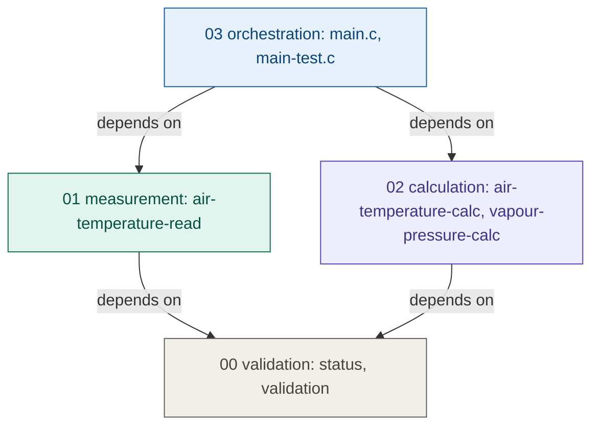
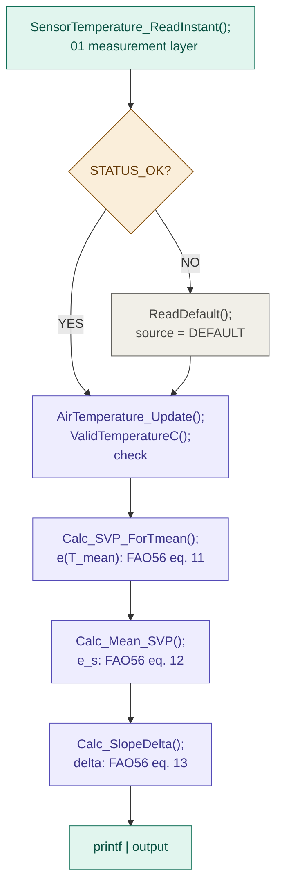
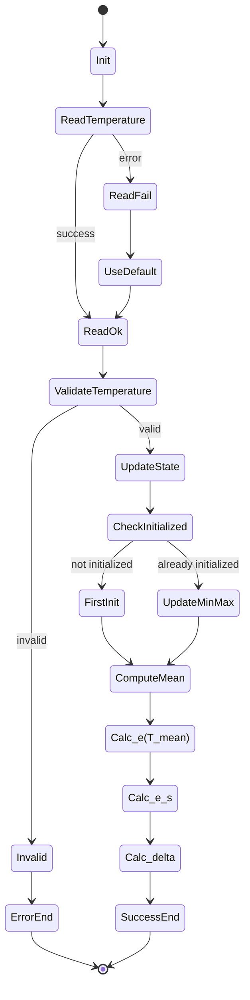
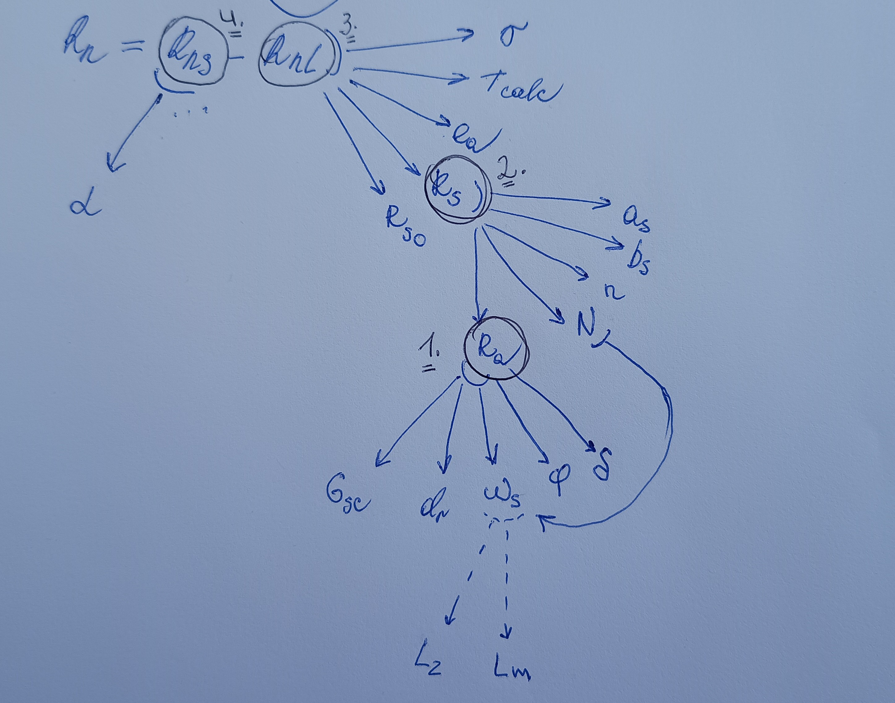

# devlog04. Промежуточная документация

## Зачем этот девлог

После трех шагов разработки - постановки задачи, первых модулей и их улучшения - у нас есть "ходячий скелет" с проверенными вычислениями. Прежде чем двигаться по методу аккреции к радиационному блоку, имеет смысл **зафиксировать архитектуру** в том виде, в котором она сейчас существует и планируется: не как финальную документацию, а как рабочую карту, на которую можно опираться при разработке следующих модулей.

> Этот девлог не добавляет новый код - он фиксирует то, что уже есть.

* * *

## Что сделано к этому моменту

- Реализован слой `00-validation`: единая система статусов и базовые проверки входных значений.
- Реализован модуль `011-air-temperature-read`: имитация мгновенного измерения температуры воздуха и fallback-значения при недоступности сенсора.
- Реализован модуль `022-air-temperature-calc`: структура `AirTemperatureData`, функции `Init` и `Update` с явной инициализацией и отслеживанием вычисляемых min, max, mean значений температуры воздуха.
- Реализован модуль `024-vapour-pressure-calc`: три функции - e<sup>o</sup>(T<sub>mean</sub>), e<sub>s</sub>, "дельта" - по уравнениям FAO56 (eq. 11-13).
- Реализован слой `03-orchestration`: `main.c` (интеграционный пайплайн с fallback-логикой) и `main-test.c` (ручные тесты, `TEST_CASE` 1-5).
- Все вычисленные значения сверены с таблицами FAO56 (Annex 2, Tab. 2.3 и 2.4) при T = 1.0, 20.0, 27.5, 48.5 C - расхождение в пределах ±0.0005 kPa.

* * *

## Файловая структура

```md
FAO56-CALC-PROJECT/
├── 00-validation/
│   ├── status.h/.c       <- Status enum, Status_ToString()
│   └── validation.h/.c   <- ValidTemperatureC()
│
├── 01-measurement/
│   └── 011-air-temperature-read/
│       ├── air-temperature-read.h   <- TemperatureSample, SensorValueSource
│       └── air-temperature-read.c   <- mock + fallback (SENSOR_MOCK_INSTANT_C)
│
├── 02-calculation/
│   ├── 021-air-temperature-calc/
│   │   ├── air-temperature-calc.h   <- AirTemperatureData, Init, Update
│   │   └── air-temperature-calc.c
│   └── 022-vapour-pressure-calc/
│       ├── vapour-pressure-calc.h   <- Calc_SVP_ForTmean, Calc_MeanSVP, Calc_SlopeDelta
│       └── vapour-pressure-calc.c   <- static Calc_TetensSaturationPressure()
│
└── 03-orchestration/
    ├── main.c        <- интеграционный пайплайн
    └── main-test.c   <- ручные тесты (TEST_CASE 1-5)
```

> Порядок следования модулей (и их нумерация, в частности, в слое вычислений) был изменен - в большем соответствии с реальным порядком разработки, нежели с порядком следования уравнений в документации.

* * *

### Следующий модуль

```md
02-calculation/
├── 023-radiation-calc/    <- Ra, Rs, Rnl, Rns, Rn (ближайший шаг)
├── 02x-...
└── 02x-eto-calc           <- итоговое уравнение Пенмана-Монтейта
```

> Подробнее о следующем шаге см. ниже.

* * *

## Диаграммы

### Контекстная диаграмма (context diagram)


* * *

### Диаграмма слоев (layering diagram)



* * *

### Диаграмма потока данных (data flow diagram)



* * *

### Карта состояний (state chart) для текущих модулей



* * *

## Контракты модулей (contracts)

Все публичные функции следуют одному соглашению:

- возвращают `Status`;
- записывают результат в out-параметр.

> Исключение - void-функции (`Init`, `ToString`), они отмечены отдельно.

* * *

### Слой валидации

```c
/* Status enum */
typedef enum {
    STATUS_OK = 0,
    STATUS_NULL_POINTER,   /* обязательный указатель == NULL              */
    STATUS_INVALID_VALUE,  /* значение не прошло проверку диапазона/NaN   */
    STATUS_UNAVAILABLE,    /* ресурс (сенсор) недоступен                  */
    STATUS_INTERNAL_ERROR
} Status;

const char* Status_ToString(Status status);
/* Никогда не возвращает NULL */

bool ValidTemperatureC(double value);
/* true iff isfinite(value) && value >= -100.0 && value <= 100.0 */
/* Чистая функция, без побочных эффектов */
```

* * *

### Слой измерений

```c
typedef enum {
    SENSOR_VALUE_MEASURED = 0,
    SENSOR_VALUE_DEFAULT
} SensorValueSource;

typedef struct {
    double   instant_c;
    uint32_t timestamp;
    SensorValueSource source;
} TemperatureSample;

Status SensorTemperature_ReadInstant(TemperatureSample* out_sample);
/* STATUS_OK:           заполняет out_sample, source = MEASURED    */
/* STATUS_NULL_POINTER: out_sample == NULL                         */

Status SensorTemperature_ReadDefault(TemperatureSample* out_sample);
/* STATUS_OK:           заполняет out_sample, source = DEFAULT     */
/* STATUS_NULL_POINTER: out_sample == NULL                         */
```

* * *

### Слой вычислений, модуль температуры воздуха

```c
typedef struct {
    double   T_max_C;
    double   T_min_C;
    double   T_mean_C;     /* (T_max + T_min) / 2  - FAO56 eq.9   */
    uint32_t timestamp;
    bool     initialized;  /* false до первого корректного Update */
} AirTemperatureData;

void   AirTemperature_Init(AirTemperatureData* data);
/* Обнуляет все поля, initialized = false
   data == NULL: тихий возврат (исключение из общего правила)     */

Status AirTemperature_Update(AirTemperatureData* data,
                             double T_inst_C,
                             uint32_t timestamp);
/* STATUS_OK:            data обновлена, initialized = true       */
/* STATUS_NULL_POINTER:  data == NULL                             */
/* STATUS_INVALID_VALUE: T_inst_C не прошел ValidTemperatureC()   */
```

* * *

### Слой вычислений, модуль давления пара

```c
/* e(T_mean) - давление насыщенного пара для средней температуры  */
Status Calc_SaturationVapourPressure_ForTmean(
    const AirTemperatureData* Tdata, double* out_kPa);

/* e_s = (e(T_max) + e(T_min)) / 2 - среднее давление насыщенного пара */
Status Calc_Mean_SaturationVapourPressure(
    const AirTemperatureData* Tdata, double* out_kPa);

/* "Дельта" = 4098 * e(T_mean) / (T_mean + 237.3)^2  - наклон кривой */
Status Calc_SlopeDelta(
    const AirTemperatureData* Tdata, double* out_kPa_per_C);

/* Все три функции:
STATUS_OK:            *out записан корректным значением
STATUS_NULL_POINTER:  любой из указателей == NULL
STATUS_INVALID_VALUE: Tdata->initialized == false
или температура не прошла ValidTemperatureC */

/* Вспомогательная функция Calc_TetensSaturationPressure() - static, не является частью публичного API модуля */
```

* * *

## Ключевые соглашения для следующих модулей

Несколько вещей, которые нужно держать в голове при разработке радиационного блока и остальных деривативов уравнения.

**Инициализация.** Значение `0.0` не является признаком неинициализированного состояния - оно само по себе допустимо физически. Единственный корректный признак - булев флаг `initialized`. Это же соглашение нужно распространить на все новые структуры данных.

**Имена функций.** Публичные функции слоя `02-calculation` называются по схеме `Calc_ИмяВычисления(...)`. Внутренние вспомогательные функции - `static`, без префикса `Calc_`, не экспортируются в заголовочном файле.

**Направление зависимостей.** Модуль `023-radiation-calc` будет зависеть от `00-validation`. Он не должен включать заголовки `01-measurement` напрямую - он получает данные через аргументы функций, как это сделано в `022-vapour-pressure-calc`.

**Константы.** Астрономические и физические константы радиационного блока определяются через `#define` в файле модуля - по аналогии с `TETENS_CONST` и `SVP_CS_CONST`.

**Тестирование.** Каждый новый вычислительный модуль проверяется через `main-test.c` по контрольным значениям из документации FAO56, прежде чем интегрируется в `main.c`.

* * *

## Кратко о следующем шаге

Взглянем в очередной раз на уравнение Пенмана-Монтейта (FAO56 1998: 24, eq. 6):


Следующий за "дельтой" член уравнения - **R<sub>n</sub>**, представляющий значение чистой (суммарной) радиации на поверхности сельскохозяйственных культур. К нему мы и перейдем следующим шагом. Однако взглянем на *условную* схему **деривативов R<sub>n</sub>**:



Видим, что разумно будет рассматривать **R<sub>n</sub>** как блок из нескольких модулей - **R<sub>a</sub>**, **R<sub>s</sub>**, **R<sub>nl</sub>**, **R<sub>ns</sub>**. Имея в виду направление зависимостей, разумно будет начать разработку данного блока в том порядке, в каком только что были перечислены его модули, - начать с внеземного излучения, **R<sub>a</sub>**.

* * *

### Использование датчика освещенности

Промышленная реализация системы предполагает использовать для оценки радиации пиранометр. В нашем проекте мы попробуем частным образом показать, что для корректных вычислений может быть использовано более экономное решение - а именно гибрид, использующий некоторые астрономические данные по умолчанию вместе с бюджетным датчиком освещенности в качестве бинарного счетчика состояний неба.

Подробнее об этом решении будет сказано в следующих девлогах - при реализации соответствующих модулей. Здесь же лишь кратко отметим **общую идею решения**:

- вычислим номер дня в году;
- вычислим склонение солнца и солнечный угол;
- посчитаем **R<sub>a</sub>**, энергию солнца на границе атмосферы;
- используя данные с датчика освещенности (солнечный бинарный датчик для значения **n**), посчитаем **R<sub>s</sub>**, энергию у земли;
- посчитаем **R<sub>ns</sub>** и **R<sub>nl</sub>**, чистую коротковолновую и длинноволновую радиацию;
- получим **R<sub>n</sub>**, чистую радиацию - нужный нам баланс энергии.

В отсутствие пиранометра будем использовать уравнение Ангстрема-Прескотта и применять простой датчик освещенности в качестве **бинарного счетчика**. Условно:

1. **Дневной цикл** - *Runtime*:
- в период времени, например, каждые 10 секунд, считываем значение `Lux` с датчика;
- если `Lux > 20000`, инкрементируем счетчик `bright_samples++`;
- в конце дня пересчитываем: `n (солнечные часы) = bright_samples / (частота опроса)`.
2. **Полночь** - *Calculation*:
- берем накопленное значение `n`;
- считаем **R<sub>a</sub>**;
- считаем **R<sub>s</sub> = (0.25 + 0.5 * n/N) * R<sub>a</sub>**.

* * *
