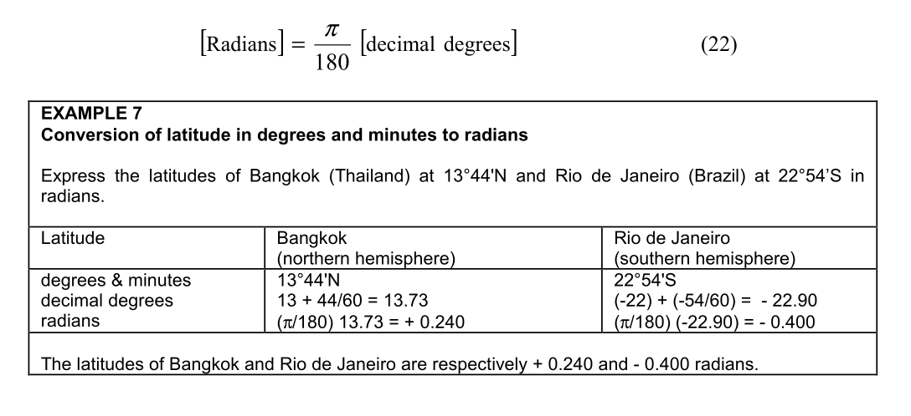
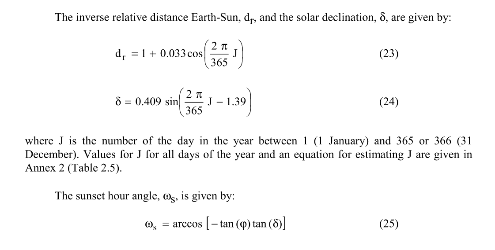
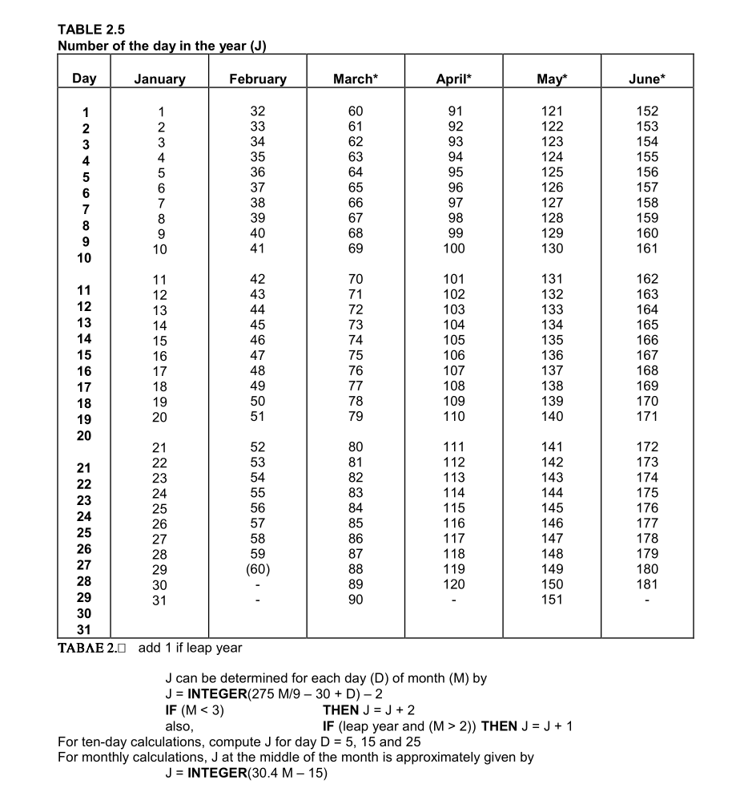
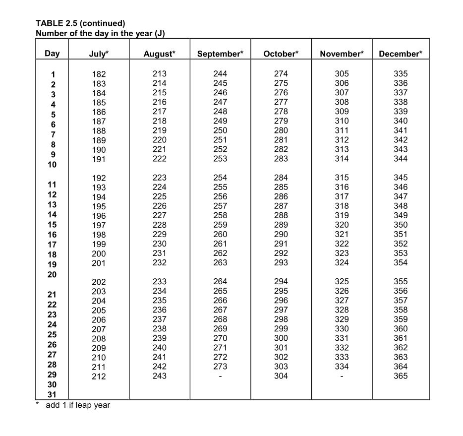

# devlog05. Модуль внеземной радиации

## Введение

Как было показано в предыдущем девлоге, вычисление следующего члена уравнения Пенмана-Монтейта, а именно члена **чистой радиации**, *net radiation*, **R<sub>n</sub>**, предполагает разработку целого блока солнечной радиации. Проанализировав деривативы этого члена уравнения, мы пришли к выводу, что начать разработку блока радиации следует с написания модуля **внеземной радиации**, *extraterrestrial radiation*, **R<sub>a</sub>**. Разработке этого модуля и будет посвящен данный девлог.

* * *

### Несколько слов о чистой радиации

Процесс эвапотранспирации определяется доступной для испарения воды энергией (*energy available to vaporize water*). Основным источником этой энергии является солнечная радиация. Солнечная радиация, способная достигнуть испаряющей поверхности (*potential solar radiation, evaporating surface*), зависит от географического положения и времени года: высоты Солнца над горизонтом, длины дня и широты. Радиация, реально достигающая поверхности (*actual solar radiation*), определяется также состоянием атмосферы - облачностью и запыленностью (*turbidity*), которые отражают и поглощают (*reflect and absorb*) часть энергии. Следует учитывать, что не вся поглощенная солнечная энергия используется для испарения воды: часть идет на нагрев воздуха и почвы (FAO56 1998: 29).

"Излучение, падающее на поверхность перпендикулярно лучам Солнца на верхней границе атмосферы Земли, называемое **солнечной постоянной** (*solar constant*), составляет примерно **0.082 MJ m<sup>-2</sup> min<sup>-1</sup>**. Однако локальная интенсивность излучения определяется углом между направлением солнечных лучей и нормалью к поверхности атмосферы. Этот угол изменяется в течение дня и отличается в зависимости от широты и времени года. Солнечное излучение, приходящее на горизонтальную поверхность на верхней границе атмосферы Земли, называется **внеземным (солнечным) излучением**, **R<sub>a</sub>**. Если Солнце находится прямо в зените (*overhead*), угол падения равен нулю (*angle of incidence is zero*), и внеземное излучение составляет **0.082 MJ m<sup>-2</sup> min<sup>-1</sup>**. С изменением сезонов изменяется положение Солнца, продолжительность дня и, соответственно, **R<sub>a</sub>**. Таким образом, **внеземное излучение является функцией широты, даты и времени суток** (*extraterrestrial radiation is a function of latitude, date and time of day*)" (FAO56 1998: 41).

> 

* * *

## Новые модули и файлы

В нашу файловую систему добавим несколько новых файлов, в которых будем писать код новых модулей:

```md
FAO56-CALC-PROJECT
├── 00-validation
│   ├── status.h/.c
│   ├── validation.h/.c             # Добавим функции ValidLatitudeRad, ValidDayOfYear
│   └── value-source.h/.c           # Добавим модуль проверки источника значений
│
├── 01-measurement
│   ├── 011-air-temperature-read
│   |   └── air-temperature-read.h/.c
|   └── 012-sunshine-lux-read       # Добавим модуль имитации датчика освещенности
│       └── sunshine-lux-read.h/.c
│
├── 02-calculation
│   ├── 021-air-temperature-calc
│   │   └── air-temperature-calc.h/.c
│   ├── 022-vapour-pressure-calc
│   |   └── vapour-pressure-calc.h/.c
│   └── 023-solar-radiation-calc    # Добавим большой блок солнечной радиации
│       ├── geolocation-calc.h/.c   # Модуль констант местоположения
│       ├── day-in-year-calc.h/.c   # Модуль астрономических деривативов
│       └── extrater-radiation-calc.h/.c  # Вычисление внеземного излучения, Ra
│
└── 03-orchestration
    ├── main.c        # Расширим пайплайн
    └── main-test.c   # Расширим тестовые наборы
```

* * *

## Обновляем модули и пишем новые

### Слой валидации

#### `validation.h`

К уже существующему коду добавим два новых объявления функций:

```C
bool ValidLatitudeRad(double phi);
/* true iff isfinite(phi) && phi >= -(π/2) && phi <= +(π/2)      */
/* Диапазон покрывает всю Землю; полюса включены намеренно       */
/* (Ra = 0 в полярную ночь обрабатывается в DayCalc_Update)      */

bool ValidDayOfYear(uint16_t J);
/* true iff J >= 1 && J <= 366                                    */
/* Високосный год: 366 допустим; валидация самого года не входит  */
/* в задачу этой функции - об этом помнит вызывающий код          */
```

* * *

#### `validation.c`

К уже существующему коду добавим реализации новых функций:

```C
/* Зададим Pi, чтобы не полагаться на M_PI из math.h  */
#define VALIDATION_PI (3.14159265358979323846)

bool ValidLatitudeRad(const double phi) {
    return isfinite(phi)
        && (phi >= -(VALIDATION_PI / 2.0))
        && (phi <=  (VALIDATION_PI / 2.0));
}

bool ValidDayOfYear(const uint16_t J) {
    return (J >= 1U) && (J <= 366U);
}
```

* * *

### Модуль проверки источника входных значений

В слое измерений будет добавлен новый датчик-эмуляция - для чтения состояния неба с точки зрения освещенности и солнечного сияния. Как и ранее в эмуляции измерений температуры, нам **потребуется проверка источника входных значений** - чтобы отслеживать, используем ли мы данные измерений или данные по умолчанию. Для этого ранее в слое измерений, в модуле чтения температуры воздуха `air-temperature-read.h/.c` были созданы перечислимый тип и функция:

```C
typedef enum {
    SENSOR_VALUE_MEASURED = 0,
    SENSOR_VALUE_DEFAULT
} SensorValueSource;

const char* SensorValueSource_ToString(const SensorValueSource source) {
    switch (source) {
        case SENSOR_VALUE_MEASURED:
            return "MEASURED";

        case SENSOR_VALUE_DEFAULT:
            return "DEFAULT";

        default:
            return "UNKNOWN";
    }
}
```

Поскольку этот фрагмент кода может быть переиспользован в других модулях, вынесем его в **отдельный модуль** `value-source.h/.c` и разместим **в слое валидации**. Соответствующие фрагменты кода следует **удалить** из модуля `air-temperature-read.h/.c`. К соответствующим файлам - там, где используются тип `SensorValueSource` и функция `SensorValueSource_ToString` - следует **подключить заголовок** `value-source.h`.

> Заметим, что требуется **внести следующие изменения** в предыдущую версию кода:
> 
> - из файла `air-temperature-read.h` в файл `value-source.h` перенести: перечислимый тип `SensorValueSource` и объявление `const char* SensorValueSource_ToString(SensorValueSource source);`;
> - в файл `air-temperature-read.h` добавить заголовок `#include "../../00-validation/value-source.h"`;
> - из файла `air-temperature-read.c` в файл `value-source.c` перенести реализацию функции `const char* SensorValueSource_ToString();`;
> - в файл `value-source.c` добавить заголовок `#include "value-source.h"`.

* * *

### Слой измерений

Напишем модуль для имитации датчика освещения (солнечного сияния), который будет использоваться позже - на следующих шагах разработки - при вычислении **R<sub>s</sub>**.

* * *

#### `sunshine-lux-read.h`

```C
#ifndef SUNSHINE_LUX_READ_H
#define SUNSHINE_LUX_READ_H

#include <stdint.h>
#include "../../00-validation/status.h"
#include "../../00-validation/value-source.h"

/* Порог "яркого солнечного света" для бинарного счетчика n - для модуля Rs при вычислении n/N */
#define BRIGHT_SUNSHINE_THRESHOLD_LUX (20000.0)

/* Мгновенное показание датчика освещенности */
typedef struct {
    double            lux;        /* Освещенность [lux] */
    uint32_t          timestamp;  /* Счетчик измерений */
    SensorValueSource source;
} SunshineLuxSample;

Status SensorLux_ReadInstant(SunshineLuxSample* out_sample);
Status SensorLux_ReadDefault(SunshineLuxSample* out_sample);

#endif /* SUNSHINE_LUX_READ_H */
```

* * *

#### `sunshine-lux-read.c`

```C
#include <stddef.h>
#include "sunshine-lux-read.h"

/* Имитация значений при ясном небе */
#define SENSOR_MOCK_INSTANT_LUX     (55000.0)  /* Прямое солнце */
#define SENSOR_DEFAULT_INSTANT_LUX  (0.0)      /* Нет данных    */
#define SENSOR_MOCK_TIMESTAMP       (0U)

Status SensorLux_ReadInstant(SunshineLuxSample* out_sample) {
    if (out_sample == NULL) {
        return STATUS_NULL_POINTER;
    }
    
    out_sample->lux       = SENSOR_MOCK_INSTANT_LUX;
    out_sample->timestamp = SENSOR_MOCK_TIMESTAMP;
    out_sample->source    = SENSOR_VALUE_MEASURED;
    return STATUS_OK;
}

Status SensorLux_ReadDefault(SunshineLuxSample* out_sample) {
    if (out_sample == NULL) {
        return STATUS_NULL_POINTER;
    }
    
    out_sample->lux       = SENSOR_DEFAULT_INSTANT_LUX;
    out_sample->timestamp = SENSOR_MOCK_TIMESTAMP;
    out_sample->source    = SENSOR_VALUE_DEFAULT;
    return STATUS_OK;
}
```

* * *

### Слой вычислений

В созданном блоке вычисления солнечной радиации `023-solar-radiation-calc` создадим модуль определения положения культуры, для которой находим эвапотранспирацию, на поверхности земли - модуль констант географического местоположения.

* * *

#### `geolocation-calc.h`

`LocationData` - это географические константы места развертывания системы. Задаются один раз при конфигурации и не меняются между измерениями. Не являются результатом измерения, а представляют собой постоянные характеристики места. Вводится (настраивается) значение DMS (градусы, минуты, секунды) - остальные параметры, требуемые в формуле радиации, вычисляются в данном модуле.



> Чтобы перевести градусы в радианы (см.: `geolocation-calc.c`), используем: `location.latitude_deg * (M_PI / 180.0)`. Чтобы перевести значение из радиан в градусы (см.: `main.c`), используем: `(location.latitude_rad * 180.0) / M_PI`.

* * *

```C
#ifndef GEOLOCATION_CALC_H
#define GEOLOCATION_CALC_H

/* LocationData - географические константы места развертывания: задаются при конфигурации */
typedef struct {
    double latitude_deg;   /* Широта в десятичных градусах */
    double latitude_rad;   /* Широта в радианах (вычисляется) */
    //double elevation_m;    /* Высота над уровнем моря [м], для Ra не используется */
} LocationData;

/* Перевод широты из формата градусы-минуты в десятичные градусы.
   Знак degrees определяет полушарие: отрицательный = южное. */
double Location_DMS_to_decimal(double degrees, double minutes);

/* Инициализирует заданную геолокацию */
void Location_Init(LocationData* loc);

#endif /* GEOLOCATION_CALC_H */
```

* * *

#### `geolocation-calc.c`

```C
#include <math.h>
#include <stddef.h>
#include "geolocation-calc.h"

/* Константа для перевода градусов в радианы */
#define DEG_TO_RAD (3.14159265358979323846 / 180.0)

/* Тестовое значение по FAO56, ex. 8: 20°S, южное полушарие */
#define DEFAULT_LATITUDE_DEG      (-20.0)  /* Минус - поскольку точка в южном полушарии */
#define DEFAULT_LATITUDE_MIN      (0.0)

/* Функция для преобразования широты в decimal degrees */
double Location_DMS_to_decimal(const double degrees, const double minutes) {
    const double sign = (degrees < 0.0) ? (-1.0) : (1.0);   /* Поскольку знак "-" для юж. п. относится и к градусам, и к минутам */
    return sign * (fabs(degrees) + (minutes / 60.0));
}

/* Инициализация геолокации */
void Location_Init(LocationData* loc) {
    if (loc == NULL) { return; }    /* Если указатель на локацию невалиден */
    /* Преобразуем широту из DMS в десятичные градусы */
    loc->latitude_deg = Location_DMS_to_decimal(DEFAULT_LATITUDE_DEG, DEFAULT_LATITUDE_MIN);
    loc->latitude_rad = loc->latitude_deg * DEG_TO_RAD;  /* Переводим широту в радианы */
}
```

* * *

#### `day-in-year-calc.h`



```C
#ifndef DAY_IN_YEAR_CALC_H
#define DAY_IN_YEAR_CALC_H

#include <stdint.h>
#include <stdbool.h>
#include "geolocation-calc.h"
#include "../../00-validation/status.h"

/* DayData - астрономические деривативы для заданного дня года и места.
Все углы в радианах. Все значения вычислены из J и широты φ; измерений не требуют */
typedef struct {
    uint16_t J;            /* День года [1...366] */
    double   dr;           /* Обратное относительное расстояние Земля-Солнце (eq. 23) */
    double   delta_rad;    /* Солнечное склонение [rad] (eq. 24) */
    double   omega_s_rad;  /* Угол заката [rad] (eq. 25) */
    double   N_hours;      /* Макс. продолжит. дня [hour] (eq. 34) */
    bool     initialized;
} DayData;

/* Обнуляет структуру. data == NULL: тихий возврат */
void DayCalc_Init(DayData* data);

/* Вычисляет все поля DayData из J и loc;
STATUS_OK: данные вычислены и записаны;
STATUS_NULL_POINTER: data == NULL или loc == NULL;
STATUS_INVALID_VALUE: J не прошел ValidDayOfYear() или loc->latitude_rad не прошел ValidLatitudeRad();
Полярный день (солнце не заходит): omega_s = π, N = 24 ч;
Полярная ночь (солнце не всходит): omega_s = 0, N = 0, Ra = 0 */
Status DayCalc_Update(DayData* data, uint16_t J, const LocationData* loc);

/* Вспомогательная утилита: номер дня в году из календарной даты.
Учитывает високосные годы. Чистая функция без побочных эффектов.
Входной диапазон не валидируется - ответственность на вызывающем. */
uint16_t DayCalc_JFromDate(uint8_t day, uint8_t month, uint16_t year);

#endif /* DAY_IN_YEAR_CALC_H */
```

* * *

#### `day-in-year-calc.c`

```C
#include <math.h>
#include <stddef.h>
#include "day-in-year-calc.h"
#include "../../00-validation/validation.h"

#define DAY_CALC_PI          (3.14159265358979323846) /* Для переносимости: M_PI не входит в C99 */
#define DAY_CALC_TWO_PI_365  (0.01721420632103996)    /* 2pi / 365 */

/* Константы уравнений FAO56 */
#define DR_AMPLITUDE           (0.033)   /* eq. 23: коэффициент эксцентриситета земной орбиты */
#define SOLAR_DECLIN_AMPLITUDE (0.409)   /* eq. 24: наклон оси Земли [rad] */
#define SOLAR_DECLIN_PHASE     (1.39)    /* eq. 24: фазовый сдвиг в уравнении Купера [rad] */

void DayCalc_Init(DayData* data) {
    if (data == NULL) { return; }
    
    data->J            = 0U;
    data->dr           = 0.0;
    data->delta_rad    = 0.0;
    data->omega_s_rad  = 0.0;
    data->N_hours      = 0.0;
    data->initialized  = false;
}

Status DayCalc_Update(DayData* data, const uint16_t J, const LocationData* loc) {
    if ((data == NULL) || (loc == NULL)) {
        return STATUS_NULL_POINTER;
    }
    
    if (!ValidDayOfYear(J)) {
        return STATUS_INVALID_VALUE;
    }
    
    if (!ValidLatitudeRad(loc->latitude_rad)) {
        return STATUS_INVALID_VALUE;
    }

    const double angle_rad = DAY_CALC_TWO_PI_365 * (double)J;

    /* Обратное относительное расстояние Земля-Солнце (eq. 23) */
    const double dr = 1.0 + DR_AMPLITUDE * cos(angle_rad);

    /* Солнечное склонение [rad] (eq. 24) */
    const double delta = SOLAR_DECLIN_AMPLITUDE * sin(angle_rad - SOLAR_DECLIN_PHASE);

    /* Угол заката [rad] (eq. 25);
    Аргумент arccos может выйти за [-1, 1] на полярных широтах:
    arg > +1 -> полярная ночь -> ωs = 0, N = 0, Ra = 0;
    arg < -1 -> полярный день -> ωs = π, N = 24 ч */
    const double arg = -tan(loc->latitude_rad) * tan(delta);
    double omega_s;
    
    if (arg > 1.0) {
        omega_s = 0.0;           /* Полярная ночь */
    } else if (arg < -1.0) {
        omega_s = DAY_CALC_PI;   /* Полярный день */
    } else {
        omega_s = acos(arg);
    }

    /* Максимальная продолжительность дня [hour] (eq. 34) */
    const double N = (24.0 / DAY_CALC_PI) * omega_s;

    data->J            = J;
    data->dr           = dr;
    data->delta_rad    = delta;
    data->omega_s_rad  = omega_s;
    data->N_hours      = N;
    data->initialized  = true;

    return STATUS_OK;
}

uint16_t DayCalc_JFromDate(const uint8_t day, const uint8_t month, const uint16_t year) {
    /* Суммируем дни прошедших месяцев + текущий день.
    Использован стандартный метод с поправкой на високосный год */
    static const uint16_t days_before_month[13] = {
        0, 0, 31, 59, 90, 120, 151, 181, 212, 243, 273, 304, 334
    };

    /* Високосный год: делится на 4, но не на 100, или делится на 400 */
    const bool is_leap = ((year % 4U == 0U) && (year % 100U != 0U))
                       || (year % 400U == 0U);

    uint16_t J = days_before_month[month] + (uint16_t)day;
    if (is_leap && (month > 2U)) {
        J += 1U;
    }
    return J;
}
```

* * *

#### `extrater-radiation-calc.h`

```C
#ifndef EXTRATER_RADIATION_CALC_H
#define EXTRATER_RADIATION_CALC_H

#include <stdbool.h>
#include "day-in-year-calc.h"
#include "geolocation-calc.h"
#include "../../00-validation/status.h"

/* Результат вычисления внеземной радиации (for daily period) */
typedef struct {
    double Ra_daily;   /* Внеземная радиация [МДж м2 сут] (eq. 21) */
    bool   initialized;
} RaData;

/* Обнуляет структуру. data == NULL: тихий возврат */
void RaCalc_Init(RaData* data);

/* Вычисляет Ra (for daily period) по FAO56 eq. 21.
Требует: day->initialized == true (DayCalc_Update был вызван успешно).
STATUS_OK: *out заполнен корректным значением,
STATUS_NULL_POINTER: любой указатель == NULL,
STATUS_INVALID_VALUE: day->initialized == false.
Примечание: при полярной ночи (omega_s = 0) Ra = 0 корректно. */
Status Calc_Ra(RaData* out, const DayData* day, const LocationData* loc);

#endif /* EXTRATER_RADIATION_CALC_H */
```

* * *

#### `extrater-radiation-calc.c`

```C
#include <math.h>
#include <stddef.h>
#include "extrater-radiation-calc.h"

#define SOLAR_CONSTANT_GSC  (0.0820)  /* Солнечная постоянная G_sc [МДж м2 мин]  */
#define PI                  (3.14159265358979323846)  /* Для переносимости       */
#define RA_COEFFICIENT      (1440.0)  /* (24 × 60) / π × Gsc = 1440 / π × 0.0820 */

/* Инициализация данных Ra */
void RaCalc_Init(RaData* data) {
    if (data == NULL) { return; }
    data->Ra_daily     = 0.0;
    data->initialized  = false;
}

/* Расчет внеземной радиации (Ra) по формуле FAO56 */
Status Calc_Ra(RaData* out, const DayData* day, const LocationData* loc) {
    if ((out == NULL) || (day == NULL) || (loc == NULL)) {
        return STATUS_NULL_POINTER;
    }
    
    if (!day->initialized) {
        return STATUS_INVALID_VALUE;
    }

    const double phi     = loc->latitude_rad;
    const double delta   = day->delta_rad;
    const double omega_s = day->omega_s_rad;
    const double dr      = day->dr;

    /* Расчет Ra по FAO56 eq. 21:
       R_a = (24 × 60 / π) × G_sc × dr ×
            [ω_s × sin(φ) × sin(δ) + cos(φ) × cos(δ) × sin(ω_s)]

       term_a = ω_s × sin(φ) × sin(δ)   - вклад ночи/дня склонения
       term_b = cos(φ) × cos(δ) × sin(ω_s) - вклад угла заката */

    const double coeff  = (RA_COEFFICIENT / PI) * SOLAR_CONSTANT_GSC * dr;
    const double term_a = omega_s * sin(phi) * sin(delta);
    const double term_b = cos(phi) * cos(delta) * sin(omega_s);

    /* При полярной ночи omega_s = 0: оба члена = 0, Ra = 0 */
    out->Ra_daily     = coeff * (term_a + term_b);
    out->initialized  = true;

    return STATUS_OK;
}
```

* * *

### Слой оркестрации

#### `main.c`

```C
#include <math.h>
#include <stdio.h>
#include <stdint.h>
#include "../00-validation/status.h"
#include "../01-measurement/011-air-temperature-read/air-temperature-read.h"
#include "../01-measurement/012-sunshine-lux-read/sunshine-lux-read.h"
#include "../02-calculation/021-air-temperature-calc/air-temperature-calc.h"
#include "../02-calculation/022-vapour-pressure-calc/vapour-pressure-calc.h"
#include "../02-calculation/023-solar-radiation-calc/geolocation-calc.h"
#include "../02-calculation/023-solar-radiation-calc/day-in-year-calc.h"
#include "../02-calculation/023-solar-radiation-calc/extrater-radiation-calc.h"

#define PI (3.14159265358979323846)

static int PrintStatusAndReturn(const char* prefix, const Status status) {
    (void)fprintf(stderr, "%s%s\n", prefix, Status_ToString(status));
    return 1;
}

int main(void) {
    /* *** Объявление локальных переменных *** */
    TemperatureSample  t_sample;
    AirTemperatureData temperature_data;
    SunshineLuxSample  lux_sample;
    LocationData       location;
    DayData            day_data;
    RaData             ra_data;

    double e_tmean = 0.0;
    double e_s = 0.0;
    double delta = 0.0;

    /* *** Инициализация *** */
    AirTemperature_Init(&temperature_data);
    Location_Init(&location);
    DayCalc_Init(&day_data);
    RaCalc_Init(&ra_data);

    /* *** 1. Слой измерений *** */

    /* Температура воздуха */
    Status status = SensorTemperature_ReadInstant(&t_sample);
    if (status != STATUS_OK) {
        (void)fprintf(stderr,
            "Нет данных температуры воздуха, используем значение по умолчанию. "
            "Причина: %s\n", Status_ToString(status));

        status = SensorTemperature_ReadDefault(&t_sample);
        if (status != STATUS_OK) {
            return PrintStatusAndReturn(
                "Критическая ошибка чтения данных температуры воздуха по умолчанию: ", status);
        }
    }

    /* Освещенность */
    status = SensorLux_ReadInstant(&lux_sample);
    if (status != STATUS_OK) {
        (void)fprintf(stderr,
            "Нет данных освещенности, используем значение по умолчанию. "
            "Причина: %s\n", Status_ToString(status));

        status = SensorLux_ReadDefault(&lux_sample);
        if (status != STATUS_OK) {
            return PrintStatusAndReturn(
                "Критическая ошибка чтения данных освещенности по умолчанию: ", status);
        }
    }

    /* *** 2. Слой вычислений *** */

    /* Температура воздуха */
    status = AirTemperature_Update(&temperature_data, t_sample.instant_c, t_sample.timestamp);
    if (status != STATUS_OK) {
        return PrintStatusAndReturn(
            "Ошибка обновления температуры воздуха: ", status);
    }

    /* Давление насыщенного пара */
    status = Calc_SaturationVapourPressure_ForTmean(&temperature_data, &e_tmean);
    if (status != STATUS_OK) {
        return PrintStatusAndReturn(
            "Ошибка расчета e(Tmean): ", status);
    }

    status = Calc_Mean_SaturationVapourPressure(&temperature_data, &e_s);
    if (status != STATUS_OK) {
        return PrintStatusAndReturn(
            "Ошибка расчета e_s: ", status);
    }

    status = Calc_SlopeDelta(&temperature_data, &delta);
    if (status != STATUS_OK) {
        return PrintStatusAndReturn(
            "Ошибка расчета дельты: ", status);
    }

    /* Астрономия */
    const uint16_t J = 246U;    /* Тестовый день (FAO56, ex. 8): J = 246 (3 сентября).
    Для проверки других значений см. main-test.c (TEST_CASE 6+) */

    status = DayCalc_Update(&day_data, J, &location);
    if (status != STATUS_OK) {
        return PrintStatusAndReturn(
            "Ошибка вычисления астрономических данных: ", status);
    }

    /* Внеземное (космическое) излучение */
    status = Calc_Ra(&ra_data, &day_data, &location);
    if (status != STATUS_OK) {
        return PrintStatusAndReturn(
            "Ошибка расчета внеземного излучения (Ra): ", status);
    }

    /* *** Вывод (для отслеживания) *** */
    (void)printf("=== Источники ===\n");
    (void)printf("Температура воздуха: %s\n", SensorValueSource_ToString(t_sample.source));
    (void)printf("Освещенность: %s\n", SensorValueSource_ToString(lux_sample.source));

    (void)printf("\n=== Температура воздуха и давление насыщенного пара ===\n");
    (void)printf("T_min  = %.2f C\n", temperature_data.T_min_C);
    (void)printf("T_max  = %.2f C\n", temperature_data.T_max_C);
    (void)printf("T_mean = %.2f C\n", temperature_data.T_mean_C);
    (void)printf("e(T_mean) = %.4f kPa\n", e_tmean);
    (void)printf("e_s       = %.4f kPa\n", e_s);
    (void)printf("delta     = %.4f kPa/C\n", delta);

    (void)printf("\n=== Астрономия, при J = %u, phi = %.4f rad = %.2f deg) ===\n",
                 day_data.J,
                 location.latitude_rad,    /* Значение радиан */
                 location.latitude_rad * (180.0 / PI));  /* Перевод радиан в градусы: обратное преобразование eq. 22 */

    (void)printf("Обратное расстояние (dr) = %.4f\n", day_data.dr);
    (void)printf("Солнечное наклонение (delta_sun) = %.4f rad (%.2f deg)\n",
                 day_data.delta_rad,
                 day_data.delta_rad * (180.0 / PI));

    (void)printf("Угол на закате (omega_s) = %.4f rad\n", day_data.omega_s_rad);
    (void)printf("Количество часов дневного света (N) = %.2f h\n", day_data.N_hours);

    (void)printf("\n=== Внеземная радиация ===\n");
    (void)printf("Внеземная радиация для дневного периода (Ra) = %.2f MJ m2 day1\n", ra_data.Ra_daily);

    (void)printf("Эквивалентное испарение = %.2f мм/сут\n", ra_data.Ra_daily * 0.408);  /* По eq. 20 */

    (void)printf("\nlux = %.0f (bright: %s)\n", lux_sample.lux,
                 (lux_sample.lux >= BRIGHT_SUNSHINE_THRESHOLD_LUX) ? "YES" : "NO");

    return 0;
}
```

> 
> 

* * *

#### `main-test.c`

```C
#include <math.h>
#include <stdio.h>
#include <stdint.h>
#include "../00-validation/status.h"
#include "../00-validation/validation.h"
#include "../02-calculation/021-air-temperature-calc/air-temperature-calc.h"
#include "../02-calculation/022-vapour-pressure-calc/vapour-pressure-calc.h"
#include "../02-calculation/023-solar-radiation-calc/geolocation-calc.h"
#include "../02-calculation/023-solar-radiation-calc/day-in-year-calc.h"
#include "../02-calculation/023-solar-radiation-calc/extrater-radiation-calc.h"

/* *** Вспомогательные макросы *** */
#define PI (3.14159265358979323846)

/* Допустимое отклонение при сравнении с табличными значениями FAO56 */
#define TOL_RA     (0.05)   /* МДж м2 сут */
#define TOL_ANGLE  (0.005)  /* рад */
#define TOL_HOURS  (0.05)   /* ч */
#define TOL_DEGREE (0.01)   /* десятичные градусы */

/* *** Выбор тестового сценария ************* * * * **** *******************
   TEST_CASE 1-5: модули температуры воздуха и давления пара (devlog03)
   TEST_CASE 6:   ValidDayOfYear - граничные значения
   TEST_CASE 7:   ValidLatitudeRad - граничные значения
   TEST_CASE 8:   DayCalc_JFromDate - календарные даты и високосные годы
   TEST_CASE 9:   DayCalc_Update - STATUS_NULL_POINTER
   TEST_CASE 10:  DayCalc_Update - STATUS_INVALID_VALUE (J = 0 и J = 367)
   TEST_CASE 11:  DayCalc_Update - STATUS_INVALID_VALUE (широта > π/2)
   TEST_CASE 12:  Phi: Radians & Decimal Degrees - Бангкок (FAO56, eq. 22, ex. 7)
   TEST_CASE 13:  Phi: Radians & Decimal Degrees - Рио-де-Жанейро (FAO56, eq. 22, ex. 7)
   TEST_CASE 14:  Calc_Ra - данные по умолчанию (20°S, J = 246) (FAO56, ex. 8, 9)
   TEST_CASE 15:  Calc_Ra - полярная ночь (80°N, J = 355)
   TEST_CASE 16:  Calc_Ra - STATUS_INVALID_VALUE (неинициализированная DayData)
   **** * * ********************* * * ************* * * * **** **************** *** */
#define TEST_CASE 14

static int CheckDouble(const char* label, const double actual, const double expected, const double tol) {
    const double diff = actual - expected;
    const double abs_diff = (diff < 0.0) ? (-diff) : diff;
    if (abs_diff <= tol) {
        printf("OK  %-30s actual=%.4f  expected=%.4f\n", label, actual, expected);
        return 0;
    } else {
        printf("FAIL %-30s actual=%.4f  expected=%.4f  diff=%.4f > tol=%.4f\n",
               label, actual, expected, abs_diff, tol);
        return 1;
    }
}

static int CheckStatus(const char* label, const Status actual, const Status expected) {
    if (actual == expected) {
        printf("OK  %-30s %s\n", label, Status_ToString(actual));
        return 0;
    } else {
        printf("FAIL %-30s actual=%s  expected=%s\n",
               label, Status_ToString(actual), Status_ToString(expected));
        return 1;
    }
}

/* Основная функция (entry point) */
int main(void) {
    Status status;
    Status expected_status = STATUS_OK;
    int    failures = 0;

    printf("=== TEST CASE %d ===\n\n", TEST_CASE);

    /* *** TEST_CASE 1-5: температура воздуха и давление пара (см. devlog03) *** */

#if TEST_CASE == 1
    /* Нормальный путь при T = 20.0 °C. Эталон: FAO56 ann. 2, tab. 2.3, 2.4. e°(T) = 2.338 kPa, Δ = 0.145 kPa/°C */
    {
        AirTemperatureData data;
        double e_tmean = 0.0, e_s = 0.0, delta = 0.0;
        AirTemperature_Init(&data);

        expected_status = STATUS_OK;
        status = AirTemperature_Update(&data, 20.0, 0U);
        failures += CheckStatus("AirTemperature_Update(20.0)", status, expected_status);
        failures += CheckDouble("T_mean", data.T_mean_C, 20.0, 0.01);

        status = Calc_SaturationVapourPressure_ForTmean(&data, &e_tmean);
        failures += CheckStatus("Calc_SVP_ForTmean", status, STATUS_OK);
        failures += CheckDouble("e(T_mean) [kPa]", e_tmean, 2.338, 0.001);

        status = Calc_SlopeDelta(&data, &delta);
        failures += CheckStatus("Calc_SlopeDelta", status, STATUS_OK);
        failures += CheckDouble("delta [kPa/C]", delta, 0.145, 0.001);

        (void)e_s;
    }

#elif TEST_CASE == 2
    /* STATUS_INVALID_VALUE: T = 150.0 °C - вне диапазона [-100, +100] */
    {
        AirTemperatureData data;
        AirTemperature_Init(&data);
        expected_status = STATUS_INVALID_VALUE;
        status = AirTemperature_Update(&data, 150.0, 0U);
        failures += CheckStatus("AirTemperature_Update(150.0)", status, expected_status);
    }

#elif TEST_CASE == 3
    /* STATUS_INVALID_VALUE: NaN */
    {
        AirTemperatureData data;
        AirTemperature_Init(&data);
        expected_status = STATUS_INVALID_VALUE;
        status = AirTemperature_Update(&data, NAN, 0U);
        failures += CheckStatus("AirTemperature_Update(NaN)", status, expected_status);
    }

#elif TEST_CASE == 4
    /* STATUS_INVALID_VALUE: INFINITY */
    {
        AirTemperatureData data;
        AirTemperature_Init(&data);
        expected_status = STATUS_INVALID_VALUE;
        status = AirTemperature_Update(&data, INFINITY, 0U);
        failures += CheckStatus("AirTemperature_Update(INF)", status, expected_status);
    }

#elif TEST_CASE == 5
    /* Логика min/max: три последовательных измерения. Ожидаем: T_min=10.0, T_max=30.0, T_mean=20.0 */
    {
        AirTemperatureData data;
        AirTemperature_Init(&data);
        status = AirTemperature_Update(&data, 20.0, 0U);
        if (status != STATUS_OK) { printf("FAIL step 1: %s\n", Status_ToString(status)); return 1; }
        status = AirTemperature_Update(&data, 10.0, 1U);
        if (status != STATUS_OK) { printf("FAIL step 2: %s\n", Status_ToString(status)); return 1; }
        status = AirTemperature_Update(&data, 30.0, 2U);
        failures += CheckStatus("AirTemperature_Update(30.0)", status, STATUS_OK);
        failures += CheckDouble("T_min", data.T_min_C, 10.0, 0.01);
        failures += CheckDouble("T_max", data.T_max_C, 30.0, 0.01);
        failures += CheckDouble("T_mean", data.T_mean_C, 20.0, 0.01);
    }

    /* *** TEST_CASE 6: ValidDayOfYear *** */

#elif TEST_CASE == 6
    /* Граничные значения: 1 и 366 допустимы, 0 и 367 - нет */
    {
        failures += CheckDouble("ValidDayOfYear(1)",   (double)ValidDayOfYear(1U),   1.0, 0.5);
        failures += CheckDouble("ValidDayOfYear(366)", (double)ValidDayOfYear(366U), 1.0, 0.5);
        failures += CheckDouble("ValidDayOfYear(0)",   (double)ValidDayOfYear(0U),   0.0, 0.5);
        failures += CheckDouble("ValidDayOfYear(367)", (double)ValidDayOfYear(367U), 0.0, 0.5);
        failures += CheckDouble("ValidDayOfYear(246)", (double)ValidDayOfYear(246U), 1.0, 0.5);
    }
    status = STATUS_OK;

    /* *** TEST_CASE 7: ValidLatitudeRad *** */

#elif TEST_CASE == 7
    /* Граничные значения ValidLatitudeRad.
       Полюса ±π/2 допустимы: Ra = 0 при полярной ночи/дне обрабатывается в DayCalc_Update через omega_s = 0 или π.
       Тест использует точное значение π/2, а не приближение 1.5708.
       1.5708 > π/2 (≈1.57079632...) - такое значение недопустимо, и ValidLatitudeRad корректно его отклоняет. */
    {
        const double PI_2 = PI / 2.0;   /* Точное π/2 */

        failures += CheckDouble("ValidLatitudeRad(0.0)",    (double)ValidLatitudeRad(0.0),    1.0, 0.5);
        failures += CheckDouble("ValidLatitudeRad(+π/2)",   (double)ValidLatitudeRad(PI_2),   1.0, 0.5);
        failures += CheckDouble("ValidLatitudeRad(-π/2)",   (double)ValidLatitudeRad(-PI_2),  1.0, 0.5);
        failures += CheckDouble("ValidLatitudeRad(+2.0)",   (double)ValidLatitudeRad(2.0),    0.0, 0.5);
        failures += CheckDouble("ValidLatitudeRad(-2.0)",   (double)ValidLatitudeRad(-2.0),   0.0, 0.5);
        failures += CheckDouble("ValidLatitudeRad(1.5708)", (double)ValidLatitudeRad(1.5708), 0.0, 0.5);
    }
    status = STATUS_OK;

    /* *** TEST_CASE 8: DayCalc_JFromDate *** */

#elif TEST_CASE == 8
    /* Проверяем конкретные даты, включая високосные и невисокосные годы (см. FAO56, ann. 2, tab. 2.5) */
    {
        /* 3 сентября 2024 -> J = 247 (2024 - високосный год) */
        uint16_t J = DayCalc_JFromDate(3U, 9U, 2024U);
        printf("JFromDate(3 Sep 2024)  = %u  (expected 247, leap)\n", J);
        failures += (J == 247U) ? 0 : 1;

        /* 3 сентября 2023 -> J = 246 (2023 - невисокосный год) */
        J = DayCalc_JFromDate(3U, 9U, 2023U);
        printf("JFromDate(3 Sep 2023)  = %u  (expected 246)\n", J);
        failures += (J == 246U) ? 0 : 1;

        /* 1 января -> J = 1 всегда */
        J = DayCalc_JFromDate(1U, 1U, 2023U);
        printf("JFromDate(1 Jan 2023)  = %u  (expected 1)\n", J);
        failures += (J == 1U) ? 0 : 1;

        /* 31 декабря невисокосного года -> J = 365 */
        J = DayCalc_JFromDate(31U, 12U, 2023U);
        printf("JFromDate(31 Dec 2023) = %u  (expected 365)\n", J);
        failures += (J == 365U) ? 0 : 1;

        /* 31 декабря високосного года -> J = 366 */
        J = DayCalc_JFromDate(31U, 12U, 2024U);
        printf("JFromDate(31 Dec 2024) = %u  (expected 366, leap)\n", J);
        failures += (J == 366U) ? 0 : 1;

        /* 28 февраля невисокосного года -> J = 59 */
        J = DayCalc_JFromDate(28U, 2U, 2023U);
        printf("JFromDate(28 Feb 2023) = %u  (expected 59)\n", J);
        failures += (J == 59U) ? 0 : 1;

        /* 1 марта невисокосного года -> J = 60 */
        J = DayCalc_JFromDate(1U, 3U, 2023U);
        printf("JFromDate(1 Mar 2023)  = %u  (expected 60)\n", J);
        failures += (J == 60U) ? 0 : 1;

        /* 1 марта високосного года -> J = 61 */
        J = DayCalc_JFromDate(1U, 3U, 2024U);
        printf("JFromDate(1 Mar 2024)  = %u  (expected 61, leap)\n", J);
        failures += (J == 61U) ? 0 : 1;
    }
    status = STATUS_OK;

    /* *** TEST_CASE 9: DayCalc_Update - STATUS_NULL_POINTER *** */

#elif TEST_CASE == 9
    {
        LocationData loc;
        Location_Init(&loc);
        expected_status = STATUS_NULL_POINTER;

        /* NULL в первый аргумент (data) */
        status = DayCalc_Update(NULL, 246U, &loc);
        failures += CheckStatus("DayCalc_Update(NULL, 246, loc)", status, expected_status);

        /* NULL во второй аргумент (loc) */
        DayData dd; DayCalc_Init(&dd);
        status = DayCalc_Update(&dd, 246U, NULL);
        failures += CheckStatus("DayCalc_Update(data, 246, NULL)", status, expected_status);
    }

    /* *** TEST_CASE 10: DayCalc_Update - невалидный J *** */

#elif TEST_CASE == 10
    {
        LocationData loc;
        Location_Init(&loc);
        DayData dd; DayCalc_Init(&dd);

        expected_status = STATUS_INVALID_VALUE;

        status = DayCalc_Update(&dd, 0U, &loc);
        failures += CheckStatus("DayCalc_Update(J=0)", status, expected_status);

        status = DayCalc_Update(&dd, 367U, &loc);
        failures += CheckStatus("DayCalc_Update(J=367)", status, expected_status);
    }

    /* *** TEST_CASE 11: DayCalc_Update - невалидная широта *** */

#elif TEST_CASE == 11
    {
        LocationData loc;
        loc.latitude_deg = 200.0;   /* заведомо неверно */
        loc.latitude_rad = 2.0;     /* > π/2 */
        DayData dd; DayCalc_Init(&dd);

        expected_status = STATUS_INVALID_VALUE;
        status = DayCalc_Update(&dd, 246U, &loc);
        failures += CheckStatus("DayCalc_Update(lat=2.0 rad)", status, expected_status);

        loc.latitude_rad = -2.0;
        status = DayCalc_Update(&dd, 246U, &loc);
        failures += CheckStatus("DayCalc_Update(lat=-2.0 rad)", status, expected_status);
    }

    /* *** TEST_CASE 12: Phi - Radians & Decimal Degrees. Бангкок (FAO56, eq. 22, ex. 7) *** */

#elif TEST_CASE == 12
    /* Проверка конвертации широты (FAO56, eq. 22, ex. 7).
     * Phi: Radians & Decimal Degrees - Бангкок.
     * Северное полушарие: 13°44'N */
    {
        LocationData loc;
        loc.latitude_deg = Location_DMS_to_decimal(13.0, 44.0);
        loc.latitude_rad = loc.latitude_deg * (PI / 180.0);

        printf("Локация: Bangkok 13°44'N:\n");
        failures += CheckDouble("latitude_deg", loc.latitude_deg,  13.73, TOL_DEGREE);
        failures += CheckDouble("latitude_rad", loc.latitude_rad,   0.240, TOL_ANGLE);
    }

    /* *** TEST_CASE 13: Phi - Radians & Decimal Degrees. Рио-де-Жанейро (FAO56, eq. 22, ex. 7) *** */

#elif TEST_CASE == 13
    /* Проверка конвертации широты (FAO56, eq. 22, ex. 7).
     * Phi: Radians & Decimal Degrees.
     * Южное полушарие: 22°54'S */
    {
        LocationData loc;
        loc.latitude_deg = Location_DMS_to_decimal(-22.0, 54.0);
        loc.latitude_rad = loc.latitude_deg * (PI / 180.0);

        printf("Локация: Rio de Janeiro 22°54'S:\n");
        failures += CheckDouble("latitude_deg", loc.latitude_deg, -22.90, TOL_DEGREE);
        failures += CheckDouble("latitude_rad", loc.latitude_rad,  -0.400, TOL_ANGLE);
    }

    /* *** TEST_CASE 14: Ra для J = 246 (3 Sep), latitude = 20°S (FAO56, ex. 8, 9) *** */

#elif TEST_CASE == 14
    /* FAO56 Examples 8, 9: 20°S, южное полушарие, J = 246 (3 сентября):
       dr     = 0.985
       δ      = 0.120 rad
       ωs     = 1.527 rad
       N      = 11.7 h  (см. ex. 9)
       Ra     = 32.2 MJ m-2 day-1 */
{
    LocationData loc;
    Location_Init(&loc);
    DayData dd; DayCalc_Init(&dd);
    RaData  rd; RaCalc_Init(&rd);

    printf("Локация:  20°S, южное полушарие  (%.4f rad = %.2f deg)\n", loc.latitude_rad, loc.latitude_deg);
    printf("День J =  246  (3 сентября, невисокосный год)\n\n");

    status = DayCalc_Update(&dd, 246U, &loc);
    failures += CheckStatus("DayCalc_Update", status, STATUS_OK);
    if (status != STATUS_OK) { goto done; }

    failures += CheckDouble("dr",            dd.dr,          0.985,  TOL_ANGLE);
    failures += CheckDouble("delta [rad]",   dd.delta_rad,   0.120,  TOL_ANGLE);
    failures += CheckDouble("omega_s [rad]", dd.omega_s_rad, 1.527,  TOL_ANGLE);
    failures += CheckDouble("N [h]",         dd.N_hours,     11.7,   TOL_HOURS);

    status = Calc_Ra(&rd, &dd, &loc);
    failures += CheckStatus("Calc_Ra", status, STATUS_OK);
    failures += CheckDouble("Ra [MJ m-2 day-1]", rd.Ra_daily, 32.2, TOL_RA);
}

    /* *** TEST_CASE 15: Calc_Ra - полярная ночь (80°N, J=355) *** */

#elif TEST_CASE == 15
    /* При полярной ночи ωs = 0, N = 0, Ra = 0. Обработка реализована в DayCalc_Update через ветку arg > 1.0 */
    {
        LocationData loc;
        loc.latitude_deg = 80.0;
        loc.latitude_rad = 80.0 * (PI / 180.0);   /* 1.3963 rad */
        DayData dd; DayCalc_Init(&dd);
        RaData  rd; RaCalc_Init(&rd);

        printf("Локация: 80°N (полярная зона)  J = 355 (зимнее солнцестояние)\n\n");

        status = DayCalc_Update(&dd, 355U, &loc);
        failures += CheckStatus("DayCalc_Update", status, STATUS_OK);
        if (status != STATUS_OK) { goto done; }

        failures += CheckDouble("omega_s [rad]", dd.omega_s_rad, 0.0, 1e-9);
        failures += CheckDouble("N [h]",         dd.N_hours,     0.0, 1e-9);

        status = Calc_Ra(&rd, &dd, &loc);
        failures += CheckStatus("Calc_Ra", status, STATUS_OK);
        failures += CheckDouble("Ra [MJ m-2 day-1]", rd.Ra_daily, 0.0, 1e-9);
    }

    /* *** TEST_CASE 16: Calc_Ra - STATUS_INVALID_VALUE (data не инициализирована) *** */

#elif TEST_CASE == 16
    /* DayData.initialized == false -> Calc_Ra должна вернуть STATUS_INVALID_VALUE, не вычисляя значение */
    {
        LocationData loc;
        Location_Init(&loc);
        DayData dd; DayCalc_Init(&dd);   /* initialized = false */
        RaData  rd; RaCalc_Init(&rd);

        expected_status = STATUS_INVALID_VALUE;
        status = Calc_Ra(&rd, &dd, &loc);
        failures += CheckStatus("Calc_Ra(uninitialized DayData)", status, expected_status);

        /* Ra_daily не должна была измениться */
        failures += CheckDouble("Ra_daily остался 0.0", rd.Ra_daily, 0.0, 1e-9);
    }

#else
#error "Неизвестный TEST_CASE. Допустимые значения: 1-16."
#endif

done:
    printf("\n");
    if (failures == 0) {
        printf("=== PASSED ===\n");
    } else {
        printf("=== FAILED: %d проверок не пройдено ===\n", failures);
    }
    return (failures == 0) ? 0 : 1;
}
```

* * *
