# devlog06. Пояснение к тестам, проверки, `goto` note

## Введение и общая идея

Здесь дается разбор файла `main-test.c` из предыдущего девлога.

Тест построен на следующем приеме: препроцессор выбирает один из сценариев через `#define TEST_CASE N`, а функция `main()` его исполняет. Это не автоматический тестовый фреймворк, а ручной, но структурированный способ запускать изолированные проверки, не модифицируя основную программу.

Такой подход имеет преимущество в том, что каждый тест компилируется в отдельный бинарный файл с четко ограниченным контекстом, и это снижает риск того, что побочные эффекты одного сценария влияют на другой. Недостаток очевиден - нельзя пройти все сценарии одной командой. Это выбранный для текущего этапа разработки компромисс.

> Кроме того, в этом девлоге также будет уделено внимание использованию оператора `goto` в нескольких тестовых сценариях (см. ниже).

* * *

## Макросы и вспомогательные функции `CheckDouble` и `CheckStatus`

Прежде чем смотреть на тесты, посмотрим на инструмент, которым они пользуются.

```C
static int CheckDouble(const char* label, const double actual, const double expected, const double tol) {
    const double diff = actual - expected;
    const double abs_diff = (diff < 0.0) ? (-diff) : diff;
    if (abs_diff <= tol) {
        printf("OK  %-30s actual=%.4f  expected=%.4f\n", label, actual, expected);
        return 0;
    } else {
        printf("FAIL %-30s actual=%.4f  expected=%.4f  diff=%.4f > tol=%.4f\n",
               label, actual, expected, abs_diff, tol);
        return 1;
    }
}
```

```C
done:
    printf("\n");
    if (failures == 0) {
        printf("=== PASSED ===\n");
    } else {
        printf("=== FAILED: %d проверок не пройдено ===\n", failures);
    }
    return (failures == 0) ? 0 : 1;
}
```

Функция возвращает `0` при успехе и `1` при провале - это стандартное соглашение. Вызывающий код суммирует возвраты в `failures`, и в конце `main` возвращает `failures == 0 ? 0 : 1` - то есть `exit code 0` при полном успехе, `1` при любом сбое.

> Это позволяет использовать тест в Makefile или CI: `./fao56_test && echo "ok"`.

* * *

Вещественная арифметика неточна. Результат вычисления через `exp()`, `sin()`, `cos()` не будет битово совпадать с числом, которое введено в коде как ожидаемое. `CheckDouble` решает эту проблему через допуск `tol`. Допуск не произвольный:

```C
#define TOL_RA     (0.05)   /* МДж м2 сут */
#define TOL_ANGLE  (0.005)  /* рад */
#define TOL_HOURS  (0.05)   /* ч */
#define TOL_DEGREE (0.01)   /* десятичные градусы */
```

`TOL_RA = 0.05` - это половина шага округления в таблицах FAO56, которые приводят **R<sub>a</sub>** с точностью до 0.1 МДж м<sup>2</sup> сут. Если таблица дает 32.7, реальное значение лежит в диапазоне [32.65, 32.75]. Допуск 0.05 - это именно этот полудиапазон. Аналогично для углов: FAO56 приводит их с двумя-тремя знаками после запятой, `TOL_ANGLE = 0.005` соответствует половине единицы третьего знака.

* * *

`CheckStatus` устроена проще - здесь нет вещественных чисел, статус либо совпадает, либо нет.

```C
static int CheckStatus(const char* label, const Status actual, const Status expected) {
    if (actual == expected) {
        printf("OK  %-30s %s\n", label, Status_ToString(actual));
        return 0;
    } else {
        printf("FAIL %-30s actual=%s  expected=%s\n",
               label, Status_ToString(actual), Status_ToString(expected));
        return 1;
    }
}
```

Обе функции помечены как `static`: они нужны только внутри этого файла, `static` запрещает их видимость снаружи и исключает конфликты имен при сборке.

* * *

## Тестовые наборы

### `TEST_CASE 1-5`: температура воздуха и давление пара

Эти тесты проверяют модули, описанные в devlog03. Проверки повторяются здесь потому, что при добавлении нового кода важно убедиться, что старый продолжает работать (регрессионное тестирование).

**`TEST_CASE 1`** - **эталонный путь**. Подается T = 20.0 °C, ожидаются конкретные значения из FAO56 Annex 2. Тест проверяет, что **математика** дает правильный физический результат при стандартных условиях.

**`TEST_CASE 2`, `3`, `4`** - тесты **граничных и невалидных входов**. Они проверяют уже не математику, а **защитный слой**. В частности, что при попадании "мусора" на вход система не вычисляет "бессмысленные числа" и не "падает", а возвращает корректный статус ошибки. Это принципиально важно для embedded, поскольку в отсутствие операционной системы нет возможности иметь все исключения; для надежности системы в данном случае важнее иметь статус ошибки, чем математически корректное вычисление "мусорных значений". Если функция получает `NaN` и не проверяет его, она посчитает что-то неопределенное и передаст это дальше по конвейеру вплоть до актуатора.

**`TEST_CASE 5`** - проверка **логики накопления состояния**. Функция `AirTemperature_Update` вызывается три раза с разными значениями; проверяется, что структура корректно отслеживает min, max и вычисляет mean. Это тест **инвариантов структуры данных**, а не математики.

* * *

### `TEST_CASE 6` и `7`: функции валидации

Эти тесты проверяют не математические вычисления, а **функции защитного слоя** - `ValidDayOfYear` и `ValidLatitudeRad`. Оба теста проверяют **граничные значения**: те, которые должны быть пропущены, и те, которые должны быть отклонены.

Логика граничных значений - место для возможных ошибок. Разница между `>` и `>=` приводит к тому, что валидное значение ведет себя как ошибочное. Граничные значения стоит проверять явно: не "работает ли функция вообще", а "правильно ли определена граница".

**`TEST_CASE 6`** проверяет `ValidDayOfYear`. Значения 1 и 366 должны быть допустимы (1 - первый день года, 366 - последний день високосного года). Значения 0 и 367 должны быть отклонены.

```C
failures += CheckDouble("ValidDayOfYear(1)",   (double)ValidDayOfYear(1U),   1.0, 0.5);
failures += CheckDouble("ValidDayOfYear(366)", (double)ValidDayOfYear(366U), 1.0, 0.5);
failures += CheckDouble("ValidDayOfYear(0)",   (double)ValidDayOfYear(0U),   0.0, 0.5);
failures += CheckDouble("ValidDayOfYear(367)", (double)ValidDayOfYear(367U), 0.0, 0.5);
failures += CheckDouble("ValidDayOfYear(246)", (double)ValidDayOfYear(246U), 1.0, 0.5);
```

Функция `ValidDayOfYear` возвращает `bool`, который в C имеет числовое значение 0 или 1. Для проверки через `CheckDouble` результат приводится к `double` через явное приведение типа, а допуск задается равным 0.5: любое значение от 0.5 до 1.5 принимается за "истину", любое от -0.5 до 0.5 - за "ложь".

**`TEST_CASE 7`** проверяет `ValidLatitudeRad`. Полюса ±π/2 физически существуют и должны быть допустимы: при полярной ночи R<sub>a</sub> = 0 - это корректный результат, а не ошибка входных данных. Граница нарушается только при |φ| > π/2, так как таких координат на земле нет.

```C
const double PI_2 = PI / 2.0;   /* точное π/2 */

failures += CheckDouble("ValidLatitudeRad(0.0)",    (double)ValidLatitudeRad(0.0),    1.0, 0.5);
failures += CheckDouble("ValidLatitudeRad(+π/2)",   (double)ValidLatitudeRad(PI_2),   1.0, 0.5);
failures += CheckDouble("ValidLatitudeRad(-π/2)",   (double)ValidLatitudeRad(-PI_2),  1.0, 0.5);
failures += CheckDouble("ValidLatitudeRad(+2.0)",   (double)ValidLatitudeRad(2.0),    0.0, 0.5);
failures += CheckDouble("ValidLatitudeRad(-2.0)",   (double)ValidLatitudeRad(-2.0),   0.0, 0.5);
failures += CheckDouble("ValidLatitudeRad(1.5708)", (double)ValidLatitudeRad(1.5708), 0.0, 0.5);
```

Последняя строка может потребовать пояснения. Значение 1.5708 выглядит как будто π/2, но это не так: π/2 ≈ 1.57079632..., а 1.5708 > π/2 примерно на 0.000004. Функция `ValidLatitudeRad` проверяет строгое неравенство `phi <= VALIDATION_PI / 2.0`, и значение 1.5708 его нарушает - функция корректно возвращает 0. Тест явно фиксирует это поведение и задает ожидание 0.0, а не 1.0. Это не баг - это правильная работа строгой границы и намеренное документирование того факта, что приближение 1.5708 ≠ π/2.

* * *

### `TEST_CASE 8`: `DayCalc_JFromDate`

```C
uint16_t J = DayCalc_JFromDate(3U, 9U, 2024U);
/* expected 247, leap */

J = DayCalc_JFromDate(3U, 9U, 2023U);
/* expected 246 */
```

Функция `DayCalc_JFromDate` - чистая **утилита**: дата на входе, номер дня года на выходе. Казалось бы, проще некуда, но и здесь могут возникать ошибки: после 28 февраля в високосном году все даты смещаются на 1. Если этого не учесть, J будет на единицу меньше для каждой даты с марта по декабрь в високосный год - и **R<sub>a</sub>** будет вычисляться для неправильного дня.

Тест проверяет оба типа года, обе стороны "февральской границы" (28 февраля и 1 марта) и крайние значения (1 января, 31 декабря). Это полностью покрывает логику данной проверки.

* * *

### `TEST_CASE 9`, `10`, `11`: контракт `DayCalc_Update`

Три сценария проверяют **три класса ошибочных входов для одной и той же функции**. Все три теста - проверка того, что **защитный слой** работает так, как это документировано в контрактах модулей.

**`TEST_CASE 9`** - `NULL`-указатели. Контракт функции предполагает: если `data == NULL` или `loc == NULL`, нужно вернуть `STATUS_NULL_POINTER`. Тест проверяет оба варианта по отдельности. Почему важно проверять оба? Потому что проверки внутри функции могут быть написаны в другом порядке, и ошибка в первом аргументе может маскировать необработанный второй.

**`TEST_CASE 10`** - невалидный J. Контракт: `J = 0` и `J = 367` должны возвращать `STATUS_INVALID_VALUE`. Проверяются обе границы.

**`TEST_CASE 11`** - невалидная широта. Контракт: `latitude_rad = 2.0` и `latitude_rad = -2.0` (оба за пределами ±π/2) должны возвращать `STATUS_INVALID_VALUE`. Проверяются оба знака, потому что реализация `ValidLatitudeRad` (см.: `validation.c`) использует двойное неравенство, и ошибка в знаке одного из них пропустила бы одну сторону.

* * *

### `TEST_CASE 12` и `13`: конвертация широты

Оба теста проверяют функцию `Location_DMS_to_decimal` и **корректность перевода широты** из формата градусы/минуты в десятичные градусы и радианы. Эталонные значения взяты из FAO56 (eq. 22, ex. 7).

Тест не использует `Location_Init` - данные задаются прямо внутри сценария. Production-код ничего не знает о Бангкоке и Рио (тестовых сценариях): в нем определена только одна тестовая локация (20°S по FAO56 ex. 8). Это намеренное архитектурное решение: данные частных сценариев принадлежат тестовому файлу, а не производственному коду.

**`TEST_CASE 12`** - Бангкок, 13°44'N (северное полушарие):

```C
LocationData loc;
loc.latitude_deg = Location_DMS_to_decimal(13.0, 44.0);
loc.latitude_rad = loc.latitude_deg * (PI / 180.0);

failures += CheckDouble("latitude_deg", loc.latitude_deg, 13.73, TOL_DEGREE);
failures += CheckDouble("latitude_rad", loc.latitude_rad, 0.240, TOL_ANGLE);
```

Вычисление: 13°44' = 13 + 44/60 = 13.7333...°, в радианах - 0.2397 рад. Ожидаемые значения в тесте округлены до трех знаков (13.73 и 0.240); допуски `TOL_DEGREE = 0.01` и `TOL_ANGLE = 0.005` покрывают разницу между полным и округленным значением.

**`TEST_CASE 13`** - Рио-де-Жанейро, 22°54'S (южное полушарие):

```C
LocationData loc;
loc.latitude_deg = Location_DMS_to_decimal(-22.0, 54.0);
loc.latitude_rad = loc.latitude_deg * (PI / 180.0);

failures += CheckDouble("latitude_deg", loc.latitude_deg, -22.90, TOL_DEGREE);
failures += CheckDouble("latitude_rad", loc.latitude_rad, -0.400, TOL_ANGLE);
```

Вычисление: 22°54'S = -(22 + 54/60) = -22.900°, в радианах - −0.3997 рад. Знак "минус" передается через отрицательное значение градусов в первом аргументе `Location_DMS_to_decimal`: функция читает знак из `degrees` и применяет его к результату, включая минуты.

Тест проверяет, что функция конвертации работает симметрично **для обоих полушарий**. Южное полушарие - не граничный случай, а нормальная половина рабочего диапазона.

* * *

### `TEST_CASE 14`: `Calc_Ra` с эталонным значением

**Основной вычислительный тест модуля внеземной радиации**. Проверяются все промежуточные астрономические деривативы и итоговое значение внеземной радиации по эталонным данным FAO56 (ex. 8, 9) для 20°S, J = 246 (3 сентября).

```C
LocationData loc;
Location_Init(&loc);    /* 20°S - значение по умолчанию из geolocation-calc.c */
DayData dd; DayCalc_Init(&dd);
RaData  rd; RaCalc_Init(&rd);

status = DayCalc_Update(&dd, 246U, &loc);
failures += CheckStatus("DayCalc_Update", status, STATUS_OK);
if (status != STATUS_OK) { goto done; }

failures += CheckDouble("dr",            dd.dr,          0.985, TOL_ANGLE);
failures += CheckDouble("delta [rad]",   dd.delta_rad,   0.120, TOL_ANGLE);
failures += CheckDouble("omega_s [rad]", dd.omega_s_rad, 1.527, TOL_ANGLE);
failures += CheckDouble("N [h]",         dd.N_hours,     11.7,  TOL_HOURS);

status = Calc_Ra(&rd, &dd, &loc);
failures += CheckStatus("Calc_Ra", status, STATUS_OK);
failures += CheckDouble("Ra [MJ m-2 day-1]", rd.Ra_daily, 32.2, TOL_RA);
```

Структура теста послойная: сначала проверяется статус `DayCalc_Update`, затем - промежуточные деривативы, и только затем **R<sub>a</sub>**. Это позволяет локализовать ошибку: если **R<sub>a</sub>** не совпадает с эталонным значением, а при этом значения dr и δ в норме, то проблема в вычислении eq. 21; если уже на уровне значения δ видим расхождение - проблема в `DayCalc_Update`, то есть выше.

Эталонные значения взяты напрямую из документации (FAO56 1998: 46-49):

| Параметр | Уравнение | Значение FAO56 | Эталон |
|---|---|---|---|
| d<sub>r</sub> | eq. 23 | 0.985 | ex. 8 |
| δ | eq. 24 | 0.120 рад | ex. 8 |
| ω<sub>s</sub> | eq. 25 | 1.527 рад | ex. 8 |
| N | eq. 34 | 11.7 ч | ex. 9 |
| R<sub>a</sub> | eq. 21 | 32.2 МДж м<sup>-2</sup> сут<sup>-1</sup> | ex. 8 |

Допуск `TOL_ANGLE = 0.005` rad выбран как половина единицы третьего знака после запятой - именно с такой точностью FAO56 приводит угловые значения в таблицах. Допуск `TOL_RA = 0.05` МДж м<sup>2</sup> сут<sup></sup> - половина шага округления в таблице R<sub>a</sub>.

`goto done` после проверки статуса `DayCalc_Update` - предусловие для всего, что идет ниже: если `dd` не инициализирована, проверка деривативов будет читать стековый мусор и выдавать вводящий в заблуждение результат. Обоснование использования `goto` приведено в этом девлоге ниже.

* * *

### `TEST_CASE 15`: полярная ночь

```C
loc.latitude_rad = 80.0 * (PI / 180.0);   /* 80°N */
/* J = 355 - зимнее солнцестояние в северном полушарии */
failures += CheckDouble("omega_s [rad]", dd.omega_s_rad, 0.0, 1e-9);
failures += CheckDouble("Ra [MJ m-2 day-1]", rd.Ra_daily, 0.0, 1e-9);
```

Это тест **граничного физического значения**. При 80°N в конце декабря солнце не всходит - полярная ночь. Аргумент arccos в уравнении 25 выходит за +1, что математически неопределенно.

Допуск здесь `1e-9` - практически ноль. Почему не `TOL_RA`? Потому что ожидаемое значение точно равно нулю, и любое отклонение от нуля означает ошибку в обработке граничного случая. Здесь нет вопроса о точности таблиц FAO56 - вопрос только в том, корректно ли сработала данная ветка кода.

* * *

### `TEST_CASE 16`: неинициализированная `DayData`

```C
DayData dd; DayCalc_Init(&dd);   /* initialized = false */
RaData  rd; RaCalc_Init(&rd);

expected_status = STATUS_INVALID_VALUE;
status = Calc_Ra(&rd, &dd, &loc);
failures += CheckDouble("Ra_daily остался 0.0", rd.Ra_daily, 0.0, 1e-9);
```

Этот тест проверяет **контракт `Calc_Ra`**: если `DayData.initialized == false`, функция не должна вычислять **R<sub>a</sub>** и должна вернуть `STATUS_INVALID_VALUE`. После вызова `Ra_daily` должна остаться нулем - то есть функция не должна частично записывать результат до обнаружения ошибки.

Вторая проверка (`Ra_daily == 0.0`) - это **тест побочных эффектов**. Функция либо полностью выполняет работу и сообщает `STATUS_OK`, либо не делает ничего и сообщает об ошибке. Промежуточного состояния быть не должно.

* * *

## Замечание об использовании `goto`

В работе **Кернигана и Ритчи** указывается: "Оператор `goto` следует стараться употреблять как можно реже или вообще никогда" (K&R 1989 3.8).

Стандарт **MISRA C:2012** в разделе **8.15 Control Flow** определяет несколько правил касательно использования оператора `goto`:

- **Правило 15.1** (рекомендательное). Оператор `goto` не следует использовать.  
- **Правило 15.2** (обязательное). Оператор `goto` должен переходить к метке, объявленной в той же функции позже.  
- **Правило 15.3** (обязательное). Любая метка, на которую ссылается оператор `goto`, должна быть объявлена в том же блоке или в любом блоке, окружающем оператор `goto`.

В коде `main-test.c` (devlog05) в тестовых сценариях 14 и 15 видим применение оператора `goto`:

```C
#elif TEST_CASE == 14
{
    LocationData loc;
    Location_Init(&loc);
    DayData dd; DayCalc_Init(&dd);
    RaData  rd; RaCalc_Init(&rd);

    printf("Локация:  20°S, южное полушарие  (%.4f rad = %.2f deg)\n", loc.latitude_rad, loc.latitude_deg);
    printf("День J =  246  (3 сентября, невисокосный год)\n\n");

    status = DayCalc_Update(&dd, 246U, &loc);
    failures += CheckStatus("DayCalc_Update", status, STATUS_OK);
    if (status != STATUS_OK) { goto done; }

    failures += CheckDouble("dr",            dd.dr,          0.985,  TOL_ANGLE);
    failures += CheckDouble("delta [rad]",   dd.delta_rad,   0.120,  TOL_ANGLE);
    failures += CheckDouble("omega_s [rad]", dd.omega_s_rad, 1.527,  TOL_ANGLE);
    failures += CheckDouble("N [h]",         dd.N_hours,     11.7,   TOL_HOURS);

    status = Calc_Ra(&rd, &dd, &loc);
    failures += CheckStatus("Calc_Ra", status, STATUS_OK);
    failures += CheckDouble("Ra [MJ m-2 day-1]", rd.Ra_daily, 32.2, TOL_RA);
}
```

* * *

```C
#elif TEST_CASE == 15
{
    LocationData loc;
    loc.latitude_deg = 80.0;
    loc.latitude_rad = 80.0 * (PI / 180.0);   /* 1.3963 rad */
    DayData dd; DayCalc_Init(&dd);
    RaData  rd; RaCalc_Init(&rd);

    printf("Локация: 80°N (полярная зона)  J = 355 (зимнее солнцестояние)\n\n");

    status = DayCalc_Update(&dd, 355U, &loc);
    failures += CheckStatus("DayCalc_Update", status, STATUS_OK);
    if (status != STATUS_OK) { goto done; }

    failures += CheckDouble("omega_s [rad]", dd.omega_s_rad, 0.0, 1e-9);
    failures += CheckDouble("N [h]",         dd.N_hours,     0.0, 1e-9);

    status = Calc_Ra(&rd, &dd, &loc);
    failures += CheckStatus("Calc_Ra", status, STATUS_OK);
    failures += CheckDouble("Ra [MJ m-2 day-1]", rd.Ra_daily, 0.0, 1e-9);
}
```

* * *

```C
done:
    printf("\n");
    if (failures == 0) {
        printf("=== PASSED ===\n");
    } else {
        printf("=== FAILED: %d проверок не пройдено ===\n", failures);
    }
    return (failures == 0) ? 0 : 1;
}
```

Дадим необходимые пояснения касательно использования оператора `goto` в нашем проекте.

* * *

Посмотрим на структуру обоих тестовых наборов. `DayCalc_Update()` является в них предусловием для всего, что идет после. Если эта функция вернула ошибку, структура `dd` не инициализирована, и все последующие `CheckDouble()` будут проверять стековый "мусор". Это дало бы не просто бессмысленные проверки, а потенциально вводящий в заблуждение вывод: тест может "провалиться" по `dr` или `omega_s`, выдав некорректное значение, хотя реальная проблема была на шаг раньше.

`goto done` решает только одну задачу: **пропустить зависимые проверки при провале предусловия**. При этом финальный блок `done:` в любом случае выполняется - счетчик failures и exit code являются общими для всей функции `main()` и всегда выводят результат.

Что касается правил **MISRA C:2012**, стоит ответить и на них. "Рекомендательное" правило означает, что его нарушение допустимо при обосновании. **Обоснование** использования оператора `goto` в нашем коде следующее:

- оператор используется только в тестовом файле `main-test.c`, и не используется в основном и prod коде, который более строго следует требованиям, в том числе правилам **MISRA C:2012**;
- альтернативы - например, `return` прямо из `if`, использование флагов, вынесение тестов в функции `run_test_n()`, - хуже текущего решения;
- два обязательных правила **MISRA C:2012** - переход к метке, объявленной после оператора, а также расположение метки в теле той же функции, что и сам оператор, - полностью соблюдены.

Таким образом, два обязательных правила (15.2 и 15.3) соблюдены. Одно рекомендательное правило (15.1) нарушено с обоснованием, что документация **MISRA C:2012** описывает как допустимое использование.

* * *

## Результаты проверок

Напомним сперва примеры эталонных вычислений по FAO56.

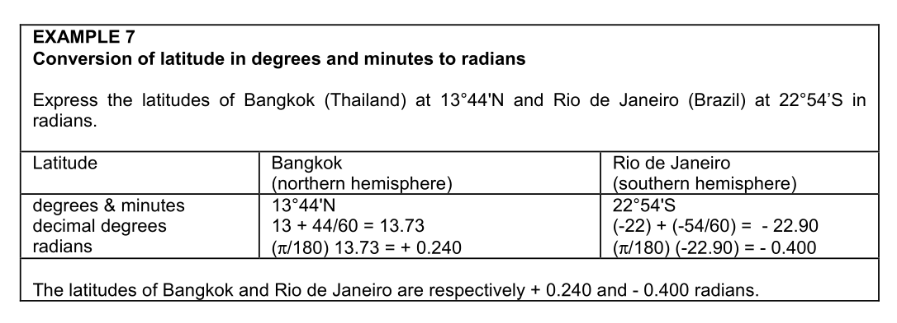  
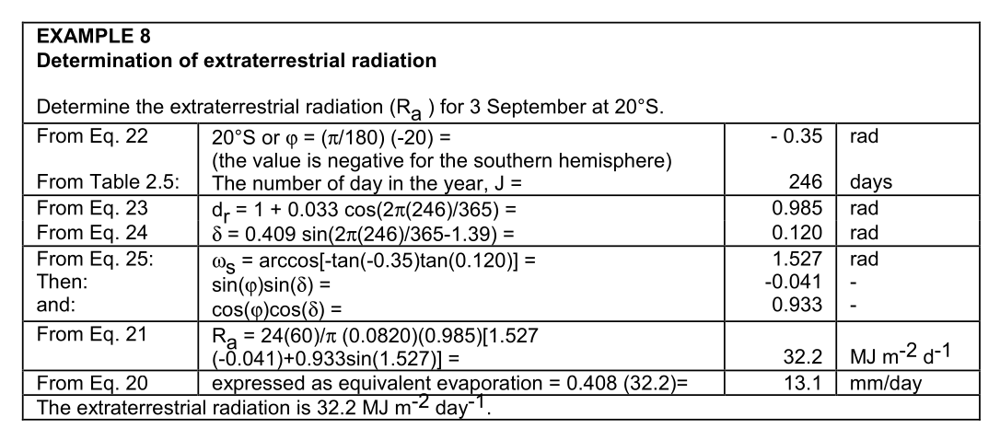  
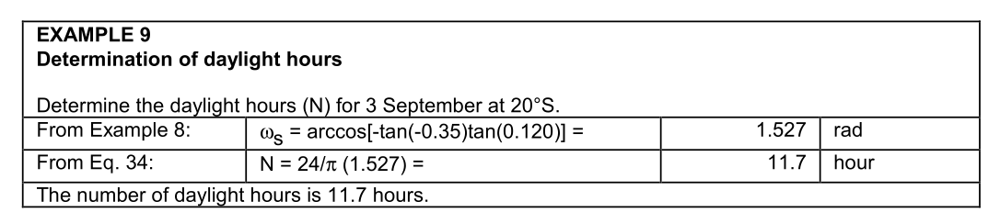

* * *

### `main.c`

Запустим файл `main.c` основного кода, который покажет вычисление **R<sub>a</sub>** и деривативов для эталонных значений 20°S, J = 246 (3 сентября).

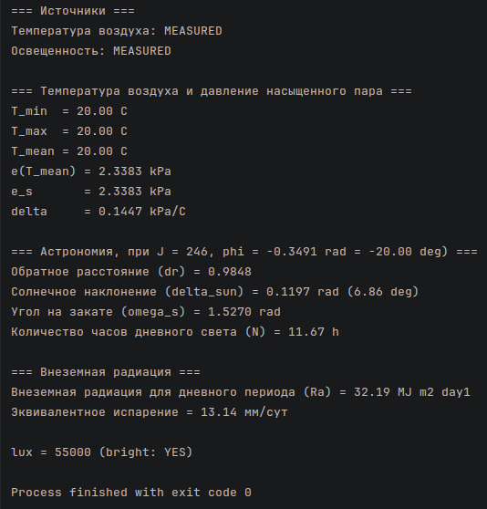

* * *

### `main-test.c`

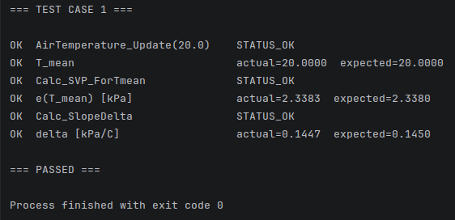  
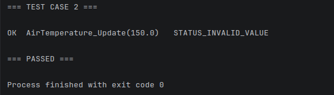  
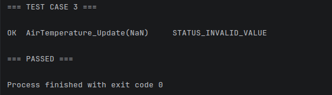  
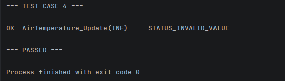  
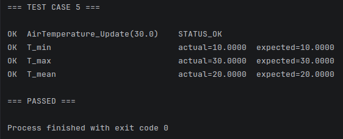  
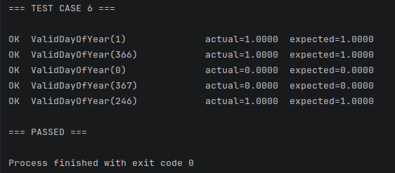  
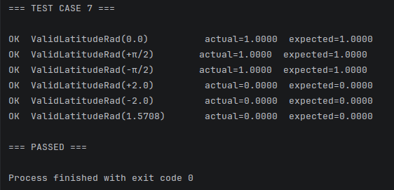  
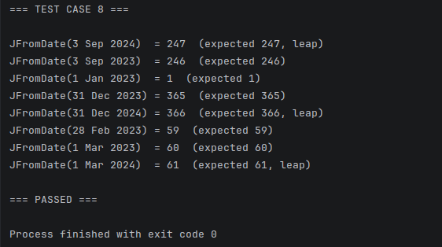  
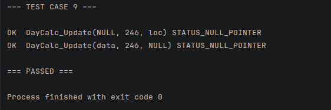  
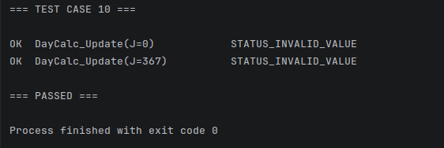  
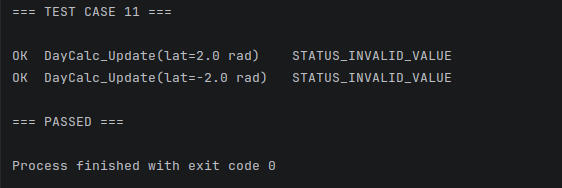  
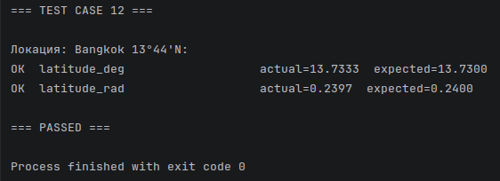  
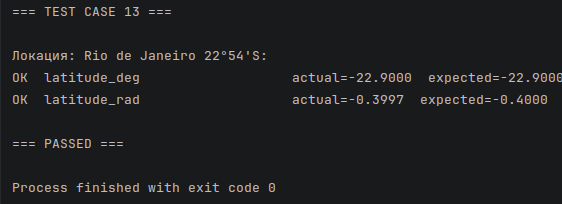  
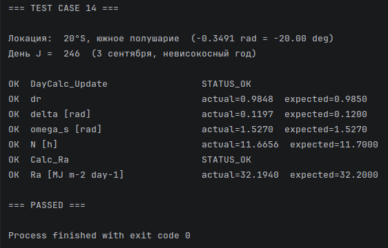  
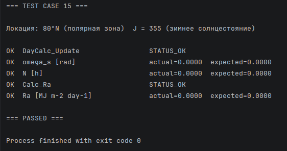  
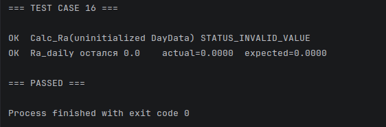

* * *
