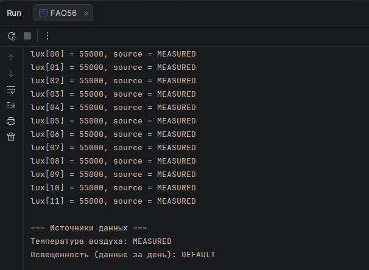
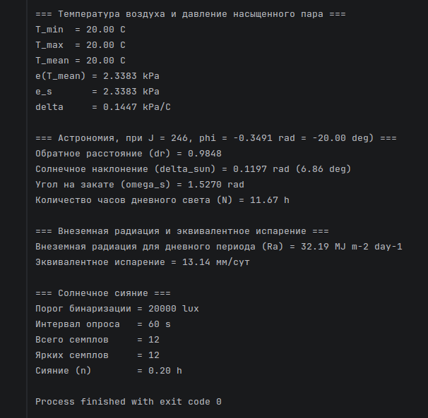
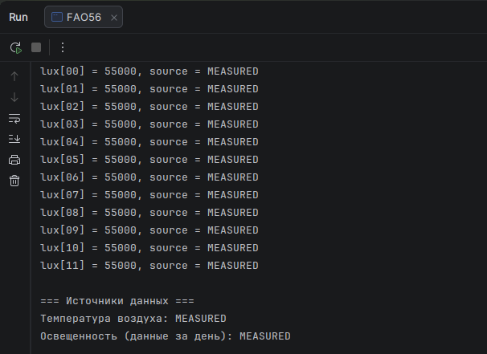

# devlog08. Модуль вычисления солнечного сияния

*Builds the sunshine-duration accumulator module (`sunshine-lux-calc`), which converts a series of binary “bright/not bright” lux readings (mimicking a Campbell–Stokes heliograph) into hours of actual sunshine, n — needed for the Angström–Prescott solar radiation formula. This entry finds and fixes a logic bug: the daily data-source flag (`MEASURED` vs `DEFAULT`) never updated to `MEASURED` because of a flawed `if/else if` condition combined with a `DEFAULT`-initialized starting state — traced from a mismatch in program output, then fixed with explicit `has_any_samples`/`has_default_samples` flags finalized once per day. Also notes an open design question (“what to do when the calendar date itself is unavailable”) deferred to devlogs 09–10.*

* * *

## Улучшения предыдущего кода

Этот девлог посвящен разработке модуля вычисления продолжительности солнечного сияния, который относится как дериватив к модулю **солнечной радиации** (*solar radiation, R<sub>s</sub>*). Прежде чем переходить к разработке, сделаем небольшой обзор найденных в предшествующем коде проблем и внесем улучшения в существующий код.

* * *

### Изменение функции `AirTemperature_Init`

Откроем файлы `air-temperature-calc.h/.c` и перепишем функцию `AirTemperature_Init()` так, чтобы она могла возвращать статус, а не игнорировала `NULL`.

* * *

#### `air-temperature-calc.h`

```C
/* STATUS_OK: структура обнулена, initialized = false */
/* STATUS_NULL_POINTER: data == NULL */
Status AirTemperature_Init(AirTemperatureData* data);
```

* * *

#### `air-temperature-calc.c`

```C
Status AirTemperature_Init(AirTemperatureData* data) {
    if (data == NULL) {
        return STATUS_NULL_POINTER;
    }
    
    data->T_min_C     = 0.0;
    data->T_max_C     = 0.0;
    data->T_mean_C    = 0.0;
    data->timestamp   = 0U;
    data->initialized = false;
    
    return STATUS_OK;
}
```

> Все места вызова этой функции (в `main.c` и в тестовых случаях 1-5 в `main-test.c`) после внесения изменений проверены и работают корректно.

* * *

### Изменение прочих функций `Init()` и `main`-файлов

Аналогично внесем изменения в функции `DayCalc_Init`, `RaCalc_Init`, `Location_Init` (опционально).

В файле оркестрации **`main.c`** заменим все измененные здесь функции `Init()` следующим образом:

```C
    /* *** Инициализация с (формальной проверкой статуса) *** */
    Status status = AirTemperature_Init(&temperature_data);
    if (status != STATUS_OK) {
        return PrintStatusAndReturn("Ошибка инициализации AirTemperatureData: ", status);
    }

    status = Location_Init(&location);
    if (status != STATUS_OK) {
        return PrintStatusAndReturn("Ошибка инициализации LocationData: ", status);
    }

    status = DayCalc_Init(&day_data);
    if (status != STATUS_OK) {
        return PrintStatusAndReturn("Ошибка инициализации DayData: ", status);
    }

    status = RaCalc_Init(&ra_data);
    if (status != STATUS_OK) {
        return PrintStatusAndReturn("Ошибка инициализации RaData: ", status);
    }
```

> Здесь функции `Init()` вызываются с адресами локальных переменных, и `STATUS_NULL_POINTER` невозможен, однако эта формальная проверка нужна для соблюдения единого контракта.

> Все модули после внесения изменений проверены и работают корректно.

* * *

## Новый модуль вычисления освещенности

### Файловая структура

Для вычисления *R<sub>s</sub>* необходимо, среди прочего, иметь вычисляемое значение *n* - продолжительности солнечного сияния (в часах). Нужно разработать такой модуль и пояснить принцип его работы.

Заметим, что модуль вычисления освещенности **`sunshine-lux-calc`** имеет прямую связь с модулем чтения данных с датчика освещенности `sunshine-lux-read`. Эта пара соотносится аналогично тому, как соотносится между собой пара модулей для измерения и для вычисления температуры воздуха - `air-temperature-read` и `air-temperature-calc`. Однако, если модули температуры, с точки зрения файловой структуры, представляют собой отдельные подкаталоги, то модуль `sunshine-lux-calc` размещен внутри подкаталога вычисления радиации `radiation-calc` и представляет собой, по сути, два связанных файла - `sunshine-lux-calc.h` и `sunshine-lux-calc.c`.

Размещение этого модуля в файловой структуре проекта могло бы быть и другим - "симметричным" по отношению к паре модулей температуры воздуха. Решение разместить модуль в крупном блоке вычисления радиации основано на удобстве следования за документацией *FAO56* при разработке и анализе, а также на семантическом, или математико-логическом членении уравнения эвапотранспирации больше, чем на логике физического процесса. Согласно этому, вычисляемое значение `n` относится как дериватив к уравнению `Rs` и далее к `Rn`. Так или иначе, данное решение не влияет на распределение потоков данных, идущих от датчиков в модули вычисляемых значений, то есть, в конечном счете, не препятствует возможности следовать за логикой физического процесса.

```md
02-calculation/
  023-radiation-calc/
    ...
    sunshine-lux-calc.h
    sunshine-lux-calc.c
```

* * *

### Логика процесса и вычисления

Для вычисления *R<sub>s</sub>* нужно иметь два значения:

- **максимально возможного сияния** *N* (для данного дня и широты), нахождение которого мы уже описали в модуле внеземной радиации *R<sub>a</sub>*;
- **фактической продолжительности солнечного сияния** *n*, которое мы будем вычислять на основе показаний (эмуляции) датчика освещенности, следуя принципу **гелиографа Кэмпбелла–Стокса** (*Campbell–Stokes recorder*).

* * *

#### Описание логики физического процесса и измерений

Гелиограф Кэмпбелла–Стокса - оптический прибор XIX века. Принцип его работы следующий: стеклянная сфера фокусирует солнечные лучи на бумажную ленту и прожигает ее в те моменты, когда солнце светит достаточно ярко. Из длины таких прожженных сегментов за день получается значение *n* в часах. Прибор прост, надежен и до сих пор является опорным инструментом метеорологических измерений.

Бюджетный датчик освещенности, который мы будем использовать в нашем проекте, реализует тот же принцип цифровым способом: вместо прожигания бумаги он периодически сравнивает мгновенную освещенность с пороговым значением, отличающим ясное небо от пасмурного. Интеграция по времени - это простое суммирование "ярких" интервалов.

Главное **ограничение**: порог бинаризации (20 000 *lux* в нашем случае) является инженерным **приближением**, не стандартизованным ВМО. Датчик не различает "яркий облачный" (8 000-15 000 *lux*) и "рассеянный солнечный" свет так же хорошо, как это делает гелиограф. Для агрометеорологических расчетов по *FAO56* это **упрощение представляется допустимым**: уравнение Ангстрема–Прескотта само по себе является эмпирическим и имеет погрешность 10-15% без региональной калибровки коэффициентов *as* и *bs*, используемых при вычислении *R<sub>s</sub>*.

> Стоит отметить, что порог бинаризации на данном этапе является калибровочным и экспериментальным, то есть 20 000 *lux* - это значение, которое не является частью архитектуры и которое в процессе отладки системы может изменяться. Главная задача здесь - сделать эти изменения легкими и безобидными для функционирования всего остального кода.

* * *

#### Описание логики контрактов и модулей

Рассмотрим требуемое отношение трех функциональных узлов системы: модуля чтения данных освещенности, модуля вычисления на основе данных освещенности, модуля вычисления радиации (в данном случае, *R<sub>s</sub>*).

- Модуль `sunshine-lux-read`: **читает/эмулирует** данные датчика, а именно - **мгновенное значение освещенности** `lux`; при необходимости **включает *fallback*-логику** и заменяет данные датчика - **данными по умолчанию** (*default*); **передает мгновенное значение** освещенности - прочитанное, эмулированное или дефолтное - в модуль вычисляемых значений освещенности `sunshine-lux-calc`.

- Модуль `sunshine-lux-calc`: **принимает мгновенное значение** освещенности от модуля `sunshine-lux-read`; полученное значение **сравнивает с пороговым значением** - различающим ясное небо от пасмурного; **сохраняет и накапливает семплы** выше пороговых значений - бинарный счетчик ясного неба; **переводит накопленное значение** семплов в количество часов солнечного сияния *n*; **передает вычисленное значение *n*** в модуль вычисления радиации *R<sub>s</sub>*.

- Модуль `solar-radiation-calc`: **принимает вычисленные значения** *R<sub>a</sub>, N, n*; **вычисляет значение** *R<sub>s</sub>*; **передает вычисленное значение** *R<sub>s</sub>*.

> С точки зрения файловой структуры, модуль `solar-radiation-calc` размещен внутри крупного вычислительного блока `radiation-calc` и является, наряду с модулем `extrater-radiation-calc`, его подмножеством.

* * *

### Написание модуля `sunshine-lux-calc`

> В файле `sunshine-lux-read.h` ранее мы разместили строку:
> 
> ```C
> /* Порог "яркого солнечного света" для бинарного счетчика n - для модуля Rs при вычислении n/N */
> #define BRIGHT_SUNSHINE_THRESHOLD_LUX (20000.0)
> ```
> И затем использовали ее в файле оркестрации `main.c` следующим образом:
> 
> ```C
> (void)printf("\nlux = %.0f (bright: %s)\n", lux_sample.lux, (lux_sample.lux >= BRIGHT_SUNSHINE_THRESHOLD_LUX) ? "YES" : "NO");
> ```
> 
> Пришло время **удалить эту строку** из `sunshine-lux-read.h`, поскольку пороговое значение мы будем теперь использовать внутри нового модуля `sunshine-lux-calc`. Файл оркестрации `main.c` мы теперь будем использовать *по возможности* только для реализации *prod*-логики, а различные проверки - *главным образом* в файле `main-test.c`.

* * *

**`sunshine-lux-calc.h`:**

```C
#ifndef SUNSHINE_LUX_CALC_H
#define SUNSHINE_LUX_CALC_H

#ifdef __cplusplus
extern "C" {
#endif

#include <stdint.h>
#include <stdbool.h>
#include "../../00-validation/status.h"
#include "../../00-validation/value-source.h"

#define SUNSHINE_THRESHOLD_LUX      (20000.0)   /* Калибруемый порог бинаризации lux: sunshine или no sunshine */
#define SUNSHINE_POLL_INTERVAL_SEC  (60U)       /* Интервал опроса датчика [сек] */

/* Структура для суточного накопителя. Логика работы функций накопителя:
 * - получает мгновенные значения через SunshineLux_Update(),
 * - хранит накопленное состояние за сутки,
 * - результирует SunshineLux_FinalizeDay() в конце суток,
 * - сбрасывает SunshineLux_ResetDay() при наступлении новых суток */
typedef struct {
    double            threshold_lux;      /* Порог бинаризации [lux] */
    uint32_t          sample_period_sec;  /* Интервал опроса [сек] */
    uint32_t          bright_samples;     /* Счетчик "ярких" семплов */
    uint32_t          total_samples;      /* Счетчик всех семплов (для контроля) */
    double            n_hours;            /* Вычисленное n [ч] после финализации */
    SensorValueSource source;             /* Качество данных за день */
    bool              initialized;        /* Структура инициализирована */
} SunshineLuxData;

/* Инициализация структуры вычислительного модуля: threshold_lux > 0 и sample_period_sec > 0 обязательны */
Status SunshineLux_Init(SunshineLuxData* data, double threshold_lux, uint32_t sample_period_sec);

/* Принимает одно мгновенное показание датчика.
 * Если lux >= threshold_lux - инкрементирует счетчик bright_samples.
 * Если хоть один source из семплов SENSOR_VALUE_DEFAULT, data->source становится SENSOR_VALUE_DEFAULT.
 * Вызов каждые sample_period_sec секунд (на МК - из таймера/ISR) */
Status SunshineLux_Update(SunshineLuxData* data, double lux, SensorValueSource source);

/* Вычисляет n_hours из накопленных семплов: n = (bright_samples * sample_period_sec) / 3600.
 * Вызывается один раз в конце суток перед передачей n в Calc_Rs */
Status SunshineLux_FinalizeDay(SunshineLuxData* data);

/* Сбрасывает суточные счетчики для нового дня. Параметры калибровки (threshold, period) сохраняются.
 * Вызывается каждую полночь (на МК - из RTC-прерывания) */
Status SunshineLux_ResetDay(SunshineLuxData* data);

#ifdef __cplusplus
}
#endif

#endif /* SUNSHINE_LUX_CALC_H */
```

* * *

**`sunshine-lux-calc.c`:**

```C
#include <stddef.h>
#include "sunshine-lux-calc.h"

/* Вспомогательная функция. Двоичное решение: семпл "яркий" или нет.
 * Логику порогового сравнения можно менять в одном месте (например, для калибровки или добавления гистерезиса) */
static bool SunshineLux_IsBright(const SunshineLuxData* data, const double lux) {
    return lux >= data->threshold_lux;
}

Status SunshineLux_Init(SunshineLuxData* data, const double threshold_lux, const uint32_t sample_period_sec) {
    if (data == NULL) {
        return STATUS_NULL_POINTER;
    }

    if ((threshold_lux <= 0.0) || (sample_period_sec == 0U)) {
        return STATUS_INVALID_VALUE;
    }

    data->threshold_lux     = threshold_lux;
    data->sample_period_sec = sample_period_sec;
    data->bright_samples    = 0U;
    data->total_samples     = 0U;
    data->n_hours           = 0.0;
    data->source            = SENSOR_VALUE_DEFAULT;
    data->initialized       = true;

    return STATUS_OK;
}

Status SunshineLux_Update(SunshineLuxData* data, const double lux, const SensorValueSource source) {
    if (data == NULL) {
        return STATUS_NULL_POINTER;
    }

    if (!data->initialized) {
        return STATUS_INVALID_VALUE;
    }

    if ((source != SENSOR_VALUE_MEASURED) && (source != SENSOR_VALUE_DEFAULT)) {
        return STATUS_INVALID_VALUE;
    }

    data->total_samples++;

    if (SunshineLux_IsBright(data, lux)) {
        data->bright_samples++;
    }

    /* Если хотя бы один семпл за сутки был DEFAULT, результат дня хранится как DEFAULT до следующего ResetDay().
     * Используется как nota bene: "сенсор давал сбои, данные за сутки могут быть неполными" */
    if (source == SENSOR_VALUE_DEFAULT) {
        data->source = SENSOR_VALUE_DEFAULT;
    } else if (data->source != SENSOR_VALUE_DEFAULT) {
        data->source = SENSOR_VALUE_MEASURED;
    }

    return STATUS_OK;
}

Status SunshineLux_FinalizeDay(SunshineLuxData* data) {
    if (data == NULL) {
        return STATUS_NULL_POINTER;
    }

    if (!data->initialized) {
        return STATUS_INVALID_VALUE;
    }

    /* Перевод накопленного числа ярких семплов в продолжительность сияния за день в часах.
     * Физическое ограничение: n ≤ 24 ч. Если bright_samples * sample_period_sec > 86400 сек,
     * имеем ошибку конфигурации: слишком длинный период либо счетчик не сбрасывался в полночь */
    const double n = ((double)data->bright_samples * (double)data->sample_period_sec) / 3600.0;

    /* Защитная проверка: физически n не должно превышать 24 часа */
    if (n > 24.0) {
        return STATUS_INVALID_VALUE;    /* Не перезаписываем n_hours, а оставляем 0.0 из Init/Reset */
    }

    data->n_hours = n;
    return STATUS_OK;
}

Status SunshineLux_ResetDay(SunshineLuxData* data) {
    if (data == NULL) {
        return STATUS_NULL_POINTER;
    }

    if (!data->initialized) {
        return STATUS_INVALID_VALUE;
    }

    data->bright_samples = 0U;
    data->total_samples  = 0U;
    data->n_hours        = 0.0;
    data->source         = SENSOR_VALUE_DEFAULT;

    return STATUS_OK;
}
```

> Модуль `sunshine-lux-calc` / `SunshineLuxData` - дискретный накопитель с фиксированным шагом. Он не обязан знать про пакет измерений `sunshine-lux-read` / `SunshineLuxSample` как структуру; ему достаточно значения `lux`, признака качества `source` и внутреннего `sample_period_sec`. Точные временные метки остаются задачей источника данных и оркестрации.

* * *

### Обновление файла оркестрации `main.c`

```C
#include <math.h>
#include <stdio.h>
#include <stdint.h>

#include "../00-validation/status.h"
#include "../00-validation/value-source.h"

#include "../01-measurement/011-air-temperature-read/air-temperature-read.h"
#include "../01-measurement/012-sunshine-lux-read/sunshine-lux-read.h"

#include "../02-calculation/021-air-temperature-calc/air-temperature-calc.h"
#include "../02-calculation/022-vapour-pressure-calc/vapour-pressure-calc.h"
#include "../02-calculation/023-radiation-calc/geolocation-calc.h"
#include "../02-calculation/023-radiation-calc/day-in-year-calc.h"
#include "../02-calculation/023-radiation-calc/extrater-radiation-calc.h"
#include "../02-calculation/023-radiation-calc/sunshine-lux-calc.h"

#define PI (3.14159265358979323846)

static int PrintStatusAndReturn(const char* prefix, const Status status) {
    (void)fprintf(stderr, "%s%s\n", prefix, Status_ToString(status));
    return 1;
}

int main(void) {
    /* *** Объявление локальных переменных *** */
    TemperatureSample   t_sample;
    AirTemperatureData  temperature_data;
    SunshineLuxSample   lux_sample;
    SunshineLuxData     sunshine_data;
    LocationData        location;
    DayData             day_data;
    RaData              ra_data;
    double              e_tmean = 0.0;
    double              e_s = 0.0;
    double              delta = 0.0;

    /* *** Инициализация с (формальной проверкой статуса) *** */
    Status status = AirTemperature_Init(&temperature_data);
    if (status != STATUS_OK) {
        return PrintStatusAndReturn("Ошибка инициализации AirTemperatureData: ", status);
    }

    status = Location_Init(&location);
    if (status != STATUS_OK) {
        return PrintStatusAndReturn("Ошибка инициализации LocationData: ", status);
    }

    status = DayCalc_Init(&day_data);
    if (status != STATUS_OK) {
        return PrintStatusAndReturn("Ошибка инициализации DayData: ", status);
    }

    status = RaCalc_Init(&ra_data);
    if (status != STATUS_OK) {
        return PrintStatusAndReturn("Ошибка инициализации RaData: ", status);
    }

    status = SunshineLux_Init(&sunshine_data, SUNSHINE_THRESHOLD_LUX, SUNSHINE_POLL_INTERVAL_SEC);
    if (status != STATUS_OK) {
        return PrintStatusAndReturn("Ошибка инициализации SunshineLuxData: ", status);
    }

    status = SunshineLux_ResetDay(&sunshine_data);
    if (status != STATUS_OK) {
        return PrintStatusAndReturn("Ошибка сброса суточного накопителя SunshineLuxData: ", status);
    }

    /* *** 1. Слой измерений *** */

    /* Температура воздуха */
    status = SensorTemperature_ReadInstant(&t_sample);
    if (status != STATUS_OK) {
        (void)fprintf(stderr,
            "Нет данных температуры воздуха, используем значение по умолчанию. "
            "Причина: %s\n", Status_ToString(status));

        status = SensorTemperature_ReadDefault(&t_sample);
        if (status != STATUS_OK) {
            return PrintStatusAndReturn(
                "Критическая ошибка чтения данных температуры воздуха по умолчанию: ", status);
        }
    }

    /* Освещенность */
    /* На этапе PC-версии читаем последовательность mock-значений, на МК здесь будет тот же вызов
     * через тот же контракт чтения, но реализация SensorLux_ReadInstant() станет драйверной */
    for (uint32_t i = 0U; i < 12U; ++i) {
        status = SensorLux_ReadInstant(&lux_sample);
        if (status != STATUS_OK) {
            (void)fprintf(stderr,
                "Нет данных освещенности, используем значение по умолчанию. "
                "Причина: %s\n", Status_ToString(status));

            status = SensorLux_ReadDefault(&lux_sample);
            if (status != STATUS_OK) {
                return PrintStatusAndReturn(
                    "Критическая ошибка чтения данных освещенности по умолчанию: ", status);
            }
        }

        status = SunshineLux_Update(&sunshine_data, lux_sample.lux, lux_sample.source);
        if (status != STATUS_OK) {
            return PrintStatusAndReturn(
                "Ошибка обновления счетчика солнечного сияния: ", status);
        }

        (void)printf("lux[%02u] = %.0f, source = %s\n",
            (unsigned)i, lux_sample.lux, SensorValueSource_ToString(lux_sample.source));
    }

    status = SunshineLux_FinalizeDay(&sunshine_data);
    if (status != STATUS_OK) {
        return PrintStatusAndReturn(
            "Ошибка результирования показаний счетчика за день: ", status);
    }

    /* *** 2. Слой вычислений *** */

    /* Температура воздуха */
    status = AirTemperature_Update(&temperature_data, t_sample.instant_c, t_sample.timestamp);
    if (status != STATUS_OK) {
        return PrintStatusAndReturn(
            "Ошибка обновления температуры воздуха: ", status);
    }

    /* Давление насыщенного пара */
    status = Calc_SaturationVapourPressure_ForTmean(&temperature_data, &e_tmean);
    if (status != STATUS_OK) {
        return PrintStatusAndReturn(
            "Ошибка расчета e(Tmean): ", status);
    }

    status = Calc_Mean_SaturationVapourPressure(&temperature_data, &e_s);
    if (status != STATUS_OK) {
        return PrintStatusAndReturn(
            "Ошибка расчета e_s: ", status);
    }

    status = Calc_SlopeDelta(&temperature_data, &delta);
    if (status != STATUS_OK) {
        return PrintStatusAndReturn(
            "Ошибка расчета дельты: ", status);
    }

    /* Астрономия */
    const uint16_t J = 246U;    /* Тестовый день (FAO56, ex. 8): J = 246 (3 сентября).
    Для проверки других значений см. main-test.c (TEST_CASE 6+) */

    status = DayCalc_Update(&day_data, J, &location);
    if (status != STATUS_OK) {
        return PrintStatusAndReturn(
            "Ошибка вычисления астрономических данных: ", status);
    }

    /* Внеземное (космическое) излучение */
    status = Calc_Ra(&ra_data, &day_data, &location);
    if (status != STATUS_OK) {
        return PrintStatusAndReturn(
            "Ошибка расчета внеземного излучения (Ra): ", status);
    }

    /* *** Вывод (для отслеживания) *** */
    (void)printf("\n=== Источники данных ===\n");
    (void)printf("Температура воздуха: %s\n", SensorValueSource_ToString(t_sample.source));
    (void)printf("Освещенность (данные за день): %s\n", SensorValueSource_ToString(sunshine_data.source));

    (void)printf("\n=== Температура воздуха и давление насыщенного пара ===\n");
    (void)printf("T_min  = %.2f C\n", temperature_data.T_min_C);
    (void)printf("T_max  = %.2f C\n", temperature_data.T_max_C);
    (void)printf("T_mean = %.2f C\n", temperature_data.T_mean_C);
    (void)printf("e(T_mean) = %.4f kPa\n", e_tmean);
    (void)printf("e_s       = %.4f kPa\n", e_s);
    (void)printf("delta     = %.4f kPa/C\n", delta);

    (void)printf("\n=== Астрономия, при J = %u, phi = %.4f rad = %.2f deg) ===\n",
        day_data.J, location.latitude_rad, location.latitude_rad * (180.0 / PI));  /* Перевод радиан в градусы: обратное преобразование eq. 22 */
    (void)printf("Обратное расстояние (dr) = %.4f\n", day_data.dr);
    (void)printf("Солнечное наклонение (delta_sun) = %.4f rad (%.2f deg)\n",
        day_data.delta_rad, day_data.delta_rad * (180.0 / PI));
    (void)printf("Угол на закате (omega_s) = %.4f rad\n", day_data.omega_s_rad);
    (void)printf("Количество часов дневного света (N) = %.2f h\n", day_data.N_hours);

    (void)printf("\n=== Внеземная радиация и эквивалентное испарение ===\n");
    (void)printf("Внеземная радиация для дневного периода (Ra) = %.2f MJ m-2 day-1\n", ra_data.Ra_daily);
    (void)printf("Эквивалентное испарение = %.2f мм/сут\n", ra_data.Ra_daily * 0.408);  /* По eq. 20 */

    (void)printf("\n=== Солнечное сияние ===\n");
    (void)printf("Порог бинаризации = %.0f lux\n", SUNSHINE_THRESHOLD_LUX);
    (void)printf("Интервал опроса   = %u s\n", (unsigned)SUNSHINE_POLL_INTERVAL_SEC);
    (void)printf("Всего семплов     = %u\n", sunshine_data.total_samples);
    (void)printf("Ярких семплов     = %u\n", sunshine_data.bright_samples);
    (void)printf("Сияние (n)        = %.2f h\n", sunshine_data.n_hours);

    return 0;
}
```

* * *

#### Вывод в терминал




* * *

### Анализ и исправление ошибок, улучшение кода

1. **Цикл `for` в `main.c` - временный**. Этот цикл - не *production*-логика поля, а простая проверка (*smoke test*) накопителя данных солнечного сияния:

- каждый проход цикла имитирует один момент измерения;
- `SensorLux_ReadInstant()` дает одно мгновенное значение `55000`;
- `SunshineLux_Update()` принимает этот семпл и накапливает состояние через инкремент;
- после цикла `SunshineLux_FinalizeDay()` переводит накопленное число ярких семплов (12) в `n_hours`: 12 * 60 / 3600 = 0.20 h.

При `sample_period_sec = 60` и при 12 итерациях проверяется "12 минут наблюдений".

Для полноценного режима работы этот цикл должен быть заменен на источник семплов, который работает по реальному времени или читает сценарий данных целиком.

На данном шаге - в отсутствие датчиков - **исправления не требуются**. (Позже мы добавим только функцию календарной даты и часы, и наши 12 наблюдений будут протекать во времени, а не появляться сразу все в одно мгновение.)

* * *

2. **Инициализация `const uint16_t J = 246U;`** в файле оркестрации `main.c` - **слабое место**. Необходим надежный источник календарной даты на уровне платформы (ПК, МК), а не ручной ввод *J* прямо в `main.c`.

Возможное решение:

- *math layer* не должен знать, откуда берется дата;
- оркестрация получает дату из отдельного источника;
- на ПК этот источник может быть:
  - фиксированной датой сценария;
  - аргументом командной строки;
  - отдельной тестовой конфигурацией;
- на МК это будет *RTC*.

Лучший способ - **выделить *date provider* в отдельный модуль** вне математического ядра программы, **написать/использовать функцию для чтения актуальной календарной даты**.

Поток может быть таким:

- `main.c` получает дату из `DateProvider_Read()`;
- если дата валидна - вызывает `DayCalc_UpdateFromDate()`;
- если дата недоступна - выдает ошибку и останавливает расчет этого цикла.

#### **Дилемма *default J* и *fallback*-логика:**

- при невозможности получить актуальное значение календарной даты, подстановка какой-либо даты по умолчанию, по крайней мере, не прерывает поток вычислений, и итоговый расчет эвапотранспирации не рушится; вероятно, следует рассуждать так, что дата по умолчанию должна быть насколько возможно компромиссной и исходить из принципа "лучше недолить, чем перелить" (?);

- если дата, подставляемая в уравнения, не актуальна, то множество вычислений, связанных со значением календарной даты, дают нерелевантные результаты; вероятно, следует рассуждать так, что расчет должен следовать принципу "если дата доступна - вычисляем, если не доступна - сигнализируем об ошибке и прерываемся" (?).

Возможен ли здесь более надежный алгоритм, разрешающий эту дилемму? Например, вместо использования значения по умолчанию (при невозможности получить актуальное значение календарной даты) использовать алгоритм "восстановления" текущей даты от последней записи, последней временной метки, от данных счетчика или как-то еще; а вместо прерывания и остановки расчета - переключаться на *recovery*-логику и продолжать попытки вычисления, поскольку система должна быть автономной и всегда должна находить выход из ситуации, чтобы продолжать вычисление эвапотранспирации.

> **Разрешению дилеммы "default J" посвятим отдельный девлог** - поскольку, вероятно, это требует написания отдельного модуля и хорошо продуманного (и описанного) алгоритма восстановления даты. Полагаю, сперва мы исправим текущие ошибки, затем напишем модуль вычисления радиации *R<sub>s</sub>*, обновим оркестрацию и тестовые наборы, и затем вернемся к разрешению нашей дилеммы.

* * *

3. **Проблема согласования отчета по источнику данных**: в выводе в терминал видим `lux[...] = MEASURED`, а суточная метка качества помечена как `DEFAULT`.

Сейчас в `SunshineLux_Init` `SunshineLuxData.source` инициализируется как `SENSOR_VALUE_DEFAULT` и только потом хочет обновляться через `Update()` до `MEASURED`:

```C
if (source == SENSOR_VALUE_DEFAULT) {
    data->source = SENSOR_VALUE_DEFAULT;
} else if (data->source != SENSOR_VALUE_DEFAULT) {    /* <- Тут ошибка */
    data->source = SENSOR_VALUE_MEASURED;
}
```

Если `data->source` стартует как `DEFAULT`, то ветка `else if` никогда не сработает, и после любого количества *measured*-семплов суточный *source* так и останется `DEFAULT` - это мы и видим в выводе:

- `source == DEFAULT`? - нет;
- `data->source != DEFAULT`? - тоже нет, поскольку там `DEFAULT` из `Init()`;
- ни одна ветка не выполняется, источник всегда остается `DEFAULT`.

#### **Исправляем**

Нужно инициализировать `source = SENSOR_VALUE_MEASURED`, а в `Update()` фиксировать `DEFAULT` только как деградацию `MEASURED` (в случае недоступности или повреждения данных измерения).

И главное - архитектурно - суточный `source` будем накапливать как качество серии измерений и фиксировать в `FinalizeDay()`, а не вычислять на лету в `Update()`.

Мы хотим получить следующую логику сообщений для оценки источников измерений освещенности за день:

- `MEASURED` - если за день все семплы были измеренными;
- `DEFAULT` - если хотя бы один семпл был *fallback/default*;
- `INVALID` - если за день вообще не пришло ни одного семпла.

* * *

В **`sunshine-lux-calc.h`** изменим структуру `SunshineLuxData`:

```C
/* Структура для суточного накопителя. Логика работы функций накопителя:
 * - получает мгновенные значения через SunshineLux_Update(),
 * - хранит накопленное состояние за сутки,
 * - результирует SunshineLux_FinalizeDay() в конце суток,
 * - сбрасывает SunshineLux_ResetDay() при наступлении новых суток
 *
 * Качество данных за сутки определяется на основе всей серии:
 * - если все семплы MEASURED, то source = SENSOR_VALUE_MEASURED;
 * - если хотя бы один семпл DEFAULT, то source = SENSOR_VALUE_DEFAULT;
 * - если семплов не было вовсе, FinalizeDay() возвращает STATUS_INVALID_VALUE */
typedef struct {
    double            threshold_lux;        /* Порог бинаризации [lux] */
    uint32_t          sample_period_sec;    /* Интервал опроса [сек] */
    uint32_t          bright_samples;       /* Счетчик "ярких" семплов */
    uint32_t          total_samples;        /* Счетчик всех семплов (для контроля) */
    double            n_hours;              /* Вычисленное n [ч] после финализации */
    bool              has_any_samples;      /* Был ли хотя бы один семпл */
    bool              has_default_samples;  /* Был ли хотя бы один DEFAULT-семпл */
    SensorValueSource source;               /* Качество данных за день */
    bool              initialized;          /* Структура инициализирована */
} SunshineLuxData;
```

* * *

В **`sunshine-lux-calc.c`** внесем следующие изменения:

```C
/* В функцию SunshineLux_Init() */
    data->threshold_lux       = threshold_lux;
    data->sample_period_sec   = sample_period_sec;
    data->bright_samples      = 0U;
    data->total_samples       = 0U;
    data->n_hours             = 0.0;
    data->has_any_samples     = false;
    data->has_default_samples = false;
    data->source              = SENSOR_VALUE_DEFAULT;
    data->initialized         = true;
```

```C
/* В функцию SunshineLux_Update() */
    data->total_samples++;
    data->has_any_samples = true;

    ...

    /* Если хотя бы один семпл за сутки был DEFAULT, результат дня хранится как DEFAULT до следующего ResetDay().
     * Используется как nota bene: "сенсор давал сбои, данные за сутки могут быть неполными" */
    if (source == SENSOR_VALUE_DEFAULT) {
        data->has_default_samples = true;
    }
```

```C
/* В функцию SunshineLux_FinalizeDay() */
Status SunshineLux_FinalizeDay(SunshineLuxData* data) {
    if (data == NULL) {
        return STATUS_NULL_POINTER;
    }

    if (!data->initialized) {
        return STATUS_INVALID_VALUE;
    }

    /* Без хотя бы одного семпла финализировать нечего */
    if (!data->has_any_samples) {
        return STATUS_INVALID_VALUE;
    }

    /* Перевод накопленного числа ярких семплов в продолжительность сияния за день в часах.
     * Физическое ограничение: n ≤ 24 ч. Если bright_samples * sample_period_sec > 86400 сек,
     * имеем ошибку конфигурации: слишком длинный период либо счетчик не сбрасывался в полночь */
    const double n = ((double)data->bright_samples * (double)data->sample_period_sec) / 3600.0;

    /* Защитная проверка: физически n не должно превышать 24 часа */
    if (n > 24.0) {
        return STATUS_INVALID_VALUE;    /* Не перезаписываем n_hours, а оставляем 0.0 из Init/Reset */
    }

    data->n_hours = n;
    data->source = data->has_default_samples ? SENSOR_VALUE_DEFAULT : SENSOR_VALUE_MEASURED;

    return STATUS_OK;
}
```

```C
/* В функцию SunshineLux_ResetDay() */
    data->bright_samples       = 0U;
    data->total_samples        = 0U;
    data->n_hours              = 0.0;
    data->has_any_samples      = false;
    data->has_default_samples  = false;
    data->source               = SENSOR_VALUE_DEFAULT;
```

* * *

**Еще раз уточним:**

- источник отдельного семпла - это `lux_sample.source` в `main.c`; связан с `SunshineLuxSample` из модуля `sunshine-lux-read`;

- источник для суточного результата - это `sunshine_data.source` в `main.c`; связан с `SunshineLuxData` из модуля `sunshine-lux-calc`.

* * *

**Запустим компиляцию после внесенных изменений:**



> Видим, что проблема согласования отчета по источнику данных решена.

* * *

## Дальнейшие действия

Напомним вкратце, каковы будут следующие шаги:

- напишем модуль вычисления радиации *R<sub>s</sub>*,
- обновим оркестрацию и тестовые наборы,
- вернемся к разрешению нашей дилеммы "default J".
