# devlog09. Модуль вычисления солнечной радиации

*Implements the Angström–Prescott solar radiation formula, Rs (FAO-56 eq. 35) and the clear-sky radiation formula, Rso (eq. 37), including elevation-dependent clear-sky coefficient, n/N clamping to [0,1], and polar-night zero handling. Along the way, upgrades `Location_DMS_to_decimal()` from a bare `double`-returning function to a `Status`-based contract with explicit minute-range validation (0 ≤ minutes < 60), for consistency with the rest of the codebase. Adds eight new test cases (17–24) covering the sunshine accumulator in isolation (full sun, no sun, mixed day), the FAO-56 ex. 10 reference case (Rio de Janeiro), n > N clamping, invalid Angström coefficients, and uninitialized-input rejection.*

* * *

### Напоминание о текущих задачах

Вкратце напомним задачи, стоящие перед нами на ближайшие пару шагов:

- написать модуль вычисления солнечной радиации *R<sub>s</sub>*,
- обновить оркестрацию и тестовые наборы,
- разрешить дилемму "default J" (и снова обновить оркестрацию).

В этом девлоге мы будем решать первые две задачи: создание модуля *R<sub>s</sub>* и обновление файлов оркестрации и тестирования.

* * *

## Напишем модуль солнечной радиации

В модуле `radiation-calc` слоя `calculation` создадим подмодуль с файлами `solar-radiation-calc.h/.c`.

#### `solar-radiation-calc.h`

```C
#ifndef SOLAR_RADIATION_CALC_H
#define SOLAR_RADIATION_CALC_H

#ifdef __cplusplus
extern "C" {
#endif

#include <stdbool.h>
#include "../../00-validation/status.h"
#include "extrater-radiation-calc.h"
#include "sunshine-lux-calc.h"
#include "geolocation-calc.h"
#include "day-in-year-calc.h"

/* Стандартные коэффициенты Angström–Prescott по FAO56.
 * Используются как fallback, если локальная калибровка отсутствует */
#define DEFAULT_ANGSTROM_VALUE_A_S  (0.25)
#define DEFAULT_ANGSTROM_VALUE_B_S  (0.50)

/* Базовый коэффициент clear-sky radiation для Rso (eq.37): Rso = (0.75 + 2e-5 * z) * Ra */
#define CLEAR_SKY_BASE_COEFFICIENT  (0.75)

/* Конфигурация коэффициентов Angström–Prescott. Данные значения относятся
 * не к суточному состоянию вычислений, а к параметрам модели/калибровки местности */
typedef struct {
    double a_s;         /* Коэффициент Angström */
    double b_s;         /* Коэффициент Prescott */
} AngstromValues;

/* Вычисляемая суточная солнечная радиация. Хранит результирующие значения вычислений */
typedef struct {
    double Rs_daily;      /* Солнечная радиация [MJ m-2 day-1] */
    double Rso_daily;     /* Clear-sky radiation [MJ m-2 day-1] */
    bool   initialized;   /* Структура инициализирована */
} SolarRadiationData;

/* Инициализация структуры модуля Rs */
Status SolarRadiation_Init(SolarRadiationData* data);

/* Инициализация коэффициентов Angström–Prescott значениями по умолчанию */
Status AngstromValues_Default(AngstromValues* ang);

/* Расчет солнечной радиации:
 * Rs  = (a_s  + b_s  * n/N) * Ra    (eq.35),
 * Rso = (0.75 + 2e-5 * z)   * Ra    (eq.37).
 * - n/N ограничивается диапазоном [0, 1];
 * - при полярной ночи (N = 0) возвращаются Rs = 0 и Rso = 0;
 * - n > N автоматически ограничивается до N;
 * - высота z берется из LocationData */
Status SolarRadiation_Calc(const AngstromValues* ang, SolarRadiationData* out, const RaData* ra, const DayData* day, const SunshineLuxData* sunshine,
    const LocationData* loc);

#ifdef __cplusplus
}
#endif

#endif /* SOLAR_RADIATION_CALC_H */
```

> В уравнении 37 формула нахождения *R<sub>so</sub>* включает значение высоты *z*, которая хранится у нас в модуле `geolocation-calc` в структуре `LocationData` как ее строка `elevation_m`. В данный момент эта строка выключена (закомментирована). Для нахождения формулы *Angström–Prescott* включим значение высоты.
>
> Откроем файл `geolocation-calc.h` и раскомментируем строку `double elevation_m; ` структуры `LocationData`. Кроме того, в файле `geolocation-calc.c` добавим макрос `#define DEFAULT_ELEVATION_M (0.0)`, а затем в области действия функции `Location_Init()` после проверки валидации добавим строку `loc->elevation_m = DEFAULT_ELEVATION_M;`.
>
> Тогда в функцию `Calc_Rs()` добавим также и аргумент `const LocationData* loc`
>
> Теперь мы сможем использовать вызов `elevation_m` для вычислений уравнения *Angström–Prescott*. Хотя в данный момент значение высоты равно нулю, использование `elevation_m` необходимо заложить сейчас как архитектурное решение.

* * *

#### `solar-radiation-calc.c`

```C
#include <math.h>
#include <stddef.h>
#include "solar-radiation-calc.h"

Status AngstromValues_Default(AngstromValues* ang) {
    if (ang == NULL) {
        return STATUS_NULL_POINTER;
    }

    ang->a_s = DEFAULT_ANGSTROM_VALUE_A_S;
    ang->b_s = DEFAULT_ANGSTROM_VALUE_B_S;

    return STATUS_OK;
}

Status SolarRadiation_Init(SolarRadiationData* data) {
    if (data == NULL) {
        return STATUS_NULL_POINTER;
    }

    data->Rs_daily    = 0.0;
    data->Rso_daily   = 0.0;
    data->initialized = true;

    return STATUS_OK;
}

Status SolarRadiation_Calc(const AngstromValues* ang, SolarRadiationData* out, const RaData* ra, const DayData* day,
    const SunshineLuxData* sunshine, const LocationData* loc) {

    if ((ang == NULL) || (out == NULL) || (ra == NULL) || (day == NULL) || (sunshine == NULL) || (loc == NULL)) {
        return STATUS_NULL_POINTER;
    }

    if (!out->initialized || !ra->initialized || !day->initialized || !sunshine->initialized) {
        return STATUS_INVALID_VALUE;
    }

    /* Проверка коэффициентов Angström–Prescott. Ожидается: a_s >= 0, b_s >= 0, a_s + b_s <= 1 */
    if ((ang->a_s < 0.0) || (ang->b_s < 0.0) || ((ang->a_s + ang->b_s) > 1.0)) {
        return STATUS_INVALID_VALUE;
    }

    if (ra->Ra_daily < 0.0) {
        return STATUS_INVALID_VALUE;
    }

    if (day->N_hours < 0.0) {
        return STATUS_INVALID_VALUE;
    }

    if (sunshine->n_hours < 0.0) {
        return STATUS_INVALID_VALUE;
    }

    /* Полярная ночь: Ra = 0, N = 0, Rs = 0 */
    if (day->N_hours == 0.0) {
        out->Rs_daily = 0.0;
        out->Rso_daily = 0.0;

        return STATUS_OK;
    }

    /* Фактическое сияние n не может превышать максимально возможное N */
    const double n = (sunshine->n_hours <= day->N_hours) ? sunshine->n_hours : day->N_hours;

    /* Relative sunshine duration n/N */
    const double n_over_N = n / day->N_hours;

    /* FAO56 eq.35: Rs = (as + bs * n/N) * Ra */
    const double Rs = (ang->a_s + (ang->b_s * n_over_N)) * ra->Ra_daily;

    /* FAO56 eq.37: Rso = (0.75 + 2e-5 * z) * Ra */
    const double Rso = (CLEAR_SKY_BASE_COEFFICIENT + (2e-5 * loc->elevation_m)) * ra->Ra_daily;

    /* Защита от NaN/inf */
    if (!isfinite(Rs) || !isfinite(Rso)) {
        return STATUS_INVALID_VALUE;
    }

    /* Дополнительная проверка */
    if ((Rs < 0.0) || (Rso < 0.0)) {
        return STATUS_INVALID_VALUE;
    }

    /* Сохраним полученные значения */
    out->Rs_daily = Rs;
    out->Rso_daily = Rso;

    return STATUS_OK;
}
```

* * *

### Небольшие улучшения

Когда мы обращались к файлу/модулю геолокации, мы обнаружили, что при первичной разработке не внесли некоторые проверки значений. Перейдем в файл `geolocation-calc.c` и в области действия функции `Location_Init()` добавим проверку на то, что −90 ≤ *ϕ* ≤ 90:

```C
Status Location_Init(LocationData* loc) {
    if (loc == NULL) {
        return STATUS_NULL_POINTER;
    }

    loc->elevation_m = DEFAULT_ELEVATION_M;

    loc->latitude_deg = Location_DMS_to_decimal(DEFAULT_LATITUDE_DEG, DEFAULT_LATITUDE_MIN);
    
    if ((loc->latitude_deg < -90.0) || (loc->latitude_deg > 90.0)) {
        return STATUS_INVALID_VALUE;
    }
    
    loc->latitude_rad = loc->latitude_deg * DEG_TO_RAD;

    return STATUS_OK;
}
```

* * *

Кроме того, в функции `Location_DMS_to_decimal()` хотелось бы добавить проверку на то, что 0 ≤ *minutes* < 60.

Вообще говоря, кажется, что эта функция должна проверяться, поскольку содержит важные для последующих вычислений значения: ошибка в координатах нарушит результаты астрономических вычислений. Тогда перепишем ее иначе:

```C
Status Location_DMS_to_decimal(double degrees, double minutes, double* decimal_deg);
```

Тогда **перепишем оба файла** следующим образом:

**`geolocation-calc.h`**

```C
#ifndef GEOLOCATION_CALC_H
#define GEOLOCATION_CALC_H

#ifdef __cplusplus
extern "C" {
#endif

#include "../../00-validation/status.h"

/* LocationData - географические константы места развертывания: задаются при конфигурации системы */
typedef struct {
    double latitude_deg;   /* Широта в десятичных градусах */
    double latitude_rad;   /* Широта в радианах (вычисляется) */
    double elevation_m;    /* Высота над уровнем моря [м] */
} LocationData;

/* Перевод широты из формата градусы-минуты в десятичные градусы.
 * Знак degrees определяет полушарие: отрицательный = южное полушарие.
 * Результат записывается в decimal_deg.
 *
 * Требования:
 * - minutes: 0 <= minutes < 60
 * - degrees: -90 <= degrees <= 90 */
Status Location_DMS_to_decimal(double degrees, double minutes, double* decimal_deg);

/* Инициализация геолокации */
Status Location_Init(LocationData* loc);

#ifdef __cplusplus
}
#endif

#endif /* GEOLOCATION_CALC_H */
```

**`geolocation-calc.c`**

```C
#include <math.h>
#include <stddef.h>
#include "geolocation-calc.h"

/* Константа для перевода градусов в радианы */
#define DEG_TO_RAD (3.14159265358979323846 / 180.0)

/* Высота над уровнем моря z = 0 */
#define DEFAULT_ELEVATION_M (0.0)   /* Sea level */

/* Тестовое значение по FAO56, ex.8: 20°S, южное полушарие */
#define DEFAULT_LATITUDE_DEG (-20.0)
#define DEFAULT_LATITUDE_MIN (0.0)

/* Перевод широты из DMS в decimal degrees */
Status Location_DMS_to_decimal(const double degrees, const double minutes, double* decimal_deg) {
    if (decimal_deg == NULL) {
        return STATUS_NULL_POINTER;
    }

    /* Проверка диапазона минут */
    if ((minutes < 0.0) || (minutes >= 60.0)) {
        return STATUS_INVALID_VALUE;
    }

    /* Проверка диапазона градусов */
    if ((degrees < -90.0) || (degrees > 90.0)) {
        return STATUS_INVALID_VALUE;
    }

    /* Знак degrees "-" для юж. п. относится и к градусам, и к минутам */
    const double sign = (degrees < 0.0) ? (-1.0) : (1.0);

    *decimal_deg = sign * (fabs(degrees) + (minutes / 60.0));

    return STATUS_OK;
}

/* Инициализация геолокации */
Status Location_Init(LocationData* loc) {
    if (loc == NULL) {
        return STATUS_NULL_POINTER;
    }

    loc->elevation_m = DEFAULT_ELEVATION_M;    /* Sea level */

    /* Преобразуем широту из DMS в decimal degrees */
    Status status = Location_DMS_to_decimal(DEFAULT_LATITUDE_DEG, DEFAULT_LATITUDE_MIN, &loc->latitude_deg);

    if (status != STATUS_OK) {
        return status;
    }

    /* Дополнительная защита диапазона */
    if ((loc->latitude_deg < -90.0) || (loc->latitude_deg > 90.0)) {
        return STATUS_INVALID_VALUE;
    }

    /* Перевод широты в радианы */
    loc->latitude_rad = loc->latitude_deg * DEG_TO_RAD;

    return STATUS_OK;
}
```

> После замены файлов работа программы была вновь проверена:
> 
> 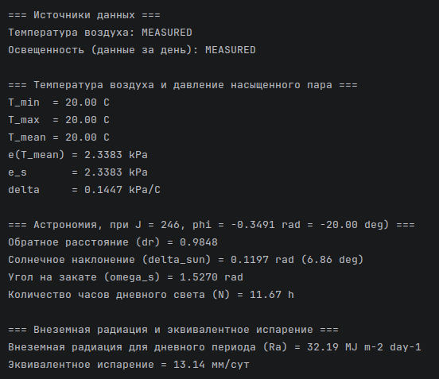

* * *

## Обновим файл оркестрации

Добавим в оркестрацию вывод значений солнечной радиации. Опишем **добавления** в текущий **`main.c`** файл.

1. Добавим новый **заголовочный файл**.

   ```C
   ...
   #include "../02-calculation/023-radiation-calc/solar-radiation-calc.h"
   ...
   ```

2. Добавим **локальные переменные**.

   ```C
   /* *** Объявление локальных переменных *** */
    TemperatureSample   t_sample;
    AirTemperatureData  temperature_data;
    SunshineLuxSample   lux_sample;
    SunshineLuxData     sunshine_data;
    LocationData        location;
    DayData             day_data;
    RaData              ra_data;
    AngstromValues      angstrom;           /* Добавлено */
    SolarRadiationData  solar_radiation;    /* Добавлено */
    ...
   ```

3. Добавим **инициализацию**.

   ```C
   ...
   status = RaCalc_Init(&ra_data);
   if (status != STATUS_OK) {
       return PrintStatusAndReturn("Ошибка инициализации RaData: ", status);
   }

   /* Добавления ниже */
   status = AngstromValues_Default(&angstrom);
   if (status != STATUS_OK) {
       return PrintStatusAndReturn("Ошибка инициализации коэффициентов Angstrom-Prescott: ", status);
   }

   status = SolarRadiation_Init(&solar_radiation);
   if (status != STATUS_OK) {
       return PrintStatusAndReturn("Ошибка инициализации SolarRadiationData: ", status);
   }
   ...
   ```

4. Добавим **расчет уравнений** *R<sub>s</sub>, R<sub>so</sub>*.

   ```C
   ...
       status = Calc_Ra(&ra_data, &day_data, &location);
       if (status != STATUS_OK) {
           return PrintStatusAndReturn(
               "Ошибка расчета внеземного излучения (Ra): ", status);
       }

       /* Добавления ниже */
       status = SolarRadiation_Calc(&angstrom, &solar_radiation, &ra_data, &day_data, &sunshine_data, &location);
       if (status != STATUS_OK) {
           return PrintStatusAndReturn(
               "Ошибка расчета солнечной радиации (Rs/Rso): ", status);
       }
   ...
   ```

5. Добавим **вывод результатов** вычисления *R<sub>s</sub>, R<sub>so</sub>*.

   ```C
   ...
   (void)printf("Эквивалентное испарение = %.2f мм/сут\n", ra_data.Ra_daily * 0.408);

   /* Добавления ниже */
    (void)printf("\n=== Солнечная и clear-sky радиация ===\n");
    (void)printf("Angstrom a_s = %.2f\n", angstrom.a_s);
    (void)printf("Angstrom b_s = %.2f\n", angstrom.b_s);
    (void)printf("Солнечная радиация (Rs) = %.2f MJ m-2 day-1\n", solar_radiation.Rs_daily);
    (void)printf("Clear-sky radiation (Rso) = %.2f MJ m-2 day-1\n", solar_radiation.Rso_daily);
   ...
   ```

* * *

### Проверка компиляции

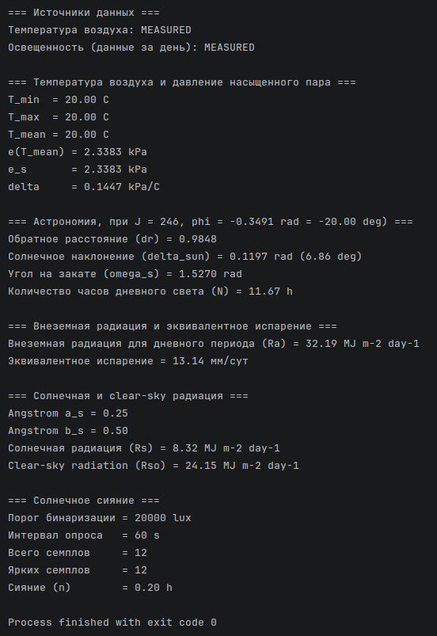

* * *

## Напишем новые тестовые наборы

Пришло время обновить файл `main-test.c`, добавив в него тестовые наборы для новых модулей `sunshine-lux-calc` и `solar-radiation-calc` (и по ходу немного улучшив существующий код).

Опишем **изменения и добавления** в текущий **`main-test.c`** файл.

1. Добавим новые **заголовочные файлы**.

   ```C
   ...
   #include "../02-calculation/023-radiation-calc/extrater-radiation-calc.h"
   /* Добавления ниже */
   #include "../02-calculation/023-radiation-calc/sunshine-lux-calc.h"
   #include "../02-calculation/023-radiation-calc/solar-radiation-calc.h"
   ...
   ```

2. Добавим новые **tolerance-макросы**.

   ```C
   ...
   #define TOL_DEGREE (0.01)   /* десятичные градусы */
   /* Добавления ниже */
   #define TOL_RSO    (0.05)   /* MJ m-2 day-1 */
   #define TOL_RS     (0.05)   /* MJ m-2 day-1 */
   ...
   ```

3. Обновим **список тестовых наборов**, добавив сценарии с 17 по 24.

   ```C
   ...
   /* *** Выбор тестового сценария ************* * * * **** *******************
    * TEST_CASE 1-5:   модули температуры воздуха и давления пара (devlog03)
    * TEST_CASE 6:     ValidDayOfYear - граничные значения
    * TEST_CASE 7:     ValidLatitudeRad - граничные значения
    * TEST_CASE 8:     DayCalc_JFromDate - календарные даты и високосные годы
    * TEST_CASE 9:     DayCalc_Update - STATUS_NULL_POINTER
    * TEST_CASE 10:    DayCalc_Update - STATUS_INVALID_VALUE (J = 0 и J = 367)
    * TEST_CASE 11:    DayCalc_Update - STATUS_INVALID_VALUE (широта > π/2)
    * TEST_CASE 12:    Phi - Bangkok (FAO56, eq.22, ex.7)
    * TEST_CASE 13:    Phi - Rio de Janeiro (FAO56, eq.22, ex.7)
    * TEST_CASE 14:    Calc_Ra - 20°S, J = 246 (FAO56, ex.8, 9)
    * TEST_CASE 15:    Calc_Ra - полярная ночь (80°N, J = 355)
    * TEST_CASE 16:    Calc_Ra - STATUS_INVALID_VALUE (DayData не initialized)
    * TEST_CASE 17:    SunshineLux - полный солнечный день
    * TEST_CASE 18:    SunshineLux - отсутствие солнечного сияния
    * TEST_CASE 19:    SunshineLux - смешанный день (50%)
    * TEST_CASE 20:    SolarRadiation_Calc - FAO56 example 10 (Rio de Janeiro)
    * TEST_CASE 21:    SolarRadiation_Calc - полярная ночь
    * TEST_CASE 22:    SolarRadiation_Calc - ограничение n > N
    * TEST_CASE 23:    SolarRadiation_Calc - STATUS_INVALID_VALUE (a_s + b_s > 1)
    * TEST_CASE 24:    SolarRadiation_Calc - STATUS_INVALID_VALUE (не initialized)
    * **** * * ********************* * * ************* * * * **** **************** *** */
    #define TEST_CASE 14    /* Ввести номер сценария вручную */
    ...
   ```

4. Добавим **новые тестовые сценарии** с 17 по 24 - сразу после окончания блока `TEST_CASE == 16`.

      ```C
          /* *** TEST_CASE 17: SunshineLux - полный солнечный день *** */
          
   #elif TEST_CASE == 17
          /* Все семплы выше порога -> n = total_time */
          {
              SunshineLuxData sd;
              
              status = SunshineLux_Init(&sd, 20000.0, 60U);
              failures += CheckStatus("SunshineLux_Init", status, STATUS_OK);
              
              status = SunshineLux_ResetDay(&sd);
              failures += CheckStatus("SunshineLux_ResetDay", status, STATUS_OK);
              
              for (uint32_t i = 0U; i < 60U; ++i) {
                  status = SunshineLux_Update(&sd, 50000.0, SENSOR_VALUE_MEASURED);
                  failures += CheckStatus("SunshineLux_Update", status, STATUS_OK);
              }
              
              status = SunshineLux_FinalizeDay(&sd);
              failures += CheckStatus("SunshineLux_FinalizeDay", status, STATUS_OK);
              
              failures += CheckDouble("n_hours", sd.n_hours, 1.0, 0.001);
          }
          
          /* *** TEST_CASE 18: SunshineLux - отсутствие солнечного сияния *** */

      #elif TEST_CASE == 18
          /* Все значения ниже порога -> n = 0 */
          {
              SunshineLuxData sd;
              
              status = SunshineLux_Init(&sd, 20000.0, 60U);
              failures += CheckStatus("SunshineLux_Init", status, STATUS_OK);
              
              status = SunshineLux_ResetDay(&sd);
              failures += CheckStatus("SunshineLux_ResetDay", status, STATUS_OK);
              
              for (uint32_t i = 0U; i < 60U; ++i) {
                  status = SunshineLux_Update(&sd, 1000.0, SENSOR_VALUE_MEASURED);
                  failures += CheckStatus("SunshineLux_Update", status, STATUS_OK);
              }
              
              status = SunshineLux_FinalizeDay(&sd);
              failures += CheckStatus("SunshineLux_FinalizeDay", status, STATUS_OK);
              
              failures += CheckDouble("n_hours", sd.n_hours, 0.0, 1e-9);
          }
          
          /* *** TEST_CASE 19: SunshineLux - смешанный день (50%) *** */

      #elif TEST_CASE == 19
          /* Половина семплов яркие -> n = 0.5 h */
          {
              SunshineLuxData sd;
              
              status = SunshineLux_Init(&sd, 20000.0, 60U);
              failures += CheckStatus("SunshineLux_Init", status, STATUS_OK);
              
              status = SunshineLux_ResetDay(&sd);
              failures += CheckStatus("SunshineLux_ResetDay", status, STATUS_OK);
              
              for (uint32_t i = 0U; i < 30U; ++i) {
                  status = SunshineLux_Update(&sd, 50000.0, SENSOR_VALUE_MEASURED);
                  failures += CheckStatus("SunshineLux_Update(bright)", status, STATUS_OK);
              }
              
              for (uint32_t i = 0U; i < 30U; ++i) {
                  status = SunshineLux_Update(&sd, 1000.0, SENSOR_VALUE_MEASURED);
                  failures += CheckStatus("SunshineLux_Update(dark)", status, STATUS_OK);
              }
              
              status = SunshineLux_FinalizeDay(&sd);
              failures += CheckStatus("SunshineLux_FinalizeDay", status, STATUS_OK);
              
              failures += CheckDouble("n_hours", sd.n_hours, 0.5, 0.001);
          }
          
          /* *** TEST_CASE 20: SolarRadiation_Calc - FAO56 example 10 *** */
    
    #elif TEST_CASE == 20
          /* FAO56 example 10 (сияние за май, за 31 день):
           * Rio de Janeiro: 22°54'S = 22.90°S
           * J   = 135 (15 May)
           * Ra  = 25.1 MJ m-2 day-1
           * N   = 10.9 h
           * n   = 7.1 h (220 hours / 31 days)
           * Rs  = 14.5 MJ m-2 day-1 */
          {
              LocationData loc;
              DayData dd;
              RaData rd;
              SunshineLuxData sd;
              SolarRadiationData rsd;
              AngstromValues ang;
              
              status = Location_DMS_to_decimal(-22.0, 54.0, &loc.latitude_deg);
              failures += CheckStatus("Location_DMS_to_decimal", status, STATUS_OK);
              
              loc.latitude_rad = loc.latitude_deg * (PI / 180.0);
              loc.elevation_m = 0.0;
              
              DayCalc_Init(&dd);
              RaCalc_Init(&rd);
              SolarRadiation_Init(&rsd);
              AngstromValues_Default(&ang);
              
              status = DayCalc_Update(&dd, 135U, &loc);
              failures += CheckStatus("DayCalc_Update", status, STATUS_OK);
              
              failures += CheckDouble("N [h]", dd.N_hours, 10.9, TOL_HOURS);
              
              status = Calc_Ra(&rd, &dd, &loc);
              failures += CheckStatus("Calc_Ra", status, STATUS_OK);
              
              failures += CheckDouble("Ra [MJ m-2 day-1]", rd.Ra_daily, 25.1, TOL_RA);
              
              status = SunshineLux_Init(&sd, 20000.0, 60U);
              failures += CheckStatus("SunshineLux_Init", status, STATUS_OK);
              
              sd.n_hours = 7.1;
              sd.initialized = true;
              
              status = SolarRadiation_Calc(&ang, &rsd, &rd, &dd, &sd, &loc);
              failures += CheckStatus("SolarRadiation_Calc", status, STATUS_OK);
              
              failures += CheckDouble("Rs [MJ m-2 day-1]", rsd.Rs_daily, 14.5, TOL_RS);
              failures += CheckDouble("Rso [MJ m-2 day-1]", rsd.Rso_daily, 18.8, TOL_RSO);
          }
          
          /* *** TEST_CASE 21: SolarRadiation_Calc - полярная ночь *** */
          
   #elif TEST_CASE == 21
          {
              LocationData loc;
              DayData dd;
              RaData rd;
              SunshineLuxData sd;
              SolarRadiationData rsd;
              AngstromValues ang;
              
              loc.latitude_deg = 80.0;
              loc.latitude_rad = 80.0 * (PI / 180.0);
              loc.elevation_m = 0.0;

              DayCalc_Init(&dd);
              RaCalc_Init(&rd);
              SolarRadiation_Init(&rsd);
              AngstromValues_Default(&ang);

              status = DayCalc_Update(&dd, 355U, &loc);
              failures += CheckStatus("DayCalc_Update", status, STATUS_OK);

              status = Calc_Ra(&rd, &dd, &loc);
              failures += CheckStatus("Calc_Ra", status, STATUS_OK);

              status = SunshineLux_Init(&sd, 20000.0, 60U);
              failures += CheckStatus("SunshineLux_Init", status, STATUS_OK);

              sd.n_hours = 0.0;
              sd.initialized = true;

              status = SolarRadiation_Calc(&ang, &rsd, &rd, &dd, &sd, &loc);
              failures += CheckStatus("SolarRadiation_Calc", status, STATUS_OK);

              failures += CheckDouble("Rs", rsd.Rs_daily, 0.0, 1e-9);
              failures += CheckDouble("Rso", rsd.Rso_daily, 0.0, 1e-9);
          }

          /* *** TEST_CASE 22: SolarRadiation_Calc - ограничение n > N *** */

   #elif TEST_CASE == 22
          /* n не должен превышать N: модуль должен автоматически ограничить значение */
          {
              LocationData loc;
              DayData dd;
              RaData rd;
              SunshineLuxData sd;
              SolarRadiationData rsd;
              AngstromValues ang;
              
              Location_Init(&loc);
              DayCalc_Init(&dd);
              RaCalc_Init(&rd);
              SolarRadiation_Init(&rsd);
              AngstromValues_Default(&ang);
              
              status = DayCalc_Update(&dd, 246U, &loc);
              failures += CheckStatus("DayCalc_Update", status, STATUS_OK);
              
              status = Calc_Ra(&rd, &dd, &loc);
              failures += CheckStatus("Calc_Ra", status, STATUS_OK);
              
              status = SunshineLux_Init(&sd, 20000.0, 60U);
              failures += CheckStatus("SunshineLux_Init", status, STATUS_OK);
              
              sd.n_hours = dd.N_hours + 5.0;
              sd.initialized = true;
              
              status = SolarRadiation_Calc(&ang, &rsd, &rd, &dd, &sd, &loc);
              failures += CheckStatus("SolarRadiation_Calc", status, STATUS_OK);
              
              /* При n > N нужно использовать n = N: Rs = (0.25 + 0.50 * 1.0) * Ra = 0.75 * Ra */
              failures += CheckDouble("Rs limited", rsd.Rs_daily, 0.75 * rd.Ra_daily, TOL_RS);
          }
          
          /* *** TEST_CASE 23: SolarRadiation_Calc - STATUS_INVALID_VALUE *** */

   #elif TEST_CASE == 23
          /* Невалидные коэффициенты: a_s + b_s > 1 */
          {
              LocationData loc;
              DayData dd;
              RaData rd;
              SunshineLuxData sd;
              SolarRadiationData rsd;
              AngstromValues ang;
              
              Location_Init(&loc);
              DayCalc_Init(&dd);
              RaCalc_Init(&rd);
              SolarRadiation_Init(&rsd);
              
              ang.a_s = 0.8;
              ang.b_s = 0.5;
              
              status = DayCalc_Update(&dd, 246U, &loc);
              failures += CheckStatus("DayCalc_Update", status, STATUS_OK);
              
              status = Calc_Ra(&rd, &dd, &loc);
              failures += CheckStatus("Calc_Ra", status, STATUS_OK);
              
              status = SunshineLux_Init(&sd, 20000.0, 60U);
              failures += CheckStatus("SunshineLux_Init", status, STATUS_OK);
              
              sd.n_hours = 5.0;
              sd.initialized = true;
              
              status = SolarRadiation_Calc(&ang, &rsd, &rd, &dd, &sd, &loc);
              failures += CheckStatus("SolarRadiation_Calc", status, STATUS_INVALID_VALUE);
          }
          
          /* *** TEST_CASE 24: SolarRadiation_Calc - STATUS_INVALID_VALUE *** */

   #elif TEST_CASE == 24
          /* Not initialized DayData */
          {
              LocationData loc;
              DayData dd;
              RaData rd;
              SunshineLuxData sd;
              SolarRadiationData rsd;
              AngstromValues ang;
              
              Location_Init(&loc);
              DayCalc_Init(&dd);
              RaCalc_Init(&rd);
              SolarRadiation_Init(&rsd);
              AngstromValues_Default(&ang);
              
              status = SunshineLux_Init(&sd, 20000.0, 60U);
              failures += CheckStatus("SunshineLux_Init", status, STATUS_OK);
              
              sd.n_hours = 5.0;
              sd.initialized = true;
              
              expected_status = STATUS_INVALID_VALUE;
              
              status = SolarRadiation_Calc(&ang, &rsd, &rd, &dd, &sd, &loc);
              failures += CheckStatus("SolarRadiation_Calc(uninitialized DayData)", status, expected_status);
          }
      ```

5. Обновим **поле `#error`** в конце файла.

   Вместо строки:

   ```C
   #error "Неизвестный TEST_CASE. Допустимые значения: 1-16."
   ```

   Запишем строку:

   ```C
   #error "Неизвестный TEST_CASE. Допустимые значения: 1-24."
   ```

6. Обновим **тестовые сценарии 12 и 13**.

      Поскольку ранее в этом девлоге мы несколько переписали функцию `Location_DMS_to_decimal()`, сделав ее `Status API`, обновим несколько строк в прошлых тестовых сценариях. А именно в тестовых наборах 12 и 13 заменим (по аналогии с набором 20) присваивание `loc.latitude_deg = Location_DMS_to_decimal(...)` на:

   ```C
   /* Test case 12 */
   status = Location_DMS_to_decimal(13.0, 44.0, &loc.latitude_deg);
   failures += CheckStatus("Location_DMS_to_decimal", status, STATUS_OK);

   /* Test case 13 */
   status = Location_DMS_to_decimal(-22.0, 54.0, &loc.latitude_deg);
   failures += CheckStatus("Location_DMS_to_decimal", status, STATUS_OK);
   ```
 
 * * *

## Проведем необходимые проверки

Проверим тестовые сценарии 12-13, 17-24. Для теста 20, вычисляющего солнечную радиацию *R<sub>s</sub>*, будем опираться на эталонный пример из документации *FAO56* (ex. 10), чтобы отследить точность вычислений нашей программы, а не только надежность ее архитектуры.

* * *

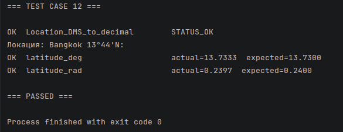  
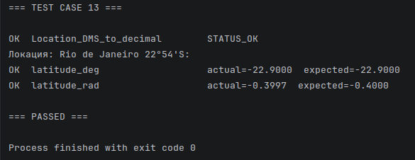  
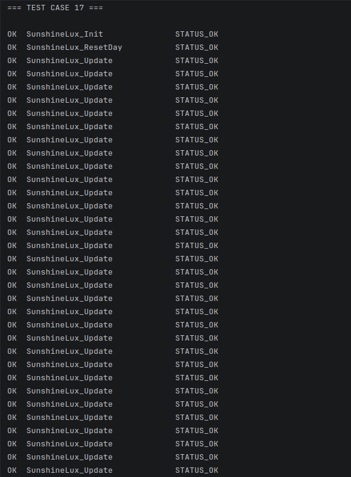  
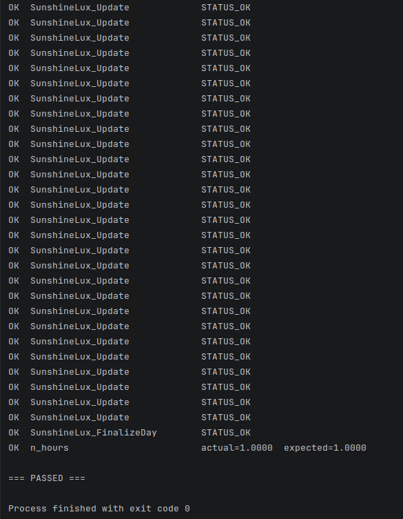  
  
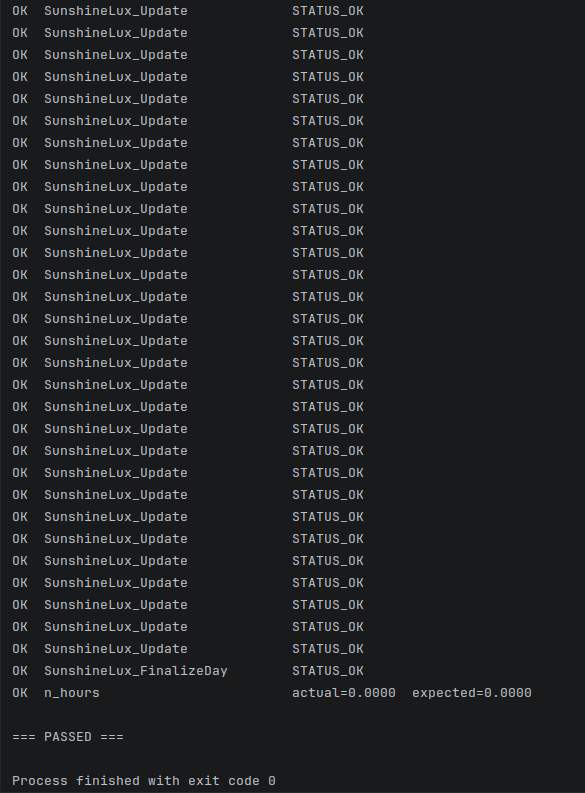  
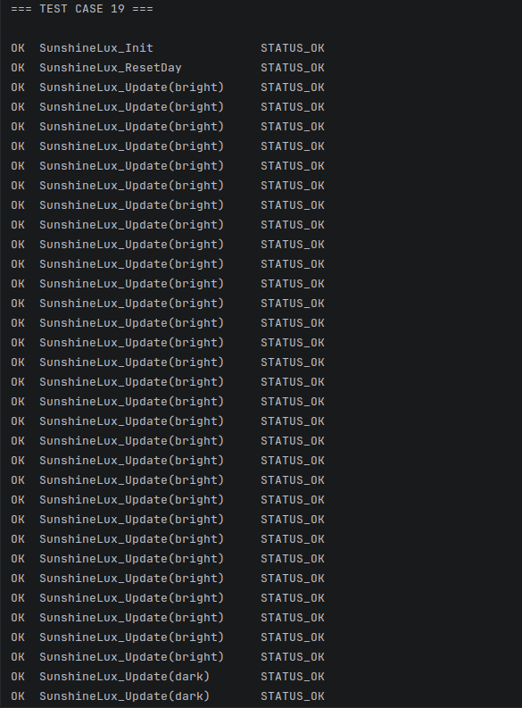  
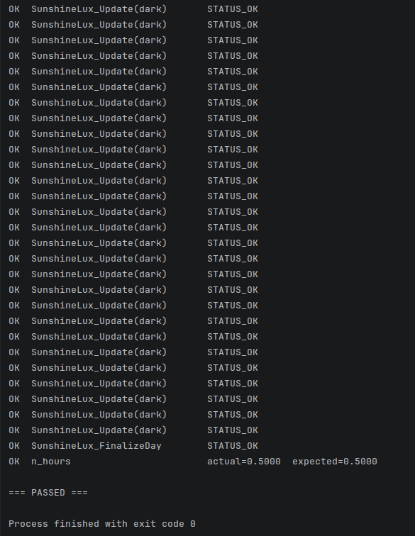  
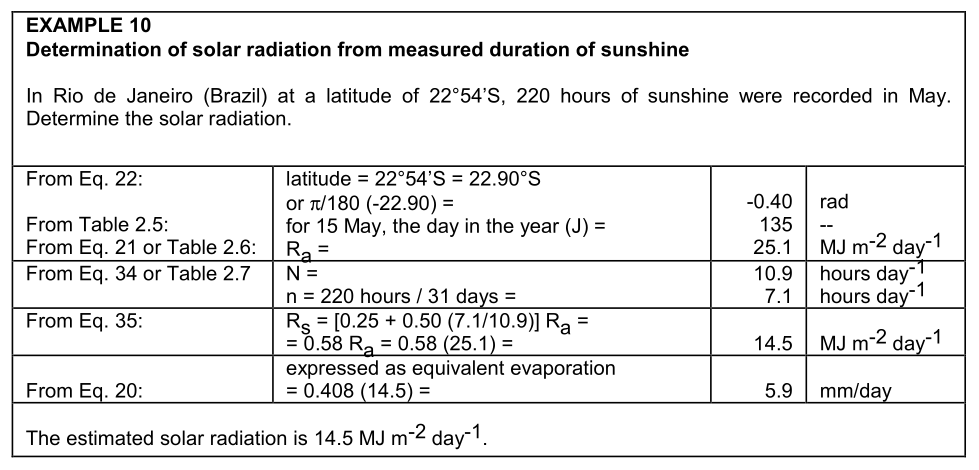  
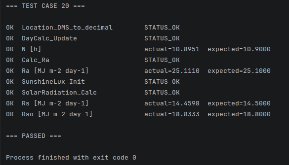  
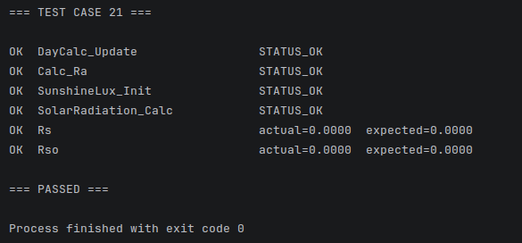  
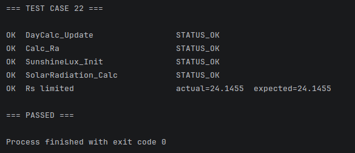  
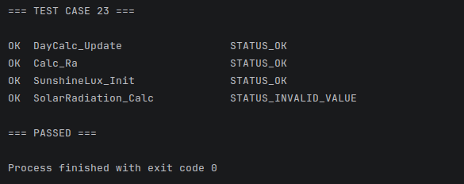  
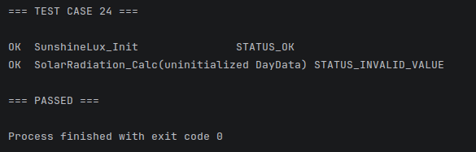

* * *

## Пояснение к тестовым наборам

Рассмотрим кратко принципы проверок в новых тестовых наборах 17-24.

#### `TEST_CASE 17`: полный солнечный день

Здесь эмулируются 60 вызовов `SunshineLux_Update()` с интервалом "60 секунд" и значением `lux` выше порога. Это проверка дискретного счетчика: 60 ярких семплов * 60 с = 3600 с = 1 час. Ожидаемое `n_hours = 1.0` - проверка логики накопления: действительно ли модуль считает значение времени сияния из серии измерений, а не подставляет готовый ответ. Ограничение на данный момент понятно: в настоящий момент у нас нет модуля, обеспечивающего счет реального времени.

#### `TEST_CASE 18`: отсутствие солнечного сияния

Тот же механизм, но все семплы ниже порогового значения. Для полевого прибора пасмурный день - нормальный сценарий, а не ошибка. Ожидается `n_hours = 0.0`, и статус должен быть `STATUS_OK`.

#### `TEST_CASE 19`: смешанный день

Половина семплов яркие, половина темные. Тест проверяет, что счетчик корректно работает на переходах через порог и что итоговый расчет линейно зависит от количества *bright*-семплов: 30 минут яркого света при шаге 60 с дают `n = 0.5 h`. Это минимальная проверка устойчивости накопителя к смешанной серии измерений.

#### `TEST_CASE 20`: FAO56 ex. 10

Это основной тест для `solar-radiation-calc`. Здесь мы проверяем модель вычислений на основе эталонных значений *FAO56* ex. 10: `J = 135`, широта *Rio de Janeiro*, `Ra = 25.1`, `N = 10.9`, `n = 7.1`, `Rs = 14.5`. Тест проверяет формулу *R<sub>s</sub>*, а не логику накопления сияния, поэтому `n_hours` здесь задается прямо. Это нужно для изоляции ответственности: накопитель проверяется в `TEST_CASE 17-19`, а здесь - только математика по эталонам *FAO56*.

#### `TEST_CASE 21`: полярная ночь

Физически возможный крайний случай: `N = 0`, `Ra = 0`, `Rs = 0`, `Rso = 0`. Проверка нужна, чтобы не посчитать нулевой день ошибкой. Корректное поведение - вернуть `STATUS_OK` и нули. Тест показывает, что модель не дает сбой на значениях полярных широт и не интерпретирует физически допустимую ситуацию как исключение. (Хотя смысл проверок полярных значений может представляться дискуссионным или даже лишенным практической ценности.)

#### `TEST_CASE 22`: ограничение `n > N`

Тест для защиты от ошибок счетчика, таймера или сброса суток. Если `n` по какой-то причине оказалось больше `N`, модуль должен ограничить его значением `N`, чтобы в последующие вычисления не проникло физически невозможное значение `n/N > 1`. Количество часов реального солнечного сияния за данный день не может быть большим, чем максимально возможное количество часов солнечного сияния за данный день.

#### `TEST_CASE 23`: невалидные коэффициенты

Здесь тест проверяет не физику, а корректность параметризации модели. Если `a_s + b_s > 1`, то входные параметры проблемны, и модуль должен вернуть `STATUS_INVALID_VALUE`. Это системная проверка: она защищает от неправильной конфигурации модели.

#### `TEST_CASE 24`: неинициализированная структура

Проверка контрактов *API*. Модуль не должен незаметно продолжать работу на частично подготовленных данных. Для *embedded*-системы это имеет существенное значение. Если состояние не инициализировано, лучше вернуть ошибку сразу, чем постепенно и незаметно деградировать и в конечном счете получить неверный результат вычислений. 

* * *

## Дальнейшие действия

Напомним вкратце, каковы будут следующие шаги:

- обратимся к разрешению дилеммы "default J",
- обновим оркестрацию и тестовые наборы,
- перейдем к завершающим вычислениям всего блока радиации.
