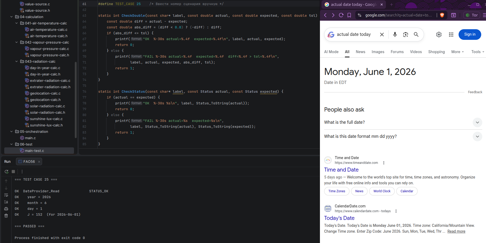
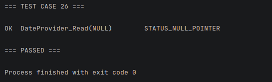
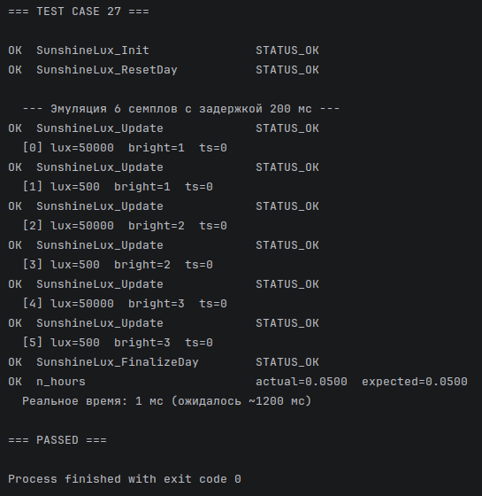

# devlog10. Дилемма default J, конфигурация и другое

## Небольшие улучшения

Сперва - уже по традиции - внесем небольшие изменения в предшествующий код. В файле `geolocation-calc.c` видим повторную ("параноидальную") проверку диапазона. Сперва в функции `Status Location_DMS_to_decimal()`:

```C
    if ((degrees < -90.0) || (degrees > 90.0)) {
        return STATUS_INVALID_VALUE;
    }
```

Затем в функции `Status Location_Init()`:

```C
    if ((loc->latitude_deg < -90.0) || (loc->latitude_deg > 90.0)) {
        return STATUS_INVALID_VALUE;
    }
```

Вторая проверка избыточна - можем ее удалить. *Следует* ее удалить - чтобы `Location_DMS_to_decimal()` остался единственной точкой валидации *DMS to decimal* и владельцем контракта для диапазона, `Location_Init()` пусть использует готовый валидированный результат.

* * *

## Текущие задачи и проблемы

Наша система несколько усложняется, и требует более надежных архитектурных решений.

- Мы хотим убрать введение значения *J* из *production*-слоя (оркестрации), следовательно, нам необходимо решить вопрос с тем, где и как хранятся данные о дате и времени.
- Мы хотим более явно разделить данные в системе на: а) те, что настраиваются при запуске системы (конфигурации); б) константы; в) поступающие от источников измерений (сенсоров); г) вычисляемых значений; следовательно, необходимо решить вопрос со слоем конфигурации - для раздельного хранения данных первого типа.

В этом девлоге мы будем решать эти задачи путем **создания нового слоя** системы, который будет состоять (на данном этапе) из двух элементов:

- отдельных ***config* файлов**, один из которых будет хранить параметры развертывания системы, вводимые заранее (геолокационные данные, высота, коэффициенты, пороги), а второй - настраиваемые эталонные значение для тестирования функций;

- специального ***date provider* модуля**, который будет передавать данные о времени в файл оркестрации (вместо прямого ввода значения *J*, как было ранее).

Можно сказать даже более драматично: на данном этапе необходимо **стабилизировать архитектуру**, более отчетливо **разделить потоки данных, ответственности и контракты** - чтобы на следующих шагах все не перемешалось до трудноподдерживаемого состояния, поскольку количество зависимостей начинает быть ощутимым.

Нам все еще следует придерживаться вот этой простой **архитектурной схемы**:

```md
Measurement/Providers -> Validation -> State Update -> Pure Calculations -> Orchestration -> Output/Test
```

Еще раз напомним себе, что значит *pure calculation* как **ядро** нашей системы. Математические функции не должны знать ничего: о сенсорах; о *fallback*; о тестах; о времени системы; о сценариях; о глобальном состоянии. Они должны: принимать структуру; принимать вход; возвращать *Status*; писать результат в *out*. Они должны быть четко отделены от других функциональных слоев и иметь ясные и отчетливые, согласованные и однонаправленные зависимости/контракты. Сейчас самое время **привести систему в надлежащее состояние**.

Почему об этом зашла речь именно сейчас? Потому, что сейчас у нас появится источник календарной даты и возникнет риск неадекватного проведения связей между такими "логическими узлами", как *date provider, day calculations, orchestration, test scenarios, FAO reference values, state logic*.

* * *

## Поток и оркестрация

Мы хотим получить следующим образом направленный поток:

```md
Read Temperature
Read Date
↓
Validate
↓
Update Temperature State
↓
Compute Day Of Year
↓
Compute Vapour Pressure
↓
Compute Radiation Terms
↓
Compute FAO56 Equation
↓
Output
```

Мы наконец можем сделать `main.c` файлом, исключительно оркестрирующим, управляющим пайплайном - *read-validate-update-calculate-print* - и не хранящим никаких данных для вычисления.

Все *FAO reference values* будем хранить в файле конфигурации тестов - в отдельном блоке тестирования - и отделим эти значения от *production* логики.

* * *

## Изменим файловую структуру проекта

```md
FAO56-CALC-PROJECT
|
├─ 01-measurement
│   ├─ 011-air-temperature-read
│   └─ 012-sunshine-lux-read
|
├─ 02-providers
│   ├─ 021-date-provider
│   |   └─ date-provider.h/.c
│   |
│   └─ 022-configurations
│       ├─ deployment-config.h
│       └─ test-config.h
│
├─ 03-validation
│   ├─ status.h/.c
│   ├─ value-source.h/.c
│   └─ validation.h/.c
│
├─ 04-calculation
│   ├─ 041-air-temperature-calc
│   ├─ 042-vapour-pressure-calc
│   ├─ 043-radiation-calc
│   └─ ...
│
├─ 05-orchestration
│   └─ main.c
│
├─ 06-test
│   └─ main-test.c
│
└─ CMakeLists.txt
```

* * *

## Файл конфигурации `deployment-config.h`

Этот файл нужен **для хранения настраиваемых параметров системы**, которые вводятся перед ее развертыванием - они не поступают от источников измерения и не являются вычисляемыми. Здесь будут хранится, в частности, данные геолокации, а также значения для настройки оркестрации - например, пороговые значения для бинарного счетчика, интервалы опроса датчика освещения и проч.

Стоит более явно определить **различия типов параметров** нашей системы:

- *Type A* - **параметры развертывания**, которые зависят от местоположения, оборудования и возможности калибровки и проч.; эти параметры меняются от установки к установке, но не меняются во время работы системы; иными словами, это *deployment-specific configuration*; это и есть наш `deployment-config.h`.

- *Type B* - **константы** математической модели физического процесса, или коэффициенты *FAO56* уравнений; хранятся в заголовочных файлах вычислительных модулей как `#define` значения; не входят в слой `deployment-config`.

- *Type C* - **оперативные и измеряемые данные** (текущая дата, показания датчиков).

- *Type D* - **вычисляемые данные**, которые используют при вычислениях в разных случаях все три предшествующих типа.

* * *

#### `deployment-config.h`

```C
#ifndef DEPLOYMENT_CONFIG_H
#define DEPLOYMENT_CONFIG_H

#ifdef __cplusplus
extern "C" {
#endif

/* *** Type A: Параметры установки, вводятся вручную, не меняются во время выполнения *** */

/* Географические параметры */
#define CONFIG_LATITUDE_DEG    (-20.0)  /* FAO56, ex.8: 20°S, южное полушарие */
#define CONFIG_LATITUDE_MIN    (0.0)    /* FAO56, ex.8: 20°S, южное полушарие */
#define CONFIG_ELEVATION_M     (0.0)    /* Sea level */

/* Порог освещенности для бинарного счетчика */
#define CONFIG_BRIGHT_LUX_THRESHOLD (20000.0)

/* Период опроса датчика освещенности */
#define CONFIG_SAMPLE_PERIOD_SEC (60U)

#ifdef __cplusplus
}
#endif

#endif /* DEPLOYMENT_CONFIG_H */
```

* * *

### Небольшие изменения в предшествующем коде

После создания `deployment-config.h` сделаем **небольшие изменения в других файлах**.

1. В файле **`geolocation-calc.c`**:
   - уберем повторяющиеся макросы,
   - подключим к файлу заголовок `deployment-config.h`,
   - заменим `DEFAULT_LATITUDE_DEG` и проч. на `CONFIG_LATITUDE_DEG`.

2. В файле **`sunshine-lux-calc.h`**:
   - уберем повторяющиеся макросы.

3. В файле **`main.c`**:
   - подключим заголовок `deployment-config.h`,
   - в области функции **`status = SunshineLux_Init()`** заменим `SUNSHINE_THRESHOLD_LUX` и `SUNSHINE_POLL_INTERVAL_SEC` на `CONFIG_BRIGHT_LUX_THRESHOLD` и `CONFIG_SAMPLE_PERIOD_SEC`,
   - в области вывода **`printf()`** сделаем ту же замену для полей "Порог бинаризации" и "Интервал опроса".

* * *

## Новый модуль конфигурации `date-provider`

#### `date-provider.h`

```C
#ifndef DATE_PROVIDER_H
#define DATE_PROVIDER_H

#ifdef __cplusplus
extern "C" {
#endif

#include <stdint.h>
#include "../../03-validation/status.h"

typedef struct {
    uint16_t year;
    uint8_t  month;
    uint8_t  day;
} DateData;

Status DateProvider_Read(DateData* date);

#ifdef __cplusplus
}
#endif

#endif /* DATE_PROVIDER_H */
```

* * *

#### `date-provider.c`

```C
#include <time.h>
#include "date-provider.h"

Status DateProvider_Read(DateData* date) {
    if (date == NULL) {
        return STATUS_NULL_POINTER;
    }

    time_t now = time(NULL);

    if (now == (time_t)(-1)) {
        return STATUS_INVALID_VALUE;
    }

    struct tm* t = localtime(&now);

    if (t == NULL) {
        return STATUS_INVALID_VALUE;
    }

    date->year  = (uint16_t)(1900 + t->tm_year);
    date->month = (uint8_t)(t->tm_mon + 1);
    date->day   = (uint8_t)t->tm_mday;

    return STATUS_OK;
}
```

* * *

## Обновим файл оркестрации `main.c`

1. Добавим **заголовок**:

   ```C
   #include "../02-providers/021-date-provider/date-provider.h"
   ```

2. Добавим **локальные переменные**:

   ```C
   DateData date;
   uint16_t current_j = 0U;
   ```

3. Заменим грубое `const uint16_t J = 246U;` на **реальный день года**:

   ```C
    /* Астрономия */
    status = DateProvider_Read(&date);    /* Получить текущий день года */
    if (status != STATUS_OK) {
        return PrintStatusAndReturn("Ошибка чтения дня года: ", status);
    }

    current_j = DayCalc_JFromDate(date.day, date.month, date.year);

    status = DayCalc_Update(&day_data, current_j, &location);
    if (status != STATUS_OK) {
        return PrintStatusAndReturn(
            "Ошибка вычисления астрономических данных: ", status);
    }
   ...
   ```

4. Добавим **вывод** в секцию результатов:

   ```C
   (void)printf("Текущий день года (J) = %u\n", current_j);
   ```

* * *

## Новый файл конфигурации тестов `test-config.h`

Для удобства настройки тестовых сценариев и сверки значений с эталонами документации *FAO56* создадим отдельный файл конфигурации тестов.

#### `test-config.h`

```C
#ifndef TEST_CONFIG_H
#define TEST_CONFIG_H

#ifdef __cplusplus
extern "C" {
#endif

/* *** Эталонные FAO56 значения для тестовых сценариев в main-test.c: ТОЛЬКО для тестового слоя (06-test) *** */

/* Допуски (tolerances) для сравнения double-значений */
#define TOL_DEGREE     (0.01)   /* десятичные градусы */
#define TOL_ANGLE      (0.005)  /* рад */
#define TOL_HOURS      (0.05)   /* часы */
#define TOL_RA         (0.05)   /* MJ m-2 day-1 */
#define TOL_RS         (0.05)   /* MJ m-2 day-1 */
#define TOL_RSO        (0.05)   /* MJ m-2 day-1 */
#define TOL_KPA        (0.0001) /* кПа */
#define TOL_KPA_PER_C  (0.0001) /* кПа/°C */
#define TOL_RADIANS    (0.001)  /* радианы */

/* ** FAO56 ex.7: перевод координат DMS в десятичные градусы и радианы ** */
/* Бангкок: 13°44'N */
#define TEST_BANGKOK_LAT_DEG          (13.0)
#define TEST_BANGKOK_LAT_MIN          (44.0)
#define TEST_BANGKOK_LAT_EXPECTED     (13.7333)  /* десятичные градусы */
#define TEST_BANGKOK_RAD_EXPECTED     (0.2400)   /* радианы */

/* Рио-де-Жанейро: 22°54'S */
#define TEST_RIO_LAT_DEG              (-22.0)
#define TEST_RIO_LAT_MIN              (54.0)
#define TEST_RIO_LAT_EXPECTED         (-22.9000) /* десятичные градусы */
#define TEST_RIO_RAD_EXPECTED         (-0.4000)  /* радианы */

/* ** FAO56 ex.8, ex.9 modified: внеземная радиация Ra
 * Ex.8 modified: J=246, 20°S -> Ra=32.2, N=11.7, equival.evaporation=13.1
 * Полярная ночь: 80°N, J=355 -> Ra=0, N=0 */
#define TEST_EX8_J                    (246U)
#define TEST_EX8_LAT_DEG              (-20.0)
#define TEST_EX8_LAT_MIN              (0.0)
#define TEST_EX8_ELEVATION_M          (0.0)

#define TEST_EX8_DR_EXPECTED          (0.985)    /* обратное расстояние */
#define TEST_EX8_DELTA_RAD_EXPECTED   (0.120)    /* солнечное наклонение, рад */
#define TEST_EX8_OMEGA_S_EXPECTED     (1.527)    /* угол заката, рад */
#define TEST_EX8_N_EXPECTED           (11.67)    /* ч дневного света: входит в ex. 9 */
#define TEST_EX8_RA_EXPECTED          (32.2)     /* MJ m-2 day-1 */
#define TEST_EX8_EQUIV_EVAPORATION    (13.1)     /* перевод MJ m day в мм/сут */

#define TEST_POLAR_LAT_DEG            (80.0)
#define TEST_POLAR_J                  (355U)
#define TEST_POLAR_RA_EXPECTED        (0.0)
#define TEST_POLAR_N_EXPECTED         (0.0)

/* FAO56 ex.10 modified: солнечная радиация Rs, Rso
 * Рио-де-Жанейро, 220 часов света за май (31 день): J=135 (15 мая), n=7.1h (220h/31d), Rs=14.5, Rso=18.8, equival.evaporation=5.9 */
#define TEST_EX10_J                   (135U)
#define TEST_EX10_N_HOURS             (7.1)
#define TEST_EX10_RA_EXPECTED         (25.1)     /* MJ m-2 day-1 */
#define TEST_EX10_N_DAYLIGHT_EXPECTED (10.9)     /* ч */
#define TEST_EX10_RS_EXPECTED         (14.5)     /* MJ m-2 day-1 */
#define TEST_EX10_RSO_EXPECTED        (18.8)     /* MJ m-2 day-1 */
#define TEST_EX10_EQUIV_EVAPORATION   (5.9)      /* перевод MJ m day в мм/сут */

/* Температура воздуха и давление насыщенного пара,
 * тестовые значения T_min = T_max = T_mean = 20.0°C (изотермический сценарий) */
#define TEST_TEMP_MIN_C               (20.0)
#define TEST_TEMP_MAX_C               (20.0)
#define TEST_TEMP_MEAN_C              (20.0)
#define TEST_E_TMEAN_EXPECTED         (2.3383)   /* кПа */
#define TEST_E_S_EXPECTED             (2.3383)   /* кПа */
#define TEST_DELTA_EXPECTED           (0.1447)   /* кПа/°C */

/* Ангстрем–Прескотт: коэффициенты по умолчанию (eq.35) */
#define TEST_ANGSTROM_A_S             (0.25)
#define TEST_ANGSTROM_B_S             (0.50)

#ifdef __cplusplus
}
#endif

#endif /* TEST_CONFIG_H */
```

* * *

## Обновим файл тестирования `main-test.c`

1. В начало файла добавим несколько новых включений:

   ```C
   #include <math.h>
   #include <stdio.h>
   #include <stdint.h>
   #include <stdbool.h>
   #include <time.h>

   #ifdef _WIN32
       #include <windows.h>   /* Sleep(ms) */
   #else
       #include <unistd.h>    /* usleep(us) */
   #endif
   ```

2. Обновим список подключаемых файлов:

   ```C
   #include "../01-measurement/011-air-temperature-read/air-temperature-read.h"
   #include "../01-measurement/012-sunshine-lux-read/sunshine-lux-read.h"

   #include "../02-providers/021-date-provider/date-provider.h"
   #include "../02-providers/022-configurations/deployment-config.h"
   #include "../02-providers/022-configurations/test-config.h"

   #include "../03-validation/status.h"
   #include "../03-validation/value-source.h"

   #include "../04-calculation/041-air-temperature-calc/air-temperature-calc.h"
   #include "../04-calculation/042-vapour-pressure-calc/vapour-pressure-calc.h"
   #include "../04-calculation/043-radiation-calc/geolocation-calc.h"
   #include "../04-calculation/043-radiation-calc/day-in-year-calc.h"
   #include "../04-calculation/043-radiation-calc/sunshine-lux-calc.h"
   #include "../04-calculation/043-radiation-calc/extrater-radiation-calc.h"
   #include "../04-calculation/043-radiation-calc/solar-radiation-calc.h"
   ```

3. Уберем повторяющиеся определения допустимых отклонений `TOL...` - поскольку они теперь заданы в файле `test-config.h`, который мы только что подключили.

4. К существующим функциям `CheckDouble()` и `CheckStatus()` добавим новую:

   ```C
   /* Пауза в миллисекундах для теста с использованием времени */
   static void SleepMs(uint32_t ms) {
   #ifdef _WIN32
       Sleep(ms);    /* Windows: ждать ms миллисекунд */
   #else
       usleep((useconds_t)(ms * 1000U));    /* Linux/macOS: ждать ms*1000 микросекунд */
   #endif
   }
   ```

   > Поясним. Разные ОС используют разные функции паузы:
   > - *Windows*: `Sleep(1000)` ждет 1000 миллисекунд, подключается из `windows.h`,
   > - *Linux/macOS*: `usleep(1000000)` ждет 1000000 микросекунд, подключается из `unistd.h`.

5. Пополним список тест-кейсов:

   ```C
   /* TEST_CASE 25: DateProvider_Read - базовая функциональность (ПК)
    * TEST_CASE 26: DateProvider_Read - NULL pointer
    * TEST_CASE 27: Эмуляция опроса освещенности во времени */
   ```

6. Напишем новые тест-кейсы:

   ```C
        /* *** TEST_CASE 25: DateProvider_Read - базовая функциональность (ПК) *** */
    
    #elif TEST_CASE == 25
    {
        DateData date;
    
        status = DateProvider_Read(&date);
        failures += CheckStatus("DateProvider_Read", status, STATUS_OK);
    
        /* Год в правдоподобном диапазоне */
        if ((date.year < 2024U) || (date.year > 2099U)) {
            (void)printf("FAIL  year = %u  out of range [2024, 2099]\n", date.year);
            failures += 1;
        } else {
            (void)printf("OK    year = %u\n", date.year);
        }
    
        /* Месяц [1, 12] */
        if ((date.month < 1U) || (date.month > 12U)) {
            (void)printf("FAIL  month = %u  out of range [1, 12]\n", (unsigned)date.month);
            failures += 1;
        } else {
            (void)printf("OK    month = %u\n", (unsigned)date.month);
        }
    
        /* День [1, 31] */
        if ((date.day < 1U) || (date.day > 31U)) {
            (void)printf("FAIL  day = %u  out of range [1, 31]\n", (unsigned)date.day);
            failures += 1;
        } else {
            (void)printf("OK    day = %u\n", (unsigned)date.day);
        }
    
        /* J, вычисленный из даты, должен быть в [1, 366] */
        uint16_t j = DayCalc_JFromDate(date.day, date.month, date.year);
        if ((j < 1U) || (j > 366U)) {
            (void)printf("FAIL  J = %u  out of range [1, 366]\n", j);
            failures += 1;
        } else {
            (void)printf("OK    J = %u  (for %04u-%02u-%02u)\n",
                j, date.year, (unsigned)date.month, (unsigned)date.day);
        }
    }
    
        /* *** TEST_CASE 26: DateProvider_Read - NULL pointer *** */
    
    #elif TEST_CASE == 26
    {
        status = DateProvider_Read(NULL);
        failures += CheckStatus("DateProvider_Read(NULL)", status, STATUS_NULL_POINTER);
    }
    
        /* *** TEST_CASE 27: Эмуляция опроса освещенности во времени *** */
    
        /* Цель: убедиться, что:
         *   (а) накопитель корректно обрабатывает семплы, поступающие с реальными задержками;
         *   (б) n_hours вычисляется алгебраически - задержки между семплами влияют на метки, но не на результат;
         *   (в) временные метки в lux_sample монотонно возрастают
         *
         * Параметры: 6 семплов, 200 мс между каждым -> около 1.2 с суммарно,
         * 3 ярких (четные: 0,2,4) + 3 темных (нечетные: 1,3,5),
         * Ожидаемое n_hours = 3 * CONFIG_SAMPLE_PERIOD_SEC / 3600.0 = 0.05 h */
    
    #elif TEST_CASE == 27
    {
        #define EMUL_SAMPLES     (6U)
        #define EMUL_DELAY_MS    (200U)
        #define EMUL_LUX_BRIGHT  (50000.0)
        #define EMUL_LUX_DARK    (500.0)
    
        /* Ожидаемое n_hours: 3 ярких семпла * 60 с / 3600 */
        #define EMUL_N_EXPECTED  (3.0 * (double)CONFIG_SAMPLE_PERIOD_SEC / 3600.0)
    
        SunshineLuxData sd;
        SunshineLuxSample lux_sample;
        uint32_t timestamps[EMUL_SAMPLES];
        clock_t clk_start, clk_end;
        double elapsed_ms;
        uint32_t i;
    
        status = SunshineLux_Init(&sd, CONFIG_BRIGHT_LUX_THRESHOLD, CONFIG_SAMPLE_PERIOD_SEC);  /* Значения deployment конфигурации */
        failures += CheckStatus("SunshineLux_Init", status, STATUS_OK);
    
        status = SunshineLux_ResetDay(&sd);
        failures += CheckStatus("SunshineLux_ResetDay", status, STATUS_OK);
    
        (void)printf("\n  --- Эмуляция %u семплов с задержкой %u мс ---\n", EMUL_SAMPLES, EMUL_DELAY_MS);
    
        clk_start = clock();
    
        for (i = 0U; i < EMUL_SAMPLES; ++i) {
            /* Читаем семпл (mock: source=MEASURED, timestamp=time(NULL)) */
            status = SensorLux_ReadInstant(&lux_sample);
            if (status != STATUS_OK) {
                status = SensorLux_ReadDefault(&lux_sample);
            }
    
            /* Переопределяем lux для управляемого сценария */
            lux_sample.lux = ((i % 2U) == 0U) ? EMUL_LUX_BRIGHT : EMUL_LUX_DARK;
            lux_sample.source = SENSOR_VALUE_MEASURED;
    
            /* Сохраняем timestamp из семпла */
            timestamps[i] = (uint32_t)lux_sample.timestamp;
    
            status = SunshineLux_Update(&sd, lux_sample.lux, lux_sample.source);
            failures += CheckStatus("SunshineLux_Update", status, STATUS_OK);
    
            (void)printf("  [%u] lux=%.0f  bright=%u  ts=%u\n",
                         (unsigned)i, lux_sample.lux, sd.bright_samples, timestamps[i]);
    
            SleepMs(EMUL_DELAY_MS);
        }
    
        clk_end = clock();
        elapsed_ms = (double)(clk_end - clk_start) / (double)CLOCKS_PER_SEC * 1000.0;
    
        status = SunshineLux_FinalizeDay(&sd);
        failures += CheckStatus("SunshineLux_FinalizeDay", status, STATUS_OK);
    
        /* Проверить n_hours - должно быть точным независимо от реальных задержек */
        failures += CheckDouble("n_hours", sd.n_hours, EMUL_N_EXPECTED, 0.001);
    
        /* Проверить монотонность временных меток */
        for (i = 1U; i < EMUL_SAMPLES; ++i) {
            if (timestamps[i] < timestamps[i - 1U]) {
                (void)printf("FAIL  timestamps не монотонны: " "ts[%u]=%u < ts[%u]=%u\n",
                    (unsigned)i, timestamps[i], (unsigned)(i - 1U), timestamps[i - 1U]);
                failures += 1;
            }
        }
        (void)printf("  Реальное время: %.0f мс " "(ожидалось ~%u мс)\n",
            elapsed_ms, EMUL_SAMPLES * EMUL_DELAY_MS);
    }
   ```

7. Обновим строку `#error`:

   ```C
   #error "Неизвестный TEST_CASE. Допустимые значения: 1-27."
   ```

* * *

## Проведем тесты

  
  


* * *
