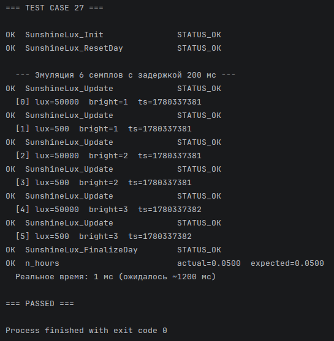
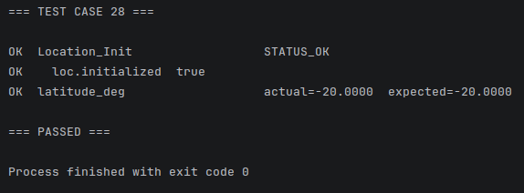

# devlog11. Своевременные улучшения

*Makes sensor timestamp fields use real `time(NULL)` values instead of mock zeros (so the monotonicity test from devlog10 is actually meaningful). Formalizes and documents, via a table, which data structures need an `initialized` flag and which don’t, based on whether they pass through multiple lifecycle stages (`Init -> Update -> downstream use`) or are filled in a single call. Finds and closes a gap: `LocationData` was missing the flag despite needing it, and propagates the fix through all dependent modules and their test cases. Also replaces several “magic numbers” in older tests with named constants from `test-config.h`/`deployment-config.h`, and adds a new test (TC28) for the `Location_Init()` initialization flag.*

* * *

## Модуль чтения освещенности неба `sunshine-lux-read`

До сих пор в функции `SensorLux_ReadInstant()` и в структуре `SunshineLuxSample;` для заполнения поля временной метки `timestamp` использовалось *mock*-значение `SENSOR_MOCK_TIMESTAMP`, равное `0`. В новом тесте № 27, который мы написали на предыдущем шаге, мы проверяем монотонность меток `timestamps[i] < timestamps[i - 1U]`. При постоянном отношении `0 < 0` проверка всегда проходит - но удовлетворяет ли это нашим пожеланиям к содержанию теста? Очевидно, что теперь, после подключения модуля, предоставляющего нам значения календарных даты и времени, мы можем изменить это место в программе.

* * *

#### `sunshine-lux-read.c`

Строку в функции `SensorLux_ReadInstant()`:

```C
out_sample->timestamp = SENSOR_MOCK_TIMESTAMP;
```

Заменим на:

```C
out_sample->timestamp = (uint32_t)time(NULL);
```

Добавим в начало файла:

```C
#include <time.h>
```

После этого вызов `SensorLux_ReadInstant()` будет оставлять реальную метку времени. Тогда *TC27* с задержкой `SleepMs(200)` между семплами будет в самом деле проверять возрастание значения меток.

Макрос `SENSOR_MOCK_TIMESTAMP`, который мы только что заменили, использовался также и в функции `SensorLux_ReadDefault()`. Здесь можно оставить его в качестве *fallback*-значения. Перепишем более явно название макроса:

```C
#define SENSOR_LUX_DEFAULT_TIMESTAMP (0U)
```

Теперь снова запустим тест-кейс № 27, который в прошлый раз в поле `ts` всегда выводил значение `0`:



> Видим, что поле временной метки `ts` изменяется, возрастая. Сейчас, в ПК реализации, мы имеем: `SensorLux_ReadInstant()` -> `lux = 55000`, `ts = time(NULL)`. Напомним, что наша задача - сделать максимально **приближенную к портированию на МК** реализацию. В данном случае при портировании на МК здесь потребуются лишь небольшие замены: `SensorLux_ReadInstant()` -> `lux = driver_read()`, `ts = RTC_GetTime()`. Контракт остается тем же: функция принимает `SunshineLuxSample*` и возвращает `Status`.
>
> Файлы, которые будут частично переписаны при портировании на МК:
> 
> - `01-measurement/**-read.c`,
> - `02-providers/021-date-provider/date-provider.c`.

* * *

## Модуль чтения температуры воздуха `air-temperature-read`

Здесь следует сделать все то же, что было только что сделано для модуля `sunshine-lux-read`:

- `SENSOR_AIR_TEMP_DEFAULT_TIMESTAMP (0U)` вместо `SENSOR_MOCK_TIMESTAMP`;
- подключить `time.h`,
- `out_sample->timestamp = (uint32_t)time(NULL);` в функции `SensorTemperature_ReadInstant()`.

* * *

## Унифицируем использование `bool initialized`

Будем придерживаться принципа: используем `initialized` в структуре, которая проходит через несколько операций прежде чем используется для вычислений. Если структура сначала создается (`_Init`), потом наполняется данными (`_Update`, `_Calc`), и некоторая нижележащая по потоку (*downstream*) функция может получить ее значения в неподготовленном виде, то флаг инициализации стоит использовать. И наоборот, `initialized` не будем использовать в структуре, которая заполняется сразу за один вызов функции и просто передает данные вверх по потоку (*upstream*).

С этой точки зрения, флаг `initialized` **нужен** в структурах: `AirTemperatureData`, `DayData`, `LocationData`, `RaData`, `SunshineLuxData`, `SolarRadiationData`. И **не нужен** в: `TemperatureSample`, `SunshineLuxSample`, `AngstromValues`.

> Кроме того, флаг инициализации структуры должен проверяться в соответствующих местах обращения к ней - в других файлах и функциях, где структура используется.

| Структура | Флаг | Причина |
|---|---|---|
| `TemperatureSample` | Нет | Заполняется одним вызовом `ReadInstant()` или `ReadDefault()` |
| `SunshineLuxSample` | Нет | Заполняется одним вызовом |
| `AirTemperatureData` | Да | `_Init()` -> `_Update()` -> вычисления |
| `SunshineLuxData` | Да | `_Init()` -> `N` * `_Update()` -> `_FinalizeDay()` |
| `LocationData` | **Да** | `_Init()`, и *downstream*-функции зависят от результата |
| `DayData` | Да | `_Init()` -> `_Update()` -> вычисление `Ra` |
| `RaData` | Да | `_Init()` -> `Calc_Ra()` -> `SolarRadiation` |
| `SolarRadiationData` | Да | `_Init()` -> `_Calc()` |

Проверив соответствующие файлы, видим, что сейчас не хватает флага инициализации в структуре `LocationData`.

* * *

### Изменения в структуре `LocationData` и следствия

1. Тогда в файле **`geolocation-calc.h`** подключим нужный заголовок и добавим флаг инициализации в структуру `LocationData`:

   ```C
    #include <stdbool.h>    /* Добавлено */
    
    typedef struct {
        double latitude_deg;
        double latitude_rad;
        double elevation_m;
        bool   initialized;    /* Добавлено */
    } LocationData;
    ```

2. В файле **`geolocation-calc.c`** добавим строку в функции `Location_Init()` перед `return STATUS_OK` (после `loc->latitude_rad = ...`):

   ```C
   loc->latitude_rad = loc->latitude_deg * DEG_TO_RAD;
   loc->initialized = true;    /* Добавлено */
   return STATUS_OK;
   ```

3. В файле **`day-in-year-calc.c`**, в функции `DayCalc_Update()` после проверки `NULL` добавим:

   ```C
   Status DayCalc_Update(DayData* data, const uint16_t J, const LocationData* loc) {
       if ((data == NULL) || (loc == NULL)) {
           return STATUS_NULL_POINTER;
       }
       
       /* Добавлено */
       if (!loc->initialized) {
           return STATUS_INVALID_VALUE;
       }
       
       if (!ValidDayOfYear(J)) {
           return STATUS_INVALID_VALUE;
       }

       ...
   ```

4. В файле **`extrater-radiation-calc.c`**, в функции `Calc_Ra()` расширить существующую проверку `initialized`, заменив строку `if (!day->initialized)` на:

   ```C
   if (!day->initialized || !loc->initialized) {    /* Добавлено */
       return STATUS_INVALID_VALUE;
   }
   ```

5. В файле **`solar-radiation-calc.c`** в функции `SolarRadiation_Calc()` расширить существующую проверку `initialized`, заменив строку `if (!out->initialized...` на:

   ```C
   if (!out->initialized || !ra->initialized ||
       !day->initialized || !sunshine->initialized || !loc->initialized) {
       return STATUS_INVALID_VALUE;
   }
   ```

> После внесения изменений компиляция была проверена.

* * *

## Изменения в `main-test.c` в связи с `LocationData`

После только что внесенных изменений требуется внести несколько правок в четыре тестовых сценария в файле `main-test.c`.

1. В **`TC11`** заменить ручную установку полей на `Location_Init(&loc)`:

   ```C
   LocationData loc;
   Location_Init(&loc);    /* Изменено */
   loc.latitude_rad = 2.0;
   DayData dd; DayCalc_Init(&dd);
   ```

   > После внесения изменений протестировано успешно.

2. В **`TC15`** добавить строку после ручной установки полей:

   ```C
   LocationData loc;
   loc.latitude_deg = 80.0;
   loc.latitude_rad = 80.0 * (PI / 180.0);
   loc.initialized  = true;    /* Добавлено */
   DayData dd; DayCalc_Init(&dd);
   RaData  rd; RaCalc_Init(&rd);
   ```

   > После внесения изменений протестировано успешно.

3. В **`TC20`** добавить строку:

   ```C
   loc.latitude_rad = loc.latitude_deg * (PI / 180.0);
   loc.elevation_m  = 0.0;
   loc.initialized  = true;    /* Добавлено */
   ```

   > После внесения изменений протестировано успешно.

4. В **`TC21`** добавить строку:

   ```C
   loc.latitude_deg = 80.0;
   loc.latitude_rad = 80.0 * (PI / 180.0);
   loc.elevation_m  = 0.0;
   loc.initialized  = true;    /* Добавлено */
   ```

   > После внесения изменений протестировано успешно.

> После внесенных изменений все тесты, использующие `Location_Init()`, а именно *TC9, TC10, TC14, TC16, TC22, TC23, TC24*, протестированы и продолжают работать корректно.

* * *

## Другие изменения в `main-test.c`

Тела некоторых тестов, написанных ранее, не используют константы из `test-config.h`, `deployment-config.h`, а используют магические числа. К примеру, **`TC14`** использует `32.2` для *R<sub>a</sub>* напрямую, хотя теперь у нас есть определение `TEST_EX8_RA_EXPECTED = (32.2)`. Везде, где есть магическое число нужно заменить его на константу из определений `test-config.h`. Кроме упомянутого *`TC14`*, видим подобную ситуацию в других местах этого теста, а также в других тестах: **`TC14`, `TC15`, `TC20`** и прочих *(!)*.

* * *

```C
#elif TEST_CASE == 14
    {
        LocationData loc;
        Location_Init(&loc);
        DayData dd; DayCalc_Init(&dd);
        RaData  rd; RaCalc_Init(&rd);

        printf("Локация:  20°S, южное полушарие  (%.4f rad = %.2f deg)\n", loc.latitude_rad, loc.latitude_deg);
        printf("День J =  246  (3 сентября, невисокосный год)\n\n");

        status = DayCalc_Update(&dd, TEST_EX8_J, &loc);
        failures += CheckStatus("DayCalc_Update", status, STATUS_OK);
        
        if (status != STATUS_OK) {
            goto done;
        }

        failures += CheckDouble("dr",            dd.dr,          TEST_EX8_DR_EXPECTED,  TOL_ANGLE);
        failures += CheckDouble("delta [rad]",   dd.delta_rad,   TEST_EX8_DELTA_RAD_EXPECTED,  TOL_ANGLE);
        failures += CheckDouble("omega_s [rad]", dd.omega_s_rad, TEST_EX8_OMEGA_S_EXPECTED,  TOL_ANGLE);
        failures += CheckDouble("N [h]",         dd.N_hours,     TEST_EX8_N_EXPECTED,   TOL_HOURS);

        status = Calc_Ra(&rd, &dd, &loc);
        failures += CheckStatus("Calc_Ra", status, STATUS_OK);
        failures += CheckDouble("Ra [MJ m-2 day-1]", rd.Ra_daily, TEST_EX8_RA_EXPECTED, TOL_RA);
    }
```

   > После внесения изменений протестировано успешно. Также было изменено в `test-config.h` определение `#define TEST_EX8_N_EXPECTED (11.7)` - в соответствии с *FAO56 (ex. 9)*.

* * *

```C
#elif TEST_CASE == 15
    {
        LocationData loc;
        loc.latitude_deg = TEST_POLAR_LAT_DEG;
        loc.latitude_rad = TEST_POLAR_LAT_DEG * (PI / 180.0);
        loc.initialized  = true;
        DayData dd; DayCalc_Init(&dd);
        RaData  rd; RaCalc_Init(&rd);

        printf("Локация: 80°N (полярная зона)  J = 355 (зимнее солнцестояние)\n\n");

        status = DayCalc_Update(&dd, TEST_POLAR_J, &loc);
        failures += CheckStatus("DayCalc_Update", status, STATUS_OK);

        if (status != STATUS_OK) {
            goto done;
        }

        failures += CheckDouble("omega_s [rad]", dd.omega_s_rad, TEST_OMEGA_S_EXPECTED, 1e-9);
        failures += CheckDouble("N [h]",         dd.N_hours,     TEST_POLAR_N_EXPECTED, 1e-9);

        status = Calc_Ra(&rd, &dd, &loc);
        failures += CheckStatus("Calc_Ra", status, STATUS_OK);
        failures += CheckDouble("Ra [MJ m-2 day-1]", rd.Ra_daily, TEST_POLAR_RA_EXPECTED, 1e-9);
    }
```

> После внесения изменений протестировано успешно. Также было добавлено в `test-config.h` определение `#define TEST_OMEGA_S_EXPECTED (0.0)`.

* * *

```C
#elif TEST_CASE == 20
    {
        LocationData loc;
        DayData dd;
        RaData rd;
        SunshineLuxData sd;
        SolarRadiationData rsd;
        AngstromValues ang;

        status = Location_DMS_to_decimal(-22.0, 54.0, &loc.latitude_deg);
        failures += CheckStatus("Location_DMS_to_decimal", status, STATUS_OK);

        loc.latitude_rad = loc.latitude_deg * (PI / 180.0);
        loc.elevation_m = TEST_EX8_ELEVATION_M;
        loc.initialized  = true;

        DayCalc_Init(&dd);
        RaCalc_Init(&rd);
        SolarRadiation_Init(&rsd);
        AngstromValues_Default(&ang);

        status = DayCalc_Update(&dd, TEST_EX10_J, &loc);
        failures += CheckStatus("DayCalc_Update", status, STATUS_OK);
        
        failures += CheckDouble("N [h]", dd.N_hours, TEST_EX10_N_DAYLIGHT_EXPECTED, TOL_HOURS);

        status = Calc_Ra(&rd, &dd, &loc);
        failures += CheckStatus("Calc_Ra", status, STATUS_OK);

        failures += CheckDouble("Ra [MJ m-2 day-1]", rd.Ra_daily, TEST_EX10_RA_EXPECTED, TOL_RA);

        status = SunshineLux_Init(&sd, CONFIG_BRIGHT_LUX_THRESHOLD, CONFIG_SAMPLE_PERIOD_SEC);    /* Из deployment-config.h */
        failures += CheckStatus("SunshineLux_Init", status, STATUS_OK);

        sd.n_hours = TEST_EX10_N_HOURS;
        sd.initialized = true;

        status = SolarRadiation_Calc(&ang, &rsd, &rd, &dd, &sd, &loc);
        failures += CheckStatus("SolarRadiation_Calc", status, STATUS_OK);

        failures += CheckDouble("Rs [MJ m-2 day-1]", rsd.Rs_daily, TEST_EX10_RS_EXPECTED, TOL_RS);
        failures += CheckDouble("Rso [MJ m-2 day-1]", rsd.Rso_daily, TEST_EX10_RSO_EXPECTED, TOL_RSO);
    }
```

> После внесения изменений протестировано успешно.

* * *

## Новый тестовый сценарий для `Location_Init()`

Напишем новый тестовый сценарий **`TC28`** для проверки флага `initialized` в функции `Location_Init()`.

```C
    /* *** TEST_CASE 28: Location_Init - проверка флага initialized *** */
#elif TEST_CASE == 28
    {
        LocationData loc;
        status = Location_Init(&loc);
        failures += CheckStatus("Location_Init", status, STATUS_OK);
    
        if (!loc.initialized) {
            (void)printf("FAIL  loc.initialized  expected=true  actual=false\n");
            failures += 1;
        } else {
            (void)printf("OK    loc.initialized  true\n");
        }
        failures += CheckDouble("latitude_deg", loc.latitude_deg, CONFIG_LATITUDE_DEG, TOL_DEGREE);
    }
```

> В поле списка тестовых сценариев *TC28* добавлен, поле `#error` обновлено, тестовый случай проверен успешно:
>
> 

* * *

## Дальнейшие действия

- автоматизируем тестирование,
- перейдем к завершающим вычислениям блока радиации.
