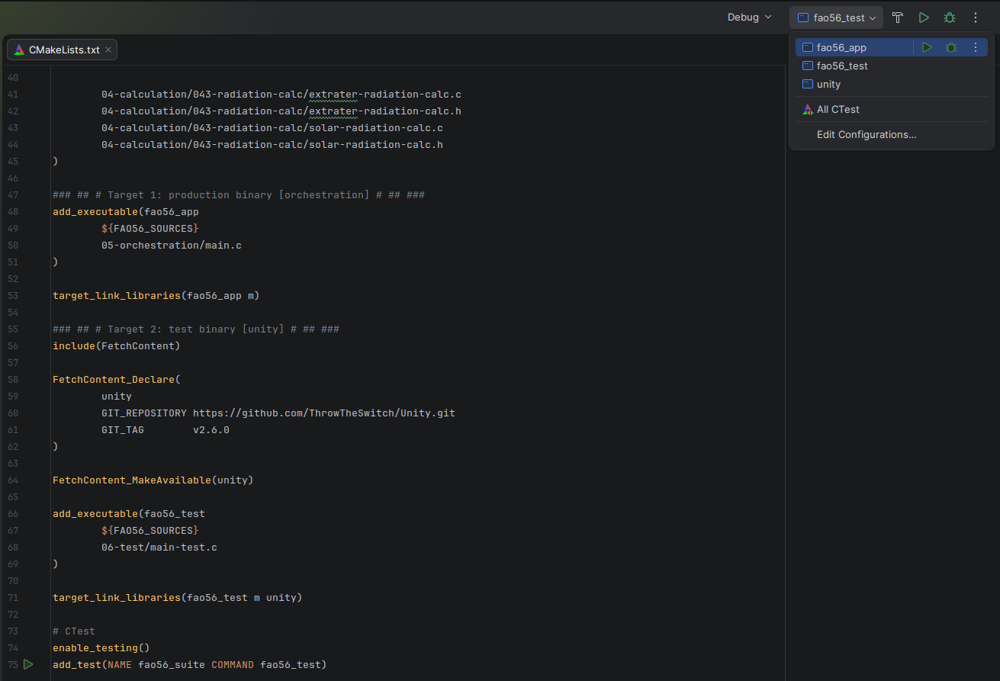
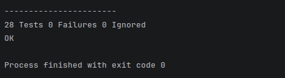

# devlog12. Автоматизация тестирования

## Постановка задач

На этом шаге и в этом девлоге мы хотим решить две задачи, прежде чем двигаться дальше в разработке уравнения и завершении блока радиации:

- автоматизировать тестирование, используя [*Unity*](https://github.com/ThrowTheSwitch/Unity), следовательно, **переписать структуру `main-test.c`** под этот фреймворк;
- **переписать `CMakeLists.txt`** для удобства выбора целей - оркестрации или тестирования.

* * *

## Перепишем `CMakeLists.txt`

Наша задача - подключить *Unity* через `FetchContent`, чтобы использовать его затем в сборке бинарных файлов для целей оркестрации и тестирования, и описать, собственно, сами цели сборки.

* * *

```CMake
cmake_minimum_required(VERSION 4.1)
project(FAO56 C)

set(CMAKE_C_STANDARD 11)

### ## # Исходные файлы, используемые для обеих целей # ## ###
set(FAO56_SOURCES
        01-measurement/011-air-temperature-read/air-temperature-read.c
        01-measurement/011-air-temperature-read/air-temperature-read.h

        01-measurement/012-sunshine-lux-read/sunshine-lux-read.c
        01-measurement/012-sunshine-lux-read/sunshine-lux-read.h

        02-providers/021-date-provider/date-provider.c
        02-providers/021-date-provider/date-provider.h

        02-providers/022-configurations/deployment-config.h
        02-providers/022-configurations/test-config.h

        03-validation/status.c
        03-validation/status.h
        03-validation/validation.c
        03-validation/validation.h
        03-validation/value-source.c
        03-validation/value-source.h

        04-calculation/041-air-temperature-calc/air-temperature-calc.c
        04-calculation/041-air-temperature-calc/air-temperature-calc.h

        04-calculation/042-vapour-pressure-calc/vapour-pressure-calc.c
        04-calculation/042-vapour-pressure-calc/vapour-pressure-calc.h

        04-calculation/043-radiation-calc/geolocation-calc.c
        04-calculation/043-radiation-calc/geolocation-calc.h
        04-calculation/043-radiation-calc/day-in-year-calc.c
        04-calculation/043-radiation-calc/day-in-year-calc.h

        04-calculation/043-radiation-calc/sunshine-lux-calc.c
        04-calculation/043-radiation-calc/sunshine-lux-calc.h

        04-calculation/043-radiation-calc/extrater-radiation-calc.c
        04-calculation/043-radiation-calc/extrater-radiation-calc.h
        04-calculation/043-radiation-calc/solar-radiation-calc.c
        04-calculation/043-radiation-calc/solar-radiation-calc.h
)

### ## # Target 1: production binary [orchestration] # ## ###
add_executable(fao56_app
        ${FAO56_SOURCES}
        05-orchestration/main.c
)

target_link_libraries(fao56_app m)

### ## # Target 2: test binary [unity] # ## ###
include(FetchContent)

FetchContent_Declare(
        unity
        GIT_REPOSITORY https://github.com/ThrowTheSwitch/Unity.git
        GIT_TAG        v2.6.0
)

FetchContent_MakeAvailable(unity)

add_executable(fao56_test
        ${FAO56_SOURCES}
        06-test/main-test.c
)

target_link_libraries(fao56_test m unity)
target_compile_definitions(unity PUBLIC UNITY_INCLUDE_DOUBLE)

# CTest
enable_testing()
add_test(NAME fao56_suite COMMAND fao56_test)
```

* * *

Когда из файла будут прочитаны строки `FetchContent_Declare()` и `FetchContent_MakeAvailable(unity)`, *CMake* сделает обращение к репозиторию *GitHub*, чтобы скачать фреймворк *Unity* и разместить его во внутренней папке сборки (`cmake-build-debug/`). Это происходит при первом конфигурировании, *Unity* кешируется локально и последующие разы уже не скачивается. Во время первого запуска *CMake*-конфигурации требуется подключение к сети.

После имплементации этого `CMakeLists.txt` получим возможности запускать на выбор файл оркестрации или файл тестирования прямо из панели *IDE* в одно нажатие:



> **UPD:** Несколько позднее была обнаружена проблема. В `CMakeLists.txt` необходимо добавить строку:
>
> ```C
> target_link_libraries(fao56_test m unity)
> target_compile_definitions(unity PUBLIC UNITY_INCLUDE_DOUBLE)  # Добавлено
> ```
>
> Код выше был обновлен. Скриншот показывает состояние без добавления этой строки. В данном случае это не проблема - сам тестовый файл будет запущен через уже обновленный файл сборки, и мы увидим результат (см. ниже).

* * *

## Перепишем файл тестирования

Наша задача - переписать содержимое `main-test.c` так, чтобы все наши 28 тестов (и все впоследствии добавляемые) запускались за один раз, а результат проверок выводился один сразу для всех тестов. Для этого придется попрощаться с созданными нами средствами `CheckDouble`, `CheckStatus` и `failures`, которые прекрасно служили нам до сих пор: прощайте, созданные средства!

Вкратце для нас основная идея тестирования через фреймворк *Unity* сводится к следующему:

- каждый тест запускается через функцию, которая имеет вид `static void test_ИмяТеста(void)`, следовательно определения `#define TEST_CASE`, `#elif` больше не нужны;
- `UNITY_BEGIN()` запускает сессию, `UNITY_END()` завершает ее и печатает результат;
- `RUN_TEST(имя_функции)` запускает тест;
- при провале тест останавливается, следующий тест продолжается, не нужно больше использовать `goto done` (в отношении которого имеется, к слову, почти религиозный страх);
- по итогам тестирования выводятся результаты всех тестовых наборов, использование счетчика `failures` больше не требуется;
- `CheckDouble`, `CheckStatus` заменяются на `AssertDouble` и `AssertStatus`.

* * *

### Обновим сперва `test-config.h`

Чтобы сделать более наглядным использование тестовых и эталонных значений по *FAO56* в тестовых наборах `main-test.c`, обновим и реорганизуем внешний вид нашего файла тестовой конфигурации `test-config.h`:

```C
#ifndef TEST_CONFIG_H
#define TEST_CONFIG_H

#ifdef __cplusplus
extern "C" {
#endif

/* =============================================================================
 * test-config.h
 * Эталонные значения FAO56 и параметры тестовых сценариев.
 * Используется ТОЛЬКО в 06-test/main-test.c.
 * Физические константы модели остаются в заголовках вычислительных модулей.
 * ============================================================================= */

/* -----------------------------------------------------------------------------
 * Допуски (tolerances) для сравнения double-значений
 * Выбраны в соответствии с точностью, заявленной в FAO56.
 * ----------------------------------------------------------------------------- */
#define TOL_AIR_TEMP   (0.01)    /* °C             - температура воздуха         */
#define TOL_KPA        (0.0001)  /* кПа            - давление пара               */
#define TOL_KPA_PER_C  (0.0001)  /* кПа/°C         - наклон кривой давления      */
#define TOL_DEGREE     (0.01)    /* °              - широта в градусах           */
#define TOL_RADIANS    (0.001)   /* рад            - широта в радианах           */
#define TOL_ANGLE      (0.005)   /* рад            - астрономические углы        */
#define TOL_HOURS      (0.05)    /* ч              - продолжительность дня       */
#define TOL_RA         (0.05)    /* МДж м-2 сут-1  - внеземная радиация          */
#define TOL_RS         (0.05)    /* МДж м-2 сут-1  - солнечная радиация          */
#define TOL_RSO        (0.05)    /* МДж м-2 сут-1  - радиация чистого неба       */

/* -----------------------------------------------------------------------------
 * TC1-5: Температура воздуха и давление насыщенного пара
 *
 * TC1 (изотермический): одно измерение T = 20°C.
 * TC5 (min/max):        три измерения - 20, 10, 30°C.
 * Эталон: FAO56 Ann. 2, Table 2.3, 2.4.
 * ----------------------------------------------------------------------------- */
#define TEST_TEMP_INST_C          (20.0)    /* TC1: мгновенное показание датчика */
#define TEST_TEMP_MEAN_C          (20.0)    /* TC1/TC5: T_mean = (T_min+T_max)/2 */
#define TEST_TEMP_MIN_C           (10.0)    /* TC5: минимальная температура      */
#define TEST_TEMP_MAX_C           (30.0)    /* TC5: максимальная температура     */
#define TEST_TEMP_OUT_OF_RANGE    (150.0)   /* TC2: вне допустимого диапазона    */
#define TEST_E_TMEAN_EXPECTED     (2.3383)  /* кПа - e°(T_mean = 20°C)           */
#define TEST_E_S_EXPECTED         (2.3383)  /* кПа - e_s при изотерм. сценарии   */
#define TEST_DELTA_EXPECTED       (0.1447)  /* кПа/°C - Δ при T = 20°C           */

/* -----------------------------------------------------------------------------
 * TC12-13: Перевод координат DMS -> десятичные градусы и радианы
 * FAO56 eq. 22, ex. 7.
 * ----------------------------------------------------------------------------- */
/* Бангкок: 13°44'N                                                              */
#define TEST_BANGKOK_LAT_DEG          (13.0)     /* градусы°                     */
#define TEST_BANGKOK_LAT_MIN          (44.0)     /* минуты'                      */
#define TEST_BANGKOK_LAT_EXPECTED     (13.7333)  /* градусы°                     */
#define TEST_BANGKOK_RAD_EXPECTED     (0.2400)   /* рад                          */

/* Рио-де-Жанейро: 22°54'S                                                       */
#define TEST_RIO_LAT_DEG              (-22.0)    /* градусы°                     */
#define TEST_RIO_LAT_MIN              (54.0)     /* минуты'                      */
#define TEST_RIO_LAT_EXPECTED         (-22.9000) /* градусы°                     */
#define TEST_RIO_RAD_EXPECTED         (-0.4000)  /* рад                          */

/* -----------------------------------------------------------------------------
 * TC14: Внеземная радиация Ra - FAO56 ex. 8 и ex. 9
 * Локация: 20°S, уровень моря. День: J = 246 (3 сентября).
 * Эталонные значения из FAO56 ex. 8 (Ra) и ex. 9 (N).
 * ----------------------------------------------------------------------------- */
#define TEST_EX8_J                    (246U)     /* день J                       */
#define TEST_EX8_LAT_DEG              (-20.0)    /* градусы°                     */
#define TEST_EX8_LAT_MIN              (0.0)      /* минуты'                      */
#define TEST_ELEVATION_SEA_LEVEL      (0.0)      /* м - использ. в TC14, TC20    */

#define TEST_EX8_DR_EXPECTED          (0.985)    /* обр. расст. Земля-Солнце     */
#define TEST_EX8_DELTA_RAD_EXPECTED   (0.120)    /* солнечное склонение δ, рад   */
#define TEST_EX8_OMEGA_S_EXPECTED     (1.527)    /* угол заката ωs, рад          */
#define TEST_EX8_N_EXPECTED           (11.7)     /* ч светлого времени суток     */
#define TEST_EX8_RA_EXPECTED          (32.2)     /* МДж м-2 сут-1                */

/* -----------------------------------------------------------------------------
 * TC15: Полярная ночь - FAO56 ex. 8 (расширение)
 * Локация: 80°N. День: J = 355 (зимнее солнцестояние).
 * При полярной ночи: ωs = 0, N = 0, Ra = 0.
 * ----------------------------------------------------------------------------- */
#define TEST_POLAR_LAT_DEG            (80.0)     /* градусы°                     */
#define TEST_POLAR_J                  (355U)     /* день J                       */
#define TEST_POLAR_OMEGA_S_EXPECTED   (0.0)      /* рад                          */
#define TEST_POLAR_N_EXPECTED         (0.0)      /* ч                            */
#define TEST_POLAR_RA_EXPECTED        (0.0)      /* МДж м-2 сут-1                */

/* -----------------------------------------------------------------------------
 * TC20: Солнечная радиация Rs, Rso - FAO56 ex. 10
 * Локация: Рио-де-Жанейро 22°54'S. День: J = 135 (15 мая).
 * Данные: 220 ч сияния за май (31 день) -> n = 220/31 = 7.1 ч/сут.
 * ----------------------------------------------------------------------------- */
#define TEST_EX10_J                   (135U)     /* день J                       */
#define TEST_EX10_N_HOURS             (7.1)      /* ч фактического сияния        */
#define TEST_EX10_RA_EXPECTED         (25.1)     /* МДж м-2 сут-1                */
#define TEST_EX10_N_DAYLIGHT_EXPECTED (10.9)     /* ч светлого времени           */
#define TEST_EX10_RS_EXPECTED         (14.5)     /* МДж м-2 сут-1                */
#define TEST_EX10_RSO_EXPECTED        (18.8)     /* МДж м-2 сут-1                */

/* -----------------------------------------------------------------------------
 * TC27: Эмуляция опроса датчика освещенности в реальном времени
 * ----------------------------------------------------------------------------- */
#define TEST_EMUL_SAMPLES             (6U)       /* число семплов                */
#define TEST_EMUL_DELAY_MS            (200U)     /* задержка между семплами, мс  */
#define TEST_EMUL_LUX_BRIGHT          (50000.0)  /* лк - "ясно"                  */
#define TEST_EMUL_LUX_DARK            (500.0)    /* лк - "пасмурно"              */

#ifdef __cplusplus
}
#endif

#endif /* TEST_CONFIG_H */
```

* * *

### Перенесем файл тестовой конфигурации

Не вполне корректным решением было изначально создавать файл тестовой конфигурации `test-config.h` в слое конфигурации. Ошибка понятна - мысль последовала за названием. Этот файл не должен попадать в *production-binary*, так что лучше перенести его в папку `06-test/`. Пусть тестовая конфигурация ничего не знает о производственном коде.

> Здесь и во всех подобных случаях - ранее и позднее - мы исходим из того, что *CLion* автоматически заменяет пути и зависимости при переносе или переименовании файлов.

После этого следует внести небольшое изменение в `CMakeLists.txt`:

```CMake
# FAO56_SOURCES - убрать эту строку:
02-providers/022-configurations/test-config.h

# fao56_test - добавить отдельно:
add_executable(fao56_test
        ${FAO56_SOURCES}
        06-test/test-config.h      # Добавлено
        06-test/main-test.c
)
```

* * *

### Теперь перейдем к `main-test.c`

```C
#include <time.h>
#include <math.h>
#include <stdio.h>
#include <stdint.h>
#include <stdbool.h>

#ifdef _WIN32
    #include <windows.h>    /* Sleep(ms) */
#else
    #include <unistd.h>     /* usleep(us) */
#endif

#include "unity.h"

#include "test-config.h"

#include "../01-measurement/011-air-temperature-read/air-temperature-read.h"
#include "../01-measurement/012-sunshine-lux-read/sunshine-lux-read.h"

#include "../02-providers/021-date-provider/date-provider.h"
#include "../02-providers/022-configurations/deployment-config.h"

#include "../03-validation/status.h"
#include "../03-validation/validation.h"
#include "../03-validation/value-source.h"

#include "../04-calculation/041-air-temperature-calc/air-temperature-calc.h"
#include "../04-calculation/042-vapour-pressure-calc/vapour-pressure-calc.h"

#include "../04-calculation/043-radiation-calc/geolocation-calc.h"
#include "../04-calculation/043-radiation-calc/day-in-year-calc.h"
#include "../04-calculation/043-radiation-calc/sunshine-lux-calc.h"

#include "../04-calculation/043-radiation-calc/extrater-radiation-calc.h"
#include "../04-calculation/043-radiation-calc/solar-radiation-calc.h"

#define PI (3.14159265358979323846)

/* *** Вспомогательные функции *** */

/* Пауза в миллисекундах (для эмуляции реального времени) */
static void SleepMs(uint32_t ms) {
#ifdef _WIN32
    Sleep(ms);
#else
    usleep((useconds_t)(ms * 1000U));
#endif
}

/* Проверка double: выводит значения и вызывает Unity assertion */
static void AssertDouble(const char *label, const double actual, const double expected, const double tol) {
    char msg[192];
    double abs_diff = fabs(actual - expected);

    snprintf(msg, sizeof(msg), "%s: actual=%.6f  expected=%.6f  diff=%.6f  tol=%.6f",
        label, actual, expected, abs_diff, tol);
    (void)printf("  %-36s actual=%.4f  expected=%.4f\n", label, actual, expected);

    TEST_ASSERT_DOUBLE_WITHIN_MESSAGE(tol, expected, actual, msg);    /* Unity-макрос */
}

/* Проверка Status: выводит строку статуса и вызывает Unity assertion */
static void AssertStatus(const char *label, const Status actual, const Status expected) {
    char msg[192];

    snprintf(msg, sizeof(msg), "%s: actual=%s  expected=%s",
        label, Status_ToString(actual), Status_ToString(expected));
    (void)printf("  %-36s %s\n", label, Status_ToString(actual));

    TEST_ASSERT_EQUAL_INT_MESSAGE((int)expected, (int)actual, msg);    /* Unity-макрос */
}

void setUp(void)    { /* ничего */ }    /* Вызывается перед каждым тестом */
void tearDown(void) { /* ничего */ }    /* Вызывается после каждого теста */

/* ============================================================================= *
 *                                ТЕСТОВЫЕ НАБОРЫ                                *
 * ============================================================================= */

/* *** TC1-5: Модули температуры воздуха и давления насыщенного пара *** */

/* TC1: нормальный путь T = 20°C, FAO56 ann. 2, tab. 2.3, 2.4 */
static void test_AirTemperature_NormalPath_T20(void) {
    (void)printf("\n>>> TC1: %s\n", __func__);

    AirTemperatureData data;
    double e_tmean = 0.0, delta = 0.0;
    AirTemperature_Init(&data);

    AssertStatus("AirTemperature_Update(20.0)",
                 AirTemperature_Update(&data, TEST_TEMP_INST_C , 0U), STATUS_OK);
    AssertDouble("T_mean", data.T_mean_C, TEST_TEMP_MEAN_C, TOL_AIR_TEMP);

    AssertStatus("Calc_SVP_ForTmean",
                 Calc_SaturationVapourPressure_ForTmean(&data, &e_tmean), STATUS_OK);
    AssertDouble("e(T_mean) [kPa]", e_tmean, TEST_E_TMEAN_EXPECTED, TOL_KPA);

    AssertStatus("Calc_SlopeDelta",
                 Calc_SlopeDelta(&data, &delta), STATUS_OK);
    AssertDouble("delta [kPa/C]", delta, TEST_DELTA_EXPECTED, TOL_KPA_PER_C);
}

/* TC2: T = 150°C - вне диапазона [-100, +100] */
static void test_AirTemperature_OutOfRange(void) {
    (void)printf("\n>>> TC2: %s\n", __func__);

    AirTemperatureData data;
    AirTemperature_Init(&data);

    AssertStatus("AirTemperature_Update(150.0)",
                 AirTemperature_Update(&data, TEST_TEMP_OUT_OF_RANGE, 0U), STATUS_INVALID_VALUE);
}

/* TC3: NaN */
static void test_AirTemperature_NaN(void) {
    (void)printf("\n>>> TC3: %s\n", __func__);

    AirTemperatureData data;
    AirTemperature_Init(&data);

    AssertStatus("AirTemperature_Update(NaN)",
                 AirTemperature_Update(&data, NAN, 0U), STATUS_INVALID_VALUE);
}

/* TC4: INFINITY */
static void test_AirTemperature_Infinity(void) {
    (void)printf("\n>>> TC4: %s\n", __func__);

    AirTemperatureData data;
    AirTemperature_Init(&data);

    AssertStatus("AirTemperature_Update(INF)",
                 AirTemperature_Update(&data, INFINITY, 0U), STATUS_INVALID_VALUE);
}

/* TC5: три измерения -> T_min = 10, T_max = 30, T_mean = (10 + 30) / 2 = 20 */
static void test_AirTemperature_MinMaxTracking(void) {
    (void)printf("\n>>> TC5: %s\n", __func__);

    AirTemperatureData data;
    AirTemperature_Init(&data);

    AssertStatus("Update(20.0)", AirTemperature_Update(&data, TEST_TEMP_INST_C, 0U), STATUS_OK);
    AssertStatus("Update(10.0)", AirTemperature_Update(&data, TEST_TEMP_MIN_C,  1U), STATUS_OK);
    AssertStatus("Update(30.0)", AirTemperature_Update(&data, TEST_TEMP_MAX_C,  2U), STATUS_OK);
    AssertDouble("T_min",  data.T_min_C,  TEST_TEMP_MIN_C,  TOL_AIR_TEMP);
    AssertDouble("T_max",  data.T_max_C,  TEST_TEMP_MAX_C,  TOL_AIR_TEMP);
    AssertDouble("T_mean", data.T_mean_C, TEST_TEMP_MEAN_C, TOL_AIR_TEMP);
}

/* *** TC6-8: Валидация, конвертация дат *** */

/* TC6: ValidDayOfYear - граничные значения */
static void test_ValidDayOfYear_BoundaryValues(void) {
    (void)printf("\n>>> TC6: %s\n", __func__);

    TEST_ASSERT_TRUE_MESSAGE(ValidDayOfYear(1U),     "J=1 допустим");
    TEST_ASSERT_TRUE_MESSAGE(ValidDayOfYear(366U),   "J=366 допустим");
    TEST_ASSERT_FALSE_MESSAGE(ValidDayOfYear(0U),    "J=0 недопустим");
    TEST_ASSERT_FALSE_MESSAGE(ValidDayOfYear(367U),  "J=367 недопустим");
    TEST_ASSERT_TRUE_MESSAGE(ValidDayOfYear(246U),   "J=246 допустим");
}

/* TC7: ValidLatitudeRad - граничные значения [-π/2, +π/2] */
static void test_ValidLatitudeRad_BoundaryValues(void) {
    (void)printf("\n>>> TC7: %s\n", __func__);

    const double PI_2 = PI / 2.0;

    TEST_ASSERT_TRUE_MESSAGE(ValidLatitudeRad(0.0),     "lat=0 допустим");
    TEST_ASSERT_TRUE_MESSAGE(ValidLatitudeRad(PI_2),        "lat=+π/2 допустим");
    TEST_ASSERT_TRUE_MESSAGE(ValidLatitudeRad(-PI_2),       "lat=-π/2 допустим");
    TEST_ASSERT_FALSE_MESSAGE(ValidLatitudeRad(2.0),    "lat=2.0 > π/2 недопустим");
    TEST_ASSERT_FALSE_MESSAGE(ValidLatitudeRad(-2.0),   "lat=-2.0 < -π/2 недопустим");
    TEST_ASSERT_FALSE_MESSAGE(ValidLatitudeRad(1.5708), "lat=1.5708 > π/2 недопустим");    /* 1.5708 > π/2 ≈ 1.57079632... - граничный случай */
}

/* TC8: DayCalc_JFromDate - календарные даты и високосные годы */
static void test_DayCalc_JFromDate_CalendarDates(void) {
    (void)printf("\n>>> TC8: %s\n", __func__);

    TEST_ASSERT_EQUAL_UINT16(247U, DayCalc_JFromDate(3U,  9U,  2024U));    /* 3  Sep 2024 (високосный)   -> J = 247 */
    TEST_ASSERT_EQUAL_UINT16(246U, DayCalc_JFromDate(3U,  9U,  2023U));    /* 3  Sep 2023 (невисокосный) -> J = 246 */
    TEST_ASSERT_EQUAL_UINT16(1U,   DayCalc_JFromDate(1U,  1U,  2023U));    /* 1  Jan -> J = 1                       */
    TEST_ASSERT_EQUAL_UINT16(365U, DayCalc_JFromDate(31U, 12U, 2023U));    /* 31 Dec невисокосный -> J = 365        */
    TEST_ASSERT_EQUAL_UINT16(366U, DayCalc_JFromDate(31U, 12U, 2024U));    /* 31 Dec високосный   -> J = 366        */
    TEST_ASSERT_EQUAL_UINT16(59U,  DayCalc_JFromDate(28U, 2U,  2023U));    /* 28 Feb невисокосный -> J = 59         */
    TEST_ASSERT_EQUAL_UINT16(60U,  DayCalc_JFromDate(1U,  3U,  2023U));    /* 1  Mar невисокосный -> J = 60         */
    TEST_ASSERT_EQUAL_UINT16(61U,  DayCalc_JFromDate(1U,  3U,  2024U));    /* 1  Mar високосный   -> J = 61         */
}

/* *** TC9-11: DayCalc_Update - статусы ошибок *** */

/* TC9: NULL pointer */
static void test_DayCalc_Update_NullPointer(void) {
    (void)printf("\n>>> TC9: %s\n", __func__);

    LocationData loc; Location_Init(&loc);
    DayData dd;       DayCalc_Init(&dd);

    AssertStatus("DayCalc_Update(NULL, 246, loc)",
                 DayCalc_Update(NULL,  246U, &loc), STATUS_NULL_POINTER);
    AssertStatus("DayCalc_Update(dd, 246, NULL)",
                 DayCalc_Update(&dd,   246U, NULL), STATUS_NULL_POINTER);
}

/* TC10: невалидный J - 0 и 367 */
static void test_DayCalc_Update_InvalidJ(void) {
    (void)printf("\n>>> TC10: %s\n", __func__);

    LocationData loc; Location_Init(&loc);
    DayData dd;       DayCalc_Init(&dd);

    AssertStatus("DayCalc_Update(J=0)",
                 DayCalc_Update(&dd, 0U, &loc),   STATUS_INVALID_VALUE);
    AssertStatus("DayCalc_Update(J=367)",
                 DayCalc_Update(&dd, 367U, &loc),  STATUS_INVALID_VALUE);
}

/* TC11: невалидная широта (lat_rad вне [-π/2, +π/2]).
 * Используем Location_Init() чтобы initialized = true, затем переопределяем latitude_rad невалидным значением. */
static void test_DayCalc_Update_InvalidLatitude(void) {
    (void)printf("\n>>> TC11: %s\n", __func__);

    LocationData loc; Location_Init(&loc);
    DayData dd;       DayCalc_Init(&dd);

    loc.latitude_rad = 2.0;
    AssertStatus("DayCalc_Update(lat=+2.0 rad)",
                 DayCalc_Update(&dd, 246U, &loc), STATUS_INVALID_VALUE);

    loc.latitude_rad = -2.0;
    AssertStatus("DayCalc_Update(lat=-2.0 rad)",
                 DayCalc_Update(&dd, 246U, &loc), STATUS_INVALID_VALUE);
}

/* *** TC12-13: Location_DMS_to_decimal - FAO56 ex.7 *** */

/* TC12: Бангкок 13°44'N */
static void test_Location_DMS_Bangkok(void) {
    (void)printf("\n>>> TC12: %s\n", __func__);

    LocationData loc;

    AssertStatus("DMS_to_decimal(Bangkok)", Location_DMS_to_decimal(
        TEST_BANGKOK_LAT_DEG, TEST_BANGKOK_LAT_MIN, &loc.latitude_deg), STATUS_OK);

    loc.latitude_rad = loc.latitude_deg * (PI / 180.0);
    AssertDouble("latitude_deg", loc.latitude_deg, TEST_BANGKOK_LAT_EXPECTED, TOL_DEGREE);
    AssertDouble("latitude_rad", loc.latitude_rad, TEST_BANGKOK_RAD_EXPECTED, TOL_RADIANS);
}

/* TC13: Рио-де-Жанейро 22°54'S */
static void test_Location_DMS_Rio(void) {
    (void)printf("\n>>> TC13: %s\n", __func__);

    LocationData loc;

    AssertStatus("DMS_to_decimal(Rio)", Location_DMS_to_decimal(
        TEST_RIO_LAT_DEG, TEST_RIO_LAT_MIN, &loc.latitude_deg), STATUS_OK);

    loc.latitude_rad = loc.latitude_deg * (PI / 180.0);
    AssertDouble("latitude_deg", loc.latitude_deg, TEST_RIO_LAT_EXPECTED, TOL_DEGREE);
    AssertDouble("latitude_rad", loc.latitude_rad, TEST_RIO_RAD_EXPECTED, TOL_RADIANS);
}

/* *** TC14-16: Внеземная радиация Ra *** */

/* TC14: FAO56 ex.8, ex.9 - 20°S, J = 246.
 * Эталон: dr = 0.985, δ = 0.120 рад, ωs = 1.527 рад, N = 11.7 ч, Ra = 32.2 МДж/м-2/су-1 */
static void test_Calc_Ra_FAO56_ex8(void) {
    (void)printf("\n>>> TC14: %s\n", __func__);

    LocationData loc; Location_Init(&loc);
    DayData      dd;  DayCalc_Init(&dd);
    RaData       rd;  RaCalc_Init(&rd);

    AssertStatus("DayCalc_Update", DayCalc_Update(&dd, TEST_EX8_J, &loc), STATUS_OK);
    AssertDouble("dr",             dd.dr,          TEST_EX8_DR_EXPECTED,        TOL_ANGLE);
    AssertDouble("delta [rad]",    dd.delta_rad,   TEST_EX8_DELTA_RAD_EXPECTED, TOL_ANGLE);
    AssertDouble("omega_s [rad]",  dd.omega_s_rad, TEST_EX8_OMEGA_S_EXPECTED,   TOL_ANGLE);
    AssertDouble("N [h]",          dd.N_hours,     TEST_EX8_N_EXPECTED,         TOL_HOURS);

    AssertStatus("Calc_Ra", Calc_Ra(&rd, &dd, &loc), STATUS_OK);
    AssertDouble("Ra [MJ m-2 day-1]", rd.Ra_daily, TEST_EX8_RA_EXPECTED, TOL_RA);
}

/* TC15: полярная ночь - 80°N, J = 355 -> ωs = 0, N = 0, Ra = 0 */
static void test_Calc_Ra_PolarNight(void) {
    (void)printf("\n>>> TC15: %s\n", __func__);

    LocationData loc;

    loc.latitude_deg = TEST_POLAR_LAT_DEG;
    loc.latitude_rad = TEST_POLAR_LAT_DEG * (PI / 180.0);
    loc.elevation_m  = 0.0;
    loc.initialized  = true;

    DayData dd; DayCalc_Init(&dd);
    RaData  rd; RaCalc_Init(&rd);

    AssertStatus("DayCalc_Update",    DayCalc_Update(&dd, TEST_POLAR_J, &loc), STATUS_OK);
    AssertDouble("omega_s [rad]",     dd.omega_s_rad, TEST_POLAR_OMEGA_S_EXPECTED,  1e-9);
    AssertDouble("N [h]",             dd.N_hours,     TEST_POLAR_N_EXPECTED,  1e-9);

    AssertStatus("Calc_Ra", Calc_Ra(&rd, &dd, &loc), STATUS_OK);
    AssertDouble("Ra [MJ m-2 day-1]", rd.Ra_daily,    TEST_POLAR_RA_EXPECTED, 1e-9);
}

/* TC16: STATUS_INVALID_VALUE - DayData не инициализирован (initialized = false) */
static void test_Calc_Ra_UninitializedDayData(void) {
    (void)printf("\n>>> TC16: %s\n", __func__);

    LocationData loc; Location_Init(&loc);
    DayData      dd;  DayCalc_Init(&dd);    /* initialized = false - DayCalc_Update не вызывался */
    RaData       rd;  RaCalc_Init(&rd);

    AssertStatus("Calc_Ra(uninitialized DayData)", Calc_Ra(&rd, &dd, &loc), STATUS_INVALID_VALUE);
    AssertDouble("Ra_daily остался 0.0", rd.Ra_daily, 0.0, 1e-9);        /* Ra_daily не должна была измениться */
}

/* *** TC17-19: Модуль накопителя солнечного сияния SunshineLux *** */

/* TC17: полный солнечный день - 60 ярких семплов -> n = 1.0 ч.
 * Все семплы выше порога lux = 50000 > threshold = 20000. Ожидаемый результат: bright_samples = 60, n_hours = 1.0 ч. */
static void test_SunshineLux_FullSunshine(void) {
    (void)printf("\n>>> TC17: %s\n", __func__);

    SunshineLuxData sd;

    AssertStatus("SunshineLux_Init", SunshineLux_Init(&sd, 20000.0, 60U), STATUS_OK);
    AssertStatus("SunshineLux_ResetDay", SunshineLux_ResetDay(&sd), STATUS_OK);

    for (uint32_t i = 0U; i < 60U; ++i) {
        Status s = SunshineLux_Update(&sd, 50000.0, SENSOR_VALUE_MEASURED);

        if (s != STATUS_OK) {
            char msg[80];
            snprintf(msg, sizeof(msg), "SunshineLux_Update[%u] failed: %s", (unsigned)i, Status_ToString(s));
            TEST_FAIL_MESSAGE(msg);
        }
    }

    (void)printf("  SunshineLux_Update * 60         все STATUS_OK"
                 "  (lux=50000 > threshold=20000)\n");

    (void)printf("  bright_samples=%-4u  total_samples=%u\n",
                 (unsigned)sd.bright_samples, (unsigned)sd.total_samples);

    AssertStatus("SunshineLux_FinalizeDay", SunshineLux_FinalizeDay(&sd), STATUS_OK);
    AssertDouble("n_hours", sd.n_hours, 1.0, 0.001);
}

/* TC18: отсутствие сияния - 60 темных семплов -> n = 0.
 * Все семплы ниже порога: lux = 1000 < threshold = 20000. Ожидаемый результат: bright_samples = 0, n_hours = 0 */
static void test_SunshineLux_NoSunshine(void) {
    (void)printf("\n>>> TC18: %s\n", __func__);

    SunshineLuxData sd;

    AssertStatus("SunshineLux_Init", SunshineLux_Init(&sd, 20000.0, 60U), STATUS_OK);
    AssertStatus("SunshineLux_ResetDay", SunshineLux_ResetDay(&sd), STATUS_OK);

    for (uint32_t i = 0U; i < 60U; ++i) {
        Status s = SunshineLux_Update(&sd, 1000.0, SENSOR_VALUE_MEASURED);

        if (s != STATUS_OK) {
            char msg[80];
            snprintf(msg, sizeof(msg), "SunshineLux_Update[%u] failed: %s", (unsigned)i, Status_ToString(s));
            TEST_FAIL_MESSAGE(msg);
        }
    }

    (void)printf("  SunshineLux_Update * 60        все STATUS_OK"
                 "  (lux=1000 < threshold=20000)\n");

    (void)printf("  bright_samples=%-4u  total_samples=%u\n",
                 (unsigned)sd.bright_samples, (unsigned)sd.total_samples);

    AssertStatus("SunshineLux_FinalizeDay", SunshineLux_FinalizeDay(&sd), STATUS_OK);
    AssertDouble("n_hours", sd.n_hours, 0.0, 1e-9);
}

/* TC19: смешанный день - 30 ярких + 30 темных -> n = 0.5 ч */
static void test_SunshineLux_MixedDay(void) {
    (void)printf("\n>>> TC19: %s\n", __func__);

    SunshineLuxData sd;

    AssertStatus("SunshineLux_Init", SunshineLux_Init(&sd, 20000.0, 60U), STATUS_OK);
    AssertStatus("SunshineLux_ResetDay", SunshineLux_ResetDay(&sd), STATUS_OK);

    for (uint32_t i = 0U; i < 30U; ++i) {
        AssertStatus("Update(bright)", SunshineLux_Update(&sd, 50000.0, SENSOR_VALUE_MEASURED), STATUS_OK);
    }

    for (uint32_t i = 0U; i < 30U; ++i) {
        AssertStatus("Update(dark)", SunshineLux_Update(&sd, 1000.0, SENSOR_VALUE_MEASURED), STATUS_OK);
    }

    AssertStatus("SunshineLux_FinalizeDay", SunshineLux_FinalizeDay(&sd), STATUS_OK);
    AssertDouble("n_hours", sd.n_hours, 0.5, 0.001);
}

/* *** TC20-24: Солнечная радиация Rs, Rso *** */

/* TC20: FAO56 ex.10 - Рио-де-Жанейро, 15 мая (J = 135).
 * Эталон: Ra = 25.1, N = 10.9 ч, n = 7.1 ч -> Rs = 14.5, Rso = 18.8 МДж/м-2/сут-1 */
static void test_SolarRadiation_FAO56_ex10(void) {
    (void)printf("\n>>> TC20: %s\n", __func__);

    LocationData loc;

    AssertStatus("DMS_to_decimal", Location_DMS_to_decimal(
        TEST_RIO_LAT_DEG, TEST_RIO_LAT_MIN, &loc.latitude_deg), STATUS_OK);

    loc.latitude_rad = loc.latitude_deg * (PI / 180.0);
    loc.elevation_m  = TEST_ELEVATION_SEA_LEVEL;
    loc.initialized  = true;

    DayData            dd;  DayCalc_Init(&dd);
    RaData             rd;  RaCalc_Init(&rd);
    SolarRadiationData rsd; SolarRadiation_Init(&rsd);
    AngstromValues     ang; AngstromValues_Default(&ang);

    AssertStatus("DayCalc_Update", DayCalc_Update(&dd, TEST_EX10_J, &loc), STATUS_OK);
    AssertDouble("N [h]", dd.N_hours, TEST_EX10_N_DAYLIGHT_EXPECTED, TOL_HOURS);

    AssertStatus("Calc_Ra", Calc_Ra(&rd, &dd, &loc), STATUS_OK);
    AssertDouble("Ra [MJ m-2 day-1]", rd.Ra_daily, TEST_EX10_RA_EXPECTED, TOL_RA);

    SunshineLuxData sd;
    AssertStatus("SunshineLux_Init", SunshineLux_Init(
        &sd, CONFIG_BRIGHT_LUX_THRESHOLD, CONFIG_SAMPLE_PERIOD_SEC), STATUS_OK);

    sd.n_hours     = TEST_EX10_N_HOURS;
    sd.initialized = true;

    AssertStatus("SolarRadiation_Calc", SolarRadiation_Calc(&ang, &rsd, &rd, &dd, &sd, &loc), STATUS_OK);
    AssertDouble("Rs  [MJ m-2 day-1]",  rsd.Rs_daily,  TEST_EX10_RS_EXPECTED,  TOL_RS);
    AssertDouble("Rso [MJ m-2 day-1]",  rsd.Rso_daily, TEST_EX10_RSO_EXPECTED, TOL_RSO);
}

/* TC21: полярная ночь -> Rs = 0, Rso = 0 */
static void test_SolarRadiation_PolarNight(void) {
    (void)printf("\n>>> TC21: %s\n", __func__);

    LocationData loc;

    loc.latitude_deg = TEST_POLAR_LAT_DEG;
    loc.latitude_rad = TEST_POLAR_LAT_DEG * (PI / 180.0);
    loc.elevation_m  = 0.0;
    loc.initialized  = true;

    DayData            dd;  DayCalc_Init(&dd);
    RaData             rd;  RaCalc_Init(&rd);
    SolarRadiationData rsd; SolarRadiation_Init(&rsd);
    AngstromValues     ang; AngstromValues_Default(&ang);

    AssertStatus("DayCalc_Update", DayCalc_Update(&dd, TEST_POLAR_J, &loc), STATUS_OK);
    AssertStatus("Calc_Ra", Calc_Ra(&rd, &dd, &loc), STATUS_OK);

    SunshineLuxData sd;
    AssertStatus("SunshineLux_Init", SunshineLux_Init(&sd, 20000.0, 60U), STATUS_OK);

    sd.n_hours     = 0.0;
    sd.initialized = true;

    AssertStatus("SolarRadiation_Calc", SolarRadiation_Calc(&ang, &rsd, &rd, &dd, &sd, &loc), STATUS_OK);
    AssertDouble("Rs",  rsd.Rs_daily,  0.0, 1e-9);
    AssertDouble("Rso", rsd.Rso_daily, 0.0, 1e-9);
}

/* TC22: ограничение n > N. Результат: Rs = (as + bs * 1.0) * Ra = 0.75 * Ra */
static void test_SolarRadiation_NClampedToN(void) {
    (void)printf("\n>>> TC22: %s\n", __func__);

    LocationData       loc; Location_Init(&loc);
    DayData            dd;  DayCalc_Init(&dd);
    RaData             rd;  RaCalc_Init(&rd);
    SolarRadiationData rsd; SolarRadiation_Init(&rsd);
    AngstromValues     ang; AngstromValues_Default(&ang);

    AssertStatus("DayCalc_Update", DayCalc_Update(&dd, TEST_EX8_J, &loc), STATUS_OK);
    AssertStatus("Calc_Ra", Calc_Ra(&rd, &dd, &loc), STATUS_OK);

    SunshineLuxData sd;
    AssertStatus("SunshineLux_Init", SunshineLux_Init(&sd, 20000.0, 60U), STATUS_OK);

    sd.n_hours     = dd.N_hours + 5.0;  /* намеренно > N */
    sd.initialized = true;

    AssertStatus("SolarRadiation_Calc", SolarRadiation_Calc(&ang, &rsd, &rd, &dd, &sd, &loc), STATUS_OK);
    AssertDouble("Rs limited", rsd.Rs_daily, 0.75 * rd.Ra_daily, TOL_RS);
}

/* TC23: невалидные коэффициенты Ангстрема - as + bs = 0.8 + 0.5 = 1.3 > 1.0 */
static void test_SolarRadiation_InvalidAngstrom(void) {
    (void)printf("\n>>> TC23: %s\n", __func__);

    LocationData       loc; Location_Init(&loc);
    DayData            dd;  DayCalc_Init(&dd);
    RaData             rd;  RaCalc_Init(&rd);
    SolarRadiationData rsd; SolarRadiation_Init(&rsd);
    AngstromValues     ang;

    ang.a_s = 0.8;
    ang.b_s = 0.5;

    AssertStatus("DayCalc_Update", DayCalc_Update(&dd, TEST_EX8_J, &loc), STATUS_OK);
    AssertStatus("Calc_Ra", Calc_Ra(&rd, &dd, &loc), STATUS_OK);

    SunshineLuxData sd;
    AssertStatus("SunshineLux_Init", SunshineLux_Init(&sd, 20000.0, 60U), STATUS_OK);

    sd.n_hours     = 5.0;
    sd.initialized = true;

    AssertStatus("SolarRadiation_Calc(invalid ang)",
                 SolarRadiation_Calc(&ang, &rsd, &rd, &dd, &sd, &loc), STATUS_INVALID_VALUE);
}

/* TC24: RaData и DayData не инициализированы (initialized = false) */
static void test_SolarRadiation_UninitializedData(void) {
    (void)printf("\n>>> TC24: %s\n", __func__);

    LocationData       loc; Location_Init(&loc);
    DayData            dd;  DayCalc_Init(&dd);  /* initialized = false */
    RaData             rd;  RaCalc_Init(&rd);   /* initialized = false */
    SolarRadiationData rsd; SolarRadiation_Init(&rsd);
    AngstromValues     ang; AngstromValues_Default(&ang);

    SunshineLuxData sd;
    AssertStatus("SunshineLux_Init", SunshineLux_Init(&sd, 20000.0, 60U), STATUS_OK);

    sd.n_hours     = 5.0;
    sd.initialized = true;

    AssertStatus("SolarRadiation_Calc(uninitialized)",
    SolarRadiation_Calc(&ang, &rsd, &rd, &dd, &sd, &loc), STATUS_INVALID_VALUE);
}

/* *** TC25-27: Провайдер даты и эмуляция времени *** */

/* TC25: DateProvider_Read - базовая функциональность на PC */
static void test_DateProvider_BasicPC(void) {
    (void)printf("\n>>> TC25: %s\n", __func__);

    DateData date;
    AssertStatus("DateProvider_Read", DateProvider_Read(&date), STATUS_OK);

    char msg[64];

    snprintf(msg, sizeof(msg), "year=%u not in [2024, 2099]", date.year);
    TEST_ASSERT_TRUE_MESSAGE((date.year >= 2024U) && (date.year <= 2099U), msg);

    snprintf(msg, sizeof(msg), "month=%u not in [1, 12]", (unsigned)date.month);
    TEST_ASSERT_TRUE_MESSAGE((date.month >= 1U) && (date.month <= 12U), msg);

    snprintf(msg, sizeof(msg), "day=%u not in [1, 31]", (unsigned)date.day);
    TEST_ASSERT_TRUE_MESSAGE((date.day >= 1U) && (date.day <= 31U), msg);

    uint16_t j = DayCalc_JFromDate(date.day, date.month, date.year);
    snprintf(msg, sizeof(msg), "J=%u not in [1, 366]", j);
    TEST_ASSERT_TRUE_MESSAGE((j >= 1U) && (j <= 366U), msg);

    (void)printf("  Текущая дата: %04u-%02u-%02u  J=%u\n",
        date.year, (unsigned)date.month, (unsigned)date.day, j);
}

/* TC26: DateProvider_Read - NULL pointer */
static void test_DateProvider_NullPointer(void) {
    (void)printf("\n>>> TC26: %s\n", __func__);

    AssertStatus("DateProvider_Read(NULL)",
        DateProvider_Read(NULL), STATUS_NULL_POINTER);
}

/* TC27: эмуляция опроса освещенности в реальном времени.
 *
 * Проверяет три свойства независимо:
 *   (а) накопитель корректно обрабатывает семплы с реальными задержками;
 *   (б) n_hours вычисляется алгебраически и не зависит от реального времени;
 *   (в) временные метки монотонно не убывают.
 *
 * 6 семплов * 200 мс ≈ 1.2 с - этот тест добавляет ~1.2 с к сюите. */
static void test_SunshineLux_RealTimeEmulation(void) {
    (void)printf("\n>>> TC27: %s\n", __func__);

    const double emul_n_expected = 3.0 * (double)CONFIG_SAMPLE_PERIOD_SEC / 3600.0;

    SunshineLuxData   sd;
    SunshineLuxSample lux_sample;
    uint32_t          timestamps[TEST_EMUL_SAMPLES];

    AssertStatus("SunshineLux_Init", SunshineLux_Init(
        &sd, CONFIG_BRIGHT_LUX_THRESHOLD, CONFIG_SAMPLE_PERIOD_SEC), STATUS_OK);

    AssertStatus("SunshineLux_ResetDay", SunshineLux_ResetDay(&sd), STATUS_OK);

    (void)printf("  --- %u семплов * %u мс ---\n", TEST_EMUL_SAMPLES, TEST_EMUL_DELAY_MS);

    clock_t clk_start = clock();

    for (uint32_t i = 0U; i < TEST_EMUL_SAMPLES; ++i) {
        Status s = SensorLux_ReadInstant(&lux_sample);

        if (s != STATUS_OK) {
            (void)SensorLux_ReadDefault(&lux_sample);
        }

        /* Управляемый сценарий: четные -> яркие, нечетные -> темные */
        lux_sample.lux    = ((i % 2U) == 0U) ? TEST_EMUL_LUX_BRIGHT : TEST_EMUL_LUX_DARK;
        lux_sample.source = SENSOR_VALUE_MEASURED;
        timestamps[i]     = (uint32_t)lux_sample.timestamp;

        AssertStatus("SunshineLux_Update", SunshineLux_Update(&sd, lux_sample.lux, lux_sample.source), STATUS_OK);
        (void)printf("  [%u] lux=%.0f  bright=%u  ts=%u\n", (unsigned)i, lux_sample.lux, sd.bright_samples, timestamps[i]);
        SleepMs(TEST_EMUL_DELAY_MS);
    }

    double elapsed_ms = (double)(clock() - clk_start) / (double)CLOCKS_PER_SEC * 1000.0;

    AssertStatus("SunshineLux_FinalizeDay", SunshineLux_FinalizeDay(&sd), STATUS_OK);

    /* (б) n_hours не зависит от реального времени - чистая математика */
    AssertDouble("n_hours", sd.n_hours, emul_n_expected, 0.001);

    /* (в) временные метки монотонно не убывают */
    for (uint32_t i = 1U; i < TEST_EMUL_SAMPLES; ++i) {
        char msg[128];

        snprintf(msg, sizeof(msg), "ts[%u]=%u < ts[%u]=%u - метки не монотонны",
                 (unsigned)i,        timestamps[i],
                 (unsigned)(i - 1U), timestamps[i - 1U]);

        TEST_ASSERT_TRUE_MESSAGE(timestamps[i] >= timestamps[i - 1U], msg);
    }

    (void)printf("  Реальное время: %.0f мс (ожидалось ~%u мс)\n",
                 elapsed_ms, TEST_EMUL_SAMPLES * TEST_EMUL_DELAY_MS);
}

/* *** TC28: Location_Init - проверка флага initialized *** */
static void test_Location_Init_InitializedFlag(void) {
    (void)printf("\n>>> TC28: %s\n", __func__);

    LocationData loc;

    AssertStatus("Location_Init", Location_Init(&loc), STATUS_OK);
    TEST_ASSERT_TRUE_MESSAGE(loc.initialized, "loc.initialized должен быть true");
    AssertDouble("latitude_deg", loc.latitude_deg, CONFIG_LATITUDE_DEG, TOL_DEGREE);
}

/* =============================================================================
 * main() - Unity runner.
 * UNITY_BEGIN() открывает сессию.
 * RUN_TEST() регистрирует и запускает каждый тест.
 * UNITY_END() печатает итог и возвращает 0 (все прошли) или 1 (есть ошибки).
 * ============================================================================= */

int main(void) {
    UNITY_BEGIN();

    /* Температура и давление пара */
    RUN_TEST(test_AirTemperature_NormalPath_T20);
    RUN_TEST(test_AirTemperature_OutOfRange);
    RUN_TEST(test_AirTemperature_NaN);
    RUN_TEST(test_AirTemperature_Infinity);
    RUN_TEST(test_AirTemperature_MinMaxTracking);

    /* Валидация и конвертация дат */
    RUN_TEST(test_ValidDayOfYear_BoundaryValues);
    RUN_TEST(test_ValidLatitudeRad_BoundaryValues);
    RUN_TEST(test_DayCalc_JFromDate_CalendarDates);

    /* DayCalc_Update - ошибки */
    RUN_TEST(test_DayCalc_Update_NullPointer);
    RUN_TEST(test_DayCalc_Update_InvalidJ);
    RUN_TEST(test_DayCalc_Update_InvalidLatitude);

    /* Геолокация */
    RUN_TEST(test_Location_DMS_Bangkok);
    RUN_TEST(test_Location_DMS_Rio);

    /* Внеземная радиация */
    RUN_TEST(test_Calc_Ra_FAO56_ex8);
    RUN_TEST(test_Calc_Ra_PolarNight);
    RUN_TEST(test_Calc_Ra_UninitializedDayData);

    /* Солнечное сияние */
    RUN_TEST(test_SunshineLux_FullSunshine);
    RUN_TEST(test_SunshineLux_NoSunshine);
    RUN_TEST(test_SunshineLux_MixedDay);

    /* Солнечная радиация */
    RUN_TEST(test_SolarRadiation_FAO56_ex10);
    RUN_TEST(test_SolarRadiation_PolarNight);
    RUN_TEST(test_SolarRadiation_NClampedToN);
    RUN_TEST(test_SolarRadiation_InvalidAngstrom);
    RUN_TEST(test_SolarRadiation_UninitializedData);

    /* Провайдер даты и время */
    RUN_TEST(test_DateProvider_BasicPC);
    RUN_TEST(test_DateProvider_NullPointer);
    RUN_TEST(test_SunshineLux_RealTimeEmulation);

    /* Геолокация - initialized */
    RUN_TEST(test_Location_Init_InitializedFlag);

    return UNITY_END();
}
```

* * *

## Запустим тестовую проверку



* * *

## Дальнейшие действия

Перейдем наконец к завершающим вычислениям блока радиации.

* * *
