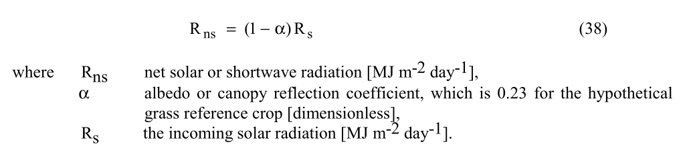
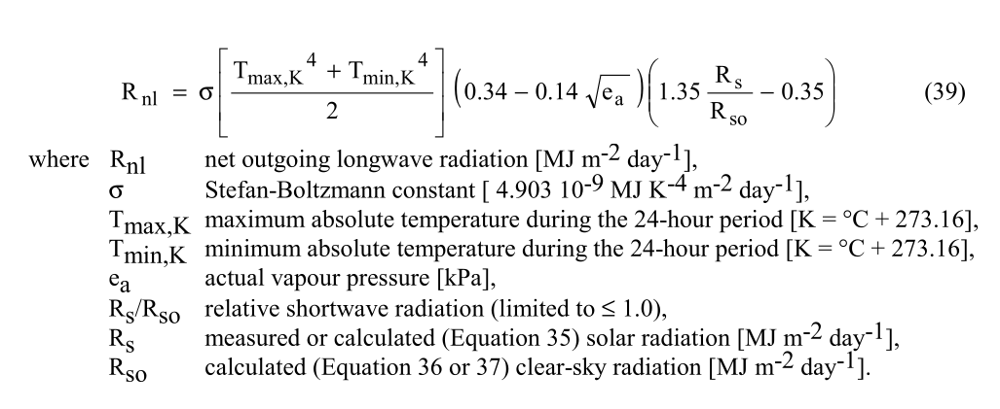
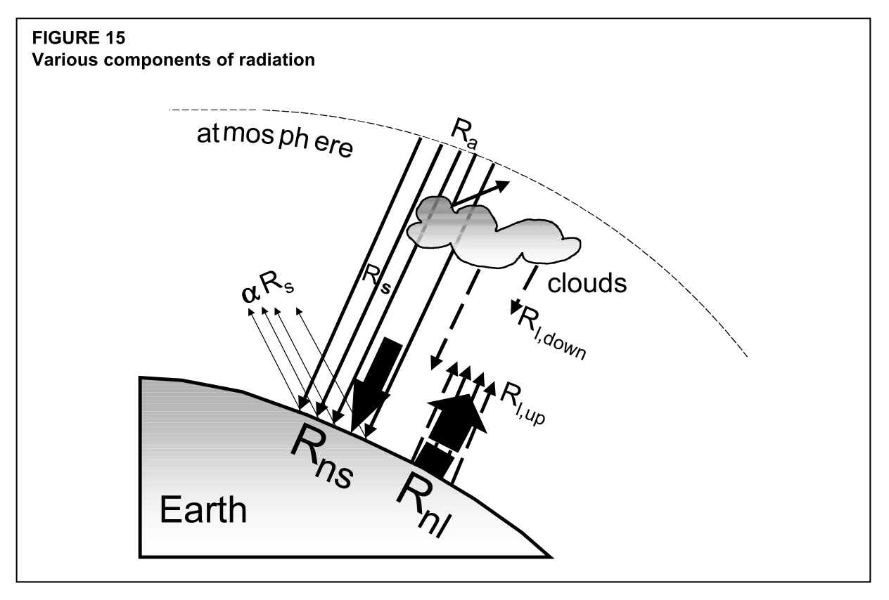
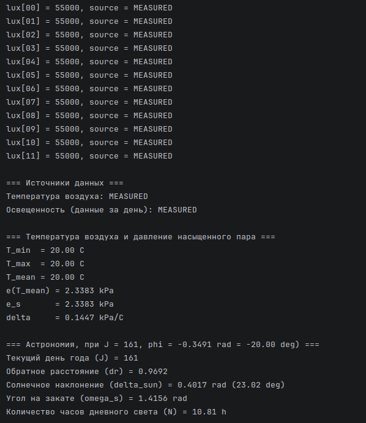
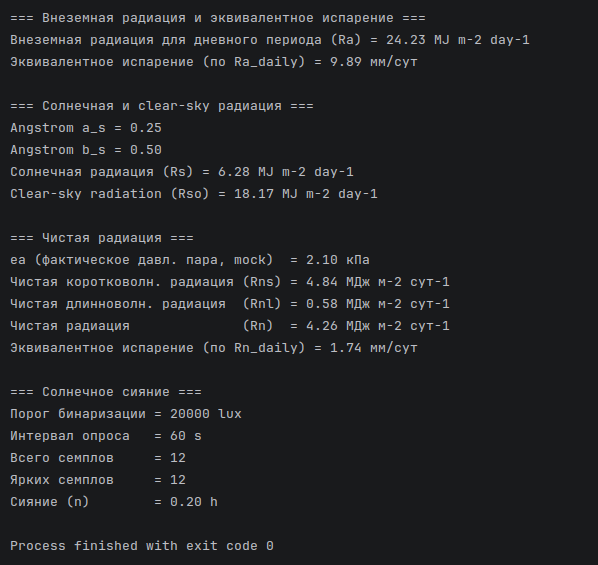
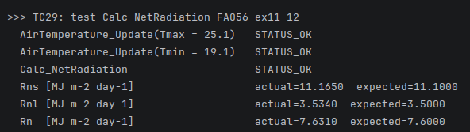

# devlog13. Модуль чистой радиации Rn и деривативы

*Implements the net radiation module: net shortwave radiation Rns (eq. 38, using the FAO-56 reference grass albedo of 0.23), net longwave radiation Rnl (eq. 39, Stefan–Boltzmann thermal emission corrected for humidity and cloudiness), and their combination into net radiation Rn (eq. 40). Includes an explanation of why each of Rnl’s three multiplicative factors behaves the way it does. Implementation clamps the cloudiness factor to avoid a physically impossible negative Rnl. Four new tests (29–32) verify against FAO-56 worked examples 11 and 12 (Rio de Janeiro), matching within tolerances explicitly justified by the documentation’s own intermediate rounding.*

* * *

## Обзор уравнений

На этом шаге мы собираемся разработать модуль для вычисления **чистой радиации** *R<sub>n</sub>* и деривативов *R<sub>ns</sub>, R<sub>nl</sub>*. Будем вычислять все в единой функции `Calc_NetRadiation()`.


* * *

#### R<sub>ns</sub>

*R<sub>ns</sub>* (eq. 38) - **чистая коротковолновая радиация**, она равна входящей солнечной радиации *R<sub>s</sub>* за вычетом отраженной. **Альбедо** *α* = 0.23, согласно стандарту *FAO56* для эталонной гипотетической культуры (низкая трава). В нашей архитектуре это *Type B* константа, то есть часть свойств модели и вычислительного ядра, но не параметров развертки.

> В будущем, однако, в слой конфигурации вероятно нужно будет вывести функционал для удобного изменения этой части вычислительного ядра (модели), поскольку адаптация модели под конкретную культуру, очевидно, необходима.



* * *

#### R<sub>nl</sub>

*R<sub>nl</sub>* (eq. 39) - **чистая длинноволновая радиация**. Пожалуй, наиболее сложное уравнение блока радиации.




Здесь перемножаются три независимых корректирующих фактора (подробнее см. ниже):

- **тепловой поток**, ***σ * (T<sub>max, K</sub><sup>4</sup> + T<sub>min, K</sub><sup>4</sup> ) / 2*** - абсолютные температуры, четвертая степень по [закону Стефана-Больцмана](https://en.wikipedia.org/wiki/Stefan%E2%80%93Boltzmann_law);
- поправка на влажность: ***(0.34 - 0.14√e<sub>a</sub>)*** - влага поглощает исходящее длинноволновое, уменьшает *R<sub>nl</sub>*;
- поправка на облачность: ***(1.35 * R<sub>s</sub>/R<sub>so</sub> - 0.35)*** - облака возвращают длинноволновое обратно.

> *Nota bene.* В уравнении, приводимом *FAO56*, постоянная Стефана-Больцмана выражается в переводе с Ватт на Джоули:
>
> - *1 W = 1 J/s = (86400 / 10<sup>6</sup>) MJ/day = 0.0864 MJ/day*,
> - *σ = 5.670374419 * 10<sup>-8</sup> * 0.0864 = 4.8992 * 10<sup>-9</sup> MJ m<sup>-2</sup> day<sup>-1</sup> K<sup>-4</sup>,*
> - *σ ≈ 4.903 * 10<sup>-9</sup> MJ K<sup>-4</sup> m<sup>-2</sup> day<sup>-1</sup>*.

* * *

#### e<sub>a</sub>

*e<sub>a</sub>* - **фактическое давление пара** (*actual vapour pressure*). Использование этого значения в уравнении *R<sub>nl</sub>* предполагает реализацию **новой функции** в модуле `vapour-pressure-calc`, а также новый **модуль `air-humidity-read`**, который пока - в ПК версии - будет работать с эмуляцией значений, поступающих от датчика.

* * *

## Порядок действий

Как видно, для реализации вычисления *R<sub>n</sub>* требуется провести ряд разработок. Можно провести их в различном порядке: например, сперва создать модуль чтения влажности, затем обновить модуль давления, и только потом вернуться к завершению блока радиации.

Мы, однако, пойдем следующим путем: все же первым делом закончим блок радиации и протестируем его вычислительное ядро. Для этого временно будем имитировать поступающее значение влажности - прямо в файле оркестрации (как делали это раньше). Затем мы создадим модуль чтения влажности и добавим нужные вычисления в файл вычисления давления - и сразу же заменим имитацию в `main.c` на нужную нам архитектурную связь с модулем чтения данных датчиков (пусть и эмулируемых данных).

Разобъем эти действия на два шага, на два девлога соответственно.

1. **Текущий шаг и девлог** -> разработка радиационного модуля:

- создать `net-radiation-calc.h` и `net-radiation-calc.c`,
- добавить их в `CMakeLists.txt`,
- добавить изменения в `main.c` (`include`, переменная, инициализация, вызов, вывод) - с *mock*-значением `ea_kpa = 2.1`,
- добавить константы в `test-config.h` (секция *TC29-32*),
- добавить *TC29-32* в `main-test.c` и `RUN_TEST(...)` в `main()`,
- запустить `fao56_app` и `fao56_test`.

2. **Следующий шаг и девлог** -> разработка модуля влажности и функций давления (а также - сразу - модуля психрометрии):

- создать `air-humidity-read.h` и `air-humidity-read.c`,
- создать `psychrometric-calc.h` и `psychrometric-calc.c`,
- добавить оба модуля в `CMakeLists.txt`,
- добавить `Calc_SaturationVapourPressure()` и `Calc_ActualVapourPressure()` в `vapour-pressure-calc.h/.c`,
- обновить `main.c` - добавить новые `include`, переменные, чтение влажности, вызовы `Calc_AtmosphericParameters()` и `Calc_ActualVapourPressure()`, убрать имитацию `ea_kpa = 2.1`,
- добавить константы в `test-config.h` (секция *TC33-38*),
- добавить *TC33-38* в `main-test.c`,
- запустить `fao56_app` и `fao56_test`.

* * *

## Объяснение физического смысла *R<sub>nl</sub>*

Прежде чем переходить к разработке модуля чистой радиации *R<sub>n</sub>* и деривативов, кратко поясним, в чем состоит физический процесс, который мы будем вычислять в уравнении *R<sub>nl</sub>*.

Уравнение *R<sub>nl</sub>* (eq. 39) показывает, сколько *тепловой* энергии земная поверхность **теряет** в атмосферу в форме **длинноволнового** излучения за сутки, с учетом температуры воздуха, влажности и облачности. Вспомним здесь схему, которую мы уже приводили ранее.



Любое тело с температурой выше абсолютного нуля непрерывно излучает энергию в виде электромагнитных волн. Чем тело горячее, тем интенсивнее и короче излучаемые волны. Солнце излучает электромагнитные волны в видимом диапазоне (коротковолновое излучение). Земная поверхность и атмосфера, нагретые до десятков градусов Цельсия, излучают в инфракрасном диапазоне (длинноволновое излучение). Именно это и показывает уравнение *R<sub>nl</sub>* (eq. 39).

Согласно **закону Стефана–Больцмана** ([*Stefan–Boltzmann law*](https://en.wikipedia.org/wiki/Stefan%E2%80%93Boltzmann_law)), *тепловой поток, излучаемый абсолютно черным телом, пропорционален четвертой степени его абсолютной температуры*.

> Физический смысл четвертой степени температуры не то чтобы интуитивно понятен. Эта степень возникает из интегрирования по всему спектру длин волн.

Рассмотрим три множителя уравнения *R<sub>nl</sub>* (eq. 39), приведенного выше.

**Первый множитель** уравнения ***σ * (T<sub>max, K</sub><sup>4</sup> + T<sub>min, K</sub><sup>4</sup> ) / 2*** - это средний за сутки тепловой поток абсолютно черного тела при температуре воздуха. Температуры берутся в Кельвинах, поскольку абсолютная температура - физически значимая величина: при ***T = 0 К*** излучение отсутствует полностью. Среднее по ***T<sup>4</sup><sub>max</sub>*** и ***T<sup>4</sup><sub>min</sub>*** взято вместо ***T<sup>4</sup><sub>mean</sub>*** потому, что функция нелинейна - из-за четвертой степени результат чувствителен к максимальным значениям; в данном случае это эмпирическая аппроксимация.

**Второй множитель** уравнения ***(0.34 - 0.14√e<sub>a</sub>)*** - это поправка на влажность. Водяной пар поглощает часть исходящего длинноволнового излучения и переизлучает его обратно. Чем больше воды в воздухе (то есть чем выше e<sub>a</sub>), тем меньший *нетто*-поток тепла переизлучается в космос. Квадратный корень отражает нелинейную зависимость, установленную эмпирически: влажность снижает *R<sub>nl</sub>* нелинейно, насыщение уменьшает эффект каждого дополнительного молекулярного слоя пара.

**Третий множитель** уравнения ***(1.35 * R<sub>s</sub>/R<sub>so</sub> - 0.35)*** - это поправка на облачность. Облака, как и пар, поглощают исходящее с поверхности Земли длинноволновое излучение и переизлучают обратно вниз. Чем меньше солнечного света достигло поверхности по сравнению с максимально возможным (R<sub>s</sub>/R<sub>so</sub> -> 0), тем плотнее облачный покров, тем меньше уходит длинноволнового излучения (тепла) вверх. При ясном небе (R<sub>s</sub>/R<sub>so</sub> -> 1) множитель -> 1.0, при сплошной облачности он стремится к отрицательным значениям.

> В нашей программе этот множитель ограничивается снизу нулем.

Земля излучает тепло непрерывно, в том числе ночью, поэтому *R<sub>nl</sub>* входит в *R<sub>n</sub>* даже при нулевой солнечной радиации.

* * *

## Напишем подмодуль `net-radiation-calc`

### `net-radiation-calc.h`

```C
#ifndef NET_RADIATION_CALC_H
#define NET_RADIATION_CALC_H

#ifdef __cplusplus
extern "C" {
#endif

#include <stdbool.h>
#include "solar-radiation-calc.h"
#include "../../03-validation/status.h"
#include "../041-air-temperature-calc/air-temperature-calc.h"

/* =============================================================================
 * Альбедо эталонной культуры (FAO56, eq. 38).
 * Type B: константа математической модели.
 * α = 0.23 - эталонное значение для гипотетического травяного покрова.
 * ============================================================================= */
#define GRASS_ALBEDO (0.23)

/* =============================================================================
 * Константа Стефана–Больцмана (FAO56, eq. 39).
 * σ = 4.903 * 10-⁹ МДж К-⁴ м-² сут-¹.
 * Получена из СИ-значения (5.67 * 10-⁸ Вт м-² К-⁴) пересчетом в МДж/сут.
 * ============================================================================= */
#define STEFAN_BOLTZMANN (4.903e-9)

/* =============================================================================
 * Перевод °C -> K (FAO56 использует 273.16, а не 273.15).
 * ============================================================================= */
#define CELSIUS_TO_KELVIN (273.16)

/* Вычисляемые суточные значения чистой радиации */
typedef struct {
    double Rns_daily;   /* Чистая коротковолновая радиация [МДж м-2 сут-1] */
    double Rnl_daily;   /* Чистая длинноволновая радиация  [МДж м-2 сут-1] */
    double Rn_daily;    /* Чистая радиация                 [МДж м-2 сут-1] */
    bool   initialized; /* Структура инициализирована                      */
} NetRadiationData;

/* Инициализация структуры: обнуление полей, initialized = true */
Status NetRadiation_Init(NetRadiationData *data);

/* Расчет чистой радиации: FAO56 eq. 38, 39, 40.
 *
 * eq. 38: Rns = (1 - α) * Rs
 * eq. 39: Rnl = σ * [(Tmax,K⁴ + Tmin,K⁴) / 2] * (0.34 - 0.14√ea) * (1.35 * Rs / Rso - 0.35)
 * eq. 40: Rn  = Rns - Rnl
 *
 * Граничные случаи:
 *   - Rs/Rso ограничивается сверху 1.0 (FAO56 требование);
 *   - при Rso = 0 (полярная ночь): Rs/Rso = 0, деление на ноль исключено;
 *   - cloudiness factor ограничивается снизу 0, т.к. при очень пасмурном небе (Rs/Rso < 0.26)
 *     фактор стал бы отрицательным; следовательно, Rnl < 0, физически неверно.
 *
 * ea_kPa: фактическое давление пара [кПа]. */
Status Calc_NetRadiation(NetRadiationData *out,
    const AirTemperatureData *temp, const SolarRadiationData *solar, double ea_kPa);

#ifdef __cplusplus
}
#endif

#endif /* NET_RADIATION_CALC_H */
```

* * *

### `net-radiation-calc.c`

```C
#include <math.h>
#include <stddef.h>
#include "net-radiation-calc.h"

Status NetRadiation_Init(NetRadiationData *data) {
    if (data == NULL) {
        return STATUS_NULL_POINTER;
    }
    
    data->Rns_daily   = 0.0;
    data->Rnl_daily   = 0.0;
    data->Rn_daily    = 0.0;
    data->initialized = true;
    
    return STATUS_OK;
}

Status Calc_NetRadiation(NetRadiationData *out,
    const AirTemperatureData *temp, const SolarRadiationData *solar, const double ea_kPa) {

    /* Проверка NULL */
    if ((out == NULL) || (temp == NULL) || (solar == NULL)) {
        return STATUS_NULL_POINTER;
    }

    /* Проверка инициализации входных структур */
    if (!out->initialized || !temp->initialized || !solar->initialized) {
        return STATUS_INVALID_VALUE;
    }

    /* Проверка ea */
    if ((ea_kPa < 0.0) || !isfinite(ea_kPa)) {
        return STATUS_INVALID_VALUE;
    }

    /* Проверка значений радиации */
    if ((solar->Rs_daily < 0.0) || (solar->Rso_daily < 0.0)) {
        return STATUS_INVALID_VALUE;
    }

    /* =========================================================================
     * eq. 38: Rns = (1 - α) * Rs
     * α = GRASS_ALBEDO = 0.23 - для гипотетической эталонной культуры.
     * ========================================================================= */
    const double Rns = (1.0 - GRASS_ALBEDO) * solar->Rs_daily;

    /* =========================================================================
     * eq. 39: Rnl = σ * [(Tmax,K⁴ + Tmin,K⁴) / 2] * humidity * cloudiness
     * ========================================================================= */

    /* Перевод в Кельвины: FAO56 использует 273.16 */
    const double Tmax_K = temp->T_max_C + CELSIUS_TO_KELVIN;
    const double Tmin_K = temp->T_min_C + CELSIUS_TO_KELVIN;

    /* T⁴ через умножение, без использования pow() */
    const double Tmax_K2 = Tmax_K * Tmax_K;
    const double Tmin_K2 = Tmin_K * Tmin_K;
    const double sigma_T4_avg = STEFAN_BOLTZMANN * (((Tmax_K2 * Tmax_K2) + (Tmin_K2 * Tmin_K2)) / 2.0);

    /* Поправка на влажность: (0.34 - 0.14 * √ea).
     * При высокой влажности: ea↑ -> √ea↑ -> фактор↓ -> Rnl↓ (влага поглощает тепло). */
    const double humidity_factor = 0.34 - (0.14 * sqrt(ea_kPa));

    /* Отношение Rs/Rso - мера облачности.
     * Ограничение сверху: 1.0 (FAO56 требование, защита от шума датчика).
     * При Rso = 0 (полярная ночь) и Rs = 0 -> используем 0, деление исключено. */
    double Rs_over_Rso;

    if (solar->Rso_daily <= 0.0) {
        Rs_over_Rso = 0.0;
    } else {
        Rs_over_Rso = solar->Rs_daily / solar->Rso_daily;
        if (Rs_over_Rso > 1.0) {
            Rs_over_Rso = 1.0;
        }
    }

    /* Поправка на облачность: (1.35 * Rs/Rso - 0.35).
     * При ясном небе (Rs/Rso -> 1): фактор -> 1.0 -> Rnl максимален.
     * При сплошной облачности (Rs/Rso -> 0): фактор -> -0.35 -> ограничиваем до 0.
     * Отрицательный фактор означал бы Rnl < 0, что нереалистично для суточного временного шага. */
    double cloudiness_factor = (1.35 * Rs_over_Rso) - 0.35;

    if (cloudiness_factor < 0.0) {
        cloudiness_factor = 0.0;
    }

    const double Rnl = sigma_T4_avg * humidity_factor * cloudiness_factor;

    /* =========================================================================
     * eq. 40: Rn = Rns - Rnl
     * ========================================================================= */
    const double Rn = Rns - Rnl;

    /* Защита от NaN/inf */
    if (!isfinite(Rns) || !isfinite(Rnl) || !isfinite(Rn)) {
        return STATUS_INVALID_VALUE;
    }

    out->Rns_daily = Rns;
    out->Rnl_daily = Rnl;
    out->Rn_daily  = Rn;

    return STATUS_OK;
}
```

* * *

## Обновим файл оркестрации `main.c`

Включим новый **заголовок**:

```C
#include "../04-calculation/043-radiation-calc/net-radiation-calc.h"
```

Добавим **локальные переменные**:

```C
NetRadiationData  net_radiation;
const double      ea_kpa = 2.1;    /* Сейчас это лишь временный mock по FAO56 ex.11, который мы заменим на следующем шаге */
```

Добавим **инициализацию** (после `SolarRadiation_Init`):

```C
status = NetRadiation_Init(&net_radiation);
if (status != STATUS_OK) {
    return PrintStatusAndReturn("Ошибка инициализации NetRadiationData: ", status);
}
```

Добавим **вычисление** (после `SolarRadiation_Calc`):

```C
status = Calc_NetRadiation(&net_radiation, &temperature_data, &solar_radiation, ea_kpa);
if (status != STATUS_OK) {
    return PrintStatusAndReturn("Ошибка расчета чистой радиации (Rn): ", status);
}
```

Добавим **вывод** (после секции солнечной радиации):

```C
    (void)printf("\n=== Чистая радиация ===\n");
    (void)printf("ea (фактическое давл. пара, mock)  = %.2f кПа\n",   ea_kpa);
    (void)printf("Чистая коротковолн. радиация (Rns) = %.2f МДж м-2 сут-1\n", net_radiation.Rns_daily);
    (void)printf("Чистая длинноволн. радиация  (Rnl) = %.2f МДж м-2 сут-1\n", net_radiation.Rnl_daily);
    (void)printf("Чистая радиация              (Rn)  = %.2f МДж м-2 сут-1\n", net_radiation.Rn_daily);
    (void)printf("Эквивалентное испарение (по Rn_daily) = %.2f мм/сут\n", net_radiation.Rn_daily * 0.408);  /* По eq. 20 */
```

> Разумеется, новые файлы следует также добавить и в список источников для сборки в файле `CMakeLists.txt`.

* * *

## Запустим проверку

  


> Напомним, что, запуская файл оркестрации, мы проверяем работу конвейера вычислений, контрактов и т.д., но не вычисления на основе эталонных значений по *FAO56* - проверки последнего требуют ручных настроек, и поэтому проводятся в модуле тестирования. Кратко напомню, почему это так: после введения модуля, поставляющего для вычислений текущую календарную дату, мы хотим держать этот *production*-функционал в порядке и избегаем ради частных проверок вручную подставлять нужные нам даты по *FAO56*. Последнее удобнее проверять в модуле тестирования.

* * *

## Обновим файл тестовых конфигураций `test-config.h`

Добавим новый блок **макросов**.

```C
/* -----------------------------------------------------------------------------
 * TC29-32: Чистая радиация Rns, Rnl, Rn - FAO56 ex. 11, ex. 12
 *
 * TC29 (основной): Рио-де-Жанейро, май.
 *   Входные данные из ex. 11 и ex. 10:
 *     T_max = 25.1°C, T_min = 19.1°C, ea = 2.1 кПа,
 *     Rs = 14.5, Rso = 18.8 МДж м-2 сут-1.
 *   Эталон (ex.11, ex.12):
 *     Rns = (1 - 0.23) * 14.5 = 11.1 МДж м-2 сут-1,
 *     Rnl = 3.5 МДж м-2 сут-1,
 *     Rn  = 7.6 МДж м-2 сут-1.
 * ----------------------------------------------------------------------------- */
#define TEST_EX11_TMAX_C              (25.1)    /* °C - T_max для Rnl            */
#define TEST_EX11_TMIN_C              (19.1)    /* °C - T_min для Rnl            */
#define TEST_EX11_EA_KPA              (2.1)     /* кПа - фактическое давл. пара  */
#define TEST_EX11_RNL_EXPECTED        (3.5)     /* МДж м-2 сут-1                 */
#define TEST_EX12_RNS_EXPECTED        (11.1)    /* МДж м-2 сут-1                 */
#define TEST_EX12_RN_EXPECTED         (7.6)     /* МДж м-2 сут-1                 */

/* Допуски: FAO56 округляет промежуточные значения, наш код - нет.
Разница обусловлена накоплением округлений в примерах документа. */
#define TOL_RNS  (0.10)   /* МДж м-2 сут-1 - eq. 38 */
#define TOL_RNL  (0.15)   /* МДж м-2 сут-1 - eq. 39 (T⁴ накапливает округление)  */
#define TOL_RN   (0.20)   /* МДж м-2 сут-1 - eq. 40 (сумма двух округлений)      */
```

* * *

## Обновим файл тестирования `main-test.c`

Добавим новый **заголовок**.

```C
#include "../04-calculation/043-radiation-calc/net-radiation-calc.h"
```

Добавим новые **тестовые наборы** (после *TC28*).

```C
/* *** TC29-32: Чистая радиация - eq. 38, 39, 40 *** */

/* TC29: FAO56 ex. 11 (Rnl) и ex. 12 (Rns, Rn) - Рио-де-Жанейро, май.
 *
 * Входные данные из ex. 11:
 *   T_max = 25.1°C, T_min = 19.1°C, ea = 2.1 кПа.
 * Значения Rs/Rso взяты из ex. 10.
 *
 * Проверяет:
 *   STATUS_OK, Rns ≈ 11.1, Rnl ≈ 3.5, Rn ≈ 7.6 МДж м-2 сут-1. */
static void test_Calc_NetRadiation_FAO56_ex11_12(void) {
    (void)printf("\n>>> TC29: %s\n", __func__);

    /* Температура: два измерения задают T_max и T_min */
    AirTemperatureData temp;
    AirTemperature_Init(&temp);

    AssertStatus("AirTemperature_Update(Tmax = 25.1)",
        AirTemperature_Update(&temp, TEST_EX11_TMAX_C, 0U), STATUS_OK);
    AssertStatus("AirTemperature_Update(Tmin = 19.1)",
        AirTemperature_Update(&temp, TEST_EX11_TMIN_C, 1U), STATUS_OK);

    /* Из известных значений ex.10 тестируем eq. 39 изолированно */
    SolarRadiationData solar;
    SolarRadiation_Init(&solar);
    solar.Rs_daily  = TEST_EX10_RS_EXPECTED;   /* 14.5 МДж м-2 сут-1 */
    solar.Rso_daily = TEST_EX10_RSO_EXPECTED;  /* 18.8 МДж м-2 сут-1 */

    NetRadiationData net;
    NetRadiation_Init(&net);

    AssertStatus("Calc_NetRadiation",
        Calc_NetRadiation(&net, &temp, &solar, TEST_EX11_EA_KPA), STATUS_OK);

    AssertDouble("Rns [MJ m-2 day-1]", net.Rns_daily, TEST_EX12_RNS_EXPECTED, TOL_RNS);
    AssertDouble("Rnl [MJ m-2 day-1]", net.Rnl_daily, TEST_EX11_RNL_EXPECTED, TOL_RNL);
    AssertDouble("Rn  [MJ m-2 day-1]", net.Rn_daily,  TEST_EX12_RN_EXPECTED,  TOL_RN);
}

/* TC30: Calc_NetRadiation - STATUS_NULL_POINTER для каждого аргумента */
static void test_Calc_NetRadiation_NullPointer(void) {
    (void)printf("\n>>> TC30: %s\n", __func__);

    AirTemperatureData temp;  AirTemperature_Init(&temp);
    SolarRadiationData solar; SolarRadiation_Init(&solar);
    NetRadiationData   net;   NetRadiation_Init(&net);

    AssertStatus("Calc_NetRadiation(out=NULL)",
        Calc_NetRadiation(NULL,  &temp,  &solar, 2.0), STATUS_NULL_POINTER);

    AssertStatus("Calc_NetRadiation(temp=NULL)",
        Calc_NetRadiation(&net,  NULL,   &solar, 2.0), STATUS_NULL_POINTER);

    AssertStatus("Calc_NetRadiation(solar=NULL)",
        Calc_NetRadiation(&net,  &temp,  NULL,   2.0), STATUS_NULL_POINTER);
}

/* TC31: Calc_NetRadiation - STATUS_INVALID_VALUE при temp не инициализирован.
 * AirTemperature_Init устанавливает initialized = false.
 * Без вызова AirTemperature_Update данные температуры не готовы. */
static void test_Calc_NetRadiation_UninitializedTemp(void) {
    (void)printf("\n>>> TC31: %s\n", __func__);

    AirTemperatureData temp;  AirTemperature_Init(&temp);   /* initialized = false */
    SolarRadiationData solar; SolarRadiation_Init(&solar);

    solar.Rs_daily  = TEST_EX10_RS_EXPECTED;
    solar.Rso_daily = TEST_EX10_RSO_EXPECTED;

    NetRadiationData   net;   NetRadiation_Init(&net);

    /* temp.initialized = false -> STATUS_INVALID_VALUE */
    AssertStatus("Calc_NetRadiation(temp uninitialized)",
        Calc_NetRadiation(&net, &temp, &solar, 2.0), STATUS_INVALID_VALUE);
}

/* TC32: Calc_NetRadiation - STATUS_INVALID_VALUE при невалидном ea (ea < 0 физически невозможно, давление пара ≥ 0). */
static void test_Calc_NetRadiation_InvalidEa(void) {
    (void)printf("\n>>> TC32: %s\n", __func__);

    AirTemperatureData temp;
    AirTemperature_Init(&temp);

    AssertStatus("Update(Tmax)", AirTemperature_Update(&temp, TEST_EX11_TMAX_C, 0U), STATUS_OK);
    AssertStatus("Update(Tmin)", AirTemperature_Update(&temp, TEST_EX11_TMIN_C, 1U), STATUS_OK);

    SolarRadiationData solar; SolarRadiation_Init(&solar);
    solar.Rs_daily  = TEST_EX10_RS_EXPECTED;
    solar.Rso_daily = TEST_EX10_RSO_EXPECTED;

    NetRadiationData   net; NetRadiation_Init(&net);

    AssertStatus("Calc_NetRadiation(ea=-0.5)",
        Calc_NetRadiation(&net, &temp, &solar, -0.5), STATUS_INVALID_VALUE);
}
```

Обновим **`main()`**.

```C
/* Чистая радиация */
RUN_TEST(test_Calc_NetRadiation_FAO56_ex11_12);
RUN_TEST(test_Calc_NetRadiation_NullPointer);
RUN_TEST(test_Calc_NetRadiation_UninitializedTemp);
RUN_TEST(test_Calc_NetRadiation_InvalidEa);
```

> Поскольку это модуль тестирования, а не оркестрации, стоит добавить этот блок в конце - после блока геолокации, чтобы порядок нумерации тестовых наборов в выводе не нарушался.

* * *

## Запустим проверку

Согласно документации *FAO56 ex. 11-12*, ожидаемые значения:

```md
Tmax,K = 25.1 + 273.16 = 298.26 K
Tmin,K = 19.1 + 273.16 = 292.26 K

σTmax,K⁴   = 4.903e-9 * 298.26⁴    = 38.8 МДж м-2 сут-1    (FAO56: 38.8 ✓)
σTmin,K⁴   = 4.903e-9 * 292.26⁴    = 35.8 МДж м-2 сут-1    (FAO56: 35.8 ✓)
avg        = (38.8 + 35.8) / 2     = 37.3 МДж м-2 сут-1

humidity   = 0.34 - 0.14 * √2.1    = 0.34 - 0.203 = 0.137  (FAO56: 0.14 ✓)
Rs/Rso     = 14.5 / 18.8           = 0.771                 (FAO56: 0.77 ✓)
cloudiness = 1.35 * 0.771 - 0.35   = 0.691                 (FAO56: 0.69 ✓)

Rnl = 37.3  * 0.137 * 0.691  = 3.53 МДж м-2 сут-1          (FAO56: 3.5  ✓)
Rns = 0.77  * 14.5           = 11.17 МДж м-2 сут-1         (FAO56: 11.1 ✓)
Rn  = 11.17 - 3.53           = 7.64 МДж м-2 сут-1          (FAO56: 7.6  ✓)
```

  

