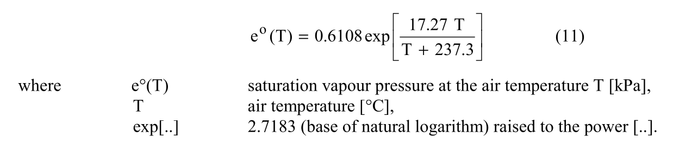
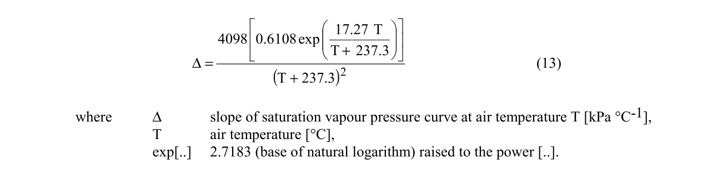
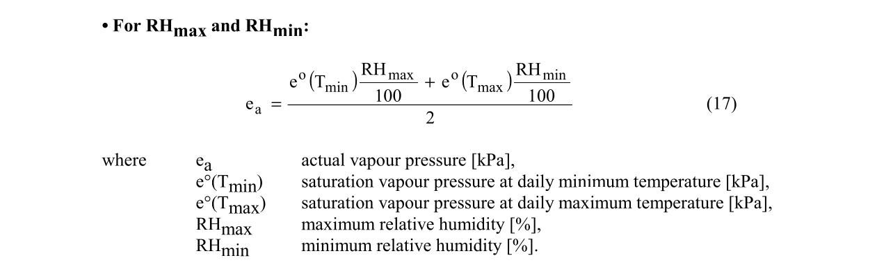
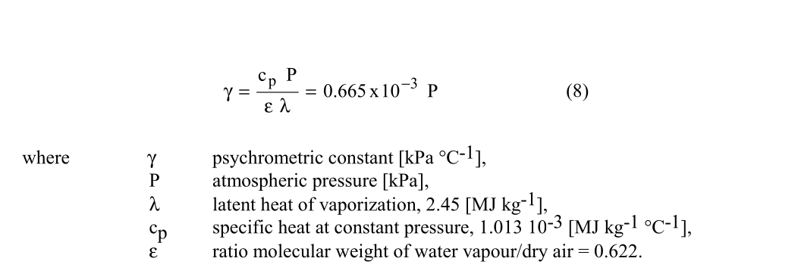
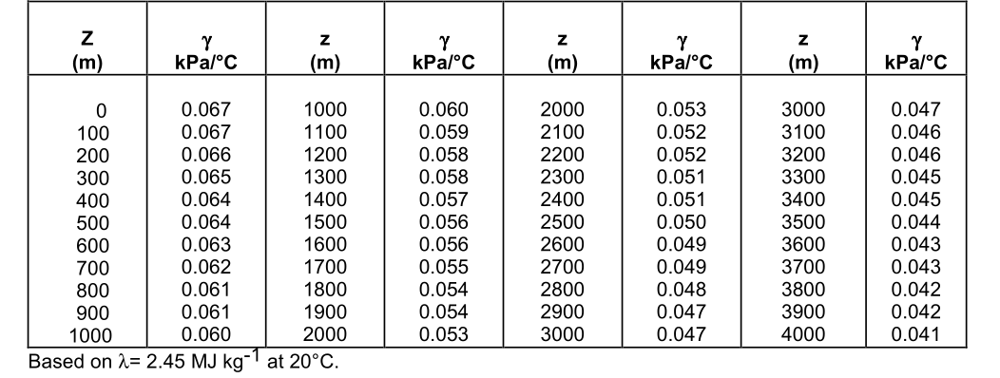
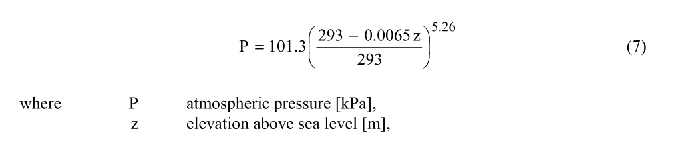
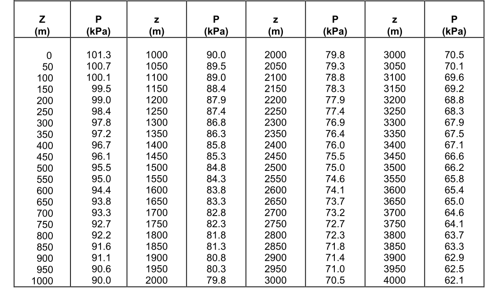
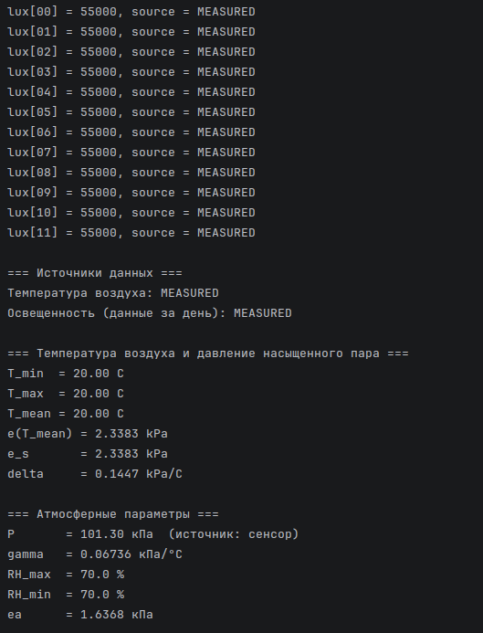
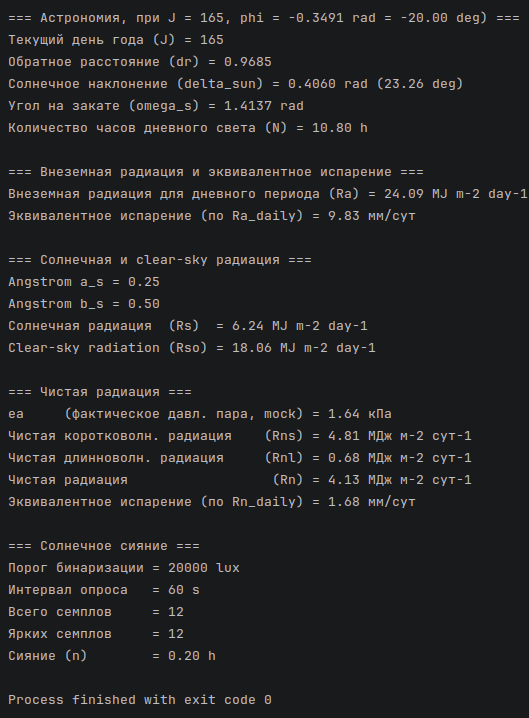

# devlog14. Атмосферные модули и функции

## Текущие задачи

Мы хотим на этом шаге и в этом девлоге разработать **модуль влажности** и **функции давления**, кроме того, также и **модуль атмосферных параметров**. Итак, мы хотим здесь:

- создать `air-humidity-read.h/.c` для чтения данных,
- создать `air-humidity-calc.h/.c` для вычисляемых значений влажности,
- создать модуль `atmospheric-calc` с файлами `psychrometric-calc.h/.c` и `atm-pressure-model.h/.c`,
- добавить все это в `CMakeLists.txt`,
- добавить `Calc_SaturationVapourPressure()` и `Calc_ActualVapourPressure()` в `vapour-pressure-calc.h/.c`,
- обновить `main.c` - добавить новые `include`, переменные, чтение влажности, вызовы `Calc_AtmosphericParameters()` и `Calc_ActualVapourPressure()`, убрать имитацию `ea_kpa = 2.1`,
- добавить константы в `test-config.h` (секция *TC33-38*),
- добавить *TC33-38* в `main-test.c`,
- запустить `fao56_app` и `fao56_test`.

* * *

## Напишем модуль чтения влажности воздуха

В слое измерений создадим модуль измерения относительной влажности воздуха `01-measurement/013-air-humidity-read/air-humidity-read.h/.c`. На этапе ПК версии мы оперируем эмулируемыми значениями для данных датчиков. Модуль по своей структуре и логике аналогичен модулю чтения температуры воздуха: его задача - только читать непосредственно измеренное значение относительной влажности воздуха, обрабатывать и сохранять его, передавать дальше - в модуль вычисляемых значений относительной влажности воздуха.

* * *

### `air-humidity-read.h`

```C
#ifndef AIR_HUMIDITY_READ_H
#define AIR_HUMIDITY_READ_H

#ifdef __cplusplus
extern "C" {
#endif

#include <stdint.h>
#include "../../03-validation/033-status/status.h"
#include "../../03-validation/031-value-source/value-source.h"

/* Структура хранения мгновенного значения относительной влажности воздуха */
typedef struct {
    double            RH_pct;     /* Относительная влажность воздуха [%]   */
    uint32_t          timestamp;  /* Метка времени [с]                     */
    SensorValueSource source;     /* Источник данных                       */
} AirHumiditySample;

/* Чтение мгновенного значения влажности */
Status SensorHumidity_ReadInstant(AirHumiditySample *out_sample);

/* Fallback-значение при недоступности основного источника */
Status SensorHumidity_ReadDefault(AirHumiditySample *out_sample);

#ifdef __cplusplus
}
#endif

#endif /* AIR_HUMIDITY_READ_H */
```

* * *

### `air-humidity-read.c`

```C
#include <time.h>
#include <stddef.h>
#include "air-humidity-read.h"

/* Mock на ПК - типичная дневная влажность умеренного климата,
 * на МК заменить драйверным вызовом датчика */
#define SENSOR_MOCK_INSTANT_RH_PCT        (70.0)
#define SENSOR_DEFAULT_INSTANT_RH_PCT     (70.0)
#define SENSOR_HUMIDITY_DEFAULT_TIMESTAMP (0U)

Status SensorHumidity_ReadInstant(AirHumiditySample *out_sample) {
    if (out_sample == NULL) {
        return STATUS_NULL_POINTER;
    }

    out_sample->RH_pct    = SENSOR_MOCK_INSTANT_RH_PCT;
    out_sample->timestamp = (uint32_t)time(NULL);
    out_sample->source    = SENSOR_VALUE_MEASURED;

    return STATUS_OK;
}

Status SensorHumidity_ReadDefault(AirHumiditySample *out_sample) {
    if (out_sample == NULL) {
        return STATUS_NULL_POINTER;
    }

    out_sample->RH_pct    = SENSOR_DEFAULT_INSTANT_RH_PCT;
    out_sample->timestamp = SENSOR_HUMIDITY_DEFAULT_TIMESTAMP;
    out_sample->source    = SENSOR_VALUE_DEFAULT;

    return STATUS_OK;
}
```

* * *

## Напишем модуль вычисления влажности воздуха

Отношение этого модуля к модулю чтения непосредственных значений датчика влажности такое же, как отношение между модулем чтения температуры воздуха и модулем вычисляемых значений температуры воздуха. Здесь мы хотим получать, хранить и вычислять читаемые значения так, чтобы получать минимальное, максимальное и среднее значение влажности за сутки.

В слое вычислений создадим модуль относительной влажности воздуха `04-calculation/044-air-humidity-calc/air-humidity-calc.h/.c`

* * *

### `air-humidity-calc.h`

```C
#ifndef AIR_HUMIDITY_CALC_H
#define AIR_HUMIDITY_CALC_H

#ifdef __cplusplus
extern "C" {
#endif

#include <stdint.h>
#include <stdbool.h>
#include "../../03-validation/status.h"

/* Накопленные суточные значения относительной влажности.
 * Логика аналогична AirTemperatureData:
 *   AirHumidity_Init()   -> initialized = false
 *   AirHumidity_Update() -> накапливает min/max/mean, initialized = true */
typedef struct {
    double   RH_max;      /* Максимальная суточная влажность [%]  */
    double   RH_min;      /* Минимальная суточная влажность [%]   */
    double   RH_mean;     /* Средняя суточная влажность [%]       */
    uint32_t timestamp;   /* Время последнего обновления          */
    bool     initialized;
} AirHumidityData;

/* Инициализация структуры, STATUS_OK: обнулено, initialized = false */
Status AirHumidity_Init(AirHumidityData *data);

/* Обновление суточных min/max/mean по одному мгновенному измерению.
 * RH_pct: относительная влажность [0, 100], первый корректный вход инициализирует min и max */
Status AirHumidity_Update(AirHumidityData *data, double RH_pct, uint32_t timestamp);

#ifdef __cplusplus
}
#endif

#endif /* AIR_HUMIDITY_CALC_H */
```

* * *

### `air-humidity-calc.c`

```C
#include <stddef.h>
#include "air-humidity-calc.h"

Status AirHumidity_Init(AirHumidityData *data) {
    if (data == NULL) {
        return STATUS_NULL_POINTER;
    }

    data->RH_max      = 0.0;
    data->RH_min      = 0.0;
    data->RH_mean     = 0.0;
    data->timestamp   = 0U;
    data->initialized = false;

    return STATUS_OK;
}

Status AirHumidity_Update(AirHumidityData *data, const double RH_pct, const uint32_t timestamp) {
    if (data == NULL) {
        return STATUS_NULL_POINTER;
    }

    if ((RH_pct < 0.0) || (RH_pct > 100.0)) {
        return STATUS_INVALID_VALUE;
    }

    data->timestamp = timestamp;

    /* Первый корректный вход - инициализация min и max */
    if (!data->initialized) {
        data->RH_max      = RH_pct;
        data->RH_min      = RH_pct;
        data->initialized = true;
    } else {
        if (RH_pct > data->RH_max) {
            data->RH_max = RH_pct;
        }
        if (RH_pct < data->RH_min) {
            data->RH_min = RH_pct;
        }
    }

    data->RH_mean = (data->RH_max + data->RH_min) / 2.0;

    return STATUS_OK;
}
```

* * *

## Реорганизуем и обновим файловую структуру и `CMakeList`

```md
FAO56-CALC-PROJECT
|
├─ 01-measurement
│   ├─ 011-air-temperature-read
│   ├─ 012-air-humidity-read       # Новый модуль (см. выше)
│   ├─ 013-atm-pressure-read       # Новый модуль (см. ниже)
│   └─ 014-sunshine-lux-read
|
├─ 02-providers
│   ├─ 021-date-provider
│   └─ 022-configurations
│       └─ deployment-config.h
│
├─ 03-validation
│   ├─ 031-value-source
│   ├─ 032-validation
│   └─ 033-status
│
├─ 04-calculation
│   ├─ 041-air-temperature-calc
│   ├─ 042-air-humidity-calc       # Новый модуль  (см. выше)
│   ├─ 043-vapour-pressure-calc    # Новые функции (см. ниже)
│   ├─ 044-atmospheric-calc        # Новый модуль  (см. ниже)
│   |    ├─ psychrometric-calc.h
│   |    ├─ psychrometric-calc.c
│   |    ├─ atm-pressure-model.h
│   |    └─ atm-pressure-model.c
│   └─ 045-radiation-calc
│
├─ 05-orchestration
│   └─ main.c
│
├─ 06-test
│   ├─ test-config.h
│   └─ main-test.c
│
└─ CMakeLists.txt
```

* * *

```CMake
cmake_minimum_required(VERSION 4.1)
project(FAO56 C)

set(CMAKE_C_STANDARD 11)

### ## # Исходные файлы, используемые для обеих целей # ## ###
set(FAO56_SOURCES
        01-measurement/011-air-temperature-read/air-temperature-read.c
        01-measurement/011-air-temperature-read/air-temperature-read.h

        01-measurement/012-air-humidity-read/air-humidity-read.c
        01-measurement/012-air-humidity-read/air-humidity-read.h

        01-measurement/013-atm-pressure-read/atm-pressure-read.c
        01-measurement/013-atm-pressure-read/atm-pressure-read.h

        01-measurement/014-sunshine-lux-read/sunshine-lux-read.c
        01-measurement/014-sunshine-lux-read/sunshine-lux-read.h

        02-providers/021-date-provider/date-provider.c
        02-providers/021-date-provider/date-provider.h

        02-providers/022-configurations/deployment-config.h

        03-validation/031-value-source/value-source.c
        03-validation/031-value-source/value-source.h

        03-validation/032-validation/validation.c
        03-validation/032-validation/validation.h

        03-validation/033-status/status.c
        03-validation/033-status/status.h

        04-calculation/041-air-temperature-calc/air-temperature-calc.c
        04-calculation/041-air-temperature-calc/air-temperature-calc.h

        04-calculation/042-air-humidity-calc/air-humidity-calc.c
        04-calculation/042-air-humidity-calc/air-humidity-calc.h

        04-calculation/043-vapour-pressure-calc/vapour-pressure-calc.c
        04-calculation/043-vapour-pressure-calc/vapour-pressure-calc.h

        04-calculation/044-atmospheric-calc/atm-pressure-model.c
        04-calculation/044-atmospheric-calc/atm-pressure-model.h

        04-calculation/044-atmospheric-calc/psychrometric-calc.c
        04-calculation/044-atmospheric-calc/psychrometric-calc.h

        04-calculation/045-radiation-calc/geolocation-calc.c
        04-calculation/045-radiation-calc/geolocation-calc.h

        04-calculation/045-radiation-calc/day-in-year-calc.c
        04-calculation/045-radiation-calc/day-in-year-calc.h

        04-calculation/045-radiation-calc/sunshine-lux-calc.c
        04-calculation/045-radiation-calc/sunshine-lux-calc.h

        04-calculation/045-radiation-calc/extrater-radiation-calc.c
        04-calculation/045-radiation-calc/extrater-radiation-calc.h

        04-calculation/045-radiation-calc/solar-radiation-calc.c
        04-calculation/045-radiation-calc/solar-radiation-calc.h

        04-calculation/045-radiation-calc/net-radiation-calc.c
        04-calculation/045-radiation-calc/net-radiation-calc.h
)

### ## # Target 1: production binary [orchestration] # ## ###
add_executable(fao56_app
        ${FAO56_SOURCES}
        05-orchestration/main.c
)

target_link_libraries(fao56_app m)

### ## # Target 2: test binary [unity] # ## ###
include(FetchContent)

FetchContent_Declare(
        unity
        GIT_REPOSITORY https://github.com/ThrowTheSwitch/Unity.git
        GIT_TAG        v2.6.0
)

FetchContent_MakeAvailable(unity)

add_executable(fao56_test
        ${FAO56_SOURCES}
        06-test/test-config.h
        06-test/main-test.c
)

target_link_libraries(fao56_test m unity)
target_compile_definitions(unity PUBLIC UNITY_INCLUDE_DOUBLE)

# CTest
enable_testing()
add_test(NAME fao56_suite COMMAND fao56_test)
```

* * *

## Обновим функции в модуле `vapour-pressure-calc`

Теперь мы можем улучшить вычисления давления пара и разработать функцию вычисления **фактического давления насыщенного пара**.

* * *

### Сперва сделаем пояснения

Напомним, что сейчас в модуле давления пара у нас есть три публичные функции:

- `Calc_SaturationVapourPressureForTmean()`,
- `Calc_MeanSaturationVapourPressure()`,
- `Calc_SlopeDelta()`.

И одна приватная функция:

- `Calc_TetensSaturationPressure()`.

Приватная функция высчитывает *e<sup>o</sup>(T)* (eq. 11) для некой температуры - эту функцию использует функция `Calc_SaturationVapourPressureForTmean()`, подставляя на место "некой температуры" значение средней температуры воздуха.



Эту же приватную функцию `Calc_TetensSaturationPressure()` используют и две другие публичные функции.

`Calc_MeanSaturationVapourPressure()` вызывает ее, чтобы записать в две переменные значения *e<sup>o</sup>(T)* для минимальной и максимальной температуры соответственно - это нужно для вычисления  *e<sub>s</sub>* (eq. 12).


`Calc_SlopeDelta()` вызывает `Calc_TetensSaturationPressure()`, чтобы вычислить с ее помощью дельту, используя значение средней температуры воздуха (eq. 13).



Как видим, иметь отдельная функция `Calc_SaturationVapourPressureForTmean()` не нужна, поскольку можно иметь универсальную функцию `Calc_SaturationVapourPressure()`, которая в аргумент запишет нужную температуру, вызвав `Calc_TetensSaturationPressure()`.

Однако прежде чем заменять старую, работающую функцию новой, лучше сперва напишем новую и проверим ее работу - в данном случае `Calc_SaturationVapourPressureForTmean()` работе не помешает. Удалить ее можно будет позднее.

Так что мы хотим **написать функцию для *e<sup>o</sup>(T)*** (eq. 11) и **написать функцию для *e<sub>a</sub>*** (eq. 17):



* * *

### Создадим функции в `vapour-pressure-calc`

#### `vapour-pressure-calc.h`

```C
#ifndef VAPOUR_PRESSURE_CALC_H
#define VAPOUR_PRESSURE_CALC_H

#ifdef __cplusplus
extern "C" {
#endif

#include "../041-air-temperature-calc/air-temperature-calc.h"
#include "../042-air-humidity-calc/air-humidity-calc.h"
#include "../../03-validation/033-status/status.h"

/* Давление насыщенного пара для средней температуры воздуха, e(Tmean) (eq. 11) */
Status Calc_SaturationVapourPressureForTmean(const AirTemperatureData* Tdata, double* out_kPa);

/* Давление насыщенного пара e(T) при произвольной T (eq. 11) */
Status Calc_SaturationVapourPressure(double T_c, double *e_sat_kPa);

/* Среднее давление насыщенного пара (eq. 12), e_s = (e(T_max) + e(T_min)) / 2 */
Status Calc_MeanSaturationVapourPressure(const AirTemperatureData* Tdata, double* out_kPa);

/* Delta = slope of saturation vapour pressure curve, нужно использовать T_mean */
Status Calc_SlopeDelta(const AirTemperatureData* Tdata, double* out_kPa_per_C);

/* Фактическое давление пара из накопленных суточных RH (eq. 17):
 * ea = [e(Tmin) * RHmax/100 + e(Tmax) * RHmin/100] / 2 */
Status Calc_ActualVapourPressure(double *ea_kPa, const AirTemperatureData *temp, const AirHumidityData *humidity);

#ifdef __cplusplus
}
#endif

#endif /* VAPOUR_PRESSURE_CALC_H */
```

* * *

#### `vapour-pressure-calc.c`

```C
#include <math.h>
#include <stddef.h>
#include "vapour-pressure-calc.h"
#include "../../03-validation/032-validation/validation.h"

/* Константы для расчета e(T) и slope of SVP curve */
#define TETENS_CONST_A      (0.6108)        /* Константа уравнения Тетенса e(T) по FAO56 */
#define TETENS_CONST_B      (17.27)         /* Константа уравнения Тетенса e(T) по FAO56 */
#define TETENS_CONST_C      (237.3)         /* Константа уравнения Тетенса e(T) по FAO56 */
#define SVP_CS_CONST_D      (4098.0)        /* Константа уравнения slope of SVP curve */
// #define LOG_BASE_CONST       (2.7183)        /* Константа основания натурального логарифма */

/* Внутренняя (непубличная) вспомогательная функция - вычисление уравнения Магнуса-Тетенса (eq. 11) */
static double Calc_TetensSaturationPressure(const double temperature_c) {
    const double exp_term = (TETENS_CONST_B * temperature_c) / (temperature_c + TETENS_CONST_C);
    return TETENS_CONST_A * exp(exp_term);
}

/* Давление насыщенного пара для средней температуры, e(T_mean) (eq. 11) */
Status Calc_SaturationVapourPressureForTmean(const AirTemperatureData* Tdata, double* out_kPa) {
    if ((Tdata == NULL) || (out_kPa == NULL)) {
        return STATUS_NULL_POINTER;
    }

    if ((Tdata->initialized == false) || (!ValidTemperatureC(Tdata->T_mean_C))) {
        return STATUS_INVALID_VALUE;
    }

    *out_kPa = Calc_TetensSaturationPressure(Tdata->T_mean_C);

    return STATUS_OK;
}

/* Давление насыщенного пара e(T) при произвольной T (eq. 11) */
Status Calc_SaturationVapourPressure(const double T_c, double *e_sat_kPa) {
    if (e_sat_kPa == NULL) {
        return STATUS_NULL_POINTER;
    }
    
    if (!isfinite(T_c)) {
        return STATUS_INVALID_VALUE;
    }
    
    *e_sat_kPa = Calc_TetensSaturationPressure(T_c);
    
    return STATUS_OK;
}

/* Среднее давление насыщенного пара (eq. 12), e_s = (e(T_max) + e(T_min)) / 2 */
Status Calc_MeanSaturationVapourPressure(const AirTemperatureData* Tdata, double* out_kPa) {
    if ((Tdata == NULL) || (out_kPa == NULL)) {
        return STATUS_NULL_POINTER;
    }

    if ((Tdata->initialized == false) || (!ValidTemperatureC(Tdata->T_max_C)) || (!ValidTemperatureC(Tdata->T_min_C))) {
        return STATUS_INVALID_VALUE;
    }

    const double e_Tmax = Calc_TetensSaturationPressure(Tdata->T_max_C);
    const double e_Tmin = Calc_TetensSaturationPressure(Tdata->T_min_C);
    *out_kPa = (e_Tmax + e_Tmin) / 2.0;

    return STATUS_OK;
}

/* Delta = slope of saturation vapour pressure curve, использует T_mean (eq. 13) */
Status Calc_SlopeDelta(const AirTemperatureData* Tdata, double* out_kPa_per_C) {
    if ((Tdata == NULL) || (out_kPa_per_C == NULL)) {
        return STATUS_NULL_POINTER;
    }

    if ((Tdata->initialized == false) || (!ValidTemperatureC(Tdata->T_mean_C))) {
        return STATUS_INVALID_VALUE;
    }

    const double e_Tmean = Calc_TetensSaturationPressure(Tdata->T_mean_C);
    const double denom = (Tdata->T_mean_C + TETENS_CONST_C) * (Tdata->T_mean_C + TETENS_CONST_C);

    if (denom == 0.0) {
        return STATUS_INVALID_VALUE;
    }

    *out_kPa_per_C = (SVP_CS_CONST_D * e_Tmean) / denom;

    return STATUS_OK;
}

/* Фактическое давление пара из накопленных суточных RH (eq. 17) */
Status Calc_ActualVapourPressure(double *ea_kPa, const AirTemperatureData *temp, const AirHumidityData *humidity) {
    if ((ea_kPa == NULL) || (temp == NULL) || (humidity == NULL)) {
        return STATUS_NULL_POINTER;
    }
    
    if (!temp->initialized || !humidity->initialized) {
        return STATUS_INVALID_VALUE;
    }

    double e_min = 0.0;
    double e_max = 0.0;

    Status s = Calc_SaturationVapourPressure(temp->T_min_C, &e_min);
    if (s != STATUS_OK) {
        return s;
    }

    s = Calc_SaturationVapourPressure(temp->T_max_C, &e_max);
    if (s != STATUS_OK) {
        return s;
    }

    /* ea = [e(Tmin) * RHmax/100 + e(Tmax) * RHmin/100] / 2 */
    const double ea = (e_min * (humidity->RH_max / 100.0) + e_max * (humidity->RH_min / 100.0)) / 2.0;

    if (!isfinite(ea) || (ea < 0.0)) {
        return STATUS_INVALID_VALUE;
    }
    
    *ea_kPa = ea;
    
    return STATUS_OK;
}
```

* * *

## Напишем блок атмосферных параметров

Под блоком атмосферных параметров мы имеем в виду следующее:

- **модуль чтения атмосферного давления** (непосредственных значений давления),
- модуль вычисления атмосферных параметров, а именно **подмодуль психрометрических вычислений** и **подмодуль вычисления атмосферного давления согласно модели** *FAO56*.

* * *

### Замечание об архитектуре и *fallback*-логике

Поясним кратко, почему здесь такая асимметрия в сравнении, например, с модулями температуры воздуха или влажности воздуха.

Дело в том, что модель вычисления психрометрической константы по *FAO56* предполагает использовать значение атмосферного давления *P* (eq. 8; ann. 2, tab. 2.2):

  


В то же время давление *P* читается сенсором. В нашей архитектуре мы "привычно" снабжаем функции чтения непосредственных значений какого-либо датчика (`read_Instant()`) функциями, обеспечивающими *fallback*-логику (`read_Default()`), нужными на случай, если данные сенсора недоступны или ненадежны. И здесь документация *FAO56* прямо указывает вычисляемое эталонное значение *P* как функции высоты *z* (eq. 7; ann. 2, tab. 2.1):

  


Дело в том, что в нашей архитектуре мы не хотим, руководствуясь *fallback*-логикой, введенной для надежности, **вносить вычисления в модуль чтения**, подрывая суть надежности нашей архитектуры. Стало быть, мы хотим перенести вычисляемые значения в какое-то отдельное место. Однако тогда, если это вычисление берет на себя функцию *fallback*-логики, "страховочные значения" на случай проблем с датчиком находятся отдельно от слоя, который должен поставлять данные непосредственных значений давления - будь они прочитанными реально, эмулированными или "дефолтными" по происхождению, - поставлять в другие модули, как правило ... модули вычисляемых значений.

**Мы пришли к следующему решению.** Модуль чтения непосредственных значений атмосферного давления `atm-pressure-read`,"как и положено" (в рамках нашей архитектуры), будет использовать функции как собственно чтения - `read_Instant()`, так и введения значений по умолчанию - `read_Default()`. В то же время создадим подмодуль в слое вычислений, который будет вычислять и хранить значение *P* на основе рекомендуемых процедур *FAO56*. Таким образом, мы будем иметь **три возможных источника** *P*, которые в порядке приоритета от высшего к низшему мы определим следующим образом:

- сенсор и функция `SensorPressure_ReadInstant()` -> непосредственное значение (для ПК-версии - *mock*-константа);

- модель *FAO56 (eq.7)* и функция `Calc_PressureFromElevation()` -> вычисление *P* как функции высоты будет использоваться, когда сенсор недоступен или данные повреждены;

- константа в модуле чтения и функция `SensorPressure_ReadDefault()` -> "абсолютный" *fallback* будет использоваться как последний уровень защиты.

**Выбор источника** определяется (*to provide*) в процессе оркестрации в файле `main.c` - ни измерительный, ни вычислительный слои ничего об этом не знают.

Итак, это на первый взгляд отклонение от нашей архитектуры является прямым следствием тех требований, которые мы к ней выдвигали, - оно сохраняет (функциональную) суть нашей архитектуры.

* * *

### Напишем модуль чтения атмосферного давления

#### `atm-pressure-read.h`

```C
#ifndef ATM_PRESSURE_READ_H
#define ATM_PRESSURE_READ_H

#ifdef __cplusplus
extern "C" {
#endif

#include <stdint.h>
#include "../../03-validation/033-status/status.h"
#include "../../03-validation/031-value-source/value-source.h"

/* Структура хранения мгновенного значения атмосферного давления.
 *
 * В МК версии SensorPressure_ReadInstant() заменяется драйверным вызовом.
 * Fallback-иерархия давления задается в оркестрации:
 *   1. SensorPressure_ReadInstant()     -> реальный сенсор
 *   2. Calc_PressureFromElevation()     -> см. atm-pressure-model.h/.c
 *   3. SensorPressure_ReadDefault()     -> абсолютная последняя защита */
typedef struct {
    double            P_kPa;      /* Атмосферное давление [кПа] */
    uint32_t          timestamp;  /* Метка времени              */
    SensorValueSource source;     /* Источник данных            */
} AtmPressureSample;

/* Чтение мгновенного значения давления */
Status SensorPressure_ReadInstant(AtmPressureSample *out_sample);

/* Fallback: стандартное давление на уровне моря - если и сенсор, и модель недоступны */
Status SensorPressure_ReadDefault(AtmPressureSample *out_sample);

#ifdef __cplusplus
}
#endif

#endif /* ATM_PRESSURE_READ_H */
```

* * *

#### `atm-pressure-read.c`

```C
#include <time.h>
#include <stddef.h>
#include "atm-pressure-read.h"

/* Mock: давление на уровне моря */
#define SENSOR_MOCK_P_KPA                 (101.3)
#define SENSOR_DEFAULT_P_KPA              (101.3)
#define SENSOR_PRESSURE_DEFAULT_TIMESTAMP (0U)

Status SensorPressure_ReadInstant(AtmPressureSample *out_sample) {
    if (out_sample == NULL) {
        return STATUS_NULL_POINTER;
    }

    out_sample->P_kPa     = SENSOR_MOCK_P_KPA;
    out_sample->timestamp = (uint32_t)time(NULL);
    out_sample->source    = SENSOR_VALUE_MEASURED;

    return STATUS_OK;
}

Status SensorPressure_ReadDefault(AtmPressureSample *out_sample) {
    if (out_sample == NULL) {
        return STATUS_NULL_POINTER;
    }

    out_sample->P_kPa     = SENSOR_DEFAULT_P_KPA;
    out_sample->timestamp = SENSOR_PRESSURE_DEFAULT_TIMESTAMP;
    out_sample->source    = SENSOR_VALUE_DEFAULT;

    return STATUS_OK;
}
```

* * *

### Напишем подмодуль вычисления давления согласно модели *FAO56*

#### `atm-pressure-model.h`

```C
#ifndef ATM_PRESSURE_MODEL_H
#define ATM_PRESSURE_MODEL_H

#ifdef __cplusplus
extern "C" {
#endif

#include "../../03-validation/033-status/status.h"

/* =============================================================================
 * Модельный расчет атмосферного давления из высоты над уровнем моря.
 * FAO56 eq.7: P = 101.3 * [(293 - 0.0065z) / 293]^5.26
 *
 * Используется как fallback, когда барометрический сенсор недоступен.
 * FAO56: "The effect is, however, small and in the calculation procedures,
 *         the average value for a location is sufficient."
 * ============================================================================= */

/* Eq.7: расчет атмосферного давления как функции высоты [м] */
Status Calc_PressureFromElevation(double elevation_m, double *P_kPa);

#ifdef __cplusplus
}
#endif

#endif /* ATM_PRESSURE_MODEL_H */
```

* * *

#### `atm-pressure-model.c`

```C
#include <math.h>
#include <stddef.h>
#include "atm-pressure-model.h"

Status Calc_PressureFromElevation(const double elevation_m, double *P_kPa) {
    if (P_kPa == NULL) {
        return STATUS_NULL_POINTER;
    }

    /* Практический диапазон: -500 м ... +6000 м.
     * Формула: (293 - 0.0065z) > 0 при z < 45077 м - всегда выполняется. */
    if ((elevation_m < -500.0) || (elevation_m > 6000.0)) {
        return STATUS_INVALID_VALUE;
    }

    const double factor = (293.0 - (0.0065 * elevation_m)) / 293.0;
    if (factor <= 0.0) {
        return STATUS_INVALID_VALUE;
    }

    const double P = 101.3 * pow(factor, 5.26);        /* eq. 7 */
    if (!isfinite(P) || (P <= 0.0)) {
        return STATUS_INVALID_VALUE;
    }

    *P_kPa = P;
    
    return STATUS_OK;
}
```

* * *

### Напишем подмодуль вычисления психрометрической постоянной

#### `psychrometric-calc.h`

```C
#ifndef PSYCHROMETRIC_CALC_H
#define PSYCHROMETRIC_CALC_H

#ifdef __cplusplus
extern "C" {
#endif

#include <stdbool.h>
#include "../../03-validation/033-status/status.h"

/* Коэффициент упрощенной формы eq. 8: γ = 0.000665 * P */
#define PSYCHROMETRIC_GAMMA_COEFF (0.000665)

/* Структура атмосферных параметров,
 * P_kPa заполняется оркестрацией, выбор источника: сенсор -> модель eq. 7 -> константа */
typedef struct {
    double P_kPa;            /* Атмосферное давление [кПа]           */
    double gamma_kPa_per_C;  /* Психрометрическая константа [кПа/°C] */
    bool   initialized;
} AtmosphericData;

/* Инициализация структуры */
Status AtmosphericData_Init(AtmosphericData *data);

/* Расчет γ из P (eq. 8): γ = 0.000665 * P.
 * Функция принимает P_kPa как double и она не знает источник P.
 * Функция записывает P_kPa в структуру, чтобы P и γ хранились как пара. */
Status Calc_AtmosphericParameters(AtmosphericData *out, double P_kPa);

#ifdef __cplusplus
}
#endif

#endif /* PSYCHROMETRIC_CALC_H */
```

* * *

#### `psychrometric-calc.c`

```C
#include <math.h>
#include <stddef.h>
#include "psychrometric-calc.h"

Status AtmosphericData_Init(AtmosphericData *data) {
    if (data == NULL) {
        return STATUS_NULL_POINTER;
    }

    data->P_kPa           = 0.0;
    data->gamma_kPa_per_C = 0.0;
    data->initialized     = true;

    return STATUS_OK;
}

Status Calc_AtmosphericParameters(AtmosphericData *out, const double P_kPa) {
    if (out == NULL) {
        return STATUS_NULL_POINTER;
    }

    if (!out->initialized) {
        return STATUS_INVALID_VALUE;
    }

    /* Проверка диапазона давления: 50-120 кПа (с большим запасом) */
    if ((P_kPa < 50.0) || (P_kPa > 120.0) || !isfinite(P_kPa)) {
        return STATUS_INVALID_VALUE;
    }

    /* Eq. 8: γ = c_p * P / (ε * λ) ≈ 0.000665 * P */
    const double gamma = PSYCHROMETRIC_GAMMA_COEFF * P_kPa;

    if (!isfinite(gamma)) {
        return STATUS_INVALID_VALUE;
    }

    out->P_kPa           = P_kPa;
    out->gamma_kPa_per_C = gamma;

    return STATUS_OK;
}
```

* * *

## Обновим файл оркестрации `main.c`

Добавим **заголовки**.

```C
#include "../01-measurement/012-air-humidity-read/air-humidity-read.h"
#include "../01-measurement/013-atm-pressure-read/atm-pressure-read.h"
#include "../04-calculation/042-air-humidity-calc/air-humidity-calc.h"
#include "../04-calculation/044-atmospheric-calc/atm-pressure-model.h"
#include "../04-calculation/044-atmospheric-calc/psychrometric-calc.h"
```

Добавим **локальные переменные**.

```C
AirHumiditySample  humidity_sample;
AirHumidityData    humidity_data;
AtmPressureSample  pressure_sample;
AtmosphericData    atmos_data;
double             ea_kpa = 0.0;    /* Заменить этим строку const double ea_kpa = 2.1; */
double             P_source_kPa = 0.0;
```

Добавим **инициализацию**.

```C
status = AirHumidity_Init(&humidity_data);
if (status != STATUS_OK) {
    return PrintStatusAndReturn("Ошибка инициализации AirHumidityData: ", status);
}

status = AtmosphericData_Init(&atmos_data);
if (status != STATUS_OK) {
    return PrintStatusAndReturn("Ошибка инициализации AtmosphericData: ", status);
}
```

Обновим **слой измерений**.

```C
    /* Влажность воздуха */
    status = SensorHumidity_ReadInstant(&humidity_sample);
    if (status != STATUS_OK) {
        (void)fprintf(stderr, "Нет данных влажности воздуха, используем значение по умолчанию. Причина: %s\n", Status_ToString(status));
        status = SensorHumidity_ReadDefault(&humidity_sample);

        if (status != STATUS_OK) {
            return PrintStatusAndReturn(
                "Критическая ошибка чтения данных влажности воздуха по умолчанию: ", status);
        }
    }

    status = AirHumidity_Update(&humidity_data, humidity_sample.RH_pct, humidity_sample.timestamp);
    if (status != STATUS_OK) {
        return PrintStatusAndReturn(
            "Ошибка обновления данных влажности воздуха: ", status);
    }

    /* Атмосферное давление (приоритет источников P) */
    status = SensorPressure_ReadInstant(&pressure_sample);
    if (status == STATUS_OK) {
        /* Источник 1: сенсор */
        P_source_kPa = pressure_sample.P_kPa;
    } else {
        /* Источник 2: модель eq. 7 - предпочтительный fallback */
        (void)fprintf(stderr, "Сенсор давления недоступен (%s). Используем модель eq.7.\n", Status_ToString(status));
        status = Calc_PressureFromElevation(location.elevation_m, &P_source_kPa);

        if (status != STATUS_OK) {
            /* Источник 3: последний уровень fallback */
            (void)fprintf(stderr, "Модель eq.7 недоступна (%s). Используем константу.\n", Status_ToString(status));
            (void)SensorPressure_ReadDefault(&pressure_sample);

            P_source_kPa = pressure_sample.P_kPa;
        }
    }
```

Обновим **слой вычислений**.

```C
/* Психрометрическая константа из P (eq. 8) */
status = Calc_AtmosphericParameters(&atmos_data, P_source_kPa);
if (status != STATUS_OK) {
    return PrintStatusAndReturn(
        "Ошибка расчета психрометрической константы: ", status);
}

/* Фактическое давление пара ea (eq. 17) */
status = Calc_ActualVapourPressure(&ea_kpa, &temperature_data, &humidity_data);
if (status != STATUS_OK) {
    return PrintStatusAndReturn(
        "Ошибка расчета фактического давления пара (ea): ", status);
}
```

Обновим **вывод**.

```C
(void)printf("\n=== Атмосферные параметры ===\n");
(void)printf("P       = %.2f кПа  (источник: %s)\n", atmos_data.P_kPa,
             (pressure_sample.source == SENSOR_VALUE_MEASURED) ? "сенсор" :
             "модель/константа");
(void)printf("gamma   = %.5f кПа/°C\n", atmos_data.gamma_kPa_per_C);
(void)printf("RH_max  = %.1f %%\n",     humidity_data.RH_max);
(void)printf("RH_min  = %.1f %%\n",     humidity_data.RH_min);
(void)printf("ea      = %.4f кПа\n",    ea_kpa);
```

* * *

### Проведем проверку

  


* * *

## Обновим файлы конфигурации тестов и тестирования

#### `test-config.h`

```C
/* -----------------------------------------------------------------------------
 * TC33-TC40: Влажность воздуха, атмосферное давление, психрометрия, давление пара
 *
 * TC33: AirHumidity_Update - накопление min/max/mean (из значений ex. 5)
 * TC34: Calc_PressureFromElevation - уровень моря
 * TC35: Calc_PressureFromElevation - FAO56 ex. 2 (z = 1800 м)
 * TC36: Calc_AtmosphericParameters - уровень моря
 * TC37: Calc_AtmosphericParameters - FAO56 ex. 2
 * TC38: NULL pointer (Calc_PressureFromElevation, Calc_AtmosphericParameters)
 * TC39: Calc_SaturationVapourPressure - FAO56 ex. 3
 * TC40: Calc_ActualVapourPressure - FAO56 ex. 5
 * ----------------------------------------------------------------------------- */

/* TC33: накопление влажности (значения из FAO56 ex. 5) */
#define TEST_EX5_RH_MAX               (82.0)    /* % */
#define TEST_EX5_RH_MIN               (54.0)    /* % */
#define TEST_RH_MEAN_EXPECTED         (68.0)    /* % - (82 + 54) / 2 */

/* TC34-35: Calc_PressureFromElevation */
#define TEST_P_SEA_LEVEL_EXPECTED     (101.3)   /* кПа */
#define TEST_EX2_ELEVATION_M          (1800.0)  /* м   */
#define TEST_EX2_P_EXPECTED           (81.8)    /* кПа */

/* TC36-37: Calc_AtmosphericParameters */
#define TEST_GAMMA_SEA_LEVEL_EXPECTED (0.0674)  /* кПа/°C */
#define TEST_EX2_GAMMA_EXPECTED       (0.054)   /* кПа/°C */

/* TC39: Calc_SaturationVapourPressure - FAO56 ex. 3 */
#define TEST_EX3_TMAX_C               (24.5)    /* °C  */
#define TEST_EX3_TMIN_C               (15.0)    /* °C  */
#define TEST_EX3_E_TMAX_EXPECTED      (3.075)   /* кПа */
#define TEST_EX3_E_TMIN_EXPECTED      (1.705)   /* кПа */

/* TC40: Calc_ActualVapourPressure - FAO56 ex. 5 */
#define TEST_EX5_TMIN_C               (18.0)    /* °C  */
#define TEST_EX5_TMAX_C               (25.0)    /* °C  */
#define TEST_EX5_EA_EXPECTED          (1.70)    /* кПа */

/* Допуски */
#define TOL_P      (0.10)   /* кПа    */
#define TOL_GAMMA  (0.002)  /* кПа/°C */
#define TOL_E_SAT  (0.005)  /* кПа    */
#define TOL_EA     (0.010)  /* кПа    */
```

* * *

#### `main-test.c`

```C
#include "../01-measurement/012-air-humidity-read/air-humidity-read.h"
#include "../04-calculation/042-air-humidity-calc/air-humidity-calc.h"
#include "../04-calculation/044-atmospheric-calc/atm-pressure-model.h"
#include "../04-calculation/044-atmospheric-calc/psychrometric-calc.h"
```

```C
/* *** TC33-TC40: Влажность воздуха, атмосферное давление, психрометрия, давление пара *** */

/* TC33: AirHumidity_Update - накопление min/max/mean.
 * Два входа: 82% (утро) и 54% (день) -> RH_max = 82, RH_min = 54, RH_mean = 68. */
static void test_AirHumidity_Update_MinMaxTracking(void) {
    (void)printf("\n>>> TC33: %s\n", __func__);

    AirHumidityData data;
    AirHumidity_Init(&data);

    AssertStatus("AirHumidity_Update(82%)", AirHumidity_Update(&data, TEST_EX5_RH_MAX, 0U), STATUS_OK);
    AssertDouble("RH_max после 1го", data.RH_max, TEST_EX5_RH_MAX, 0.001);
    AssertDouble("RH_min после 1го", data.RH_min, TEST_EX5_RH_MAX, 0.001);

    AssertStatus("AirHumidity_Update(54%)", AirHumidity_Update(&data, TEST_EX5_RH_MIN, 1U), STATUS_OK);
    AssertDouble("RH_max",  data.RH_max,  TEST_EX5_RH_MAX,        0.001);
    AssertDouble("RH_min",  data.RH_min,  TEST_EX5_RH_MIN,        0.001);
    AssertDouble("RH_mean", data.RH_mean, TEST_RH_MEAN_EXPECTED,  0.001);
}

/* TC34: Calc_PressureFromElevation - уровень моря: P = 101.3 кПа */
static void test_Calc_PressureFromElevation_SeaLevel(void) {
    (void)printf("\n>>> TC34: %s\n", __func__);

    double P = 0.0;
    AssertStatus("Calc_PressureFromElevation(z = 0)", Calc_PressureFromElevation(TEST_ELEVATION_SEA_LEVEL, &P), STATUS_OK);
    AssertDouble("P [кПа]", P, TEST_P_SEA_LEVEL_EXPECTED, TOL_P);
}

/* TC35: Calc_PressureFromElevation - FAO56 ex. 2: z = 1800м -> P = 81.8 кПа */
static void test_Calc_PressureFromElevation_FAO56_ex2(void) {
    (void)printf("\n>>> TC35: %s\n", __func__);

    double P = 0.0;
    AssertStatus("Calc_PressureFromElevation(z = 1800)", Calc_PressureFromElevation(TEST_EX2_ELEVATION_M, &P), STATUS_OK);
    AssertDouble("P [кПа]", P, TEST_EX2_P_EXPECTED, TOL_P);
}

/* TC36: Calc_AtmosphericParameters - уровень моря: P = 101.3 -> γ ≈ 0.0674 */
static void test_Calc_AtmosphericParameters_SeaLevel(void) {
    (void)printf("\n>>> TC36: %s\n", __func__);

    AtmosphericData atmos;
    AtmosphericData_Init(&atmos);

    AssertStatus("Calc_AtmosphericParameters(P = 101.3)", Calc_AtmosphericParameters(&atmos, TEST_P_SEA_LEVEL_EXPECTED), STATUS_OK);
    AssertDouble("P [кПа]",        atmos.P_kPa,           TEST_P_SEA_LEVEL_EXPECTED,     TOL_P);
    AssertDouble("gamma [кПа/°C]", atmos.gamma_kPa_per_C, TEST_GAMMA_SEA_LEVEL_EXPECTED, TOL_GAMMA);
}

/* TC37: Calc_AtmosphericParameters - FAO56 ex. 2: P = 81.8 -> γ = 0.054 */
static void test_Calc_AtmosphericParameters_FAO56_ex2(void) {
    (void)printf("\n>>> TC37: %s\n", __func__);

    AtmosphericData atmos;
    AtmosphericData_Init(&atmos);

    AssertStatus("Calc_AtmosphericParameters(P = 81.8)", Calc_AtmosphericParameters(&atmos, TEST_EX2_P_EXPECTED), STATUS_OK);
    AssertDouble("P [кПа]",        atmos.P_kPa,           TEST_EX2_P_EXPECTED,     TOL_P);
    AssertDouble("gamma [кПа/°C]", atmos.gamma_kPa_per_C, TEST_EX2_GAMMA_EXPECTED, TOL_GAMMA);
}

/* TC38: NULL pointer - Calc_PressureFromElevation и Calc_AtmosphericParameters */
static void test_Calc_AtmosphericParameters_NullPointer(void) {
    (void)printf("\n>>> TC38: %s\n", __func__);

    AssertStatus("Calc_PressureFromElevation(NULL)", Calc_PressureFromElevation(0.0, NULL),         STATUS_NULL_POINTER);
    AssertStatus("Calc_AtmosphericParameters(NULL)", Calc_AtmosphericParameters(NULL, 101.3), STATUS_NULL_POINTER);
}

/* TC39: Calc_SaturationVapourPressure - FAO56 ex. 3 - e°(24.5°C) = 3.075 кПа, e°(15.0°C) = 1.705 кПа */
static void test_Calc_SaturationVapourPressure_FAO56_ex3(void) {
    (void)printf("\n>>> TC39: %s\n", __func__);

    double e_max = 0.0;
    double e_min = 0.0;

    AssertStatus("Calc_SVP(Tmax = 24.5)", Calc_SaturationVapourPressure(TEST_EX3_TMAX_C, &e_max), STATUS_OK);
    AssertDouble("e°(Tmax) [кПа]", e_max, TEST_EX3_E_TMAX_EXPECTED, TOL_E_SAT);

    AssertStatus("Calc_SVP(Tmin = 15.0)", Calc_SaturationVapourPressure(TEST_EX3_TMIN_C, &e_min), STATUS_OK);
    AssertDouble("e°(Tmin) [кПа]", e_min, TEST_EX3_E_TMIN_EXPECTED, TOL_E_SAT);
}

/* TC40: Calc_ActualVapourPressure - FAO56 ex. 5 - Tmin = 18°C, Tmax = 25°C, RHmax = 82%, RHmin = 54% -> ea = 1.70 кПа */
static void test_Calc_ActualVapourPressure_FAO56_ex5(void) {
    (void)printf("\n>>> TC40: %s\n", __func__);

    /* Температура: два вхождения задают T_max и T_min */
    AirTemperatureData temp;
    AirTemperature_Init(&temp);

    AssertStatus("Update(Tmax = 25)", AirTemperature_Update(&temp, TEST_EX5_TMAX_C, 0U), STATUS_OK);
    AssertStatus("Update(Tmin = 18)", AirTemperature_Update(&temp, TEST_EX5_TMIN_C, 1U), STATUS_OK);

    /* Влажность: два вхождения задают RH_max и RH_min */
    AirHumidityData humidity;
    AirHumidity_Init(&humidity);

    AssertStatus("Update(RHmax = 82)", AirHumidity_Update(&humidity, TEST_EX5_RH_MAX, 0U), STATUS_OK);
    AssertStatus("Update(RHmin = 54)", AirHumidity_Update(&humidity, TEST_EX5_RH_MIN, 1U), STATUS_OK);

    double ea = 0.0;
    AssertStatus("Calc_ActualVapourPressure", Calc_ActualVapourPressure(&ea, &temp, &humidity), STATUS_OK);
    AssertDouble("ea [кПа]", ea, TEST_EX5_EA_EXPECTED, TOL_EA);
}
```

```C
    /* Влажн. возд., атм. давл., психрометрия, давл. пара */
    RUN_TEST(test_AirHumidity_Update_MinMaxTracking);
    RUN_TEST(test_Calc_PressureFromElevation_SeaLevel);
    RUN_TEST(test_Calc_PressureFromElevation_FAO56_ex2);
    RUN_TEST(test_Calc_AtmosphericParameters_SeaLevel);
    RUN_TEST(test_Calc_AtmosphericParameters_FAO56_ex2);
    RUN_TEST(test_Calc_AtmosphericParameters_NullPointer);
    RUN_TEST(test_Calc_SaturationVapourPressure_FAO56_ex3);
    RUN_TEST(test_Calc_ActualVapourPressure_FAO56_ex5);
```

* * *

### Проведем проверку


* * *

## Некоторые замечания и исправления

### Небольшой дрифт имен

В предыдущих девлогах две функции назывались `Calc_SaturationVapourPressure_ForTmean()` и `Calc_Mean_SaturationVapourPressure()` - теперь они называются `Calc_SaturationVapourPressureForTmean()` и `Calc_MeanSaturationVapourPressure()`. Без одного нижнего подчеркивания.

* * *

### Разберемся с `Calc_SaturationVapourPressureForTmean()`

Теперь можем удалить эту функцию, поскольку `Calc_ActualVapourPressure()` уже устанавливает образец, который можно использовать в том числе с *T<sub>mean</sub>*, но нужно быть внимательными с зависимостями.

* * *

1. В **`vapour-pressure-calc.h`** удалим строку:

   ```C
   /* Давление насыщенного пара для средней температуры воздуха, e(Tmean) (eq. 11) */
   Status Calc_SaturationVapourPressureForTmean(const AirTemperatureData* Tdata, double* out_kPa);
   ```

* * *

2. В **`vapour-pressure-calc.c`** удалим тело функции:

   ```C
   /* Давление насыщенного пара для средней температуры, e(T_mean) (eq. 11) */
   Status Calc_SaturationVapourPressureForTmean(const AirTemperatureData* Tdata, double* out_kPa) {
       if ((Tdata == NULL) || (out_kPa == NULL)) {
           return STATUS_NULL_POINTER;
       }
       
       if ((Tdata->initialized == false) || (!ValidTemperatureC(Tdata->T_mean_C))) {
           return STATUS_INVALID_VALUE;
       }
       
       *out_kPa = Calc_TetensSaturationPressure(Tdata->T_mean_C);
       
       return STATUS_OK;
   }
   ```

* * *

3. В **`main.c`** сделаем замену:

   ```C
   /* с: */
   status = Calc_SaturationVapourPressure_ForTmean(&temperature_data, &e_tmean);
   
   /* на: */
   status = Calc_SaturationVapourPressure(temperature_data.T_mean_C, &e_tmean);
   ```

* * *

4. В **`main-test.c`**, сделаем замену в *TC1*:

   ```C
   /* с: */
   AssertStatus("Calc_SVP_ForTmean",
             Calc_SaturationVapourPressure_ForTmean(&data, &e_tmean), STATUS_OK);

   /* на: */
   AssertStatus("Calc_SVP(Tmean)",
             Calc_SaturationVapourPressure(data.T_mean_C, &e_tmean), STATUS_OK);
   ```

* * *

> После сделанных изменений `fao56_app` и `fao56_test` были запущены и прошли проверку успешно.

* * *

## Определим кратко следующие шаги

Далее мы хотим разработать:

- модуль скорости ветра,
- финальное уравнение Пенмана-Монтейта с добавлением *ET<sub>c</sub>*,
- итоговые архитектурные диаграммы и схемы.

* * *
