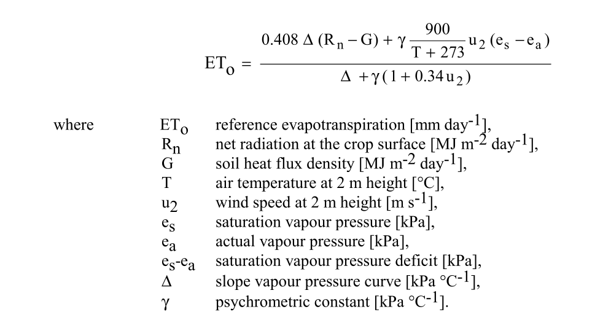
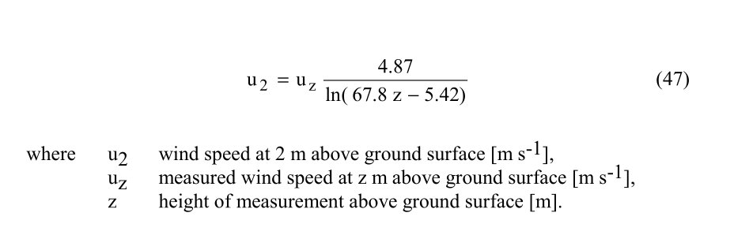
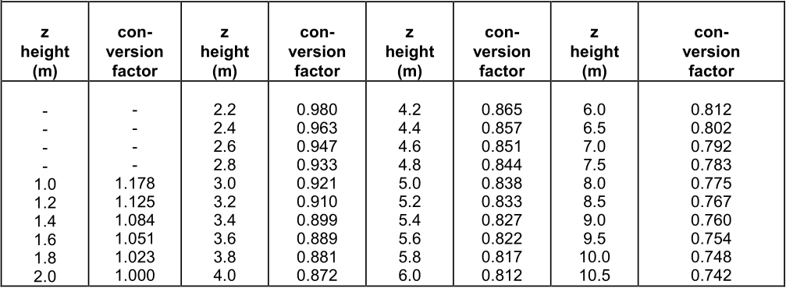
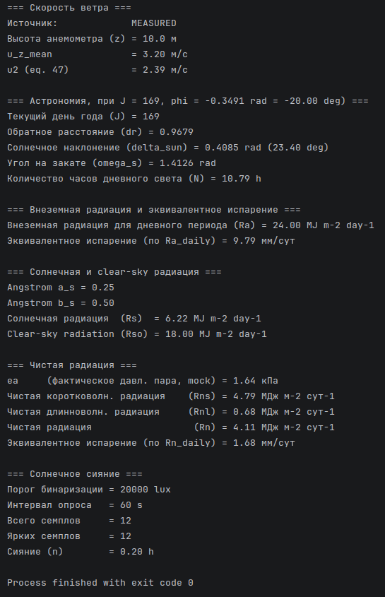
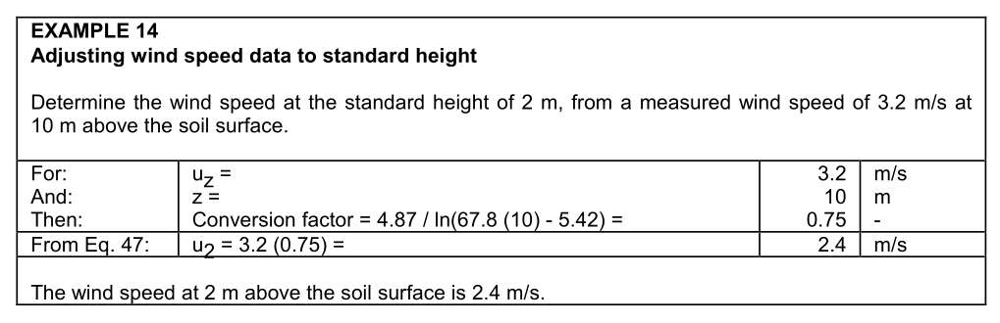
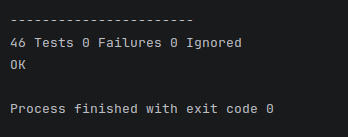

# devlog15. Разработка модулей скорости ветра

*Adds wind-speed read and calculation modules, implementing the FAO-56 logarithmic wind profile correction (eq. 47) that converts an anemometer reading at any height to the standard 2 m reference height (u2), needed for both the aerodynamic term and the denominator of the Penman–Monteith equation. Discusses the difference between WMO-standard (10 m) and FAO-standard (2 m) anemometer placement, and why the conversion matters when reusing an existing weather station’s equipment. The calculation module accumulates daily min/max/mean wind speed and enforces that the measurement height stays constant between updates within a day (a height change mid-day signals a configuration error). Six new tests (41–46) verify against FAO-56 example 14 and cover null-pointer, invalid-value, and height-mismatch cases.*

* * *

## Постановка задач и введение

В этом девлоге и на этом шаге мы хотим разработать **два модуля**:

- чтения значений скорости ветра,
- вычисления скорости ветра.

Значение **скорости ветра** *u<sub>z</sub>* входит в уравнение Пенмана-Монтейта (eq. 6) - как в аэродинамический блок уравнения, так и в знаменатель. Причем, значение **приводится к стандартной высоте** 2 метра над поверхностью земли *u<sub>2</sub>*:



В документации *FAO56* используется логарифмический профиль ветра ([Людвига Прандтля](https://en.wikipedia.org/wiki/Ludwig_Prandtl)) над невысоким травяным покровом (eq. 47):



Документация *FAO56* предлагает **коэффициенты пересчета** (*conversion factors*) для преобразования скорости ветра, измеренной на заданной высоте (над травяным покровом), в скорость ветра, измеренную на стандартной высоте 2 м над поверхностью земли (ann. 2, tab. 2.9):



При разработке модулей скорости ветра будем следовать тому же принципу, которого мы придерживались при разработке модулей чтения и вычисления температуры, влажности и давления:

- в слое **измерений** `01-measurement` будем проводить чтение мгновенного значения скорости ветра (*mock*-константа на ПК этапе), использовать *fallback*-значение,

- в слое **вычислений** `04-calculation` будем накапливать и считать суточные *min/max/mean* значения, делать пересчет к *u<sub>2</sub>*, хранить результаты.

> Напомним, что одним из важных принципов при разработке пар *read-calc* является следующий: модуль вычисляемых значений *архитектурно* не зависит от модуля измеряемых значений; проще говоря, файл реализации вычислений не обращается к файлу реализации чтения - связывание происходит на уровне оркестрации. Этот принцип выбран, чтобы изолировать модули, то есть, в конечном счете, выбран ради надежности.

* * *

## Напишем модуль чтения скорости ветра

Заметим, что модуль предполагает использование значения высоты над поверхностью земли - и это значение является параметром развертки системы, то есть, в нашей классификации, значением по типу A (*Type A*). Следовательно, разместим значение высоты измерения ветра в файле **`02-providers/022-configurations/deployment-config.h`**, добавив в него новый макрос:

```C
/* Параметры анемометра над поверхностью земли */
#define CONFIG_WIND_HEIGHT_WMO_M (10.0)    /* ВМО-стандарт: 10 м (стандартные метеостанции) */
#define CONFIG_WIND_HEIGHT_FAO_M (2.0)     /* FAO56-стандарт: 2 м (агрометеостанции) */
```

Согласно эталонам *WMO*, анемометр на метеостанциях размещается на высоте 10 метров над поверхностью земли для стандартных метеорологических измерений, а для агрометеорологических измерений - на высоте 2 или 3 метра. Подробнее об организации измерительных станций см.: **Руководство по приборам и методам наблюдений ВМО-№ 8** (*Guide to Instruments and Methods of Observation WMO-No. 8*) - **Том I**: [Измерения метеорологических переменных](https://library.wmo.int/idurl/4/68719) (2023).

Документация *FAO56* рекомендует устанавливать анемометр на высоте 2 метра над поверхностью земли (*FAO56* 1998: 55). Однако может возникать ситуация, при которой есть возможность использовать измерительные средства уже существующей "обычной" метеостанции и нет возможности развернуть измерительные системы, специально нацеленные на агрометеорологические задачи. Тогда и следует использовать приведение стандартного измерения (10 м) к *u<sub>2</sub>*.

* * *

#### `wind-speed-read.h`

```C
#ifndef WIND_SPEED_READ_H
#define WIND_SPEED_READ_H

#ifdef __cplusplus
extern "C" {
#endif

#include <stdint.h>
#include "../../03-validation/033-status/status.h"
#include "../../03-validation/031-value-source/value-source.h"

/* Структура хранения мгновенного значения скорости ветра;
 * поле height_m указывает высоту измерения (для пересчета к u2) */
typedef struct {
    double            speed_m_s;    /* Мгновенное измерение скорости ветра [м/с] */
    double            height_m;     /* Высота измерения [м] (над поверхностью)   */
    uint32_t          timestamp;    /* Метка времени [с] */
    SensorValueSource source;       /* Источник данных   */
} WindSpeedSample;

/* Чтение мгновенного значения скорости ветра */
Status SensorWindSpeed_ReadInstant(WindSpeedSample *out_sample);

/* Fallback-значение */
Status SensorWindSpeed_ReadDefault(WindSpeedSample *out_sample);

#ifdef __cplusplus
}
#endif

#endif /* WIND_SPEED_READ_H */
```

* * *

#### `wind-speed-read.c`

```C
#include <time.h>
#include <stddef.h>
#include "wind-speed-read.h"
#include "../../02-providers/022-configurations/deployment-config.h"

/* Mock-значения для ПК версии: скорость 3.2 м/с (по ex. 14),
 * высота измерения 10 м - из deployment-config.h */
#define SENSOR_MOCK_WIND_SPEED_MS     (3.2)

/* Fallback-значения: скорость 2.4 м/с (по ex. 14), высота измерения 2 м */
#define SENSOR_DEFAULT_WIND_SPEED_MS  (2.4)
#define SENSOR_DEFAULT_WIND_HEIGHT_M  (2.0)
#define SENSOR_WIND_DEFAULT_TIMESTAMP (0U)

Status SensorWindSpeed_ReadInstant(WindSpeedSample *out_sample) {
    if (out_sample == NULL) {
        return STATUS_NULL_POINTER;
    }

    out_sample->speed_m_s = SENSOR_MOCK_WIND_SPEED_MS;
    out_sample->height_m  = CONFIG_WIND_HEIGHT_WMO_M;
    out_sample->timestamp = (uint32_t)time(NULL);
    out_sample->source    = SENSOR_VALUE_MEASURED;

    return STATUS_OK;
}

Status SensorWindSpeed_ReadDefault(WindSpeedSample *out_sample) {
    if (out_sample == NULL) {
        return STATUS_NULL_POINTER;
    }

    out_sample->speed_m_s = SENSOR_DEFAULT_WIND_SPEED_MS;
    out_sample->height_m  = SENSOR_DEFAULT_WIND_HEIGHT_M;
    out_sample->timestamp = SENSOR_WIND_DEFAULT_TIMESTAMP;
    out_sample->source    = SENSOR_VALUE_DEFAULT;

    return STATUS_OK;
}
```

* * *

## Напишем модуль вычисления скорости ветра

#### `wind-speed-calc.h`

```C
#ifndef WIND_SPEED_CALC_H
#define WIND_SPEED_CALC_H

#ifdef __cplusplus
extern "C" {
#endif

#include <stdint.h>
#include <stdbool.h>
#include "../../03-validation/033-status/status.h"

/* *******************************************************************************
 * Накопление суточных показаний скорости ветра и пересчет к u2 (eq. 47).
 *
 * Паттерн: структура с накоплением; initialized = false после WindSpeed_Init(),
 * true после первого успешного WindSpeed_Update() - аналогично AirTemperatureData.
 *
 * u2 как производная величина не хранится в структуре: вычисляется отдельным вызовом
 * Calc_WindSpeedAt2m() в оркестрации - аналогично Calc_SaturationVapourPressure().
 * ***************************************************************************** */

/* Суточный накопитель скорости ветра */
typedef struct {
    double    u_z_min_m_s;    /* Минимальная скорость за сутки [м/с]        */
    double    u_z_max_m_s;    /* Максимальная скорость за сутки [м/с]       */
    double    u_z_mean_m_s;   /* Средняя скорость на высоте z [м/с]         */
    double    u_sum_m_s;      /* Накопленная сумма семплов (внутр.) [м/с]   */
    double    height_m;       /* Высота измерения [м]; задается в Update()  */
    uint32_t  sample_count;   /* Число принятых измерений                   */
    bool      initialized;    /* true после первого валидного Update()      */
} WindSpeedData;

/* Инициализация накопителя; устанавливает initialized = false; данные не готовы до первого Update() */
Status WindSpeed_Init(WindSpeedData *data);

/* Добавляет одно мгновенное измерение; speed_m_s - мгновенная скорость ветра [м/с], диапазон [0.0, 100.0] */
Status WindSpeed_Update(WindSpeedData *data, double speed_m_s, double height_m, uint32_t timestamp);

/* Пересчет скорости ветра к высоте 2 м (eq. 47): u_2 = u_z * 4.87 / ln(67.8 * z - 5.42), в м/с */
Status Calc_WindSpeedAt2m(double u_z, double z, double *out_u2);

#ifdef __cplusplus
}
#endif

#endif /* WIND_SPEED_CALC_H */
```

* * *

#### `wind-speed-calc.c`

```C
#include <math.h>
#include <stddef.h>
#include "wind-speed-calc.h"

/* Константы уравнения (eq. 47) согласно логарифмическому профилю Прандтля */
#define C_EQ47_NUM          (4.87)
#define C_EQ47_MULT         (67.8)
#define C_EQ47_SUB          (5.42)

/* Допустимые диапазоны аргументов */
#define WIND_SPEED_MIN_MS   (0.0)      /* м/с - штиль (0.0 физически допустим)  */
#define WIND_SPEED_MAX_MS   (100.0)    /* м/с - практический верхний предел     */
#define WIND_HEIGHT_MIN_M   (0.1)      /* м   - нижняя граница (защита eq. 47)  */
#define WIND_HEIGHT_MAX_M   (200.0)    /* м   - верхний предел высоты установки */

/* Допуск при сравнении высот между последовательными Update() */
#define WIND_HEIGHT_TOL_M   (0.001)    /* м */

/* *** Внутренние валидаторы *** */

/* isfinite() отсеивает NaN и +-Inf до сравнения диапазона */
static bool IsValidSpeed(const double u) {
    return isfinite(u) && (u >= WIND_SPEED_MIN_MS) && (u <= WIND_SPEED_MAX_MS);
}

static bool IsValidHeight(const double z) {
    return isfinite(z) && (z >= WIND_HEIGHT_MIN_M) && (z <= WIND_HEIGHT_MAX_M);
}

/* *** Реализация функций *** */

Status WindSpeed_Init(WindSpeedData *data) {
    if (data == NULL) {
        return STATUS_NULL_POINTER;
    }

    data->u_z_min_m_s  = 0.0;
    data->u_z_max_m_s  = 0.0;
    data->u_z_mean_m_s = 0.0;
    data->u_sum_m_s    = 0.0;
    data->height_m     = 0.0;
    data->sample_count = 0U;
    data->initialized  = false;

    return STATUS_OK;
}

Status WindSpeed_Update(WindSpeedData *data, const double speed_m_s, const double height_m, const uint32_t timestamp) {
    (void)timestamp;    /* TODO: зарезервировано (сортировка по времени) */

    if (data == NULL) {
        return STATUS_NULL_POINTER;
    }

    if (!IsValidSpeed(speed_m_s) || !IsValidHeight(height_m)) {
        return STATUS_INVALID_VALUE;
    }

    if (data->initialized) {
        /* Начиная со второго вызова высота анемометра постоянна */
        const double diff = height_m - data->height_m;
        if ((diff > WIND_HEIGHT_TOL_M) || (diff < -WIND_HEIGHT_TOL_M)) {
            return STATUS_INVALID_VALUE;
        }
    } else {
        /* Первый валидный семпл: фиксируем высоту, инициализируем min/max */
        data->height_m    = height_m;
        data->u_z_min_m_s = speed_m_s;
        data->u_z_max_m_s = speed_m_s;
        data->initialized = true;
    }

    /* Обновление min */
    if (speed_m_s < data->u_z_min_m_s) {
        data->u_z_min_m_s = speed_m_s;
    }

    /* Обновление max */
    if (speed_m_s > data->u_z_max_m_s) {
        data->u_z_max_m_s = speed_m_s;
    }

    /* Накопление для среднего арифметического суточного ряда */
    data->u_sum_m_s += speed_m_s;
    data->sample_count++;
    data->u_z_mean_m_s = data->u_sum_m_s / (double)data->sample_count;

    return STATUS_OK;
}

Status Calc_WindSpeedAt2m(const double u_z, const double z, double *out_u2) {
    if (out_u2 == NULL) {
        return STATUS_NULL_POINTER;
    }

    if (!IsValidSpeed(u_z) || !IsValidHeight(z)) {
        return STATUS_INVALID_VALUE;
    }

    double log_arg = C_EQ47_MULT * z - C_EQ47_SUB;
    *out_u2 = u_z * (C_EQ47_NUM / log(log_arg));    /* Eq. 47 */

    return STATUS_OK;
}
```

* * *

## Обновим `CMakeLists.txt`

В область `set(FAO56_SOURCES ...)` добавим новые файлы:

```CMake
01-measurement/015-wind-speed-read/wind-speed-read.c
01-measurement/015-wind-speed-read/wind-speed-read.h

04-calculation/046-wind-speed-calc/wind-speed-calc.c
04-calculation/046-wind-speed-calc/wind-speed-calc.h
```

* * *

## Обновим и запустим файл оркестрации `main.c`

#### Добавим **заголовки**:

```C
#include "../01-measurement/015-wind-speed-read/wind-speed-read.h"
#include "../04-calculation/046-wind-speed-calc/wind-speed-calc.h"
```

* * *

#### Добавим **объявления**:

```C
WindSpeedSample  wind_sample;
WindSpeedData    wind_data;
double           u2 = 0.0;
```

* * *

#### Добавим **инициализацию**:

```C
status = WindSpeed_Init(&wind_data);
    if (status != STATUS_OK) {
        return PrintStatusAndReturn("Ошибка инициализации WindSpeedData: ", status);
    }
```

* * *

#### Добавим **измерение**:

```C
/* Скорость ветра */
    status = SensorWindSpeed_ReadInstant(&wind_sample);
    if (status != STATUS_OK) {
        (void)fprintf(stderr,
            "Нет данных скорости ветра, используем значение по умолчанию. "
            "Причина: %s\n", Status_ToString(status));
        status = SensorWindSpeed_ReadDefault(&wind_sample);
        if (status != STATUS_OK) {
            return PrintStatusAndReturn(
                "Критическая ошибка чтения данных скорости ветра по умолчанию: ", status);
        }
    }

    status = WindSpeed_Update(&wind_data, wind_sample.speed_m_s, wind_sample.height_m, wind_sample.timestamp);
    if (status != STATUS_OK) {
        return PrintStatusAndReturn("Ошибка обновления данных скорости ветра: ", status);
    }
```

* * *

#### Добавим **вычисление**:

```C
/* Скорость ветра на высоте 2 м (eq. 47) */
    status = Calc_WindSpeedAt2m(wind_data.u_z_mean_m_s, wind_data.height_m, &u2);
    if (status != STATUS_OK) {
        return PrintStatusAndReturn("Ошибка пересчета скорости ветра к высоте 2 м (eq. 47): ", status);
    }
```

* * *

#### Добавим **вывод**:

```C
(void)printf("\n=== Скорость ветра ===\n");
(void)printf("Источник:             %s\n", SensorValueSource_ToString(wind_sample.source));
(void)printf("Высота анемометра (z) = %.1f м\n",   wind_data.height_m);
(void)printf("u_z_mean              = %.2f м/с\n", wind_data.u_z_mean_m_s);
(void)printf("u2 (eq. 47)           = %.2f м/с\n", u2);
```

* * *

#### Запустим `fao56_app`



Хотя это не тестовый набор, все же стоит отметить, что вычисленные значения соответствуют приведенным в эталонном примере *FAO56* (ex. 14):



* * *

## Обновим и запустим файл тестирования `main-test.c`

#### Обновим файл конфигурации `test-config.h`:

```C
/* -----------------------------------------------------------------------------
 * TC41-TC46: Скорость ветра - пересчет к u2 (FAO56 eq. 47)
 *
 * TC41: Calc_WindSpeedAt2m - нормальный путь, uz = 3.2 м/с, z = 10 м -> u2 = 2.393 м/с.
 * TC42: Calc_WindSpeedAt2m - z = 2 м, коэффициент пересчета ≈ 1.0.
 * TC43: WindSpeed_Init + Update * 3 -> min/max/mean, затем Calc_WindSpeedAt2m от mean.
 * TC44: NULL pointer - WindSpeed_Init, WindSpeed_Update, Calc_WindSpeedAt2m.
 * TC45: STATUS_INVALID_VALUE - скорость < 0, NaN, INFINITY; высота вне [0.1, 200] м.
 * TC46: STATUS_INVALID_VALUE - несоответствие высоты при повторном Update.
 * ----------------------------------------------------------------------------- */

#define TEST_WIND_UZ_MS               (3.2)     /* м/с - скорость на z = 10 м (ВМО)      */
#define TEST_WIND_HEIGHT_M            (10.0)    /* м   - высота измерения (стандарт ВМО) */
#define TEST_WIND_U2_EXPECTED         (2.393)   /* м/с - u2 = 3.2 * (4.87 / ln(672.58))  */
#define TEST_WIND_AT2M_UZ_MS          (5.0)     /* м/с - скорость, измеренная на 2 м     */
#define TEST_WIND_AT2M_EXPECTED       (5.001)   /* м/с - u2 ≈ uz при z = 2 м (фактор ≈1) */
#define TEST_WIND_SAMPLE_MS_LOW       (2.0)     /* м/с - минимальный семпл TC43          */
#define TEST_WIND_SAMPLE_MS_MID       (3.0)     /* м/с - средний семпл TC43              */
#define TEST_WIND_SAMPLE_MS_HIGH      (4.0)     /* м/с - максимальный семпл TC43         */
#define TEST_WIND_MEAN_EXPECTED       (3.0)     /* м/с - (2 + 4 + 3) / 3                 */
#define TEST_WIND_MEAN_U2_EXPECTED    (2.244)   /* м/с - u2 при u_mean = 3.0, z = 10 м   */
#define TEST_WIND_BAD_HEIGHT_LOW_M    (0.05)    /* м   - ниже допустимого 0.1 м          */
#define TEST_WIND_BAD_HEIGHT_HIGH_M   (300.0)   /* м   - выше допустимого 200 м          */
#define TEST_WIND_HEIGHT_SECOND_M     (2.0)     /* м   - другая высота для TC46          */
#define TOL_WIND_MS                   (0.005)   /* м/с - допуск                          */
```

* * *

#### Добавим **заголовки**:

```C
#include "../01-measurement/015-wind-speed-read/wind-speed-read.h"
#include "../04-calculation/046-wind-speed-calc/wind-speed-calc.h"
```

* * *

#### Напишем и добавим **функции** тестовых сценариев:

```C
/* *** TC41-TC46: Скорость ветра (eq. 47) *** */

/* TC41: Calc_WindSpeedAt2m - нормальный путь.
 * FAO56 ann.2, tab.2.9 / eq.47 / ex. 14: uz = 3.2 м/с при z = 10 м -> u2 = 2.393 м/с.
 * Коэффициент пересчета: 4.87 / ln(672.58) = 4.87 / 6.511 ≈ 0.748 (совпадает с tab.2.9). */
static void test_Calc_WindSpeedAt2m_FAO56(void) {
    (void)printf("\n>>> TC41: %s\n", __func__);

    double u2 = 0.0;
    
    AssertStatus("Calc_WindSpeedAt2m(3.2, 10.0)", Calc_WindSpeedAt2m(TEST_WIND_UZ_MS, TEST_WIND_HEIGHT_M, &u2), STATUS_OK);
    AssertDouble("u2 [м/с]", u2, TEST_WIND_U2_EXPECTED, TOL_WIND_MS);
}

/* TC42: Calc_WindSpeedAt2m - при z = 2 м коэффициент пересчета ≈ 1.0.
 * Числитель и знаменатель eq. 47 совпадают: ln(130.18) ≈ 4.869 ≈ 4.87.
 * Если анемометр на 2 м (FAO-стандарт) - пересчет практически не меняет значение. */
static void test_Calc_WindSpeedAt2m_At2m(void) {
    (void)printf("\n>>> TC42: %s\n", __func__);

    double u2 = 0.0;
    
    AssertStatus("Calc_WindSpeedAt2m(5.0, 2.0)",Calc_WindSpeedAt2m(TEST_WIND_AT2M_UZ_MS, 2.0, &u2), STATUS_OK);
    AssertDouble("u2 ≈ uz при z = 2 м", u2, TEST_WIND_AT2M_EXPECTED, TOL_WIND_MS);
}

/* TC43: WindSpeed_Init + WindSpeed_Update * 3 -> накопление min/max/mean; затем eq. 47.
 * Семплы: 2.0, 4.0, 3.0 м/с при z = 10 м.
 * Ожидание: min = 2.0, max = 4.0, mean = 3.0; u2 = 3.0 * 0.748 = 2.244 м/с. */
static void test_WindSpeed_Update_Accumulation(void) {
    (void)printf("\n>>> TC43: %s\n", __func__);

    WindSpeedData data;
    
    AssertStatus("WindSpeed_Init", WindSpeed_Init(&data), STATUS_OK);
    TEST_ASSERT_FALSE_MESSAGE(data.initialized, "initialized должен быть false после Init");

    AssertStatus("Update(2.0, 10.0)",
                 WindSpeed_Update(&data, TEST_WIND_SAMPLE_MS_LOW,  TEST_WIND_HEIGHT_M, 0U), STATUS_OK);

    TEST_ASSERT_TRUE_MESSAGE(data.initialized, "initialized должен стать true после первого Update");

    AssertStatus("Update(4.0, 10.0)",
                 WindSpeed_Update(&data, TEST_WIND_SAMPLE_MS_HIGH, TEST_WIND_HEIGHT_M, 1U), STATUS_OK);

    AssertStatus("Update(3.0, 10.0)",
                 WindSpeed_Update(&data, TEST_WIND_SAMPLE_MS_MID,  TEST_WIND_HEIGHT_M, 2U), STATUS_OK);

    AssertDouble("u_z_min",  data.u_z_min_m_s,  TEST_WIND_SAMPLE_MS_LOW,  TOL_WIND_MS);
    AssertDouble("u_z_max",  data.u_z_max_m_s,  TEST_WIND_SAMPLE_MS_HIGH, TOL_WIND_MS);
    AssertDouble("u_z_mean", data.u_z_mean_m_s, TEST_WIND_MEAN_EXPECTED,  TOL_WIND_MS);

    double u2 = 0.0;
    
    AssertStatus("Calc_WindSpeedAt2m(mean, height)",Calc_WindSpeedAt2m(data.u_z_mean_m_s, data.height_m, &u2), STATUS_OK);
    AssertDouble("u2 [м/с]", u2, TEST_WIND_MEAN_U2_EXPECTED, TOL_WIND_MS);
}

/* TC44: NULL pointer - все три функции модуля */
static void test_WindSpeed_NullPointer(void) {
    (void)printf("\n>>> TC44: %s\n", __func__);

    double u2 = 0.0;

    AssertStatus("WindSpeed_Init(NULL)", WindSpeed_Init(NULL), STATUS_NULL_POINTER);
    AssertStatus("WindSpeed_Update(data=NULL)", WindSpeed_Update(NULL, 3.2, 10.0, 0U), STATUS_NULL_POINTER);
    AssertStatus("Calc_WindSpeedAt2m(out=NULL)", Calc_WindSpeedAt2m(3.2, 10.0, NULL), STATUS_NULL_POINTER);

    /* u2 не должен измениться (Calc вернул бы ошибку до записи) */
    AssertDouble("u2 не изменился", u2, 0.0, 1e-9);
}

/* TC45: STATUS_INVALID_VALUE - все пути невалидных входных данных.
 * Скорость: отрицательная, NaN, INFINITY.
 * Высота: ниже 0.1 м (формула eq. 47 "вырождается") и выше 200 м. */
static void test_Calc_WindSpeedAt2m_InvalidValues(void) {
    (void)printf("\n>>> TC45: %s\n", __func__);

    double u2 = 0.0;

    AssertStatus("speed < 0", Calc_WindSpeedAt2m(-1.0,  TEST_WIND_HEIGHT_M, &u2), STATUS_INVALID_VALUE);
    AssertStatus("speed = NaN", Calc_WindSpeedAt2m(NAN, TEST_WIND_HEIGHT_M, &u2), STATUS_INVALID_VALUE);
    AssertStatus("speed = INFINITY", Calc_WindSpeedAt2m(INFINITY,  TEST_WIND_HEIGHT_M, &u2), STATUS_INVALID_VALUE);
    AssertStatus("z < 0.1 м", Calc_WindSpeedAt2m(TEST_WIND_UZ_MS,  TEST_WIND_BAD_HEIGHT_LOW_M,  &u2), STATUS_INVALID_VALUE);
    AssertStatus("z > 200 м", Calc_WindSpeedAt2m(TEST_WIND_UZ_MS,  TEST_WIND_BAD_HEIGHT_HIGH_M, &u2), STATUS_INVALID_VALUE);
}

/* TC46: WindSpeed_Update - несоответствие высоты при повторном вызове.
 * Физически высота анемометра постоянна; изменение высоты сигнализирует об ошибке конфигурации.
 * После отклоненного Update данные должны остаться нетронутыми. */
static void test_WindSpeed_Update_HeightMismatch(void) {
    (void)printf("\n>>> TC46: %s\n", __func__);

    WindSpeedData data;
    
    AssertStatus("WindSpeed_Init", WindSpeed_Init(&data), STATUS_OK);

    AssertStatus("Update(3.0, z = 10.0) - первый",
        WindSpeed_Update(&data, TEST_WIND_SAMPLE_MS_MID, TEST_WIND_HEIGHT_M, 0U), STATUS_OK);

    /* Та же скорость, но другая высота - вернуть ошибку */
    AssertStatus("Update(2.0, z = 2.0) - высота изменилась",
                 WindSpeed_Update(&data, TEST_WIND_SAMPLE_MS_LOW, TEST_WIND_HEIGHT_SECOND_M, 1U),
                 STATUS_INVALID_VALUE);

    /* Данные не должны были измениться после отклоненного Update */
    AssertDouble("u_z_mean не изменилась после ошибки", data.u_z_mean_m_s, TEST_WIND_SAMPLE_MS_MID, TOL_WIND_MS);

    TEST_ASSERT_EQUAL_UINT32_MESSAGE(1U, data.sample_count, "sample_count не должен был вырасти после ошибки");
}
```

* * *

#### Добавим запуски тестовых сценариев:

```C
/* Скорость ветра */
RUN_TEST(test_Calc_WindSpeedAt2m_FAO56);
RUN_TEST(test_Calc_WindSpeedAt2m_At2m);
RUN_TEST(test_WindSpeed_Update_Accumulation);
RUN_TEST(test_WindSpeed_NullPointer);
RUN_TEST(test_Calc_WindSpeedAt2m_InvalidValues);
RUN_TEST(test_WindSpeed_Update_HeightMismatch);
```

* * *

#### Запустим `fao56_test`


