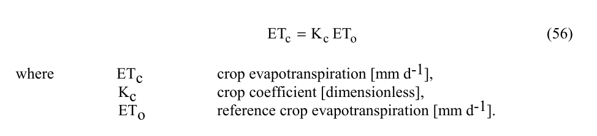
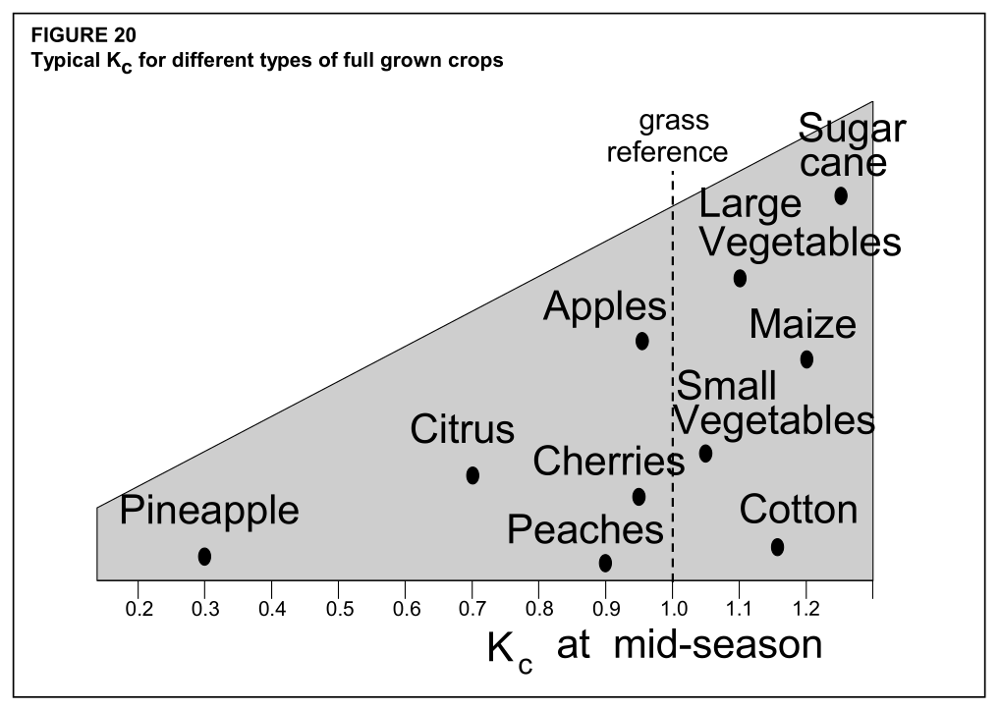
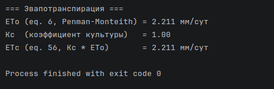

# devlog16. Уравнение Пенмана-Монтейта

*The capstone entry of the v0.1.0 computational core: assembles all previously built derivatives into the full FAO-56 Penman–Monteith reference evapotranspiration equation (eq. 6, `Calc_ETo`) and the crop evapotranspiration equation (eq. 56, `Calc_ETc = Kc × ETo`). Handles two physically meaningful edge cases explicitly: clamping actual vapour pressure to saturation vapour pressure when relative humidity would otherwise exceed 100% (a measurement-error case), and clamping ETo to zero when net radiation is negative (winter/polar-night conditions, where the raw formula could otherwise go negative). Adds a default crop coefficient (Kc mid = 1.00, reference grass) to the deployment configuration. Seven new tests (47–53) verify the equation end-to-end against a composite scenario built from earlier verified intermediate values, plus explicit soil-heat-flux, calm-wind, and negative-Rn edge cases. Closes with a cosmetic overhaul of the orchestration’s terminal output formatting (aligned columns, English labels/translation).*

* * *

## Напишем модуль вычисления эталонной эвапотранспирации

Итак, теперь, когда основное вычислительное ядро, все члены и деривативы уравнения Пенмана-Монтейта разработаны и протестированы, мы можем, наконец, собрать уравнение воедино и вычислить его - и тем самым завершить первый крупный шаг в разработке нашего проекта, зафиксировав процесс разработки проекта как **v0.1.0**.

Разместим, ожидаемо, новый модуль в слое вычислений как **`04-calculation/047-evapotranspiration-calc`**.

Напомним вид уравнения, модуль вычисления которого будем разрабатывать (eq. 6):


Будем использовать также вычисление эвапотранспирации культуры *ET<sub>c</sub>* (eq. 56):



* * *

#### `eto-calc.h`

```C
#ifndef ETO_CALC_H
#define ETO_CALC_H

#ifdef __cplusplus
extern "C" {
#endif

#include "../../03-validation/033-status/status.h"

/* Суточный поток тепла в почве G ≈ 0 (eq. 42): аргумент G_mj_m2_day в Calc_ETo() для суточных расчетов */
#define ETO_G_DAILY_MJ_M2_DAY  (0.0)    /* МДж м-2 сут-1 */

/* Эталонная эвапотранспирация = уравнение Пенмана-Монтейта (eq. 6):
 * - если ea > es (RH > 100%): ea приравнивается к es (VPD = 0);
 * - если ETo < 0 (Rn < 0): результат = 0 (ETo ≥ 0).
 * Возвращает: STATUS_OK, STATUS_NULL_POINTER или STATUS_INVALID_VALUE.               */
Status Calc_ETo(
    double  delta_kpa_c,       /* наклон кривой давления насыщения [кПа/°C]; > 0      */
    double  Rn_mj_m2_day,      /* чистая радиация [МДж м-2 сут-1]; может быть < 0     */
    double  G_mj_m2_day,       /* суточный поток тепла в почве; ETO_G_DAILY_MJ_M2_DAY */
    double  gamma_kpa_c,       /* психрометрическая константа [кПа/°C]; > 0           */
    double  T_mean_c,          /* средняя суточная температура [°C]                   */
    double  u2_m_s,            /* скорость ветра на высоте 2 м [м/с]; ≥ 0             */
    double  es_kpa,            /* давление насыщенного пара [кПа]; > 0                */
    double  ea_kpa,            /* фактическое давление пара [кПа]; ≥ 0                */
    double  *out_eto_mm_day    /* результат: ETo [мм/сут]; всегда ≥ 0                 */
);

/* Эвапотранспирация культуры, ETc = Kc * ETo.
 * Возвращает: STATUS_OK, STATUS_NULL_POINTER или STATUS_INVALID_VALUE.                    */
Status Calc_ETc(
    double eto_mm_day,        /* ETo из Calc_ETo() [мм/сут]; ≥ 0                           */
    double kc,                /* коэффициент культуры (Type A из deployment-config.h); > 0 */
    double *out_etc_mm_day    /* результат, ETc [мм/сут]                                   */
);

#ifdef __cplusplus
}
#endif

#endif /* ETO_CALC_H */
```

* * *

#### `eto-calc.c`

```C
#include <stddef.h>
#include "eto-calc.h"

/* Константы eq. 6 (FAO56 1998: 24)                                   */
#define C_RAD   (0.408)    /* коэффициент перевода радиации в мм ЭТ   */
#define C_AERO  (900.0)    /* суточная аэродинамическая константа     */
#define C_TK    (273.0)    /* перевод °C в K (FAO56 использует 273)   */
#define C_WIND  (0.34)     /* коэфф. аэродин. сопротивления травостоя */

Status Calc_ETo(const double  delta_kpa_c, const double  Rn_mj_m2_day, const double  G_mj_m2_day, const double  gamma_kpa_c,
    const double  T_mean_c, const double  u2_m_s, const double  es_kpa, const double  ea_kpa, double *out_eto_mm_day) {
    if (out_eto_mm_day == NULL) {
        return STATUS_NULL_POINTER;
    }

    /* Физические ограничения: Δ и γ должны быть положительными, u_2 неотрицательным, e_s положительным, e_a неотрицательным */
    if (delta_kpa_c <= 0.0 || gamma_kpa_c <= 0.0 || u2_m_s < 0.0 || es_kpa <= 0.0 || ea_kpa < 0.0) {
        return STATUS_INVALID_VALUE;
    }

    /* Клэмп e_a: RH не может превышать 100% (иначе это ошибка измерения) */
    double ea_eff = (ea_kpa > es_kpa) ? es_kpa : ea_kpa;

    /* eq. 6 числитель: радиационный член + аэродинамический член */
    double num_rad  = C_RAD * delta_kpa_c * (Rn_mj_m2_day - G_mj_m2_day);
    double num_aero = gamma_kpa_c * (C_AERO / (T_mean_c + C_TK)) * u2_m_s * (es_kpa - ea_eff);

    /* eq. 6 знаменатель; при delta > 0, gamma > 0, u_2 >= 0 знаменатель всегда > 0 */
    double den = delta_kpa_c + gamma_kpa_c * (1.0 + C_WIND * u2_m_s);

    /* eq. 6 результат; клэмп к 0 при Rn < 0 (зима, полярная ночь) */
    double eto = (num_rad + num_aero) / den;
    *out_eto_mm_day = (eto > 0.0) ? eto : 0.0;

    return STATUS_OK;
}

Status Calc_ETc(const double eto_mm_day, const double kc, double *out_etc_mm_day) {
    if (out_etc_mm_day == NULL) {
        return STATUS_NULL_POINTER;
    }

    if (eto_mm_day < 0.0 || kc <= 0.0) {
        return STATUS_INVALID_VALUE;
    }

    *out_etc_mm_day = kc * eto_mm_day;    /* eq. 1 */

    return STATUS_OK;
}
```

> *UPD:* Заметим здесь относительно записи и логики клэмпа для ea "RH не может превышать 100% (иначе это ошибка измерения)". В дальнейшем здесь будет новая функция `Min()` из файла `math-utils.h` (см. devlog18). Что важно: остается проблема с тем, что хотя физически не может быть влажности выше 100%, все же возможна ситуация, когда датчик измерил, например, 108% - и это вопрос не математики и кодирования, а архитектуры качества данных. Здесь нужно будет улучшить логику. К примеру: RH = 108% по факту измерений => quality = INVALID, однако текущая логика сделает RH = 100% и qality = VALID. Это ненадежно. Нужны изменения с учетом роли качества данных.

* * *

## Обновим файл оркестрации `main.c`

#### Обновим файл конфигурации `deployment-config.h`

Добавим коэффициент культуры в качестве константы развертки системы (*Type A*). Будем использовать по умолчанию эталонный показатель травостоя *K<sub>c mid</sub> = 1.0*, рекомендуемый документацией *FAO56* (1998: 91; 92, fig. 20; 110-114, tab. 12).



```C
/* Коэффициент культуры Kc mid: эталонный травостой */
#define CONFIG_CROP_KC  (1.00)
```

* * *

#### Обновим `CMakeLists.txt`

В поле источников сборки `FAO56_SOURCES` добавим:

```CMake
04-calculation/047-evapotranspiration-calc/eto-calc.c
04-calculation/047-evapotranspiration-calc/eto-calc.h
```

* * *

#### Обновим `main.c`

Добавим **заголовок**:

```C
#include "../04-calculation/047-evapotranspiration-calc/eto-calc.h"
```

* * *

Добавим **объявления**:

```C
double eto_mm_day = 0.0;
double etc_mm_day = 0.0;
```

* * *

Инициализация и измерения не требуются, так что сразу перейдем к добавлениям в **блок вычислений**:

```C
    /* Эталонная эвапотранспирация (eq. 6, Penman-Monteith)                  */
    status = Calc_ETo(
        delta,                               /* Δ [кПа/°C]                   */
        net_radiation.Rn_daily,              /* Rn [МДж м-2 сут-1]           */
        ETO_G_DAILY_MJ_M2_DAY,               /* G = 0 для суточного (eq. 42) */
        atmos_data.gamma_kPa_per_C,          /* γ [кПа/°C]                   */
        temperature_data.T_mean_C,           /* T_mean [°C]                  */
        u2,                                  /* u_2 [м/с]                    */
        e_s,                                 /* es [кПа]                     */
        ea_kpa,                              /* ea [кПа]                     */
        &eto_mm_day                          /* eto [мм/сут]                 */
    );

    if (status != STATUS_OK) {
        return PrintStatusAndReturn("Ошибка вычисления ETo (eq. 6): ", status);
    }

    /* Эвапотранспирация культуры (eq. 56) */
    status = Calc_ETc(eto_mm_day, CONFIG_CROP_KC, &etc_mm_day);
    if (status != STATUS_OK) {
        return PrintStatusAndReturn("Ошибка вычисления ETc (eq. 56): ", status);
    }
```

> *UPD:* проверки входов `isfinite()` для функций `Calc_ETo()` и `Calc_ETc()` будут добавлены впоследствии (см. **devlog18**).

* * *

Добавим **вывод**:

```C
(void)printf("\n=== Эвапотранспирация ===\n");
(void)printf("ETo (eq. 6, Penman-Monteith) = %.3f мм/сут\n", eto_mm_day);
(void)printf("Kc  (коэффициент культуры)   = %.2f\n",        CONFIG_CROP_KC);
(void)printf("ETc (eq. 56, Kc * ETo)       = %.3f мм/сут\n", etc_mm_day);
```

* * *

#### Запустим `fao56_app`



* * *

## Обновим файл тестирования `main-test.c`

#### Обновим файл конфигурации `test-config.h`

Добавим макросы для использования в завершающих тестовых сценариях:

```C
/* -----------------------------------------------------------------------------
 * TC47-TC53: Эталонная эвапотранспирация ETo (FAO56 eq. 6) и ETc (FAO56 eq. 56)
 *
 * TC47-TC50 используют составной сценарий из верифицированных примеров FAO56:
 *   delta = 0.1447 кПа/°C (TC1, T = 20°C),  Rn = 7.6 МДж м-2 сут-1 (TC29),
 *   gamma = 0.0674 кПа/°C (TC36),           T_mean = 20.0°C,
 *   es    = 2.3383 кПа (TC1),               ea = 1.70 кПа (TC40), u2 = 2.0 м/с.
 *
 * TC47: G = 0 (суточный), u2 = 2.0 -> ETo = 2.764 мм/сут.
 * Ручной расчет: num = (0.408 * 0.1447 * 7.6) + (0.0674 * (900 / 293) * 2.0 * 0.6383)
 *                    = 0.4487 + 0.2643 = 0.7130
 *                den = 0.1447 + 0.0674 * 1.68 = 0.2579
 *                ETo = 0.7130 / 0.2579 = 2.764 мм/сут.
 * TC48: G = 1.0 (ненулевой поток в почву) -> ETo = 2.535 мм/сут.
 * TC49: u2 = 0.0 (штиль) -> только радиационный член -> ETo = 2.115 мм/сут.
 * TC50: Rn = -5.0 (зима) -> ETo < 0 -> клэмп к 0.0 мм/сут.
 * TC51: STATUS_NULL_POINTER и STATUS_INVALID_VALUE для Calc_ETo.
 * TC52: ETc = Kc * ETo = 1.15 * 2.764 = 3.179 мм/сут.
 * TC53: STATUS_NULL_POINTER и STATUS_INVALID_VALUE для Calc_ETc.
 * ----------------------------------------------------------------------------- */

/* Общие входные данные TC47-TC50 */
#define TEST_ETO_DELTA_KPA_C         (0.1447)   /* кПа/°C, из TC1          */
#define TEST_ETO_RN_MJ               (7.6)      /* МДж м-2 сут-1, из TC29  */
#define TEST_ETO_GAMMA_KPA_C         (0.0674)   /* кПа/°C, из TC36         */
#define TEST_ETO_TMEAN_C             (20.0)     /* °C                      */
#define TEST_ETO_U2_MS               (2.0)      /* м/с                     */
#define TEST_ETO_ES_KPA              (2.3383)   /* кПа, из TC1             */
#define TEST_ETO_EA_KPA              (1.70)     /* кПа, из TC40            */

/* TC47: G = 0, u2 = 2.0 */
#define TEST_ETO_G_ZERO              (0.0)      /* МДж м-2 сут-1           */
#define TEST_ETO_EXPECTED            (2.764)    /* мм/сут                  */

/* TC48: G ≠ 0 */
#define TEST_ETO_G_NON_ZERO          (1.0)      /* МДж м-2 сут-1           */
#define TEST_ETO_G_NONZERO_EXPECTED  (2.535)    /* мм/сут                  */

/* TC49: штиль */
#define TEST_ETO_U2_CALM             (0.0)      /* м/с                     */
#define TEST_ETO_CALM_EXPECTED       (2.115)    /* мм/сут                  */

/* TC50: отрицательный Rn -> клэмп */
#define TEST_ETO_RN_NEGATIVE         (-5.0)     /* МДж м-2 сут-1           */
#define TEST_ETO_NEGATIVE_EXPECTED   (0.0)      /* мм/сут, клэмп к 0       */

/* TC52: ETc */
#define TEST_ETC_ETO_MM              (2.764)    /* мм/сут, ETo из TC47     */
#define TEST_ETC_KC                  (1.15)     /* Kc, пример (mid-season) */
#define TEST_ETC_EXPECTED            (3.179)    /* мм/сут, 2.764 * 1.15    */

#define TOL_ETO                      (0.005)    /* мм/сут                  */
#define TOL_ETC                      (0.005)    /* мм/сут                  */
```

* * *

#### Обновим `main-test.c`

Добавим **включение**:

```C
#include "../04-calculation/047-evapotranspiration-calc/eto-calc.h"
```

* * *

Добавим тестовые **функции**:

```C
/* *** TC47-TC53: Эвапотранспирация (eq. 6, eq. 56) *** */

/* TC47: Calc_ETo - нормальный путь (G = 0, u2 = 2.0). Составной сценарий из примеров FAO56.
 * ETo = 0.7130 / 0.2579 = 2.764 мм/сут (см. test-config.h). */
static void test_Calc_ETo_Normal(void) {
    (void)printf("\n>>> TC47: %s\n", __func__);

    double eto = 0.0;
    
    AssertStatus("Calc_ETo(G=0, u2=2.0)",
        Calc_ETo(TEST_ETO_DELTA_KPA_C, TEST_ETO_RN_MJ, TEST_ETO_G_ZERO, TEST_ETO_GAMMA_KPA_C,
            TEST_ETO_TMEAN_C, TEST_ETO_U2_MS, TEST_ETO_ES_KPA, TEST_ETO_EA_KPA, &eto),
            STATUS_OK);
    
    AssertDouble("ETo [мм/сут]", eto, TEST_ETO_EXPECTED, TOL_ETO);
}

/* TC48: Calc_ETo - G ≠ 0 (учет суточного потока тепла в почву).
 * Тест покрывает параметр G; Rn - G = 7.6 - 1.0 = 6.6 вместо 7.6. ETo = 2.535 мм/сут. */
static void test_Calc_ETo_WithSoilHeatFlux(void) {
    (void)printf("\n>>> TC48: %s\n", __func__);

    double eto = 0.0;
    
    AssertStatus("Calc_ETo(G=1.0)",
        Calc_ETo(TEST_ETO_DELTA_KPA_C, TEST_ETO_RN_MJ, TEST_ETO_G_NON_ZERO, TEST_ETO_GAMMA_KPA_C,
            TEST_ETO_TMEAN_C, TEST_ETO_U2_MS, TEST_ETO_ES_KPA, TEST_ETO_EA_KPA, &eto),
            STATUS_OK);
    
    AssertDouble("ETo с G ≠ 0 [мм/сут]", eto, TEST_ETO_G_NONZERO_EXPECTED, TOL_ETO);
}

/* TC49: Calc_ETo - штиль (u2 = 0).
 * Аэродинамический член обнуляется: ETo = 0.408 * Δ * Rn / (Δ + γ) = 2.115 мм/сут.
 * Знаменатель при u2 = 0: Δ + γ * 1 > 0 - вырождения нет. */
static void test_Calc_ETo_CalmWind(void) {
    (void)printf("\n>>> TC49: %s\n", __func__);

    double eto = 0.0;

    AssertStatus("Calc_ETo(u2 = 0, штиль)",
        Calc_ETo(TEST_ETO_DELTA_KPA_C, TEST_ETO_RN_MJ, TEST_ETO_G_ZERO, TEST_ETO_GAMMA_KPA_C,
            TEST_ETO_TMEAN_C, TEST_ETO_U2_CALM, TEST_ETO_ES_KPA, TEST_ETO_EA_KPA, &eto),
            STATUS_OK);

    AssertDouble("ETo при штиле [мм/сут]", eto, TEST_ETO_CALM_EXPECTED, TOL_ETO);
}

/* TC50: Calc_ETo - отрицательный Rn, результат клэмпится к 0.
 * При Rn = -5.0: числитель = -0.295 + 0.264 = -0.031 < 0 -> ETo ≈ -0.120 -> клэмп к 0. */
static void test_Calc_ETo_NegativeRn(void) {
    (void)printf("\n>>> TC50: %s\n", __func__);

    double eto = 0.0;

    AssertStatus("Calc_ETo(Rn < 0)",
        Calc_ETo(TEST_ETO_DELTA_KPA_C, TEST_ETO_RN_NEGATIVE, TEST_ETO_G_ZERO, TEST_ETO_GAMMA_KPA_C,
            TEST_ETO_TMEAN_C, TEST_ETO_U2_MS, TEST_ETO_ES_KPA, TEST_ETO_EA_KPA, &eto),
            STATUS_OK);

    AssertDouble("ETo клэмп к 0 [мм/сут]", eto, TEST_ETO_NEGATIVE_EXPECTED, TOL_ETO);
}

/* TC51: Calc_ETo - NULL pointer и все пути STATUS_INVALID_VALUE */
static void test_Calc_ETo_Errors(void) {
    (void)printf("\n>>> TC51: %s\n", __func__);

    double eto = 0.0;

    AssertStatus("out = NULL",
        Calc_ETo(TEST_ETO_DELTA_KPA_C, TEST_ETO_RN_MJ, TEST_ETO_G_ZERO, TEST_ETO_GAMMA_KPA_C,
            TEST_ETO_TMEAN_C, TEST_ETO_U2_MS, TEST_ETO_ES_KPA, TEST_ETO_EA_KPA, NULL),
            STATUS_NULL_POINTER);

    AssertStatus("delta <= 0",
        Calc_ETo(0.0, TEST_ETO_RN_MJ, TEST_ETO_G_ZERO, TEST_ETO_GAMMA_KPA_C,
            TEST_ETO_TMEAN_C, TEST_ETO_U2_MS, TEST_ETO_ES_KPA, TEST_ETO_EA_KPA, &eto),
            STATUS_INVALID_VALUE);

    AssertStatus("gamma <= 0",
        Calc_ETo(TEST_ETO_DELTA_KPA_C, TEST_ETO_RN_MJ, TEST_ETO_G_ZERO, 0.0,
            TEST_ETO_TMEAN_C, TEST_ETO_U2_MS, TEST_ETO_ES_KPA, TEST_ETO_EA_KPA, &eto),
            STATUS_INVALID_VALUE);

    AssertStatus("u2 < 0",
        Calc_ETo(TEST_ETO_DELTA_KPA_C, TEST_ETO_RN_MJ, TEST_ETO_G_ZERO, TEST_ETO_GAMMA_KPA_C,
            TEST_ETO_TMEAN_C, -1.0, TEST_ETO_ES_KPA, TEST_ETO_EA_KPA, &eto),
            STATUS_INVALID_VALUE);

    AssertStatus("ea < 0",
        Calc_ETo(TEST_ETO_DELTA_KPA_C, TEST_ETO_RN_MJ, TEST_ETO_G_ZERO, TEST_ETO_GAMMA_KPA_C,
            TEST_ETO_TMEAN_C, TEST_ETO_U2_MS, TEST_ETO_ES_KPA, -1.0, &eto),
            STATUS_INVALID_VALUE);

    AssertStatus("es <= 0",
        Calc_ETo(TEST_ETO_DELTA_KPA_C, TEST_ETO_RN_MJ, TEST_ETO_G_ZERO, TEST_ETO_GAMMA_KPA_C,
            TEST_ETO_TMEAN_C, TEST_ETO_U2_MS, 0.0, TEST_ETO_EA_KPA, &eto),
            STATUS_INVALID_VALUE);
}

/* TC52: Calc_ETc - нормальный путь.
 * ETc = Kc * ETo = 1.15 * 2.764 = 3.179 мм/сут. */
static void test_Calc_ETc_Normal(void) {
    (void)printf("\n>>> TC52: %s\n", __func__);

    double etc = 0.0;

    AssertStatus("Calc_ETc(2.764, 1.15)", Calc_ETc(TEST_ETC_ETO_MM, TEST_ETC_KC, &etc), STATUS_OK);
    AssertDouble("ETc [мм/сут]", etc, TEST_ETC_EXPECTED, TOL_ETC);
}

/* TC53: Calc_ETc - NULL pointer и невалидные входные данные. */
static void test_Calc_ETc_Errors(void) {
    (void)printf("\n>>> TC53: %s\n", __func__);

    double etc = 0.0;

    AssertStatus("out = NULL",  Calc_ETc(2.764, 1.0,  NULL), STATUS_NULL_POINTER);
    AssertStatus("eto < 0",     Calc_ETc(-1.0,  1.0,  &etc), STATUS_INVALID_VALUE);
    AssertStatus("kc = 0",      Calc_ETc(2.764, 0.0,  &etc), STATUS_INVALID_VALUE);
    AssertStatus("kc < 0",      Calc_ETc(2.764, -0.5, &etc), STATUS_INVALID_VALUE);
}
```

* * *

Добавим **запуски**:

```C
/* Эвапотранспирация */
RUN_TEST(test_Calc_ETo_Normal);
RUN_TEST(test_Calc_ETo_WithSoilHeatFlux);
RUN_TEST(test_Calc_ETo_CalmWind);
RUN_TEST(test_Calc_ETo_NegativeRn);
RUN_TEST(test_Calc_ETo_Errors);
RUN_TEST(test_Calc_ETc_Normal);
RUN_TEST(test_Calc_ETc_Errors);
```

* * *

#### Запустим `fao56_test`


* * *

## Подведение итогов

В следующем девлоге кратко подведем итоги текущего этапа разработки, обозначим состояние текущей v0.1.0 и сравним ее с требованиями, опишем основные параметры системы (подробное описание будет хранится в разделе документации), определим следующие шаги.

Следующий этап работы будет связан с портированием программы на МК и всей необходимой для встраиваемого программного обеспечения настройке. Этой работе будет посвящена отдельная серия девлогов. Прежде чем переходить к работе над следующей, встраиваемой, версией, сделаем небольшой смоук-тест с портированием нашей программы на МК - чтобы получить вывод в терминал (через *UART*) и сразу посмотреть, все ли в порядке с потенциалом портирования.
