# devlog18. Анализ и улучшение *v0.1.0*

## Введение

Спустя время удалось выявить ряд проблем в текущей версии проекта. Представляется адекватным провести необходимые изменения прежде, чем переходить к *smoke*-тесту и портированию.

На данный момент подготовлен список проблем и рекомендаций по исправлению кода. Приведем его ниже, однако сперва обратимся к средствам компилятора и установим некоторые флаги, чтобы собрать дополнительные сведения о возможных проблемах - возможно, часть проблем уже учтена нами в подготовленном списке. Затем приведем итоговый обзор проблем и решений для улучшения текущей версии - и реализуем эти решения.

* * *

## Флаги компиляции

Возьмем текущую *v0.1.0* и изменим `CMakeLists.txt` так, чтобы при сборке обеих целей - приложения `fao56_app` и тестирования `fao56_test` - компилятор добавлял ряд дополнительных проверок и сообщений вывода.

Добавим по одной строке `target_compile_options` **для каждой из двух целей**, включив некоторые флаги компиляции.

**`CMakeLists.txt`**

```CMake
# Target 1: application binary
target_link_libraries(fao56_app m)
target_compile_options(fao56_app PRIVATE -Wall -Wextra -Wfloat-equal -Wconversion -Wshadow)
```

```CMake
# Target 2: test binary
target_link_libraries(fao56_test m unity)
target_compile_definitions(unity PUBLIC UNITY_INCLUDE_DOUBLE)
target_compile_options(fao56_test PRIVATE -Wall -Wextra -Wfloat-equal -Wconversion -Wshadow)
```

Как видно, отсутствует флаг `-Werror`. Пока что мы хотим собрать диагностические сведения. Флаг `-Werror` будет останавливать сборку при появлении первого же предупреждения. Будем действовать следующим образом: соберем сведения по предложенным выше флагам, резюмируем и имплементируем изменения, а затем включим флаг `-Werror`.

* * *

## Сборка и проверки

Запустим сборку и проверим вывод. Не будем путать **сборку** (*Build*) и **запуск** программы (*Run*) - в последнем случае получим уже известный нам вывод выполнения программы без каких-либо предупреждений в то время как мы хотим получить **вывод компиляции**.

В инкрементальной системе сборки *CLion/Ninja*, скорее всего, ничего не произойдет после простого изменения в `CMakeLists.txt` и запуска сборки, поскольку система может посчитать, что ни один из файлов не требует пререкомпиляции. Тогда потребуется удалить папку сборки `cmake-build-debug` и запустить сборку заново.

**Предупреждение № 1**

`FAO56/04-calculation/043-vapour-pressure-calc/vapour-pressure-calc.c` *In function* `Calc_SlopeDelta`: *comparing floating-point with* `==` *or* `!=` *is unsafe* [`-Wfloat-equal`]

```C
// 63
if (denom == 0.0) {
```

**Предупреждение № 2**

`FAO56/04-calculation/045-radiation-calc/solar-radiation-calc.c` *In function* `SolarRadiation_Calc`: *comparing floating-point with* `==` *or* `!=` *is unsafe* [`-Wfloat-equal`]

```C
// 57
if (day->N_hours  == 0.0) {
```

* * *

## Анализ проверок

Оба предупреждения - одинаково для обеих целей - от `-Wfloat-equal`. Причем, формально предупреждения одинаковы, однако второй случай по содержанию отличается от первого. Об этом подробнее ниже - при работе со списком и имплементацией всех изменений для текущей версии кода.

На удивление флаги `-Wall -Wextra -Wconversion -Wshadow` не выдали ни одного предупреждения, что само по себе довольно информативно. Можно порадоваться как минимум тому, что работа с типами была проведена аккуратно.

* * *

## Список задач

Приведем список задач, затем объясним их смысл и покажем возможные решения для связанных с этими задачами проблем:

- в функциях `Calc_ETo()` и `Calc_ETc()` (файл `eto-calc.c`) нужно поработать с `NaN` и `isfinite()`-проверками на входах;
- в функции `AirHumidity_Update()` (файл `air-humidity-calc.c`) аналогично нужно сделать проверку `NaN` для `RH_pct`;
- следует поработать с приведенным выше предупреждением компилятора по флагу `-Wfloat-equal`;
- следует написать новые тестовые сценарии;
- нужно поработать с файлом `main.c` и разделить в основной функции блоки вычислений и вывода результата;
- вероятно, стоит сделать несколько не обязательных улучшений, а именно:
   - перейти от использвания `_Init` в `calc`-слое к использованию `memset` при инициализации структур хранения;
   - вынести некоторые константы/определения в отдельный публичный заголовочный файл (`math-utils.h`);
   - заменить *ad hoc*-образные тернарные выражения и условные конструкции, обеспечивающие порог, на `static inline`-функции с ограничениями по *min* и *max*;
- кроме того, проведем статический анализ кода и вновь сверимся, после всех изменений, с эталонной документацией *FAO56*.

* * *

## Исправления с пояснениями № 1

### Проверки `NaN`, `isfinite()`

**`047-evapotranspiration-calc/eto-calc.c`**

**Функция `Calc_ETo()`** не проводит проверки входящих значений на `NaN`/`INFINITY`. Следует это исправить.

Для использования `isfinite()` требуется **подключить заголовок `math.h`**.

```C
#include <math.h>
```

**Добавим проверку `NaN`/`INFINITY`** *перед* проверкой знаков - поскольку проверять знак у `NaN` бессмысленно.

```C
Status Calc_ETo(const double delta_kpa_c, const double Rn_mj_m2_day, const double G_mj_m2_day, const double gamma_kpa_c,
    const double T_mean_c, const double u2_m_s, const double es_kpa, const double ea_kpa, double *out_eto_mm_day) {
    if (out_eto_mm_day == NULL) {
        return STATUS_NULL_POINTER;
    }

    /* Reject NaN/Infinity on every input before any arithmetic or sign check */
    if (!isfinite(delta_kpa_c) || !isfinite(Rn_mj_m2_day) || !isfinite(G_mj_m2_day) || !isfinite(gamma_kpa_c)
        || !isfinite(T_mean_c) || !isfinite(u2_m_s) || !isfinite(es_kpa) || !isfinite(ea_kpa)) {
        return STATUS_INVALID_VALUE;
    }

    /* Physical constraints: Δ и γ must be positive, u2 non-negative, es positive, ea non-negative */
    if (delta_kpa_c <= 0.0 || gamma_kpa_c <= 0.0 || u2_m_s < 0.0 || es_kpa <= 0.0 || ea_kpa < 0.0) {
        return STATUS_INVALID_VALUE;
    }
```

> Значения `Rn` и `G` в принципе могут быть отрицательными (например, для ночного или зимнего времени), так что проверка на знак не требуется.

* * *

**Функция `Calc_ETc()`** тоже должна проводить проверку `NaN`/`INFINITY` для входящих значений.

```C
Status Calc_ETc(const double eto_mm_day, const double kc, double *out_etc_mm_day) {
    if (out_etc_mm_day == NULL) {
        return STATUS_NULL_POINTER;
    }

    if (!isfinite(eto_mm_day) || !isfinite(kc)) {
        return STATUS_INVALID_VALUE;
    }

    if (eto_mm_day < 0.0 || kc <= 0.0) {
        return STATUS_INVALID_VALUE;
    }
```

> После внесенных изменений *проверена* работа программы.

* * *

**`042-air-humidity-calc/air-humidity-calc.c`**

Здесь проблема схожая, но решение предложим другое - по аналогии с функцией `AirTemperature_Update()` в соседнем модуле `041-air-temperature-calc` того же слоя вычислений (см. файл `air-temperature-calc.c`). Создадим для влажности такой же общий валидатор - через слой `032-validation`.

Добавим **объявление** в **`validation.h`** сразу после `ValidTemperatureC()`:

```C
/* Temporary protective corridor for temperature values */
bool ValidTemperatureC(double value);

/* Relative humidity as measured; true iff isfinite(value) && 0 <= value <= 100 */
bool ValidHumidityPercent(double value);
```

Напишем **реализацию** в **`validation.c`**:

```C
bool ValidTemperatureC(const double value) {
    return isfinite(value)
        && (value >= -100.0)
        && (value <= 100.0);
}

bool ValidHumidityPercent(const double value) {
    return isfinite(value)
        && (value >= 0.0)
        && (value <= 100.0);
}
```

В файл **`air-humidity-calc.c`** подключим теперь **заголовок** файла валидации:

```C
#include <stddef.h>
#include "air-humidity-calc.h"
#include "../../03-validation/032-validation/validation.h"
```

И в функции `AirHumidity_Update()` заменим **проверку**:

```C
if ((RH_pct < 0.0) || (RH_pct > 100.0)) {
	return STATUS_INVALID_VALUE;
}
```

На следующую:

```C
if (!ValidHumidityPercent(RH_pct)) {
	return STATUS_INVALID_VALUE;
}
```

> После внесенных изменений *проверена* работа программы.

* * *

### Предупреждения компилятора

Перейдем к двум предупреждениям, которые мы получили от компилятора по флагу `-Wfloat-equal`: *comparing floating-point with* `==` *or* `!=` *is unsafe* - для функций

- `Calc_SlopeDelta()`, файл **`043-vapour-pressure-calc/vapour-pressure-calc.c`**,
- `SolarRadiation_Calc()`, файл **`045-radiation-calc/solar-radiation-calc.c`**.

Как сказано, несмотря на формальное сходство, содержательно это два разных случая.

* * *

**В первом случае**, в функции `Calc_SlopeDelta()`, проверка `denom == 0.0`, вообще говоря, является "мертвым кодом": при валидном значении `T_mean_c`, проверки которого уже проведены и дапазон которого ограничен, `denom` не может быть в точности равен `0.0`. Сам *паттерн сравнения* формально проблемный (на что и указывает компилятор как на знак потенциальной проблемы), и если идти по пути прояснения намерений, то лучше переписать допуск так, чтобы для данного участка кода значение гарантировалось в текущем файле, а не в том, откуда сюда пришло это значение. (Возможно, здесь имеет место избыточная проверка, но если ее в принципе сохранять, то улучшать.)

Кстати, заменим заодно "магическое число" `0.0` на **определение**:

```C
#define SLOPE_DELTA_EPS (1e-9)
```

Далее вместо сравнения, которое компилятор пометил как проблемное место:

```C
if (denom == 0.0) {
...
```

Напишем проверку не на равенство знаменателя нулю, а на "опасную близость к нулю" - и здесь подойдет допуск `1e-9` из нашего макроопределения:

```C
if (fabs(denom) < SLOPE_DELTA_EPS) {
...
```

* * *

**Во втором случае**, в функции `SolarRadiation_Calc()`, ситуация другая: значение `0.0` для `N_hours` осмысленно и возможно - и проверяется именно оно, а не нечто приближенное. Здесь применение логики допуска, как в первом случае, было бы ошибкой, поскольку в `day-in-year-calc.c` для полярной ночи `omega_s` устанавливается в `0.0`.

Как видно из самого кода, проверка на равенство нулю дается для записи параметров полярной ночи (в случае истины):

```C
/* Polar night: Ra = 0, N = 0, Rs = 0 */
if (day->N_hours  == 0.0) {
	out->Rs_daily  = 0.0;
	out->Rso_daily = 0.0;
	
	return STATUS_OK;
}
```

Однако *формальная* проблема для паттерна сравнения остается, и если мы не хотим получать предупреждение от компилятора или - в случае включения `-Werror` - остановку сборки, придется внести некоторое изменение.

Решение следующее. Чуть выше проведена проверка:

```C
if (day->N_hours < 0.0) {
	return STATUS_INVALID_VALUE;
}
```

Таким образом, к моменту сравнения `N_hours == 0` все значения ниже нуля уже отсечены.
Следовательно, проверка `<= 0.0` *в данном случае* будет работать идентично `== 0.0`, при этом оператор точного сравнения с нулем, который вызывает предупреждение компилятора, больше не используется, а поведение программы значимо не изменяется.

Итак:

```C
/* Polar night: Ra = 0, N = 0, Rs = 0 */
if (day->N_hours  <= 0.0) {
	out->Rs_daily  = 0.0;
	out->Rso_daily = 0.0;
	
	return STATUS_OK;
}
```

> После внесенных изменений *проверена* работа программы.

* * *

## Тестирование исправлений

Для первых трех исправлений - `Calc_ETo()`, `Calc_ETc()`, `AirHumidity_Update()` - напишем новые тестовые сценарии. Для более удобного отображения в выводе придется сдвинуть (переписать) нумерацию тестовых наборов: хотелось бы, чтобы `AirHumidity_Update()` оказался в блоке с влажностью, а не в самом конце файла тестирования, и т.д.

Стоит иметь это в виду: новые тестовые сценарии для `AirHumidity_Update()` получат номера `TC34`, `TC35`, `TC36`, произойдет смещение номеров вправо, затем новый тест для `Calc_ETo()` получит номер `TC55`, еще смещение, и новый тест для `Calc_ETc()` получит номер `TC58`. Все сдвиги нужно будет учесть при изменении комментариев в файлах `main-test.c` и `test-config.h`.

После написания новых тестовых сценариев следует добавить соответствующие `RUN_TEST()` в поле основной функции.

* * *

### **`main-test.c`**

Тесты для **`AirHumidity_Update()`**:

```C
/* TC34: AirHumidity_Update, NaN */
static void test_AirHumidity_NaN(void) {
    (void)printf("\n>>> TC34: %s\n", __func__);

    AirHumidityData data;
    AirHumidity_Init(&data);

    AssertStatus("AirHumidity_Update(NaN)",
                 AirHumidity_Update(&data, NAN, 0U), STATUS_INVALID_VALUE);
}

/* TC35: AirHumidity_Update, Infinity */
static void test_AirHumidity_Infinity(void) {
    (void)printf("\n>>> TC35: %s\n", __func__);

    AirHumidityData data;
    AirHumidity_Init(&data);

    AssertStatus("AirHumidity_Update(INF)",
                 AirHumidity_Update(&data, INFINITY, 0U), STATUS_INVALID_VALUE);
}

/* TC36: AirHumidity_Update, RH = 150%, out of range [0, 100] */
static void test_AirHumidity_OutOfRange(void) {
    (void)printf("\n>>> TC36: %s\n", __func__);

    AirHumidityData data;
    AirHumidity_Init(&data);

    AssertStatus("AirHumidity_Update(150%)",
                 AirHumidity_Update(&data, TEST_RH_OUT_OF_RANGE, 0U), STATUS_INVALID_VALUE);
}
```

> В файл конфигурации тестирования `test-config.h` добавлена константа `#define TEST_RH_OUT_OF_RANGE (150.0)`.

> После внесенных изменений *проверена* работа программы.

* * *

Тест для **`Calc_ETo()`**:

```C
/* TC55: Calc_ETo, NaN on each parameter */
static void test_Calc_ETo_NaN(void) {
    (void)printf("\n>>> TC55: %s\n", __func__);

    double eto = 0.0;

    AssertStatus("delta  = NaN",
                 Calc_ETo(NAN, TEST_ETO_RN_MJ, TEST_ETO_G_ZERO,
                        TEST_ETO_GAMMA_KPA_C, TEST_ETO_TMEAN_C, TEST_ETO_U2_MS, TEST_ETO_ES_KPA,
                        TEST_ETO_EA_KPA, &eto),
                 STATUS_INVALID_VALUE);

    AssertStatus("Rn     = NaN",
                 Calc_ETo(TEST_ETO_DELTA_KPA_C, NAN, TEST_ETO_G_ZERO,
                        TEST_ETO_GAMMA_KPA_C, TEST_ETO_TMEAN_C, TEST_ETO_U2_MS, TEST_ETO_ES_KPA,
                        TEST_ETO_EA_KPA, &eto),
                 STATUS_INVALID_VALUE);

    AssertStatus("T_mean = NaN",
                 Calc_ETo(TEST_ETO_DELTA_KPA_C, TEST_ETO_RN_MJ, TEST_ETO_G_ZERO,
                        TEST_ETO_GAMMA_KPA_C, NAN, TEST_ETO_U2_MS, TEST_ETO_ES_KPA,
                        TEST_ETO_EA_KPA, &eto),
                 STATUS_INVALID_VALUE);

    AssertStatus("u2     = NaN",
                 Calc_ETo(TEST_ETO_DELTA_KPA_C, TEST_ETO_RN_MJ, TEST_ETO_G_ZERO,
                        TEST_ETO_GAMMA_KPA_C, TEST_ETO_TMEAN_C, NAN, TEST_ETO_ES_KPA,
                        TEST_ETO_EA_KPA, &eto),
                 STATUS_INVALID_VALUE);

    AssertStatus("G      = NaN",
                 Calc_ETo(TEST_ETO_DELTA_KPA_C, TEST_ETO_RN_MJ, NAN,
                        TEST_ETO_GAMMA_KPA_C, TEST_ETO_TMEAN_C, TEST_ETO_U2_MS, TEST_ETO_ES_KPA,
                        TEST_ETO_EA_KPA, &eto),
                 STATUS_INVALID_VALUE);

    AssertStatus("gamma  = NaN",
                 Calc_ETo(TEST_ETO_DELTA_KPA_C, TEST_ETO_RN_MJ, TEST_ETO_G_ZERO,
                        NAN, TEST_ETO_TMEAN_C, TEST_ETO_U2_MS, TEST_ETO_ES_KPA,
                        TEST_ETO_EA_KPA, &eto),
                 STATUS_INVALID_VALUE);

    AssertStatus("ea     = NaN",
                 Calc_ETo(TEST_ETO_DELTA_KPA_C, TEST_ETO_RN_MJ, TEST_ETO_G_ZERO,
                        TEST_ETO_GAMMA_KPA_C, TEST_ETO_TMEAN_C, TEST_ETO_U2_MS,
                        TEST_ETO_ES_KPA, NAN, &eto),
                 STATUS_INVALID_VALUE);

    AssertStatus("es     = NaN",
                 Calc_ETo(TEST_ETO_DELTA_KPA_C, TEST_ETO_RN_MJ, TEST_ETO_G_ZERO,
                        TEST_ETO_GAMMA_KPA_C, TEST_ETO_TMEAN_C, TEST_ETO_U2_MS,
                        NAN, TEST_ETO_EA_KPA, &eto),
                 STATUS_INVALID_VALUE);
}
```

> После внесенных изменений *проверена* работа программы.

* * *

Тест для **`Calc_ETc()`**:

```C
/* TC58: Calc_ETc, NaN on each parameter */
static void test_Calc_ETc_NaN(void) {
    (void)printf("\n>>> TC58: %s\n", __func__);

    double etc = 0.0;

    AssertStatus("eto = NaN",
                 Calc_ETc(NAN, TEST_ETC_KC, &etc), STATUS_INVALID_VALUE);
    AssertStatus("kc  = NaN",
                 Calc_ETc(TEST_ETC_ETO_MM, NAN, &etc), STATUS_INVALID_VALUE);
}
```

> После внесенных изменений *проверена* работа программы.

> В файле `main-test.c` были замечены **"магические числа"** - нужно будет поработать над этим после завершения основных исправлений.

* * *

## Исправления с пояснениями № 2

### Изменения вокруг `main.c`

**Разделим файл основной функции** (оркестрации) так, чтобы блоки вычислений и вывода результата стали отдельными файлами. Это нужно, во-первых, для упрощения файла основной функции, во-вторых, для того, чтобы на этапе портирования программы на микроконтроллер можно было использовать те же вычисления, но другую функцию вывода результатов.

Создадим **`05-orchestration/daily-cycle.c/.h`** (и добавим в `CMakeLists.txt`). В эту пару файлов поместим все те выражения из первоначальной функции `main()`, которые идут до первого вызова `printf()`. В заголовочном файле объявим новую структуру и будем использовать ее для хранения результатов - вместо ранее используемых локальных переменных в функции `main()`.

* * *

**`daily-cycle.h`**

```C
#ifndef DAILY_CYCLE_H
#define DAILY_CYCLE_H

#ifdef __cplusplus
extern "C" {
#endif

#include <stdint.h>

#include "../01-measurement/011-air-temperature-read/air-temperature-read.h"
#include "../01-measurement/012-air-humidity-read/air-humidity-read.h"
#include "../01-measurement/013-atm-pressure-read/atm-pressure-read.h"
#include "../01-measurement/014-sunshine-lux-read/sunshine-lux-read.h"
#include "../01-measurement/015-wind-speed-read/wind-speed-read.h"

#include "../02-providers/021-date-provider/date-provider.h"
#include "../03-validation/033-status/status.h"

#include "../04-calculation/041-air-temperature-calc/air-temperature-calc.h"
#include "../04-calculation/042-air-humidity-calc/air-humidity-calc.h"
#include "../04-calculation/044-atmospheric-calc/psychrometric-calc.h"

#include "../04-calculation/045-radiation-calc/geolocation-calc.h"
#include "../04-calculation/045-radiation-calc/day-in-year-calc.h"
#include "../04-calculation/045-radiation-calc/sunshine-lux-calc.h"

#include "../04-calculation/045-radiation-calc/extrater-radiation-calc.h"
#include "../04-calculation/045-radiation-calc/solar-radiation-calc.h"
#include "../04-calculation/045-radiation-calc/net-radiation-calc.h"

#include "../04-calculation/046-wind-speed-calc/wind-speed-calc.h"

typedef struct {
    TemperatureSample   t_sample;
    AirTemperatureData  temperature_data;
    AirHumiditySample   humidity_sample;
    AirHumidityData     humidity_data;
    AtmPressureSample   pressure_sample;
    AtmosphericData     atmos_data;
    WindSpeedSample     wind_sample;
    WindSpeedData       wind_data;
    SunshineLuxSample   lux_sample;
    SunshineLuxData     sunshine_data;
    LocationData        location;
    DayData             day_data;
    DateData            date;
    RaData              ra_data;
    AngstromValues      angstrom;
    SolarRadiationData  solar_radiation;
    NetRadiationData    net_radiation;
    uint16_t            current_j;
    double              e_tmean;
    double              e_s;
    double              delta;
    double              ea_kpa;
    double              P_source_kPa;
    double              u2;
    double              eto_mm_day;
    double              etc_mm_day;
} DailyResults;

/* Суточный цикл измерения и расчета; печатает ошибку и возвращает
 * ненулевой статус при первом же сбое, ничего не печатает при успехе */
Status RunDailyCycle(DailyResults *out);

/* Печатает результат успешного цикла */
void PrintReport(const DailyResults *results);

#ifdef __cplusplus
}
#endif

#endif /* DAILY_CYCLE_H */
```

* * *

В имплементации, заимствованной из превоначального файла `main.c` при вызове переменных для функции дневного цикла теперь нужно оформить их как образцение к полям структур `DailyResults` - через `out->`, а для функции печати - через `results->`. Поскольку печатать ошибки будет теперь новая, отдельная, упрощенная функция `main()`, здесь - в функции `Status RunDailyCycle()` - будем возвращать просто `return status`.

**`daily-cycle.c`**

```C
#include <stdio.h>
#include "daily-cycle.h"

#include "../02-providers/022-configurations/deployment-config.h"

#include "../04-calculation/043-vapour-pressure-calc/vapour-pressure-calc.h"
#include "../04-calculation/044-atmospheric-calc/atm-pressure-model.h"
#include "../04-calculation/047-evapotranspiration-calc/eto-calc.h"

#define PI  (3.14159265358979323846)

Status RunDailyCycle(DailyResults *out) {
    /* *** Initialization (with formal status check) *** */
    Status status = AirTemperature_Init(&out->temperature_data);
    if (status != STATUS_OK) {
        return status;
    }

    status = AirHumidity_Init(&out->humidity_data);
    if (status != STATUS_OK) {
        return status;
    }

    status = AtmosphericData_Init(&out->atmos_data);
    if (status != STATUS_OK) {
        return status;
    }

    status = WindSpeed_Init(&out->wind_data);
    if (status != STATUS_OK) {
        return status;
    }

    status = Location_Init(&out->location);
    if (status != STATUS_OK) {
        return status;
    }

    status = DayCalc_Init(&out->day_data);
    if (status != STATUS_OK) {
        return status;
    }

    status = RaCalc_Init(&out->ra_data);
    if (status != STATUS_OK) {
        return status;
    }

    status = AngstromValues_Default(&out->angstrom);
    if (status != STATUS_OK) {
        return status;
    }

    status = SolarRadiation_Init(&out->solar_radiation);
    if (status != STATUS_OK) {
        return status;
    }

    status = NetRadiation_Init(&out->net_radiation);
    if (status != STATUS_OK) {
        return status;
    }

    status = SunshineLux_Init(&out->sunshine_data, CONFIG_BRIGHT_LUX_THRESHOLD,
        CONFIG_SAMPLE_PERIOD_SEC);
    if (status != STATUS_OK) {
        return status;
    }

    status = SunshineLux_ResetDay(&out->sunshine_data);
    if (status != STATUS_OK) {
        return status;
    }

    /* *** Measurement layer *** */

    /* Air temperature */
    status = SensorTemperature_ReadInstant(&out->t_sample);
    if (status != STATUS_OK) {
        (void)fprintf(stderr,
                      "No air temperature data, using default value. "
                      "Reason: %s\n", Status_ToString(status));

        status = SensorTemperature_ReadDefault(&out->t_sample);
        if (status != STATUS_OK) {
            return status;
        }
    }

    /* Air humidity */
    status = SensorHumidity_ReadInstant(&out->humidity_sample);
    if (status != STATUS_OK) {
        (void)fprintf(stderr,
                      "No air humidity data, using default value. Reason: %s\n",
                      Status_ToString(status));

        status = SensorHumidity_ReadDefault(&out->humidity_sample);
        if (status != STATUS_OK) {
            return status;
        }
    }

    status = AirHumidity_Update(&out->humidity_data, out->humidity_sample.RH_pct, out->humidity_sample.timestamp);
    if (status != STATUS_OK) {
        return status;
    }

    /* Atmospheric pressure (priority sources for P) */
    status = SensorPressure_ReadInstant(&out->pressure_sample);
    if (status == STATUS_OK) {
        /* Source 1: sensor */
        out->P_source_kPa = out->pressure_sample.P_kPa;
    } else {
        /* Source 2: eq. 7 model, preferred fallback */
        (void)fprintf(stderr,
                      "Pressure sensor unavailable (%s). Using eq.7 model.\n",
                      Status_ToString(status));
        status = Calc_PressureFromElevation(out->location.elevation_m, &out->P_source_kPa);
        if (status != STATUS_OK) {
            /* Source 3: final fallback level */
            (void)fprintf(stderr,
                          "Eq. 7 model unavailable (%s). Using constant.\n",
                          Status_ToString(status));
            (void)SensorPressure_ReadDefault(&out->pressure_sample);

            out->P_source_kPa = out->pressure_sample.P_kPa;
        }
    }

    /* Wind speed */
    status = SensorWindSpeed_ReadInstant(&out->wind_sample);
    if (status != STATUS_OK) {
        (void)fprintf(stderr,
                      "No wind speed data, using default value. "
                      "Reason: %s\n", Status_ToString(status));
        status = SensorWindSpeed_ReadDefault(&out->wind_sample);
        if (status != STATUS_OK) {
            return status;
        }
    }

    status = WindSpeed_Update(&out->wind_data, out->wind_sample.speed_m_s,
        out->wind_sample.height_m, out->wind_sample.timestamp);
    if (status != STATUS_OK) {
        return status;
    }

    /* Illuminance */
    /* At the PC version we read a sequence of mock values; on MCU the same call
     * through the same read contract will be used, but SensorLux_ReadInstant() will become driver-level */
    for (uint32_t i = 0U; i < 12U; ++i) {
        status = SensorLux_ReadInstant(&out->lux_sample);
        if (status != STATUS_OK) {
            (void)fprintf(stderr,
                          "No illuminance data, using default value. "
                          "Reason: %s\n", Status_ToString(status));

            status = SensorLux_ReadDefault(&out->lux_sample);
            if (status != STATUS_OK) {
                return status;
            }
        }

        status = SunshineLux_Update(&out->sunshine_data, out->lux_sample.lux, out->lux_sample.source);
        if (status != STATUS_OK) {
            return status;
        }

        (void)printf("lux[%02u] = %.0f, source = %s\n",
                     (unsigned)i, out->lux_sample.lux, SensorValueSource_ToString(out->lux_sample.source));
    }

    status = SunshineLux_FinalizeDay(&out->sunshine_data);
    if (status != STATUS_OK) {
        return status;
    }

    /* *** Calculation layer *** */

    /* Air temperature */
    status = AirTemperature_Update(&out->temperature_data, out->t_sample.instant_c, out->t_sample.timestamp);
    if (status != STATUS_OK) {
        return status;
    }

    /* Saturation vapour pressure */
    status = Calc_SaturationVapourPressure(out->temperature_data.T_mean_C, &out->e_tmean);
    if (status != STATUS_OK) {
        return status;
    }

    status = Calc_MeanSaturationVapourPressure(&out->temperature_data, &out->e_s);
    if (status != STATUS_OK) {
        return status;
    }

    status = Calc_SlopeDelta(&out->temperature_data, &out->delta);
    if (status != STATUS_OK) {
        return status;
    }

    /* Psychrometric constant from P (eq. 8) */
    status = Calc_AtmosphericParameters(&out->atmos_data, out->P_source_kPa);
    if (status != STATUS_OK) {
        return status;
    }

    /* Actual vapour pressure ea (eq. 17) */
    status = Calc_ActualVapourPressure(&out->ea_kpa, &out->temperature_data, &out->humidity_data);
    if (status != STATUS_OK) {
        return status;
    }

    /* Wind speed at 2 m height (eq. 47) */
    status = Calc_WindSpeedAt2m(out->wind_data.u_z_mean_m_s, out->wind_data.height_m, &out->u2);
    if (status != STATUS_OK) {
        return status;
    }

    /* Astronomy */
    status = DateProvider_Read(&out->date);  /* Get current day of year */
    if (status != STATUS_OK) {
        return status;
    }

    out->current_j = DayCalc_JFromDate(out->date.day, out->date.month, out->date.year);

    status = DayCalc_Update(&out->day_data, out->current_j, &out->location);
    if (status != STATUS_OK) {
        return status;
    }

    /* Extraterrestrial radiation */
    status = Calc_Ra(&out->ra_data, &out->day_data, &out->location);
    if (status != STATUS_OK) {
        return status;
    }

    /* Solar radiation */
    status = SolarRadiation_Calc(&out->angstrom, &out->solar_radiation,
        &out->ra_data, &out->day_data, &out->sunshine_data, &out->location);
    if (status != STATUS_OK) {
        return status;
    }

    /* Net radiation */
    status = Calc_NetRadiation(&out->net_radiation, &out->temperature_data,
        &out->solar_radiation, out->ea_kpa);
    if (status != STATUS_OK) {
        return status;
    }

    /* Reference evapotranspiration (eq. 6, Penman-Monteith) */
    status = Calc_ETo(
        out->delta,                               /* Δ [kPa/C]                 */
        out->net_radiation.Rn_daily,              /* Rn [MJ m-2 day-1]         */
        ETO_G_DAILY_MJ_M2_DAY,                    /* G = 0 for daily (eq. 42)  */
        out->atmos_data.gamma_kPa_per_C,          /* γ [kPa/C]                 */
        out->temperature_data.T_mean_C,           /* Tmean [C]                 */
        out->u2,                                  /* u2 [m/s]                  */
        out->e_s,                                 /* es [kPa]                  */
        out->ea_kpa,                              /* ea [kPa]                  */
        &out->eto_mm_day                          /* eto [mm/day]              */
    );

    if (status != STATUS_OK) {
        return status;
    }

    /* Crop evapotranspiration (eq. 56) */
    status = Calc_ETc(out->eto_mm_day, CONFIG_CROP_KC, &out->etc_mm_day);
    if (status != STATUS_OK) {
        return status;
    }

    return STATUS_OK;
}

void PrintReport(const DailyResults *results) {
    /* *** Output *** */
    #define COL_W 38
    #define SEP " = "

    /* Data sources */
    (void)printf("\n=== Data sources ===\n");
    (void)printf("%-*s%s%s\n", COL_W, "Air temperature",
                 SEP, SensorValueSource_ToString(results->t_sample.source));

    (void)printf("%-*s%s%s\n", COL_W, "Illuminance (daily data)",
                 SEP, SensorValueSource_ToString(results->sunshine_data.source));

    /* Air temperature & saturation vapour pressure */
    (void)printf("\n=== Air temperature and saturation vapour pressure ===\n");
    (void)printf("%-*s%s%12.2f %-6s\n", COL_W, "Tmin", SEP, results->temperature_data.T_min_C, "C");
    (void)printf("%-*s%s%12.2f %-6s\n", COL_W, "Tmax", SEP, results->temperature_data.T_max_C, "C");
    (void)printf("%-*s%s%12.2f %-6s\n", COL_W, "Tmean", SEP, results->temperature_data.T_mean_C, "C");
    (void)printf("%-*s%s%12.4f %-6s\n", COL_W, "e(Tmean)", SEP, results->e_tmean, "kPa");
    (void)printf("%-*s%s%12.4f %-6s\n", COL_W, "es", SEP, results->e_s, "kPa");
    (void)printf("%-*s%s%12.4f %-6s\n", COL_W, "delta", SEP, results->delta, "kPa/C");

    /* Atmospheric parameters */
    (void)printf("\n=== Atmospheric parameters ===\n");
    (void)printf("%-*s%s%12.2f kPa (source: %s)\n", COL_W, "P", SEP, results->atmos_data.P_kPa,
                 (results->pressure_sample.source == SENSOR_VALUE_MEASURED) ? "sensor" : "model/constant");

    (void)printf("%-*s%s%12.5f %-6s\n", COL_W, "gamma", SEP, results->atmos_data.gamma_kPa_per_C, "kPa/C");
    (void)printf("%-*s%s%12.1f %-6s\n", COL_W, "RHmax", SEP, results->humidity_data.RH_max, "%");
    (void)printf("%-*s%s%12.1f %-6s\n", COL_W, "RHmin", SEP, results->humidity_data.RH_min, "%");
    (void)printf("%-*s%s%12.4f %-6s\n", COL_W, "ea", SEP, results->ea_kpa, "kPa");

    /* Wind speed */
    (void)printf("\n=== Wind speed ===\n");
    (void)printf("%-*s%s%s\n", COL_W, "Source", SEP, SensorValueSource_ToString(results->wind_sample.source));
    (void)printf("%-*s%s%12.1f %-6s\n", COL_W, "Anemometer height (z)", SEP, results->wind_data.height_m, "m");
    (void)printf("%-*s%s%12.2f %-6s\n", COL_W, "uzmean", SEP, results->wind_data.u_z_mean_m_s, "m/s");
    (void)printf("%-*s%s%12.2f %-6s\n", COL_W, "u2 (eq. 47)", SEP, results->u2, "m/s");

    /* Astronomy */
    (void)printf("\n=== Astronomy, at J = %u, phi = %.4f rad = %.2f deg ===\n",
                 results->day_data.J, results->location.latitude_rad, results->location.latitude_rad * (180.0 / PI));

    (void)printf("%-*s%s%12u\n", COL_W, "Current day of year (J)", SEP, results->current_j);
    (void)printf("%-*s%s%12.4f\n", COL_W, "Inverse relative distance", SEP, results->day_data.dr);

    (void)printf("%-*s%s%12.4f rad (%6.2f deg)\n", COL_W, "Solar declination",
                 SEP, results->day_data.delta_rad, results->day_data.delta_rad * (180.0 / PI));

    (void)printf("%-*s%s%12.4f rad\n", COL_W, "Sunset hour angle", SEP, results->day_data.omega_s_rad);
    (void)printf("%-*s%s%12.2f h\n", COL_W, "Daylight hours (N)", SEP, results->day_data.N_hours);

    /* Extraterrestrial radiation & equivalent evaporation */
    (void)printf("\n=== Extraterrestrial radiation and equivalent evaporation ===\n");
    (void)printf("%-*s%s%12.2f %-14s\n", COL_W, "Extraterrestrial radiation (Ra)",
                 SEP, results->ra_data.Ra_daily, "MJ m-2 day-1");

    (void)printf("%-*s%s%12.2f %-14s\n", COL_W, "Equivalent evaporation (from Ra_daily)",
                 SEP, results->ra_data.Ra_daily * 0.408, "mm/day");

    /* Solar & clear-sky radiation */
    (void)printf("\n=== Solar and clear-sky radiation ===\n");
    (void)printf("%-*s%s%12.2f\n", COL_W, "Angstrom a_s", SEP, results->angstrom.a_s);
    (void)printf("%-*s%s%12.2f\n", COL_W, "Angstrom b_s", SEP, results->angstrom.b_s);

    (void)printf("%-*s%s%12.2f %-14s\n", COL_W, "Solar radiation (Rs)",
                 SEP, results->solar_radiation.Rs_daily, "MJ m-2 day-1");

    (void)printf("%-*s%s%12.2f %-14s\n", COL_W, "Clear-sky radiation (Rso)",
                 SEP, results->solar_radiation.Rso_daily, "MJ m-2 day-1");

    /* Net radiation */
    (void)printf("\n=== Net radiation ===\n");
    (void)printf("%-*s%s%12.2f %-6s\n", COL_W, "ea (actual vapour pressure)", SEP, results->ea_kpa, "kPa");

    (void)printf("%-*s%s%12.2f %-14s\n", COL_W, "Net shortwave radiation (Rns)",
                 SEP, results->net_radiation.Rns_daily, "MJ m-2 day-1");

    (void)printf("%-*s%s%12.2f %-14s\n", COL_W, "Net longwave radiation (Rnl)",
                 SEP, results->net_radiation.Rnl_daily, "MJ m-2 day-1");

    (void)printf("%-*s%s%12.2f %-14s\n", COL_W, "Net radiation (Rn)",
                 SEP, results->net_radiation.Rn_daily, "MJ m-2 day-1");

    (void)printf("%-*s%s%12.2f %-14s\n", COL_W, "Equivalent evaporation (from Rn_daily)",
                 SEP, results->net_radiation.Rn_daily * 0.408, "mm/day");

    /* Sunshine duration */
    (void)printf("\n=== Sunshine duration ===\n");
    (void)printf("%-*s%s%12.0f %-6s\n", COL_W, "Binarization threshold",
                 SEP, CONFIG_BRIGHT_LUX_THRESHOLD, "lux");

    (void)printf("%-*s%s%12u %-6s\n", COL_W, "Sampling interval",
                 SEP, (unsigned)CONFIG_SAMPLE_PERIOD_SEC, "s");

    (void)printf("%-*s%s%12u\n", COL_W, "Total samples", SEP, results->sunshine_data.total_samples);
    (void)printf("%-*s%s%12u\n", COL_W, "Bright samples", SEP, results->sunshine_data.bright_samples);
    (void)printf("%-*s%s%12.2f %-6s\n", COL_W, "Sunshine duration (n)", SEP, results->sunshine_data.n_hours, "h");

    /* Evapotranspiration */
    (void)printf("\n=== Evapotranspiration ===\n");
    (void)printf("%-*s%s%12.3f %-6s\n", COL_W, "ETo (eq. 6, Penman-Monteith)", SEP, results->eto_mm_day, "mm/day");
    (void)printf("%-*s%s%12.2f\n", COL_W, "Kc (crop coefficient)", SEP, CONFIG_CROP_KC);
    (void)printf("%-*s%s%12.3f %-6s\n", COL_W, "ETc (eq. 56, Kc * ETo)", SEP, results->etc_mm_day, "mm/day");

    #undef COL_W
    #undef SEP
}
```

* * *

Обновим **`CMakeLists.txt`**

```CMake
### ## # Source code files used for both targets # ## ###
set(FAO56_SOURCES
		...
		05-orchestration/daily-cycle.c
        05-orchestration/daily-cycle.h
)
```

* * *

В новой функции `main()` теперь не так много строк, как раньше, и, главное, функция вывода результата отделена от логики вычислений - что будет важно в скором времени, когда перейдем к портированию программы на МК.

**`main.c`**

```C
#include <stdio.h>
#include "daily-cycle.h"
#include "../03-validation/033-status/status.h"

static int PrintStatusAndReturn(const char* prefix, const Status status) {
    (void)fprintf(stderr, "%s%s\n", prefix, Status_ToString(status));
    return 1;
}

int main(void) {
    DailyResults results;
    const Status status = RunDailyCycle(&results);

    if (status != STATUS_OK) {
        return PrintStatusAndReturn("Daily cycle failed: ", status);
    }

    PrintReport(&results);

    return 0;
}
```

> После внесенных изменений *проверена* работа программы.

* * *

### Добавление `math-utils.h`

Есть две вещи, которыми может быть полезен отдельный заголовок `math-utils.h`:

- во-первых, сюда можно вынести все те определения и константы, которые сейчас дублируются в разных файлах, как например константа числа пи (но не только она);
- во-вторых, можно написать `static inline` функции для типовых проверок с ограничениями вместо того, чтобы под каждый случай писать отдельное тернарное выражение или условную конструкцию.

В последнем случае речь идет, к примеру, о том, что в файле **`solar-radiation-calc.c`** используется проверка с ограничением:

```C
const double n = (sunshine->n_hours <= day->N_hours) ? sunshine->n_hours : day->N_hours;
```

Или, например, в файле **`net-radiation-calc.c`**:

```C
if (solar->Rso_daily <= 0.0) {
    Rs_over_Rso = 0.0;
} else {
    Rs_over_Rso = solar->Rs_daily / solar->Rso_daily;
    if (Rs_over_Rso > 1.0) {
        Rs_over_Rso = 1.0;
    }
}
```

И сразу же после - **в том же файле**:

```C
double cloudiness_factor = (1.35 * Rs_over_Rso) - 0.35;

if (cloudiness_factor < 0.0) {
    cloudiness_factor = 0.0;
}
```

В файле **`eto-calc.c`**:

```C
double ea_eff = (ea_kpa > es_kpa) ? es_kpa : ea_kpa;
```

И чуть ниже - **в том же файле**:

```C
double eto = (num_rad + num_aero) / den;
*out_eto_mm_day = (eto > 0.0) ? eto : 0.0;
```

* * *

Для всех этих случаев вместо того, чтобы писать каждый раз отдельное выражение для проверки и ограничения значений, можно написать компактную `static inline`-функцию для клэмп-проверок/ограничений и вызывать ее нужном месте. Поскольку сейчас во всех приведенных примерах не видно задачи для полноценного, двустороннего клэмпа, то есть для функции вида `Clamp(x, lo, hi)`, можно написать две простые функции - для ограничения сверху и снизу.

```C
static inline double Min(const double a, const double b) {
    return (a < b) ? a : b;
}

static inline double Max(const double a, const double b) {
    return (a > b) ? a : b;
}
```

В слое валидации создадим файл: **`03-validation/034-math-utils/math-utils.h`**. Обновим `CMakeLists.txt`. Добавим в новый файл константы, которые используются в нескольких файлах (об этом чуть ниже) и/или участвуют в формировании вывода и создадим две функции:

```C
#ifndef MATH_UTILS_H
#define MATH_UTILS_H

#ifdef __cplusplus
extern "C" {
#endif

/* Portable math constants */
#define PI          (3.14159265358979323846)
#define DEG_TO_RAD  (PI / 180.0)
#define RAD_TO_DEG  (180.0 / PI)

static inline double Min(const double a, const double b) {
    return (a < b) ? a : b;
}

static inline double Max(const double a, const double b) {
    return (a > b) ? a : b;
}

#ifdef __cplusplus
}
#endif

#endif /* MATH_UTILS_H */
```

> Кроме того, перенесем также определение `#define C_RAD (0.408)` из `eto-calc.c` в `eto-calc.h` - чтобы можно было использовать его в функции печати в файле `daily-cycle.c` вместо "магического числа".

* * *

### Использование `math-utils.h`

В первую очередь **заменим константы** и ссылки, подключив новый заголовочный файл.

Во-первых, сделаем работу с **пи**: во всех файлах, где используется локальное определение числа пи, подключим заголовок `math-utils.h`, используем определение пи вместо локально определенного (иногда придется изменить имя макроса). Это файлы: `validation.c`, `day-in-year-calc.c`, `extrater-radiation-calc.c`, `main-test.c`

В новом файле `daily-cycle.c` в области функции `PrintReport()` заменим выражения `(180.0 / PI)` на `RAD_TO_DEG`, а локальное определение `PI` в этом файле удалим за ненадобностью.

В файле `geolocation-calc.c` удалить локальное определение `#define DEG_TO_RAD` - поскольку оно дано в общем заголовке `math-utils.h` (с тем же именем). В файле `main-test.c` удалим локальное определение `PI`, а выражение `(PI / 180)` заменим на `DEG_TO_RAD`.

* * *

Во вторую очередь сделаем в нескольких файлах **изменения в связи с новыми `static inline`-функциями `Min` и `Max`**. Отмеченные выше тернарные выражения и условные операторы заменим в соответствующих местах на новые функции.

**`solar-radiation-calc.c`**

```C
/* Вместо: const double n = (sunshine->n_hours <= day->N_hours) ? sunshine->n_hours : day->N_hours; */

const double n = Min(sunshine->n_hours, day->N_hours);
```

**`net-radiation-calc.c`**

```C
if (solar->Rso_daily <= 0.0) {
    Rs_over_Rso = 0.0;
} else {
    Rs_over_Rso = Min(solar->Rs_daily / solar->Rso_daily, 1.0);
}
```

И дальше в том же файле:

```C
const double cloudiness_factor = Max((1.35 * Rs_over_Rso) - 0.35, 0.0);
```

**`eto-calc.c`**

```C
const double ea_eff = Min(ea_kpa, es_kpa);
```

И дальше в том же файле:

```C
const double eto = (num_rad + num_aero) / den;
*out_eto_mm_day = Max(eto, 0.0);
```

> Добавлены `const`. После внесенных изменений *проверена* работа программы. Детальная проверка результатов нового вывода по документации *FAO56* - далее.

* * *

### Переход с  `_Init()` на `memset()`

Ряд файлов в слое оркестрации содержит повторяющийся паттерн, прописываемый каждый раз заново: при инициализации структуры каждое поле инициализируется нулями вручную. Например, так:

```C
Status AirTemperature_Init(AirTemperatureData* data) {
    if (data == NULL) {
        return STATUS_NULL_POINTER;
    }

    data->T_min_C     = 0.0;
    data->T_max_C     = 0.0;
    data->T_mean_C    = 0.0;
    data->timestamp   = 0U;
    data->initialized = false;

    return STATUS_OK;
}
```

Можно несколько улучшить код, введя для этой процедуры одно выражение:

```C
#include <string.h>
memset(data, 0, sizeof(*data));
```

Стоит отметить, во-первых, что такую замену будем проводить только там, где происходит инициализация нулями - и ничто иное. К примеру, не стоит этого делать в таком случае, как:

```C
Status SunshineLux_Init(SunshineLuxData* data, const double threshold_lux, const uint32_t sample_period_sec) {
    if (data == NULL) {
        return STATUS_NULL_POINTER;
    }

    if ((threshold_lux <= 0.0) || (sample_period_sec == 0U)) {
        return STATUS_INVALID_VALUE;
    }

    data->threshold_lux       = threshold_lux;
    data->sample_period_sec   = sample_period_sec;
    data->bright_samples      = 0U;
    data->total_samples       = 0U;
    data->n_hours             = 0.0;
    data->has_any_samples     = false;
    data->has_default_samples = false;
    data->source              = SENSOR_VALUE_DEFAULT;
    data->initialized         = true;

    return STATUS_OK;
}
```

Во-вторых, заметим, что флаг инициализации иногда указан у нас как `false`, иногда - как `true`. Там, где стоит `false`, можно убрать эту строку, поскольку `memset` его уже предполагает. Там, где стоит `true`, следует оставить эту строку.

Таким образом, файлы, которые соответствуют условиям и в которых мы будем делать замену, суть следующие: `air-temperature-calc.c`, `air-humidity-calc.c`, `psychrometric-calc.c`, `day-in-year-calc.c`, `extrater-radiation-calc.c`, `net-radiation-calc.c`, `solar-radiation-calc.c`, `wind-speed-calc.c`.

Во всех указанных файлах следует подключить заголовок:

```C
#include <string.h>
```

> Заголовок `#include <stddef.h>` там, где он используется только для обеспечения `NULL`, можно удалить, поскольку его работу обеспечит подключаемый заголовок `#include <string.h>`.

* * *

**`air-temperature-calc.c`**

```C
Status AirTemperature_Init(AirTemperatureData* data) {
    if (data == NULL) {
        return STATUS_NULL_POINTER;
    }

	memset(data, 0, sizeof(*data));

    return STATUS_OK;
}
```

. . .

**`psychrometric-calc.c`**

```C
Status AtmosphericData_Init(AtmosphericData *data) {
    if (data == NULL) {
        return STATUS_NULL_POINTER;
    }

    memset(data, 0, sizeof(*data));
    data->initialized = true;

    return STATUS_OK;
}
```

> После внесенных изменений *проверена* работа программы.

* * *

## Статический анализ

Для нашей программы - в текущей версии *v0.1.0* - мы используем несколько различных видов проверок:

- сверка, где возможно, с документацией *FAO56*;
- регулярный запуск кода после каждого изменения или добавления;
- юнит-тесты, проверяющие базовые сценарии - "счастливые" и не очень;
- предупреждения компилятора - используя набор разных флагов;
- статический анализатор `cppcheck`.

Последнее мы еще не использовали до сих пор. Используем теперь.

Запустим полную проверку анализатора в каталоге с исходным кодом нашей программы (исключая папку `cmake-build-debug`, автоматически генерируемую *IDE*):

```bash
cd ~/CLionProjects
cppcheck --enable=all --std=c11 --language=c --suppress=missingIncludeSystem FAO56/ 2> cppcheck-report-full.txt
```

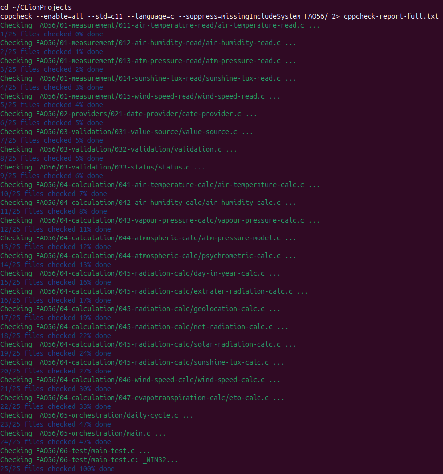

Откроем файл с отчетом `cppcheck-report-full.txt` и проанализируем результат проверки:

```bash
cat cppcheck-report-full.txt
```

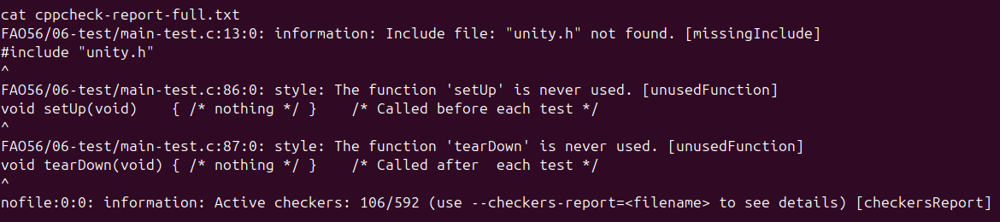

Все три сообщения связаны с тем, что в исходном коде, который читал анализатор, не было файлов библиотеки тестирования `unity`. Элементарный **статический анализ не выявил ошибок** или серьезных проблем в нынешей версии программы.

> На текущем этапе - вычислительного ядра - мы не проводим статический анализ, например, на соответствие требованиям *MISRA C*. Проверка **`cppcheck --misra`** для текущей версии программы дает множество сообщений, ни одно из которых не указывает на ошибку и при этом все сводятся к нескольким типам: стиль либо ложное срабатывание анализатора. Основным предупреждением является указание на *Rule 15.5*: множественный выход из функции. Это правило относится к рекомендациям, а отклоняется нами здесь по той причине, что мы используем защитное кодирование, *guard clauses*, так что действительно из функции различные участки текста отправляются в различные другие места для различных проверок. Нигде, насколько можно судить, это не влияет на захват значений и вычисление, а отказ от защитных проверок в пользу единой точки выхода не сделает наш код безопаснее и надежнее. Другие предупреждения связаны, как правило, с тем, что текущая версия программы содержит решения для ПК: например, включает `<time.h>`, который нам нужен здесь для запуска цикла и проверки документации *FAO56*, или `<stdio.h>`; или предупреждает о двух функциях `main()` - одна из которых находится в слое тестирования и нужна только для запуска юнит-тестов. Короче говоря, на данный момент статический анализ, включая проверки по *MISRA C*, не выявил серьезных проблем.

* * *

## Еще исправления

Если ввести какую-нибудь ошибку - увидим, что программа ведет себя предсказуемо: возвращает нужный статус. Однако мы недавно, разрезая прошую версию файла `main.c` на три новых, заменили возврат из функции `RunDailyCycle()` так, что она возвращает статус - и мы потеряли возможность трассировать места потенциальных сбоев. Нужно это быстро исправить.

К примеру, изменим в файле `deployment-config.h` значение порога:

```C
#define CONFIG_BRIGHT_LUX_THRESHOLD (000.0) // вместо 20000.0
```

Ожидаемо получим ошибку и сообщение:

```bash
Daily cycle failed: STATUS_INVALID_VALUE
Process finished with exit code 1
```

Но мы не видим, в каком месте обработки всего дневного цикла случилась проблема. Мы хотим вернуть возможность трассирования - теперь в логику с нашими новыми функциями `RunDailyCycle()`, `PrintReport()` и `main()`.

* * *

### *Daily cycle failed at...*

Сделаем так, чтобы функция `RunDailyCycle()` после проверки на `NULL` сразу же выставлялась в `OK`, а затем, если какой-нибудь из следующих шагов проваливается, функция меняла бы статус и возвращала имя того шага, на котором произошел отказ. Тогда из функции можно сделать один выход - когда верно одно из двух: либо статус `OK` и *failed step* тоже `OK` (не было сбоев), либо статус не равно `OK` и *failed step* печатает имя функции, в которой произошел провал. Это было бы полезно для отслеживания и не сильно усложнило бы логику программы.

* * *

**`daily-cycle.h`**

Заголовок остается практически тем же, лишь довавляется второй аргумент в объявлении функции:

```C
Status RunDailyCycle(DailyResults *out, const char **out_failed_step);
```

* * *

**`daily-cycle.c`**

```C
Status RunDailyCycle(DailyResults *out, const char **out_failed_step) {
    if ((out == NULL) || (out_failed_step == NULL)) {
        return STATUS_NULL_POINTER;
    }

    *out_failed_step = "OK";

    /* *** Initialization (with formal status check) *** */
    Status status = AirTemperature_Init(&out->temperature_data);
    if (status != STATUS_OK) {
        *out_failed_step = "AirTemperature_Init";
        return status;
    }

    status = AirHumidity_Init(&out->humidity_data);
    if (status != STATUS_OK) {
        *out_failed_step = "AirHumidity_Init";
        return status;
    }

	...
```

И далее - аналогично использовать тот же паттерн до конца блока инициализации в функции `RunDailyCycle()`.

Затем в блоке измерений в той же функции:

```C
    /* *** Measurement layer *** */

    /* Air temperature */
    status = SensorTemperature_ReadInstant(&out->t_sample);
    if (status != STATUS_OK) {
        (void)fprintf(stderr,
                      "No air temperature data, using default value. "
                      "Reason: %s\n", Status_ToString(status));

        status = SensorTemperature_ReadDefault(&out->t_sample);
        if (status != STATUS_OK) {
            *out_failed_step = "SensorTemperature_ReadDefault";
            return status;
        }
    }

    /* Air humidity */
    status = SensorHumidity_ReadInstant(&out->humidity_sample);
    if (status != STATUS_OK) {
        (void)fprintf(stderr,
                      "No air humidity data, using default value. Reason: %s\n",
                      Status_ToString(status));

        status = SensorHumidity_ReadDefault(&out->humidity_sample);
        if (status != STATUS_OK) {
            *out_failed_step = "SensorHumidity_ReadDefault";
            return status;
        }
    }

    status = AirHumidity_Update(&out->humidity_data, out->humidity_sample.RH_pct, out->humidity_sample.timestamp);
    if (status != STATUS_OK) {
        *out_failed_step = "AirHumidity_Update";
        return status;
    }

	...
```

И далее - аналогично, кроме функции `SensorPressure_ReadInstant()` (и вообще тех областей, где работает `fprintf()`).

Затем в блоке вычислений в той же функции:

```C
    /* *** Calculation layer *** */

    /* Air temperature */
    status = AirTemperature_Update(&out->temperature_data, out->t_sample.instant_c, out->t_sample.timestamp);
    if (status != STATUS_OK) {
        *out_failed_step = "AirTemperature_Update";
        return status;
    }

    /* Saturation vapour pressure */
    status = Calc_SaturationVapourPressure(out->temperature_data.T_mean_C, &out->e_tmean);
    if (status != STATUS_OK) {
        *out_failed_step = "Calc_SaturationVapourPressure";
        return status;
    }
```

И далее - аналогично использовать тот же паттерн до конца блока вычисления, включая функции `Calc_ETo()`, `Calc_ETo()`; до конца функции `RunDailyCycle()` и строки `return STATUS_OK;`:

```C
Status RunDailyCycle(DailyResults *out, const char **out_failed_step) {
    
	...
	
    /* Reference evapotranspiration (eq. 6, Penman-Monteith) */
    status = Calc_ETo(
        out->delta,                               /* Δ [kPa/C]                 */
        out->net_radiation.Rn_daily,              /* Rn [MJ m-2 day-1]         */
        ETO_G_DAILY_MJ_M2_DAY,                    /* G = 0 for daily (eq. 42)  */
        out->atmos_data.gamma_kPa_per_C,          /* γ [kPa/C]                 */
        out->temperature_data.T_mean_C,           /* Tmean [C]                 */
        out->u2,                                  /* u2 [m/s]                  */
        out->e_s,                                 /* es [kPa]                  */
        out->ea_kpa,                              /* ea [kPa]                  */
        &out->eto_mm_day                          /* eto [mm/day]              */
    );

    if (status != STATUS_OK) {
        *out_failed_step = "Calc_ETo";
        return status;
    }

    /* Crop evapotranspiration (eq. 56) */
    status = Calc_ETc(out->eto_mm_day, CONFIG_CROP_KC, &out->etc_mm_day);
    if (status != STATUS_OK) {
        *out_failed_step = "Calc_ETc";
        return status;
    }

    return STATUS_OK;
}
```

Функция `PrintReport()` остается без изменений.

* * *

**`main.c`**

Обновим файл основной функции:

```C
#include <stdio.h>
#include "daily-cycle.h"
#include "../03-validation/033-status/status.h"

static int PrintStatusAndReturn(const char *failed_step, const Status status) {
    (void)fprintf(stderr, "Daily cycle failed at %s: %s\n", failed_step, Status_ToString(status));
    return 1;
}

int main(void) {
    DailyResults results;
    const char *failed_step = "unknown";
    const Status status = RunDailyCycle(&results, &failed_step);

    if (status != STATUS_OK) {
        return PrintStatusAndReturn(failed_step, status);
    }

    PrintReport(&results);

    return 0;
}
```

* * *

### Вернемся к проверкам

Во-первых, после всех измнений проведем снова **сборку** двух целей - со всеми указанными ранее флагами, включая флаг **``-Werror``**: `-Wall -Wextra -Werror -Wfloat-equal -Wconversion -Wshadow`.

Получили вывод **без предупреждений**:

```bash
[25/25] Linking C executable fao56_app
Build finished
```

```bash
[27/27] Linking C executable fao56_test
Build finished
```

* * *

Во-вторых, снова запустим **статический анализатор** (убрав из целей анализа папку `cmake-build-debug`):

```bash
cd ~/CLionProjects
cppcheck --enable=all --std=c11 --language=c --suppress=missingIncludeSystem FAO56/ 2> cppcheck-report-full.txt
cat cppcheck-report-full.txt
```

Получили вывод **без значимых предупреждений**:

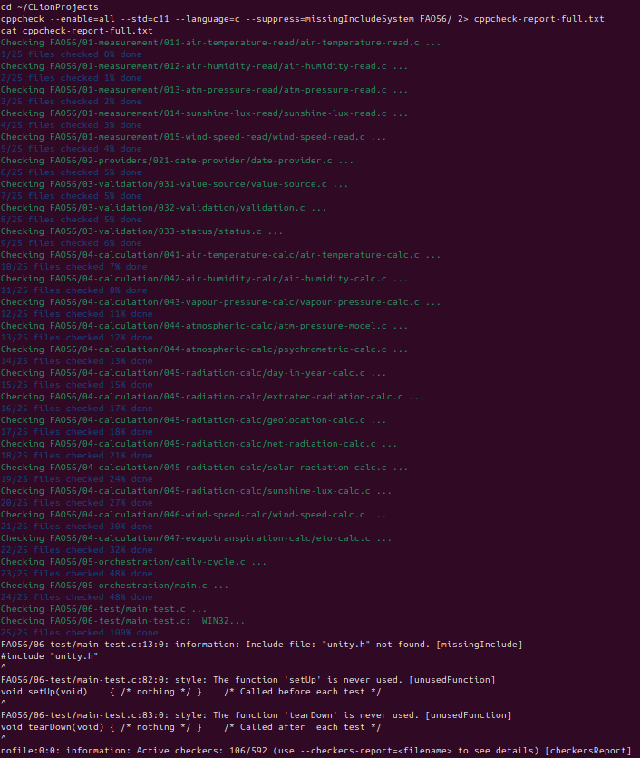

* * *

В-третьих, запустим программу с введенной ранее ошибкой порога освещенности и посмотрим, как теперь работает **трассировка**. Изменим в файле `deployment-config.h` значение порога и запустим программу:

```C
#define CONFIG_BRIGHT_LUX_THRESHOLD (000.0) // вместо 20000.0
```

Ожидаемо получим ошибку и сообщение:

```bash
Daily cycle failed at SunshineLux_Init: STATUS_INVALID_VALUE
Process finished with exit code 1
```

Теперь мы видим, в каком именно месте обработки всего дневного цикла случилась проблема. Это и требовалось.

> Другие проверки проведены, но здесь не приводятся.

* * *

Наконец, в-четвертых, запустим саму программу и затем тестовые сценарии - и проверим **корректность вывода**, сверим вывод **с эталонной документацией *FAO56***.

Запустим **самый последний `fao56_app`** (после всех изменений, сделанных в этом девлоге):

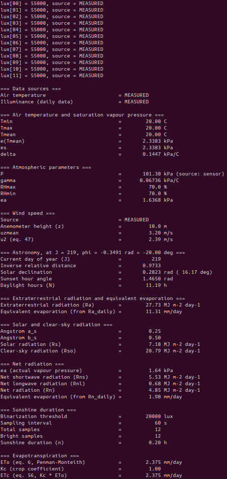

Запустим **прошлый `fao56_app`** (который был на входе, до изменений, внесенных в этом девлоге):


Программа и тестовые сценарии выполняются корректно. Вывод значений соответствует выводам, ранее проверенным по документации *FAO56*.

Запустим **последний `fao56_test`**:

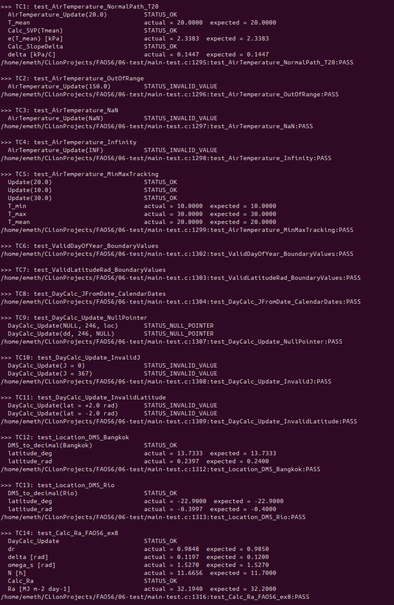  
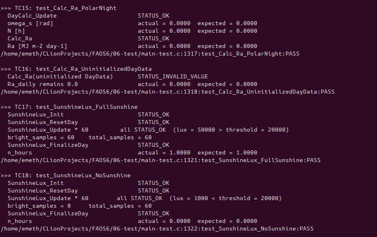  
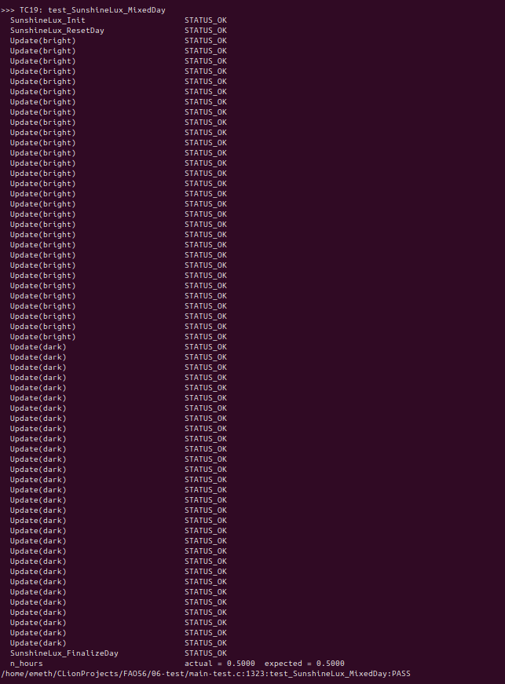  
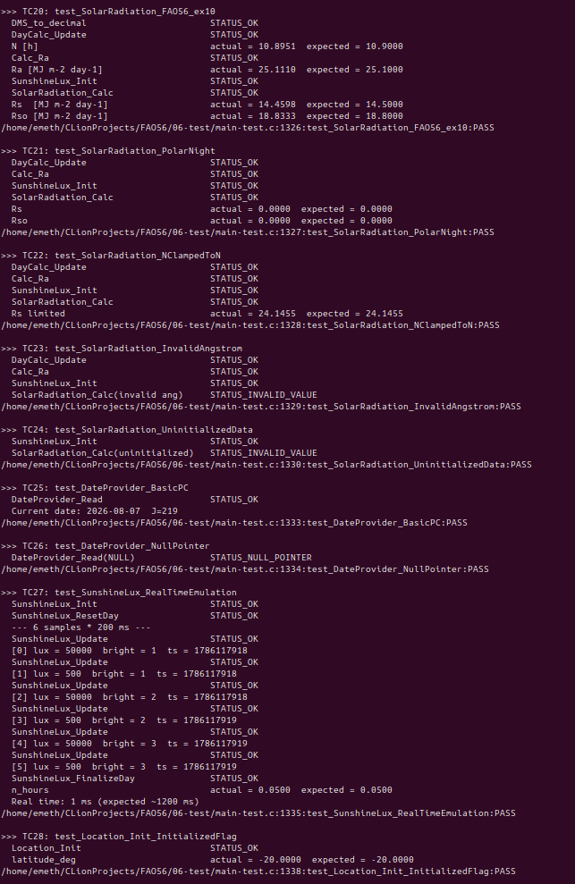  
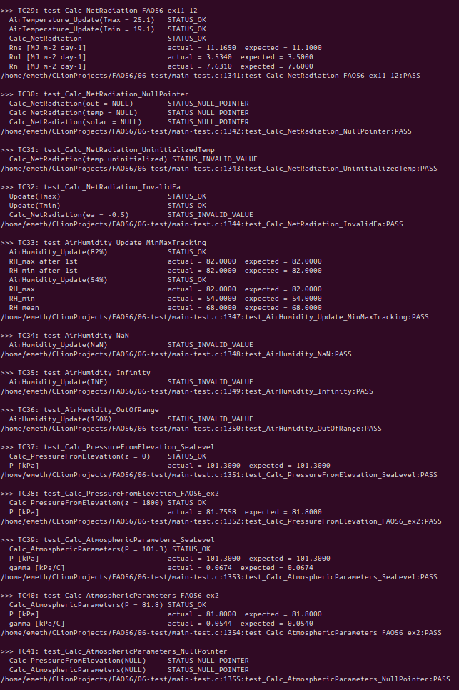  
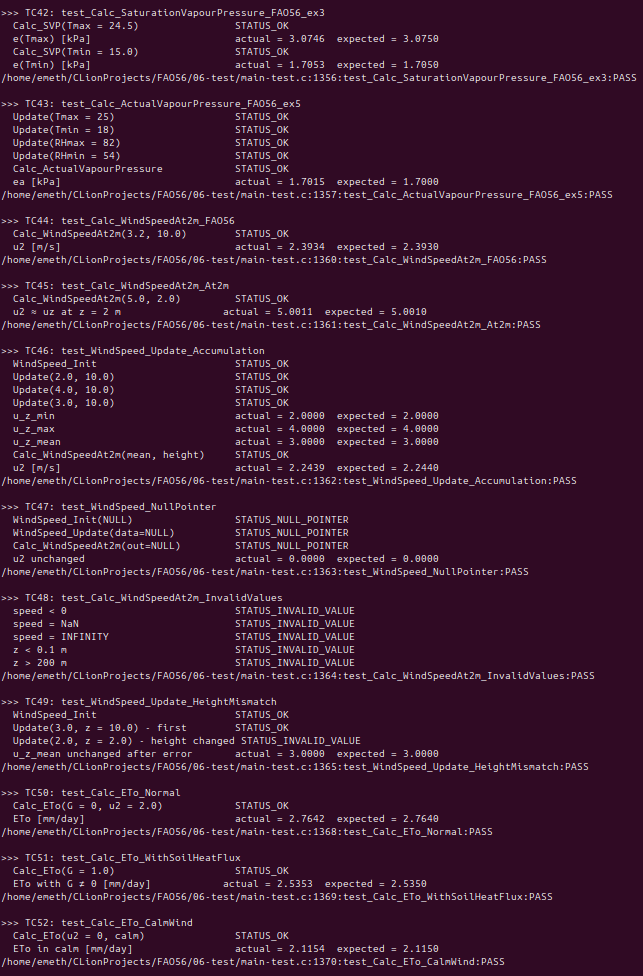  
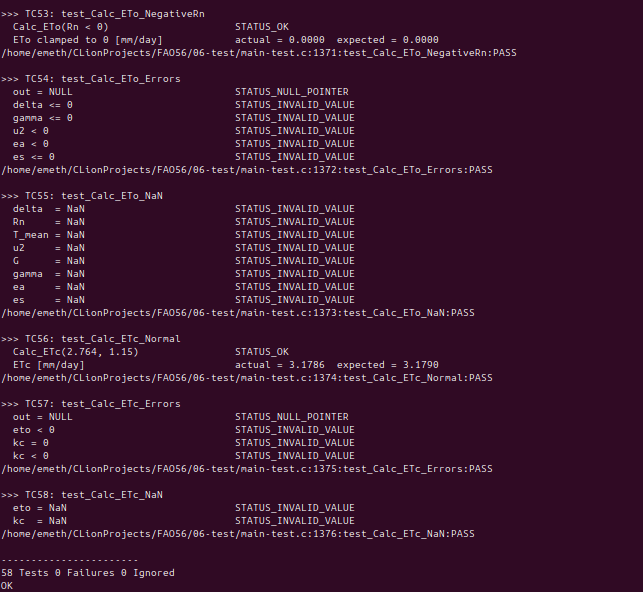

* * *

## Базовая *CI*-автоматизация

Добавим *GitHub Actions workflow* - создадим в корне репозитория каталог `.github/workflows/build-and-test.yml` со следующим содержимым:

```yml
name: Build and Test

on: [push, pull_request]

jobs:
  build-and-test:
    runs-on: ubuntu-latest

    steps:
      - name: Get source code
        uses: actions/checkout@v6

      - name: Configure
        run: cmake -S Code -B build

      - name: Build
        run: cmake --build build

      - name: Test
        run: ctest --test-dir build --output-on-failure
```

При каждом обновлении кода *GitHub* будет автоматически получать текст исходного кода, настраивать проект через *CMake*, собирать приложение и файл тестовых наборов, запускать *CTest*.

* * *

## Что остается и следующие шаги

На этом будем считать первую версию *v0.1.0* программы (вычислительного ядра) в некотором роде завершенной и проверенной. Конечно, для портирования - и даже для первого *smoke*-теста на МК - потребуется ряд изменений и добавлений. К примеру, возникнет **вопрос** с использованием стандартных **библиотек** и вызовов функций. Однако компромисс между удобством при разработке математического ядра системы и строгими требованиями конечной эксплуатации встраиваемого программного обеспечения был выбран сознательно: было бы затруднительно разрабатывать и тестировать ядро программы, используя сразу же все возможные ограничения, принятые для встраиваемых программ.

**Некоторые вопросы** остаются на будущее рассмотрение. Некоторые из них очень важны. Например, очевиден (в смысле наглядности и видимости, а не правильности решения) на данный момент выбор в пользу **типа `double`** во всей программе, несмотря на аппаратную поддержку лишь одинарной точности в целевых МК (*STM32 | Arm Cortex-M4F*). К этому вопросу еще предстоит *вернуться*. Сейчас можно сказать только, что выбор сделан сознательно: он связан с тем, что мы отдали предпочтение точности вычислений перед скоростью и экономией (тактов процессора и, следовательно, энергии). Во-первых, потому, что при разработке и тестировании математического ядра это представляется более важным - характер вычислений при расчете эталонной эвапотранспирации связан с возможностью накопления ошибок при вычислениях с одинарной точностью, а сама эталонная документация *FAO56* содержит величины, склоняющие к использованию `double`. Во-вторых, даже думая о конечной встраиваемой системе, можно предположить, что вычисление уравнения Пенмана-Монтейта раз в сутки даже с "лишними" тактами из-за использования типов `double` не является избыточно затратным. Несмотря на это, к этому вопросу еще предстоит вернуться.

Другим вопросом является унификация **модели накопления данных**. Сейчас используется несколько странное сочетание: одни функции имитируют измерения несколько раз в сутки, другие делают снимок состояния единожды в день. Это очевидный компромисс, на который мы пошли, чтобы провести весь основной цикл вычислений *ET<sub>o</sub>*: нужна была имитация почасовых измерений освещенности. Очевидно, что на обыкновенном домашнем ПК - без использования сенсоров или открытых данных по *API* - проще всего при разработке функций использовать имитацию получаемых данных: так можно проверить поток и конвейер, отвлекаясь на время от всех драйверных и аппаратных задач. К вопросу модели накопления мы перейдем сразу, как только подчключим источник реального времени *RTC* на МК и начнем интегрировать в программу блоки с драйверами реальных сенсоров.

Еще один вопрос связан с калибровкой порога освещенности. Сейчас в файле конфигурации развертки `deployment-config.h` выставлен произвольно высокий порог *20000.0 lux*. Существует возможность сделать пересчет на основе документов ВМО из *Вт/м<sup>2</sup>* в *лм/Вт* и в люксы и/или провести эмпирическую калибровку целевого датчика. К этому вопросу разумно вернуться на этапе разработки драйверов для сенсорных устройств.

**Следующие шаги** будут состоять в подготовке актуальной **документации** вычислительного ядра и программы - к проведению **смоук-теста** и **портированию** на МК.

* * *
