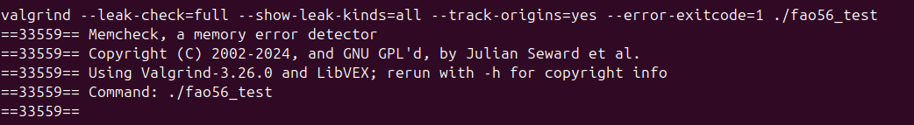
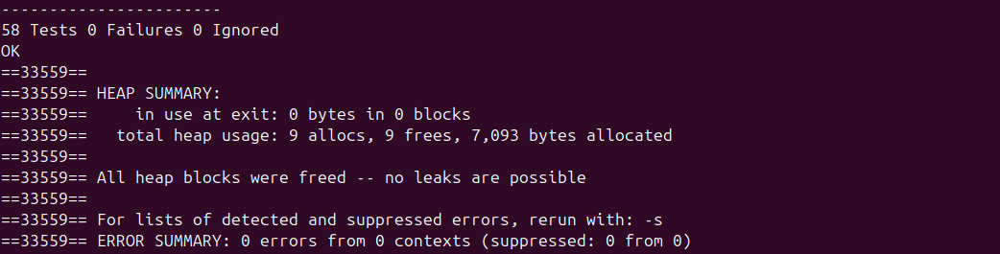
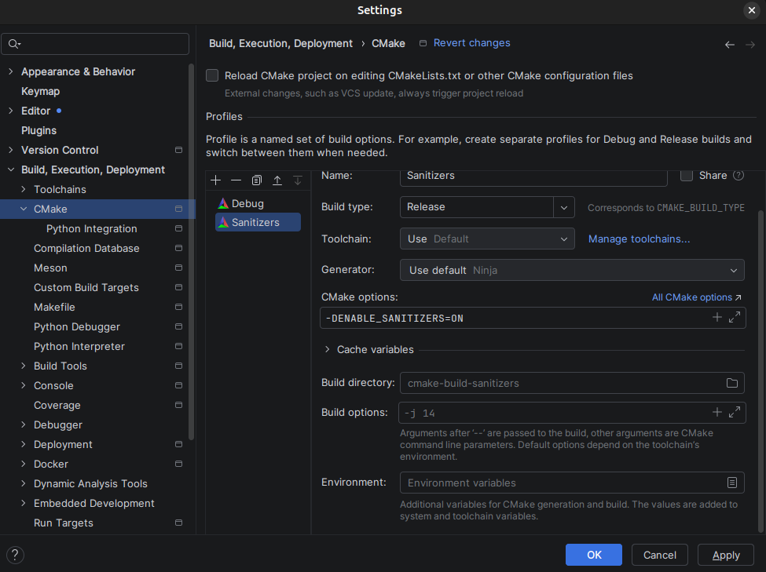
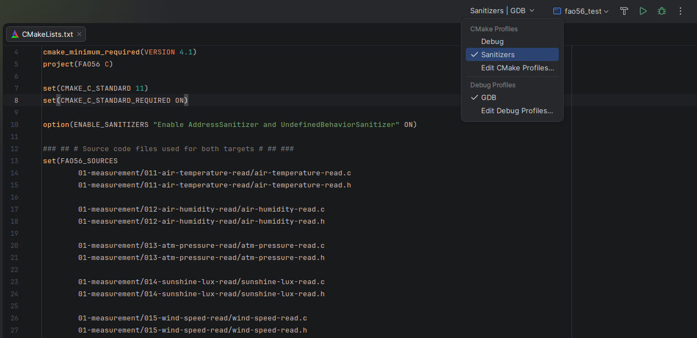
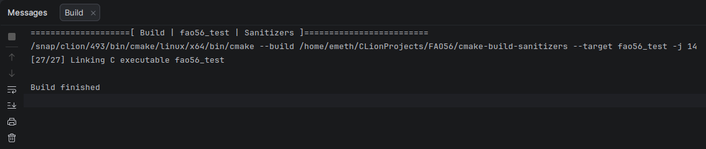
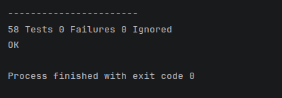

# devlog19. Дополнительные проверки и документация *v0.1.0* (обновляется)

*Adds Valgrind memory checks, introduces optional AddressSanitizer and UndefinedBehaviorSanitizer builds via a dedicated `ENABLE_SANITIZERS` CMake option. Verifies the sanitizer configuration, confirms that all 58 tests pass without sanitizer errors, and validates the actual compile and link flags with a verbose `fao56_test` build. Extends CI with a dedicated sanitizer job that configures, builds, and runs the test suite with CTest. The devlog will be updated with the software architecture documentation and related supporting documents.*

* * *

## Дополнительные проверки

### Valgrind

Запустим проверку `fao56_test`:

```bash
valgrind --leak-check=full --show-leak-kinds=all --track-origins=yes --error-exitcode=1 ./fao56_test
```

  


Проверка завершилась без обнаружения ошибок управления памятью.

**Valgrind** показал `9 allocs, 9 frees`. В файлах нашего исходного кода динамическое выделение памяти не применяется. Дополнительная проверка через **GDB** показала, что наблюдаемое выделение памяти происходит внутри `libc` при работе с локальным временем, а не непосредственно в коде приложения. `DateProvider_Read()` вызывает **API** работы со временем на ПК, после чего системная библиотека при обработке часового пояса (`/etc/localtime`) выполняет внутренний `malloc()`.

Цепочка вызовов имеет следующий вид:

```
__GI___libc_malloc(15)                   [malloc/malloc.c:3294]
    <- __GI___strdup("/etc/localtime")   [string/strdup.c:42]
    <- tzset_internal()                  [time/tzset.c:402]
    <- __tz_convert()                    [time/tzset.c:577]
    <- DateProvider_Read()               [date-provider.c:18]
    <- RunDailyCycle()                   [daily-cycle.c:268]
    <- main()                            [main.c:17]
```

При портировании на МК источник времени будет заменен на **RTC**. Реализацию `DateProvider` нужно будет проверить дополнительно - чтобы работа с **RTC** не приводила к динамическому выделению памяти.

* * *

### AddressSanitizer, UndefinedBehaviorSanitizer

Добавим в `CMakeLists.txt`:

```Cmake
set(CMAKE_C_STANDARD 11)
set(CMAKE_C_STANDARD_REQUIRED ON)

# Добавление
option(ENABLE_SANITIZERS "Enable AddressSanitizer and UndefinedBehaviorSanitizer" OFF)

...

target_link_libraries(fao56_test m unity)
target_compile_definitions(unity PUBLIC UNITY_INCLUDE_DOUBLE)
target_compile_options(fao56_test PRIVATE -Wall -Wextra -Wpedantic -Wfloat-equal -Wconversion -Wshadow -Werror)

# Добавление
if(ENABLE_SANITIZERS)
    target_compile_options(fao56_test PRIVATE 
            -fsanitize=address,undefined 
            -fno-omit-frame-pointer 
            -g
    )

    target_link_options(fao56_test PRIVATE 
            -fsanitize=address,undefined
    )
endif()

# CTest
enable_testing()
add_test(NAME fao56_suite COMMAND fao56_test)
```

Добавим конфигурацию в **CLion**:

```md
File -> Settings -> Build, Execution, Deployment -> CMake
```

Создадим новую конфигурацию с именем `Sanitizers` и включим в **CMake options** строку:

```bash
-DENABLE_SANITIZERS=ON
```



Сохраним настройки.

**CMake profile** `Sanitizers`, затем **target** `fao56_test`.



Запустим сборку.

Получили успешную сборку.



Запустим `fao56_test`.




Тестовая программа завершилась успешно. Сборка и запуск тестов выполнены с включенными **AddressSanitizer** и **UndefinedBehaviorSanitizer**. Все 58 тестов пройдены успешно, сообщений об ошибках не получено.

Корректность применения *sanitizer*-флагов дополнительно проверена с помощью *verbose*-сборки:

```bash
cmake --build cmake-build-sanitizers --target fao56_test --verbose
```

> В командах компиляции исходных файлов `fao56_test` можно видеть флаги `-fsanitize=address,undefined`. При финальной линковке исполняемого файла `fao56_test` этот флаг также присутствует.

* * *

### Автоматизация CI

В файл `.github/workflows/build-and-test.yml` добавим рядом с `build-and-test` новую проверку/`job` (`sanitizer`):

```yaml
name: Build and Test
on: [push, pull_request]

...

  sanitizer:
    runs-on: ubuntu-latest

    steps:
      - name: Get source code
        uses: actions/checkout@v6

      - name: Configure
        run: cmake -S Code -B build-sanitizers -DENABLE_SANITIZERS=ON

      - name: Build
        run: cmake --build build-sanitizers

      - name: Test
        run: ctest --test-dir build-sanitizers --output-on-failure
```

Автоматические проверки настроены и выполняют работу.
