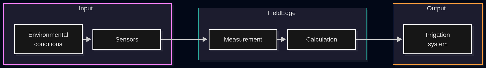
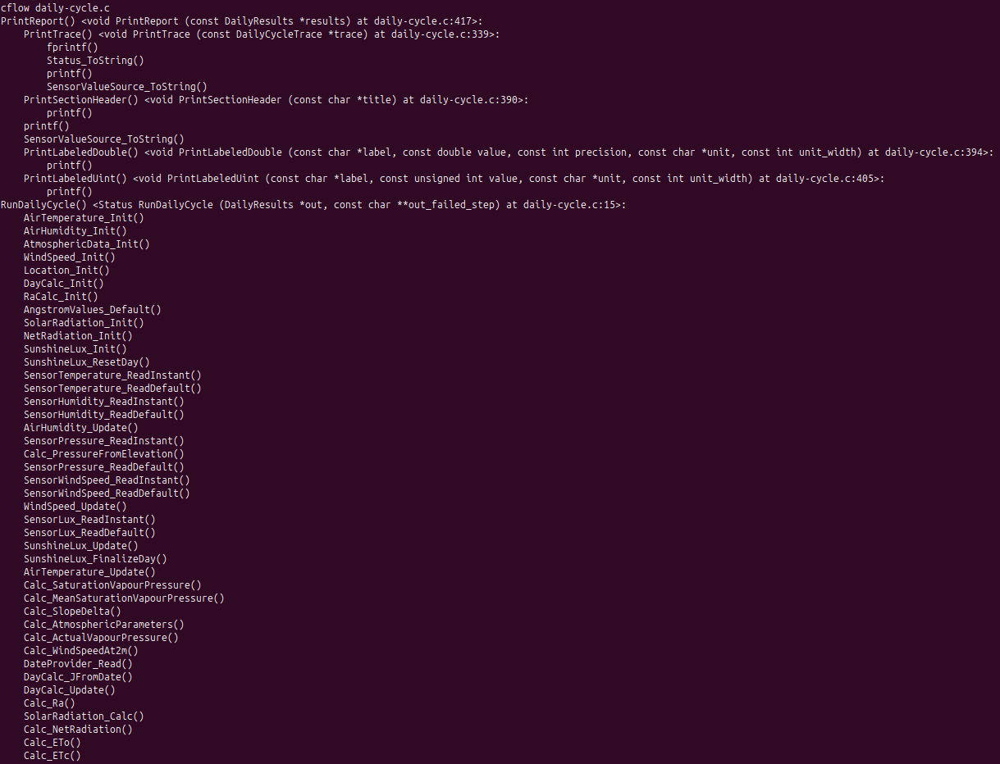
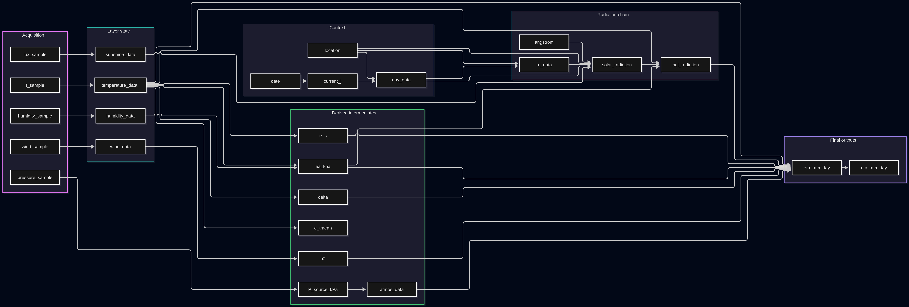

# devlog19. Дополнительные проверки и документация *v0.1.0* (обновляется)

*Adds Valgrind memory checks, introduces optional AddressSanitizer and UndefinedBehaviorSanitizer builds via a dedicated `ENABLE_SANITIZERS` CMake option. Verifies the sanitizer configuration, confirms that all 58 tests pass without sanitizer errors, and validates the actual compile and link flags with a verbose `fao56_test` build. Extends CI with a dedicated sanitizer job that configures, builds, and runs the test suite with CTest. The devlog will be updated with the software architecture documentation and related supporting documents.*

* * *

## Дополнительные проверки

### Valgrind

Запустим проверку `fao56_test`:

```bash
valgrind --leak-check=full --show-leak-kinds=all --track-origins=yes --error-exitcode=1 ./fao56_test
```

  


Проверка завершилась без обнаружения ошибок управления памятью.

**Valgrind** показал `9 allocs, 9 frees`. В файлах нашего исходного кода динамическое выделение памяти не применяется. Дополнительная проверка через **GDB** показала, что наблюдаемое выделение памяти происходит внутри `libc` при работе с локальным временем, а не непосредственно в коде приложения. `DateProvider_Read()` вызывает **API** работы со временем на ПК, после чего системная библиотека при обработке часового пояса (`/etc/localtime`) выполняет внутренний `malloc()`.

Цепочка вызовов имеет следующий вид:

```
__GI___libc_malloc(15)                   [malloc/malloc.c:3294]
    <- __GI___strdup("/etc/localtime")   [string/strdup.c:42]
    <- tzset_internal()                  [time/tzset.c:402]
    <- __tz_convert()                    [time/tzset.c:577]
    <- DateProvider_Read()               [date-provider.c:18]
    <- RunDailyCycle()                   [daily-cycle.c:268]
    <- main()                            [main.c:17]
```

При портировании на МК источник времени будет заменен на **RTC**. Реализацию `DateProvider` нужно будет проверить дополнительно - чтобы работа с **RTC** не приводила к динамическому выделению памяти.

* * *

### AddressSanitizer, UndefinedBehaviorSanitizer

Добавим в `CMakeLists.txt`:

```Cmake
set(CMAKE_C_STANDARD 11)
set(CMAKE_C_STANDARD_REQUIRED ON)

# Добавление
option(ENABLE_SANITIZERS "Enable AddressSanitizer and UndefinedBehaviorSanitizer" OFF)

...

target_link_libraries(fao56_test m unity)
target_compile_definitions(unity PUBLIC UNITY_INCLUDE_DOUBLE)
target_compile_options(fao56_test PRIVATE -Wall -Wextra -Wpedantic -Wfloat-equal -Wconversion -Wshadow -Werror)

# Добавление
if(ENABLE_SANITIZERS)
    target_compile_options(fao56_test PRIVATE 
            -fsanitize=address,undefined 
            -fno-omit-frame-pointer 
            -g
    )

    target_link_options(fao56_test PRIVATE 
            -fsanitize=address,undefined
    )
endif()

# CTest
enable_testing()
add_test(NAME fao56_suite COMMAND fao56_test)
```

Добавим конфигурацию в **CLion**:

```md
File -> Settings -> Build, Execution, Deployment -> CMake
```

Создадим новую конфигурацию с именем `Sanitizers` и включим в **CMake options** строку:

```bash
-DENABLE_SANITIZERS=ON
```


Сохраним настройки.

**CMake profile** `Sanitizers`, затем **target** `fao56_test`.


Запустим сборку.

Получили успешную сборку.


Запустим `fao56_test`.


Тестовая программа завершилась успешно. Сборка и запуск тестов выполнены с включенными **AddressSanitizer** и **UndefinedBehaviorSanitizer**. Все 58 тестов пройдены успешно, сообщений об ошибках не получено.

Корректность применения *sanitizer*-флагов дополнительно проверена с помощью *verbose*-сборки:

```bash
cmake --build cmake-build-sanitizers --target fao56_test --verbose
```

> В командах компиляции исходных файлов `fao56_test` можно видеть флаги `-fsanitize=address,undefined`. При финальной линковке исполняемого файла `fao56_test` этот флаг также присутствует.

* * *

### Автоматизация CI

В файл `.github/workflows/build-and-test.yml` добавим рядом с `build-and-test` новую проверку/`job` (`sanitizer`):

```yaml
name: Build and Test
on: [push, pull_request]

...

  sanitizer:
    runs-on: ubuntu-latest

    steps:
      - name: Get source code
        uses: actions/checkout@v6

      - name: Configure
        run: cmake -S Code -B build-sanitizers -DENABLE_SANITIZERS=ON

      - name: Build
        run: cmake --build build-sanitizers

      - name: Test
        run: ctest --test-dir build-sanitizers --output-on-failure
```

> Автоматические проверки настроены и выполняют работу.

* * *

## Документация

### Контекстная диаграмма

The system operates at the edge, acquiring agrometeorological data from sensors, processing and validating the measurements, and calculating reference evapotranspiration (ETo). The resulting ETo value is provided to an external irrigation system for local irrigation decision-making and control. Version v0.1.x implements the measurement and computation pipeline on a PC using emulated sensor data. Version v0.2.x is the STM32 implementation under development with real sensors, LoRa communication, and real-time operation.



**Mermaid script:**

```
flowchart LR

    subgraph Input[Input]
        ENV[Environmental<br>conditions]
        SENS[Sensors]
    end

    subgraph FieldEdge[FieldEdge]
        MEAS[Measurement]
        CALC[Calculation]
    end

    subgraph Output[Output]
        DEC[Irrigation<br>system]
    end

    ENV --> SENS
    SENS --> MEAS
    MEAS --> CALC
    CALC --> DEC
```

* * *

### Диаграмма архитектуры ПО

#### Общие сведения

The **FieldEdge-Evapotranspiration** software is organized into five functional subsystems with unidirectional dependencies. The **Orchestration** subsystem coordinates the overall measurement and calculation pipeline. Among the downstream components, the **Measurement** subsystem acquires sensor data, **Providers** supply external and deployment-specific data, **Validation** ensures shared validation and status handling, and **Calculation** executes the ETo computation.

The **Calculation** subsystem remains independent of sensor hardware, decoupled from data ingestion, and is invoked by the **Orchestration** subsystem with pre-validated inputs.

* * *

#### Структура проекта

The project structure for v0.1.x is as follows.

```md
FieldEdge-Evapotranspiration	
  01-measurement	
    011-air-temperature-read	
        air-temperature-read.c	
        air-temperature-read.h	
    012-air-humidity-read	
        air-humidity-read.c	
        air-humidity-read.h	
    013-atm-pressure-read	
        atm-pressure-read.c	
        atm-pressure-read.h	
    014-sunshine-lux-read	
        sunshine-lux-read.c	
        sunshine-lux-read.h	
    015-wind-speed-read	
        wind-speed-read.c	
        wind-speed-read.h	
  02-providers	
    021-date-provider	
        date-provider.c	
        date-provider.h	
    022-configurations	
        deployment-config.h	
  03-validation	
    031-value-source	
        value-source.c	
        value-source.h	
    032-validation	
        validation.c	
        validation.h	
    033-status	
        status.c	
        status.h	
    034-math-utils	
        math-utils.h	
  04-calculation	
    041-air-temperature-calc	
        air-temperature-calc.c	
        air-temperature-calc.h	
    042-air-humidity-calc	
        air-humidity-calc.c	
        air-humidity-calc.h	
    043-vapour-pressure-calc	
        vapour-pressure-calc.c	
        vapour-pressure-calc.h	
    044-atmospheric-calc	
        atm-pressure-model.c	
        atm-pressure-model.h	
        psychrometric-calc.c	
        psychrometric-calc.h	
    045-radiation-calc	
        day-in-year-calc.c	
        day-in-year-calc.h	
        extrater-radiation-calc.c	
        extrater-radiation-calc.h	
        geolocation-calc.c	
        geolocation-calc.h	
        net-radiation-calc.c	
        net-radiation-calc.h	
        solar-radiation-calc.c	
        solar-radiation-calc.h	
        sunshine-lux-calc.c	
        sunshine-lux-calc.h	
    046-wind-speed-calc	
        wind-speed-calc.c	
        wind-speed-calc.h	
    047-evapotranspiration-calc	
        eto-calc.c	
        eto-calc.h	
  05-orchestration	
        daily-cycle.c	
        daily-cycle.h	
        main.c	
  06-test	
        main-test.c	
        test-config.h
  CMakeLists.txt
```

* * *

#### Слои и модули

The core of the system consists of two independent layers: `measurement` (01) and `calculation` (04). Neither depends on the other — there is no dependency edge between them in either direction. They are connected only through `orchestration` (05), which reads sensor data and invokes the calculation pipeline within the same run.

`validation` (03) serves as the foundation: every other layer depends on it, and it has no outgoing dependencies of its own. `providers` (02) is a shared supporting layer that also depends on `validation` (03).

Calculation functions operate on validated physical values rather than raw sensor readings. This allows the entire `measurement` (01) layer to be reworked (e.g., to integrate sensor/peripheral drivers in v0.2.x) without touching a single `calculation` (04) module.


**Mermaid script:**

```
flowchart TB

    subgraph Measurement[01 · Measurement]
        M1[air-temperature-read]
        M2[air-humidity-read]
        M3[atm-pressure-read]
        M4[sunshine-lux-read]
        M5[wind-speed-read]
    end

    subgraph Providers[02 · Providers]
        P1[date-provider]
        P2[configurations]
    end

    subgraph Validation[03 · Validation]
        V1[value-source]
        V2[validation]
        V3[status]
        V4[math-utils]
    end

    subgraph Calculation[04 · Calculation]
        C1[air-temperature-calc]
        C2[air-humidity-calc]
        C3[vapour-pressure-calc]
        C4[atmospheric-calc]
        C5[radiation-calc]
        C6[wind-speed-calc]
        C7[evapotranspiration-calc]
    end

    subgraph Orchestration[05 · Orchestration]
        O1[main]
        O2[daily-cycle]
    end

    O1 --> O2

    O2 --> Measurement
    O2 --> Providers
    O2 --> Validation
    O2 --> Calculation

    Calculation --> Providers
    Calculation --> Validation
    Measurement --> Providers
    Measurement --> Validation
    Providers --> Validation
```

**Note.** For dependencies between individual functions, types, and modules, see the Doxygen reference (a link will be added later).

* * *

### Подтвержденный порядок вызовов

*Verified call graph* описан на основе анализа кода статическими и динамическими средствами: *cflow* и *gdb*. Подробный лог работы с отладчиком занял бы слишком много места даже для девлога. Результаты анализа и документацию вызовов см. непосредственно в файле [`verified-call-graph.md`](../../verified-call-graph.md). Ниже приводится вывод статической структуры вызовов первого уровня для оркестрирующей функции `RunDailyCycle()`.



* * *

### Документация открытых проблем

Для v0.1.0 задокументированы следующие проблемы (см. [`issues-v01x.md`](../../issues-v01x.md)).

#### 1. Из раздела *"Limitations and open questions of v0.1.x"* `README.md`:

* Sensor data is currently emulated using fixed constants; no real hardware is involved yet.  
* `time()` from `<time.h>` is used for the current day of year and illuminance measurement timestamps. The PC implementation causes an internal heap allocation in `libc` when timezone information is initialized; this allocation is not performed by application code. When porting to an MCU, the PC time implementation will be replaced with RTC access, and the MCU implementation should be verified to ensure that it does not introduce dynamic memory allocation.  
* State is not persisted between runs (EEPROM/Flash persistence is planned for v0.2.x).  
* The pipeline computes a single daily cycle per run; the sampling model (some sensors read once, illuminance read on a fixed interval) is a PC-development convenience and will be unified into one periodic model once real-time sampling on the MCU is designed.  
* All computation uses `double` throughout, though the target MCUs (Arm Cortex-M4F) only have single-precision hardware floating point support. This is a deliberate choice: accuracy took priority over speed for a value computed once per day, and the FAO-56 reference values were validated at `double` precision. This decision will be revisited when real timing data from the MCU port is available.  
* The illuminance-based sunshine-duration threshold is a preliminary estimate, not yet empirically calibrated against real hardware — planned for the sensor-driver development stage.

* * *

#### 2. Из первой версии документа `issues-v01x.md`:

**A) `pressure_sample.source` may read indeterminate memory.**

* Location: `Code/05-orchestration/daily-cycle.c`, pressure acquisition branch. Root cause: `Code/05-orchestration/main.c:15` (`DailyResults results;`, declared without an initializer).  
* If `SensorPressure_ReadInstant()` fails while `Calc_PressureFromElevation()` (the elevation-model fallback) succeeds, `pressure_sample` is never written in that branch. `PrintReport()` later reads `pressure_sample.source` to label the pressure source as “sensor” or “model/constant”; in this branch, the field holds indeterminate stack memory rather than a defined value. Because `SENSOR_VALUE_MEASURED` is `0` (see `value-source.h`), a zero-valued leftover byte pattern would silently print “sensor” for a value that came from the model — no error, no abnormal `Status`, only a mislabeled report line.  
* Status: latent on the PC build. All `Sensor*_ReadInstant()` mock implementations return a non-`STATUS_OK` status only on a `NULL` output pointer, and every call site in `RunDailyCycle()` passes a valid pointer — so this branch is currently unreachable (see `verified-call-graph.md`, “Unverified branches”). It becomes live once a real pressure sensor driver can fail independently of the model. Recommended fix before enabling that driver: zero-initialize `results` in `main()`, or set `pressure_sample.source` explicitly on the model-fallback path.  
* Full derivation: `dataflow-specification.md`, Observations, item 2 (link to be added).

**B) `e_tmean` is computed but not propagated.**

* Location: `Code/04-calculation/043-vapour-pressure-calc`. Computed by `Calc_SaturationVapourPressure()` from `temperature_data.T_mean_C`, consumed only by `PrintReport()`.  
* The ETo calculation uses `e_s` (from `Calc_MeanSaturationVapourPressure()`), not `e_tmean`. The underlying formula is independently exercised by `test_AirTemperature_NormalPath_T20` in `main-test.c`; this item is about an unused field in the production dataflow, not an unverified calculation.  
* Status: no functional impact. Either remove the field from `DailyResults`, or document explicitly that it is diagnostic-only.  
* Full derivation: `dataflow-specification.md`, Observations, item 1 (link to be added).

**C) `double` precision margin relative to the target FPU.**

* Location: throughout `Code/04-calculation`.  
* Already tracked in the `README`’s “Limitations and open questions of v0.1.x” as a deliberate, revisit-later decision. Added here as supporting evidence: the existing tolerances, e.g. `TOL_KPA = 0.0001` in `Code/06-test/test-config.h`, are broadly compatible with the numerical resolution of single-precision float for values in the expected operating range. Since the STM32’s Cortex-M4F provides a single-precision FPv4-SP FPU, this supports the feasibility of a future float migration, but the migration should still be validated against actual value ranges and accumulated numerical error.  
* Status: open, per `README`, pending real data from the MCU port.

**D) Time zone dependency of `DateProvider_Read`.**

* Location: `Code/02-providers/021-date-provider/date-provider.c`.  
* `localtime()` resolves the current date using the host’s/runtime’s configured local time zone. Day-of-year and solar declination calculations are date-sensitive at the midnight boundary.  
* Status: open design question for the RTC-based replacement planned for v0.2.x. The time-base semantics (UTC vs. local time, and any required time-zone/DST handling) should be defined explicitly rather than relying on host-runtime time-zone configuration that will not be implicitly available on the MCU.

* * *

### Решение некоторых проблем и обновление документации

Некоторые проблемы из вышеприведенного списка решим сразу же. В частности, решим проблему **A)** и обновим документацию. Кроме того, при анализе проблемы **А)** мы обнаружили, что тот же блок кода не содержит, как нам бы хотелось, инструкции для трассирования потенциальных сбоев. Речь об этом участке кода из функции `RunDailyCycle()` файла `daily-cycle.c`:

```C
    /* Atmospheric pressure (priority sources for P) */
    status = SensorPressure_ReadInstant(&out->pressure_sample);
    out->trace.pressure_read_status = status;
    if (status == STATUS_OK) {
        /* Source 1: sensor */
        out->P_source_kPa = out->pressure_sample.P_kPa;
    } else {
        /* Source 2: eq. 7 model, preferred fallback */
        status = Calc_PressureFromElevation(out->location.elevation_m,
            &out->P_source_kPa);

        out->trace.pressure_model_status = status;

        if (status != STATUS_OK) {
            /* Source 3: final fallback level */
            (void)SensorPressure_ReadDefault(&out->pressure_sample);

            out->P_source_kPa = out->pressure_sample.P_kPa;
        }
    }
```

Как видно, кроме описанной выше проблемы **A)**, здесь также отсутствует регулярная для этой функции *fail-fast* идиома, а именно:

```C
	status = Step(...);
	if (status != STATUS_OK) {
	    *out_failed_step = "Step";
	    return status;
	}
```

Решим обе эти проблемы следующим образом:

```C
    /* Atmospheric pressure (priority sources for P) */
    status = SensorPressure_ReadInstant(&out->pressure_sample);
    out->trace.pressure_read_status = status;
    if (status == STATUS_OK) {
        /* Source 1: sensor */
        out->P_source_kPa = out->pressure_sample.P_kPa;
    } else {
        /* Not from the sensor: everything below is reported as "model/constant" */
        out->pressure_sample.source = SENSOR_VALUE_DEFAULT;

        /* Source 2: eq. 7 model, preferred fallback */
        status = Calc_PressureFromElevation(out->location.elevation_m, &out->P_source_kPa);
        out->trace.pressure_model_status = status;

        if (status != STATUS_OK) {
            /* Source 3: final fallback level */
            status = SensorPressure_ReadDefault(&out->pressure_sample);
            if (status != STATUS_OK) {
                *out_failed_step = "SensorPressure_ReadDefault";
                return status;
            }

            out->P_source_kPa = out->pressure_sample.P_kPa;
        }
    }
```

> После внесенных изменений тесты, сборка, анализатор, санитайзеры, программа были запущены - итоговое состояние кода v0.1.0 **проверено** перед публикацией обновлений, программа работает корректно, все ранее описанные проверки и результаты остаются в силе.

* * *

#### Обновим документацию

- Уберем из `issues-v01x.md` пункт **"`pressure_sample.source` may read indeterminate memory"**.

- Уберем из `dataflow-specification.md` (документ готовится и к настоящему моменту еще не опубликован) пункт `Observations, item 2` с тем же содержанием.

- Обновим нумерацию строк кода в документе `verified-call-graph.md` - все *GDB*-документированные функции ниже `SensorPressure_ReadInstant()` изменили построчную нумерацию на +5 строк, это должно быть отражено в обновленном документе (в этом девлоге нумерация остается без изменений и хранит первоначальную запись).

* * *

### Спецификация потока данных

#### Scope

This document specifies the data flow of the `RunDailyCycle()` daily measurement-and-calculation cycle, expressed as producer/consumer relationships over the fields of the `DailyResults` structure. It complements `verified-call-graph.md`, which specifies control flow (call order) for the same function.

* * *

#### Data model

`DailyResults` is a single struct, owned and fully populated by one call to `RunDailyCycle()`. It holds six categories of data:

1. **Acquisition samples** — raw sensor readings, one struct per channel.  
2. **Layer state** — per-channel running data, derived from an initialization call and updated from the corresponding acquisition sample.  
3. **Time and location context** — date, computed day-of-year, and static location constants.  
4. **Radiation chain** — radiation quantities feeding the evapotranspiration calculation.  
5. **Derived intermediates** — single-shot values and small composite results computed once from earlier layers.  
6. **Final outputs** — two final results, ETo and ETc.

**Note.** A **seventh field**, `trace`, is a cross-cutting **diagnostics** record written throughout the function rather than by a single step.

* * *

#### Field reference

**Acquisition samples**

| Field | Producer | Consumers | Note |
|---|---|---|---|
| `t_sample` | `SensorTemperature_ReadInstant`, or `SensorTemperature_ReadDefault` on failure | `AirTemperature_Update`; `PrintReport` (`.source`) | — |
| `humidity_sample` | `SensorHumidity_ReadInstant`, or `SensorHumidity_ReadDefault` on failure | `AirHumidity_Update` | — |
| `pressure_sample` | `SensorPressure_ReadInstant`; `SensorPressure_ReadDefault` only if both the sensor read and the elevation model fail | Assignment to `P_source_kPa`; `PrintReport` (`.source`) | — |
| `wind_sample` | `SensorWindSpeed_ReadInstant`, or `SensorWindSpeed_ReadDefault` on failure | `WindSpeed_Update`; `PrintReport` (`.source`) | — |
| `lux_sample` | `SensorLux_ReadInstant`, or `SensorLux_ReadDefault` on failure; written once per loop iteration (12 iterations) | `SunshineLux_Update` (same iteration); copied into `trace.lux_samples[i]` | Holds only the final iteration’s value after the loop; not read again after loop exit |

* * *

**Layer state**

| Field | Producer `init` | Producer `update` | Consumers |
|---|---|---|---|
| `temperature_data` | `AirTemperature_Init` | `AirTemperature_Update`, from `t_sample` | `Calc_SaturationVapourPressure`, `Calc_MeanSaturationVapourPressure`, `Calc_SlopeDelta`, `Calc_ActualVapourPressure`, `Calc_NetRadiation`, `Calc_ETo`, `PrintReport` |
| `humidity_data` | `AirHumidity_Init` | `AirHumidity_Update`, from `humidity_sample` | `Calc_ActualVapourPressure`, `PrintReport` |
| `wind_data` | `WindSpeed_Init` | `WindSpeed_Update`, from `wind_sample` | `Calc_WindSpeedAt2m`, `PrintReport` |
| `sunshine_data` | `SunshineLux_Init`, `SunshineLux_ResetDay` | `SunshineLux_Update` (x12), `SunshineLux_FinalizeDay` | `SolarRadiation_Calc`, `PrintReport` |

**Note.** The “Layer state” groups functions implementing a stateful accumulator pattern: data structures are initialized once and then updated incrementally by dedicated `_Update()` functions, with an `initialized` flag indicating whether valid data has been accumulated. In the subsequent processing layer, `Calc_X()` functions are used instead; they are stateless and simply transform inputs into outputs without retaining data between calls.

* * *

**Time and location context**

| Field | Producer | Consumers |
|---|---|---|
| `location` | `Location_Init` (static; no update step) | `Calc_PressureFromElevation`, `DayCalc_Update`, `Calc_Ra`, `SolarRadiation_Calc`, `PrintReport` |
| `date` | `DateProvider_Read` | `DayCalc_JFromDate` |
| `current_j` | `DayCalc_JFromDate`, from `date` | `DayCalc_Update`, `PrintReport` |
| `day_data` | `DayCalc_Init`, then `DayCalc_Update` from `current_j` and `location` | `Calc_Ra`, `SolarRadiation_Calc`, `PrintReport` |

* * *

**Radiation chain**

| Field | Producer | Consumers |
|---|---|---|
| `ra_data` | `RaCalc_Init`, then `Calc_Ra` from `day_data`, `location` | `SolarRadiation_Calc`, `PrintReport` |
| `angstrom` | `AngstromValues_Default` | `SolarRadiation_Calc`, `PrintReport` |
| `solar_radiation` | `SolarRadiation_Init`, then `SolarRadiation_Calc` from `angstrom`, `ra_data`, `day_data`, `sunshine_data`, `location` | `Calc_NetRadiation`, `PrintReport` |
| `net_radiation` | `NetRadiation_Init`, then `Calc_NetRadiation` from `temperature_data`, `solar_radiation`, `ea_kpa` | `Calc_ETo`, `PrintReport` |

* * *

**Derived intermediates**

| Field | Producer | Consumers | Note |
|---|---|---|---|
| `e_tmean` | `Calc_SaturationVapourPressure`, from `temperature_data.T_mean_C` | `PrintReport` only | See note 1 below |
| `e_s` | `Calc_MeanSaturationVapourPressure`, from `temperature_data` | `Calc_ETo`, `PrintReport` | — |
| `delta` | `Calc_SlopeDelta`, from `temperature_data` | `Calc_ETo`, `PrintReport` | — |
| `ea_kpa` | `Calc_ActualVapourPressure`, from `temperature_data`, `humidity_data` | `Calc_NetRadiation`, `Calc_ETo`, `PrintReport` | — |
| `P_source_kPa` | `pressure_sample.P_kPa`, or `Calc_PressureFromElevation` | `Calc_AtmosphericParameters` | Not printed directly; the reported value is `atmos_data.P_kPa`; two of three possible sources are plain field copies, not function results — see the `pressure_sample` row above |
| `atmos_data` | `AtmosphericData_Init`, then `Calc_AtmosphericParameters`, from `P_source_kPa` | `Calc_ETo`, `PrintReport` | See note 2 below |
| `u2` | `Calc_WindSpeedAt2m`, from `wind_data` | `Calc_ETo`, `PrintReport` | — |

**Note 1.** `e_tmean` is computed by `Calc_SaturationVapourPressure` from `temperature_data.T_mean_C`, but is not read by any subsequent calculation step; its only consumer is `PrintReport`. The final ETo calculation uses `e_s` (from `Calc_MeanSaturationVapourPressure`), not `e_tmean`. The formula itself is independently exercised by `test_AirTemperature_NormalPath_T20` in `main-test.c`, against `TEST_E_TMEAN_EXPECTED`; this observation is about an unused field in the production data flow, not an unverified calculation. See also `Issues v0.1.x`.

**Note 2.** `atmos_data` sits here, not under “Layer state”, despite having its own `_Init()`: it has no acquisition sample and no `_Update()` — it is a single-shot `Calc_AtmosphericParameters()` result, same as every other field in this section, and its `gamma_kPa_per_C` is one of `Calc_ETo`’s eight direct inputs. It is the one struct-typed member of this section; every other field here is a bare `double`. It stays a 2-field struct rather than two bare `double`s only “so that P and γ are kept as a pair” (`psychrometric-calc.h`).

* * *

**Final outputs**

| Field | Producer | Consumers |
|---|---|---|
| `eto_mm_day` | `Calc_ETo`, from `delta`, `net_radiation.Rn_daily`, `atmos_data.gamma_kPa_per_C`, `temperature_data.T_mean_C`, `u2`, `e_s`, `ea_kpa` | `Calc_ETc`, `PrintReport` |
| `etc_mm_day` | `Calc_ETc`, from `eto_mm_day` | `PrintReport`; terminal, no further consumer in this codebase |

* * *

**Diagnostics**

| Field | Producer | Consumers |
|---|---|---|
| `trace` | `RunDailyCycle()` directly — one assignment per acquisition step, plus `lux_samples[i]` in the measurement loop | `PrintTrace`, called from both `PrintReport` (success) and `PrintStatusAndReturn` (failure, `main.c`) |

* * *

#### Data flow diagram

A view of the same data flow, grouped by the categories defined in “Data model” and “Field reference” above.



**Mermaid script:**

```
flowchart LR
    subgraph Acquisition
        TS[t_sample]
        HS[humidity_sample]
        PS[pressure_sample]
        WS[wind_sample]
        LS[lux_sample]
    end

    subgraph LayerState[Layer state]
        TD[temperature_data]
        HD[humidity_data]
        WD[wind_data]
        SD[sunshine_data]
    end

    subgraph Context
        LOC[location]
        DATE[date]
        CJ[current_j]
        DD[day_data]
    end

    subgraph Radiation[Radiation chain]
        RA[ra_data]
        ANG[angstrom]
        SR[solar_radiation]
        NR[net_radiation]
    end

    subgraph Scalars[Derived intermediates]
        ETM[e_tmean]
        ES[e_s]
        DELTA[delta]
        EA[ea_kpa]
        PSRC[P_source_kPa]
        AD[atmos_data]
        U2[u2]
    end

    subgraph Outputs[Final outputs]
        ETO[eto_mm_day]
        ETC[etc_mm_day]
    end

    TS --> TD
    HS --> HD
    PS --> PSRC
    WS --> WD
    LS --> SD

    TD --> ETM
    TD --> ES
    TD --> DELTA
    TD --> EA
    TD --> ETO
    HD --> EA

    LOC --> DD
    DATE --> CJ --> DD
    LOC --> RA
    DD --> RA
    LOC --> SR
    DD --> SR
    ANG --> SR
    SD --> SR
    RA --> SR

    PSRC --> AD
    AD --> ETO

    TD --> NR
    SR --> NR
    EA --> NR
    NR --> ETO

    WD --> U2
    U2 --> ETO
    ES --> ETO
    DELTA --> ETO
    EA --> ETO

    ETO --> ETC
```

**Note.** The `trace` is omitted from the diagram — it is written by nearly every step.
