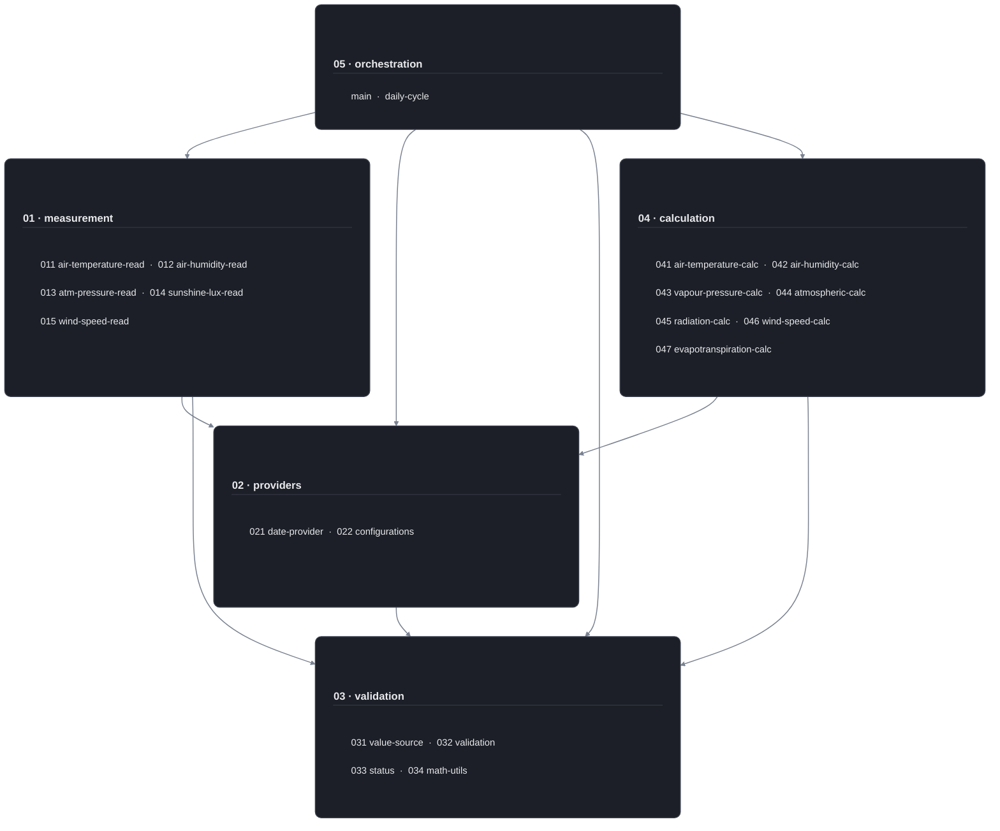
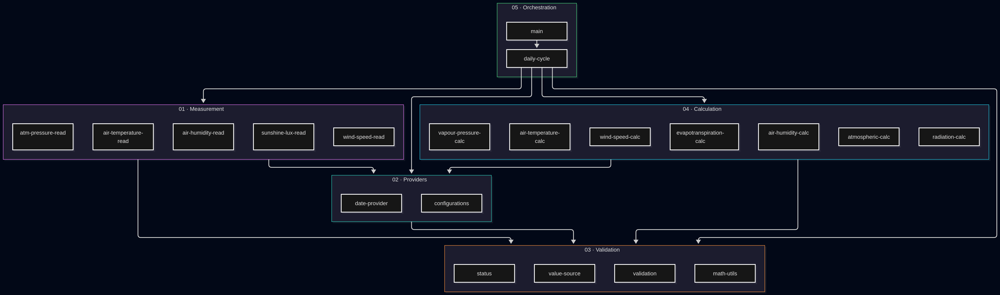

# High-level architecture: layers & modules

## General information

The **FieldEdge-Evapotranspiration** software is organized into five functional subsystems with unidirectional dependencies. The **Orchestration** subsystem coordinates the overall measurement and calculation pipeline. Among the downstream components, the **Measurement** subsystem acquires sensor data, **Providers** supply external and deployment-specific data, **Validation** ensures shared validation and status handling, and **Calculation** executes the ETo computation.

The **Calculation** subsystem remains independent of sensor hardware, decoupled from data ingestion, and is invoked by the **Orchestration** subsystem with pre-validated inputs.

* * *

## Project structure

The project structure for v0.1.x is as follows.

```md
FieldEdge-Evapotranspiration	
  01-measurement	
    011-air-temperature-read	
        air-temperature-read.c	
        air-temperature-read.h	
    012-air-humidity-read	
        air-humidity-read.c	
        air-humidity-read.h	
    013-atm-pressure-read	
        atm-pressure-read.c	
        atm-pressure-read.h	
    014-sunshine-lux-read	
        sunshine-lux-read.c	
        sunshine-lux-read.h	
    015-wind-speed-read	
        wind-speed-read.c	
        wind-speed-read.h	
  02-providers	
    021-date-provider	
        date-provider.c	
        date-provider.h	
    022-configurations	
        deployment-config.h	
  03-validation	
    031-value-source	
        value-source.c	
        value-source.h	
    032-validation	
        validation.c	
        validation.h	
    033-status	
        status.c	
        status.h	
    034-math-utils	
        math-utils.h	
  04-calculation	
    041-air-temperature-calc	
        air-temperature-calc.c	
        air-temperature-calc.h	
    042-air-humidity-calc	
        air-humidity-calc.c	
        air-humidity-calc.h	
    043-vapour-pressure-calc	
        vapour-pressure-calc.c	
        vapour-pressure-calc.h	
    044-atmospheric-calc	
        atm-pressure-model.c	
        atm-pressure-model.h	
        psychrometric-calc.c	
        psychrometric-calc.h	
    045-radiation-calc	
        day-in-year-calc.c	
        day-in-year-calc.h	
        extrater-radiation-calc.c	
        extrater-radiation-calc.h	
        geolocation-calc.c	
        geolocation-calc.h	
        net-radiation-calc.c	
        net-radiation-calc.h	
        solar-radiation-calc.c	
        solar-radiation-calc.h	
        sunshine-lux-calc.c	
        sunshine-lux-calc.h	
    046-wind-speed-calc	
        wind-speed-calc.c	
        wind-speed-calc.h	
    047-evapotranspiration-calc	
        eto-calc.c	
        eto-calc.h	
  05-orchestration	
        daily-cycle.c	
        daily-cycle.h	
        main.c	
  06-test	
        main-test.c	
        test-config.h
  CMakeLists.txt
```

* * *

## Layers & modules diagram

The core of the system consists of two independent layers: `measurement` (01) and `calculation` (04). Neither depends on the other — there is no dependency edge between them in either direction. They are connected only through `orchestration` (05), which reads sensor data and invokes the calculation pipeline within the same run.

`validation` (03) serves as the foundation: every other layer depends on it, and it has no outgoing dependencies of its own. `providers` (02) is a shared supporting layer that also depends on `validation` (03).

Calculation functions operate on validated physical values rather than raw sensor readings. This allows the entire `measurement` (01) layer can be reworked (e.g., to integrate sensor/peripheral drivers in v0.2.x) without touching a single `calculation` (04) module.



* * *

For dependencies between individual functions, types, and modules, see the Doxygen reference (a link will be added later).

A fallback image in case the Mermaid diagram does not display correctly.



* * *

## Related documents

* [`System context diagram`](system-context-diagram.md).  
* [`Verified call graph`](verified-call-graph.md).  
* `Dataflow specification` (link to be added).  
* `Doxygen contracts` and `conventions` (link to be added).
