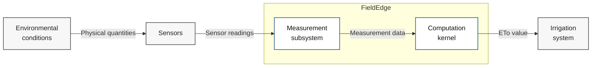

## System context

The system operates at the edge, acquiring agrometeorological data from sensors, processing and validating the measurements, and calculating reference evapotranspiration (ETo). The resulting ETo value is provided to an external irrigation system for local irrigation decision-making and control. Version v0.1.x implements the measurement and computation pipeline on a PC using emulated sensor data. Version v0.2.x is the STM32 implementation under development with real sensors, LoRa communication, and real-time operation.

* * *

### System context diagram

