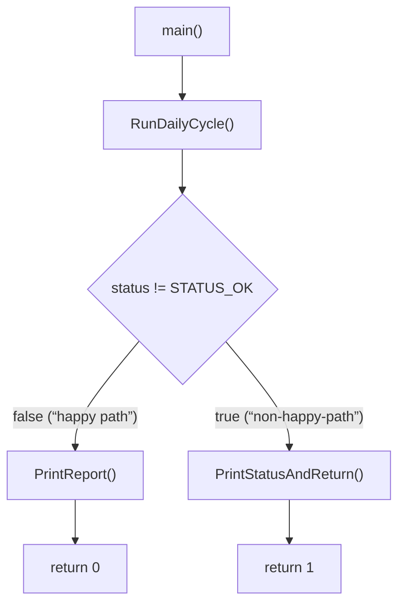

# Verified call graph

## Scope

This document specifies the verified call sequence of the production entry point (`main.c` -> `RunDailyCycle()`, `fao56_app`) for a single execution in which every step completes without error (“happy path”).

Verification basis:

* Static call structure — `cflow`, run against `main.c` and `daily-cycle.c`; the output covers first-level callees only.  
* Dynamic call order — a GDB-assisted execution trace, breakpointed at `RunDailyCycle()` entry and single-stepped to process exit, using a build with mocked/emulated sensor backends (host execution, not target hardware, for v.0.1.x).

The two sources agree exactly on the call order for every step listed below.  
See also the Doxygen documentation (link to be added).

This document covers the “happy path” only. `RunDailyCycle()` contains fallback branches (sensor read retries, an atmospheric pressure model fallback) that exist in source but were not exercised in the recorded trace; see “Unverified Branches”. A second binary, `main-test.c`, exercises “non-happy-path” scenarios by calling lower-layer functions directly rather than through `RunDailyCycle()`. It uses a different call structure and is out of scope for this document; it will be addressed in a future revision.

Line numbers below refer to `daily-cycle.c` as it existed at the time of the GDB trace (`2026-09-14`). Verify against the current repository state before relying on them for navigation.

* * *

## Initialization phase

Twelve steps, all first-level callees of `RunDailyCycle()`. All are fail-fast: a non-`STATUS_OK` return from any step aborts the cycle immediately and skips all subsequent steps. The fail-fast idiom in `RunDailyCycle()` is as follows:

```C
status = Step(...);
if (status != STATUS_OK) {
    *out_failed_step = "Step";
    return status;
}
```

* * *

| # | Function | Line | Verified |
|---|---|---|---|
| 1 | `AirTemperature_Init` | 35 | Yes |
| 2 | `AirHumidity_Init` | 41 | Yes |
| 3 | `AtmosphericData_Init` | 47 | Yes |
| 4 | `WindSpeed_Init` | 53 | Yes |
| 5 | `Location_Init` | 59 | Yes |
| 6 | `DayCalc_Init` | 65 | Yes |
| 7 | `RaCalc_Init` | 71 | Yes |
| 8 | `AngstromValues_Default` | 77 | Yes |
| 9 | `SolarRadiation_Init` | 83 | Yes |
| 10 | `NetRadiation_Init` | 89 | Yes |
| 11 | `SunshineLux_Init` | 95 | Yes |
| 12 | `SunshineLux_ResetDay` | 102 | Yes |

**Note.** Second-level call confirmed by the GDB-assisted execution trace; not present in the `cflow` output for `daily-cycle.c` (`cflow` was not run recursively into `location.c`): `Location_Init` -> `Location_DMS_to_decimal`.

* * *

## Measurement phase

| Function | Line | Verified | Note |
|---|---|---|---|
| `SensorTemperature_ReadInstant` | 111 | Yes | Succeeded; `SensorTemperature_ReadDefault` not called |
| `SensorHumidity_ReadInstant` | 122 | Yes | Succeeded; `SensorHumidity_ReadDefault` not called |
| `AirHumidity_Update` | 132 | Yes | Second-level call: `ValidHumidityPercent`, `validation.c` |
| `SensorPressure_ReadInstant` | 140 | Yes | Succeeded; pressure source recorded as sensor |
| `SensorWindSpeed_ReadInstant` | 161 | Yes | Succeeded; `SensorWindSpeed_ReadDefault` not called |
| `WindSpeed_Update` | 171 | Yes | Second-level calls: `IsValidSpeed`, `IsValidHeight`, `wind-speed-calc.c` |
| `SensorLux_ReadInstant`, `SunshineLux_Update` | 184, 195 | Yes | Executed 12 times, matching `DAILY_CYCLE_MOCK_LUX_SAMPLE_COUNT`; second-level call: `SunshineLux_IsBright`, `sunshine-lux-calc.c` |
| `SunshineLux_FinalizeDay` | 206 | Yes | — |

* * *

## Calculation phase

| Function | Line | Verified | Note |
|---|---|---|---|
| `AirTemperature_Update` | 215 | Yes | Second-level call: `ValidTemperatureC`, `validation.c` |
| `Calc_SaturationVapourPressure` | 223 | Yes | Second-level call: `Calc_TetensSaturationPressure`, `vapour-pressure-calc.c` |
| `Calc_MeanSaturationVapourPressure` | 230 | Yes | — |
| `Calc_SlopeDelta` | 237 | Yes | — |
| `Calc_AtmosphericParameters` | 244 | Yes | — |
| `Calc_ActualVapourPressure` | 252 | Yes | Second-level call: `Calc_SaturationVapourPressure`, `vapour-pressure-calc.c`, called twice |
| `Calc_WindSpeedAt2m` | 260 | Yes | — |
| `DateProvider_Read` | 268 | Yes | — |
| `DayCalc_JFromDate` | 274 | Yes | Returns `uint16_t`, not `Status`; result assigned directly, no status check |
| `DayCalc_Update` | 277 | Yes | Second-level calls: `ValidDayOfYear`, `ValidLatitudeRad`, `validation.c` |
| `Calc_Ra` | 285 | Yes | — |
| `SolarRadiation_Calc` | 293 | Yes | Second-level call: `Min`, `math-utils.h` |
| `Calc_NetRadiation` | 302 | Yes | Second-level calls: `Min`, `Max`, `math-utils.h` |
| `Calc_ETo` | 310 | Yes | Second-level calls: `Min`, `Max`, `math-utils.h` |
| `Calc_ETc` | 328 | Yes | — |

Control returns to `main.c:19` (`if (status != STATUS_OK)`), confirmed directly by the GDB stepping trace.

* * *

## Outcome dispatch: `main.c`

```C
int main(void) {
    DailyResults results;
    const char *failed_step = "unknown";
    const Status status = RunDailyCycle(&results, &failed_step);

    if (status != STATUS_OK) {
        return PrintStatusAndReturn(&results, failed_step, status);
    }

    PrintReport(&results);

    return 0;
}
```

* * *

| Condition | Function called | Verified |
|---|---|---|
| `status == STATUS_OK` | `PrintReport` | Yes, exercised in this GDB trace |
| `status != STATUS_OK` | `PrintStatusAndReturn` | No, present in source, not exercised in this GDB trace |

* * *



* * *

## Unverified branches

Present in source, not exercised in the recorded “happy path” trace:

* `SensorTemperature_ReadDefault` — fallback for `SensorTemperature_ReadInstant`.  
* `SensorHumidity_ReadDefault` — fallback for `SensorHumidity_ReadInstant`.  
* `Calc_PressureFromElevation` — fallback model, used when `SensorPressure_ReadInstant` fails.  
* `SensorPressure_ReadDefault` — final fallback, used only if both the pressure sensor read and the elevation model fail.  
* `SensorWindSpeed_ReadDefault` — fallback for `SensorWindSpeed_ReadInstant`.  
* `SensorLux_ReadDefault` — per-sample fallback for `SensorLux_ReadInstant`, within the 12-sample measurement loop.  
* `PrintStatusAndReturn` and any early return path from `RunDailyCycle()`.

**Note.** All `Sensor*_ReadInstant()` mock implementations (`01-measurement/*`) return a non-`STATUS_OK` status only when their output pointer is `NULL`. Since every call site in `RunDailyCycle()` passes a valid pointer, none of the sensor-fallback branches above are merely untraced — they are currently unreachable in the PC-mock build (v0.1.x). They become reachable only once real sensor backends are integrated (MCU port).

* * *

## Related documents

* [`Software architecture diagram`](software-architecture-diagram.md).  
* `Data flow specification` (link to be added).  
* `Doxygen contracts` and `conventions` (link to be added).
